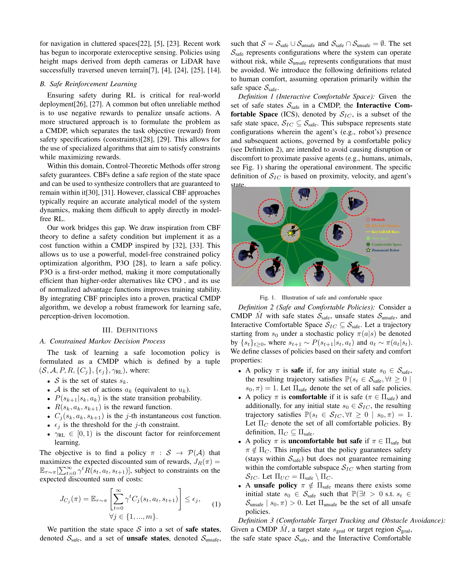

# End-to-End Humanoid Robot Safe and Comfortable Locomotion Policy

> **저자**: Zifan Wang, Xun Yang, Jianzhuang Zhao, Jiaming Zhou, Teli Ma, Ziyao Gao, Arash Ajoudani, Junwei Liang | **날짜**: 2025-08-11 | **URL**: [https://arxiv.org/abs/2508.07611](https://arxiv.org/abs/2508.07611)

---

## Essence

*Fig. 1.*

본 논문은 LiDAR 기반 end-to-end 정책을 통해 humanoid robot이 복잡한 장애물 환경에서 안전하고 쾌적하게 네비게이션할 수 있도록 하는 프레임워크를 제시한다. Control Barrier Function 원리를 CMDP 비용 함수로 변환하고 P3O 알고리즘으로 학습하여 safety와 human comfort를 동시에 보장한다.

## Motivation

- **Known**: 강화학습 기반 locomotion 정책은 뛰어난 민첩성을 달성했으나, blind controller는 환경 인식이 부족하고 depth camera 기반 방식은 2D elevation map으로 축소되어 상층부 장애물을 감지하지 못한다. 안전성 보장을 위해 CMDP 기반 제약 강화학습이 활용되어 왔다.
- **Gap**: 기존 depth camera 방식은 3D 복잡 장애물을 인식하지 못하고, CBF 기반 제어는 정확한 동역학 모델을 요구하여 model-free RL에 직접 적용 어렵다. 또한 humanoid robot의 human-centric 환경에서 안전성뿐 아니라 쾌적성(comfort)을 고려한 종합적 framework이 부족하다.
- **Why**: Humanoid robot의 현실 배포를 위해서는 3D 환경 인식, 형식적 안전 보장, 인간-로봇 상호작용 고려가 모두 필수적이다. 특히 인간 근처에서 작동하는 로봇은 단순 충돌 회피를 넘어 심리적 쾌적성을 제공해야 신뢰와 수용성을 얻을 수 있다.
- **Approach**: LiDAR point cloud를 직접 처리하는 end-to-end 정책을 개발하고, CMDP 기반 안전 제약 설정 및 CBF 원리를 비용 함수로 변환하여 P3O로 학습한다. Human-Robot Interaction 연구에 기반한 comfort-oriented reward를 추가하여 부드럽고 예측 가능한 움직임을 유도한다.

## Achievement

- **LiDAR 기반 3D 인식**: raw spatio-temporal LiDAR point cloud를 직접 처리하여 상층부 장애물 포함 3D 장애물을 인식하는 end-to-end 정책 개발
- **CBF-CMDP 통합 프레임워크**: Control Barrier Function 원리를 model-free P3O의 CMDP 비용 함수로 변환하여 형식적 안전 보장 달성
- **Human Comfort 고려**: Interactive Comfortable Space(ICS) 정의 및 comfort-oriented reward 설계로 인간 근처에서 심리적으로 안전한 움직임 생성
- **Sim-to-Real 성공**: 시뮬레이션 학습 정책을 실제 humanoid robot에 배포하여 정적·동적 3D 장애물 회피 성공

## How

*Fig. 2.*

- 상태공간을 safe state(S_safe)와 unsafe state(S_unsafe)로 분할하고, 추가로 Interactive Comfortable Space(S_IC)를 S_safe의 부분집합으로 정의
- Discrete Control Barrier Function(DCBF) h(x_k) ≥ 0 조건을 CMDP 비용 함수 C_j(s,a,s')로 변환: forward invariance 조건 h(x_{k+1}) + (γ_CBF - 1)h(x_k) ≥ 0을 만족하도록 제약", 'Penalized Proximal Policy Optimization(P3O) 알고리즘을 사용하여 reward J_R(π) 최대화와 안전 제약 J_{C_j}(π) ≤ ε_j를 동시에 만족하는 정책 학습
- HRI 연구 기반 comfort reward 설계: 접근 속도, 예측 불가능성 등 인간 불편을 야기하는 행동 패널티 부여
- Linear system dynamics x_{k+1} = A_L x_k + B_L u_k 가정 하에 안전 조건 구현
- LiDAR point cloud를 특성 벡터로 인코딩하여 신경망 정책 입력으로 활용

## Originality

- **CBF-CMDP 브리징**: 기존 model-based CBF 이론을 model-free P3O 알고리즘의 비용 함수로 창의적으로 변환하여 이론적 안전성과 실제 학습 유연성 결합
- **Comfort Space 형식화**: Interactive Comfortable Space(S_IC)를 수학적으로 정의하고 Comfortable Policy(π_C)의 형식적 정의를 도입하여 HRI를 강화학습 프레임워크에 통합
- **End-to-End LiDAR 통합**: 기존의 depth camera → 2D elevation map 파이프라인을 넘어 raw 3D point cloud를 직접 처리하는 방식의 novelty
- **Sim-to-Real 검증**: 제안된 안전 프레임워크가 실제 humanoid robot에서 작동함을 실증적으로 입증

## Limitation & Further Study

- **선형 동역학 가정**: 식 (3)의 A_L x_k + B_L u_k 선형 모델은 humanoid robot의 복잡한 비선형 동역학을 근사화하므로 제약적
- **정적 안전 공간 정의**: S_safe와 S_IC의 정의가 환경과 작업에 따라 사전 설정되어야 하므로 적응적 업데이트 메커니즘 필요
- **LiDAR 계산 비용**: raw point cloud 처리로 인한 실시간 연산 오버헤드 분석 부재
- **동적 환경 예측**: 움직이는 인간 에이전트의 궤적 예측 없이 현재 상태만 기반하므로 고속 동적 상황에서 제약 가능
- **후속 연구**: (1) 비선형 dynamics 직접 처리 모델, (2) 온라인 안전 영역 적응 학습, (3) 멀티에이전트 동적 예측 통합, (4) 다양한 humanoid 플랫폼 범용성 검증

## Evaluation

- Novelty: 4/5
- Technical Soundness: 3/5
- Significance: 4/5
- Clarity: 4/5
- Overall: 4/5

**총평**: 본 논문은 CBF 이론과 CMDP 기반 강화학습을 창의적으로 결합하고, 인간-로봇 상호작용의 심리적 쾌적성을 형식적 framework에 통합한 높은 독창성의 연구이다. LiDAR 기반 3D 인식과 sim-to-real 성공적 배포는 실제 가치를 증명하며, 안전성과 쾌적성의 이중 요구를 동시에 충족하는 점이 humanoid robot 현실 배포의 중요한 진전을 나타낸다.

## Related Papers

- 🏛 기반 연구: [[papers/1424_Geometry-Aware_Predictive_Safety_Filters_on_Humanoids_From_P/review]] — Geometry-aware safety filter의 안전 제약 방법이 end-to-end 정책에서 LiDAR 기반 안전성과 편의성을 보장하는 핵심 기반이다.
- 🔄 다른 접근: [[papers/1340_Dexterous_Safe_Control_for_Humanoids_in_Cluttered_Environmen/review]] — 둘 다 동적 환경에서의 안전 제어를 다루지만 전자는 end-to-end 학습, 후자는 dexterous한 안전 제어에 중점을 둔다.
- 🔗 후속 연구: [[papers/1273_ARMOR_Egocentric_Perception_for_Humanoid_Robot_Collision_Avo/review]] — ARMOR의 충돌 회피 인식과 end-to-end 안전 정책을 결합하면 더욱 포괄적인 humanoid 안전 시스템을 구축할 수 있다.
- 🔗 후속 연구: [[papers/1424_Geometry-Aware_Predictive_Safety_Filters_on_Humanoids_From_P/review]] — Geometry-aware safety filter와 end-to-end 안전 제어를 결합하면 정적 기하학과 동적 환경을 모두 고려한 포괄적 안전 시스템을 구축할 수 있다.
- 🔗 후속 연구: [[papers/1453_Hold_My_Beer_Learning_Gentle_Humanoid_Locomotion_and_End-Eff/review]] — Hold My Beer의 end-effector 안정화 기술은 일반적인 end-to-end humanoid locomotion policy로 확장될 수 있다.
- 🔗 후속 연구: [[papers/1535_Learning_Smooth_Humanoid_Locomotion_through_Lipschitz-Constr/review]] — 강화학습 기반 안전하고 편안한 locomotion 정책의 평활성 보장을 Lipschitz 제약을 통해 수학적으로 더욱 엄밀하게 구현한 발전된 형태임
