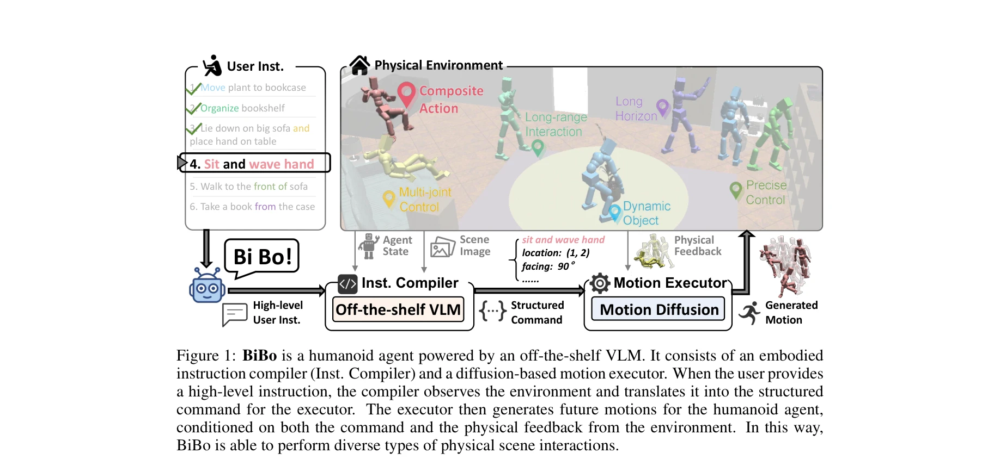
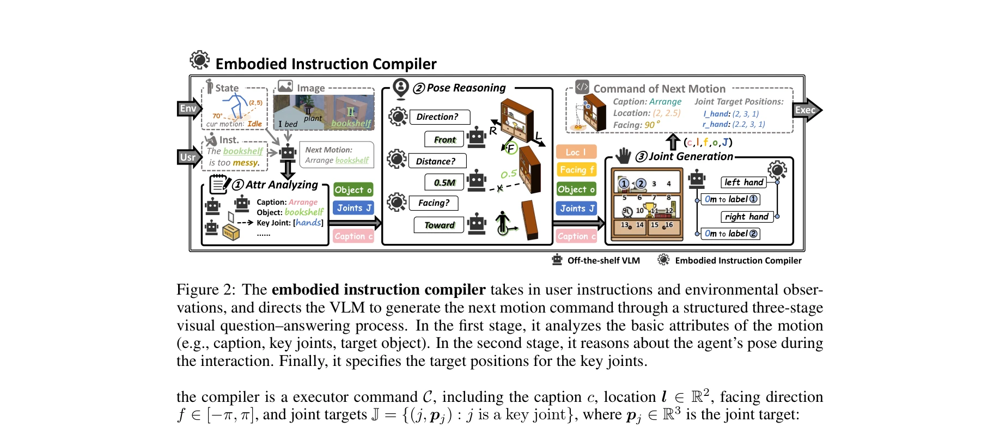

# Endowing GPT-4 with a Humanoid Body: Building the Bridge Between Off-the-Shelf VLMs and the Physical World

> **저자**: Yingzhao Jian, Zhongan Wang, Yi Yang, Hehe Fan | **날짜**: 2025-10-28 | **URL**: [https://arxiv.org/abs/2511.00041](https://arxiv.org/abs/2511.00041)

---

## Essence

*Figure 1: BiBo is a humanoid agent powered by an off-the-shelf VLM. It consists of an embodied*

BiBo는 GPT-4 같은 off-the-shelf VLM을 humanoid agent 제어에 활용하여, embodied instruction compiler와 diffusion-based motion executor를 통해 고수준 사용자 명령을 저수준 모션 제어로 변환한다.

## Motivation

- **Known**: Humanoid agent는 text-guided motion 생성과 predefined plan 하의 작업 수행이 가능하나, 개방형 환경에서의 유연한 상호작용을 위해서는 대규모 데이터 수집이 필수적이다. 반면 GPT-4 같은 VLM은 광범위한 open-world generalization 능력을 보유하고 있다.
- **Gap**: Humanoid agent 제어를 위한 대규모 데이터 수집의 비용 문제를 해결하면서도, VLM의 고수준 추론 능력과 저수준 물리적 제어 간의 간극을 어떻게 연결할 것인가가 미해결 과제이다.
- **Why**: VLM의 강력한 generalization 능력을 humanoid control에 직접 활용할 수 있다면, 비용이 많이 드는 데이터 수집을 줄이면서도 다양한 상황에 대응 가능한 humanoid agent를 구축할 수 있다.
- **Approach**: 고수준 자연어 명령을 구조화된 저수준 명령으로 변환하는 embodied instruction compiler와, 이를 실제 humanoid 모션으로 생성하는 diffusion-based motion executor를 결합하여, VLM의 추론 능력과 물리적 실행을 연결한다.

## Achievement

*Figure 1: BiBo is a humanoid agent powered by an off-the-shelf VLM. It consists of an embodied*

- **상호작용 성공률**: 개방형 환경에서 90.2%의 interaction task success rate 달성
- **정밀도 개선**: Text-guided motion execution에서 선행 방법 대비 16.3% 정밀도 향상
- **무한 길이 모션 생성**: Unlimited-length motion synthesis 가능으로 연속적 장시간 작업 수행 가능
- **실시간 제어**: 사용자 명령에 따른 실시간 interactive control 지원

## How

*Figure 2: The embodied instruction compiler takes in user instructions and environmental obser-*

- **Embodied instruction compiler**: 3-stage visual question-answering (VQA) 프로세스로 motion caption, agent pose, key joint locations를 순차적으로 결정
- **구조화된 액션 표현**: (caption, location, facing, object, joint configuration) 형태의 structured command 생성으로 coarse-to-fine 추론 실현
- **Latent Diffusion Model 활용**: 실제 실행된 모션의 latent에서 미래 모션을 확장하여 환경 피드백 반영
- **VAE 기반 평활화**: 이전 생성 모션과 현재 실행 모션의 latent를 joint decoding하여 연속성 보장
- **몇 denoising step**: 실시간 제어를 위해 diffusion의 few-step denoising 적용

## Originality

- VLM을 humanoid control에 직접 적용하는 novel 접근법으로, 기존의 RL 기반 또는 데이터-중심 방식과 구별됨
- Compiler-executor 아키텍처 메타포로, 컴퓨터 시스템의 컴파일러와 어셈블러 개념을 humanoid 제어에 창의적으로 적용
- LDM의 novel application으로 환경 피드백을 모션 생성에 통합하면서도 평활한 전이를 유지하는 기술적 혁신
- 구조화된 humanoid action representation 도입으로 VLM이 체계적인 embodied reasoning을 수행 가능하게 함

## Limitation & Further Study

- **VLM 의존성**: Off-the-shelf VLM(GPT-4o)의 성능에 전적으로 의존하며, 모델 변경 시 성능 변화 미분석
- **실제 로봇 검증 부재**: 시뮬레이션 환경(randomly generated physical environments)에서만 평가되어 실제 humanoid 로봇 적용 가능성 미확인
- **복잡한 장기 계획**: 다단계 복잡한 작업 계획이나 환경 변화 시 적응 능력의 한계 미논의
- **환경 피드백 처리의 제한**: Collision 및 external forces에 대한 적응 메커니즘이 latent space에서만 작동하여 예측 불가능한 상황에 대한 robustness 불명확
- **후속 연구 방향**: 실제 humanoid 로봇에서의 검증, 다양한 VLM 모델과의 호환성 연구, 장시간 복잡 작업 수행 능력 향상 필요

## Evaluation

- Novelty: 4/5
- Technical Soundness: 3/5
- Significance: 4/5
- Clarity: 4/5
- Overall: 4/5

**총평**: 본 논문은 VLM을 humanoid 제어에 활용하는 창의적이고 실용적인 솔루션을 제시하며, embodied instruction compiler와 LDM 기반 motion executor의 결합으로 고수준 명령과 저수준 제어 간의 간극을 효과적으로 해결한다. 다만 실제 로봇 환경에서의 검증이 부재하여 실무 적용 가능성의 추가 확인이 필요하다.

## Related Papers

- 🔄 다른 접근: [[papers/1367_EgoActor_Grounding_Task_Planning_into_Spatial-aware_Egocentr/review]] — EgoActor도 VLM 기반으로 고수준 명령을 저수준 행동으로 변환하는 유사한 접근법이다.
- 🔗 후속 연구: [[papers/1422_Hi_Robot_Open-Ended_Instruction_Following_with_Hierarchical/review]] — Hi Robot의 계층적 VLM 구조가 BiBo의 embodied instruction compiler를 발전시킨다.
- 🏛 기반 연구: [[papers/1512_PaLM-E_An_Embodied_Multimodal_Language_Model/review]] — PaLM-E의 embodied multimodal 언어 모델이 BiBo의 GPT-4 활용 방법론에 기초가 된다.
- 🏛 기반 연구: [[papers/1422_Hi_Robot_Open-Ended_Instruction_Following_with_Hierarchical/review]] — BiBo의 instruction compiler가 Hi Robot의 계층적 명령어 처리 구조에 영향을 준다.
