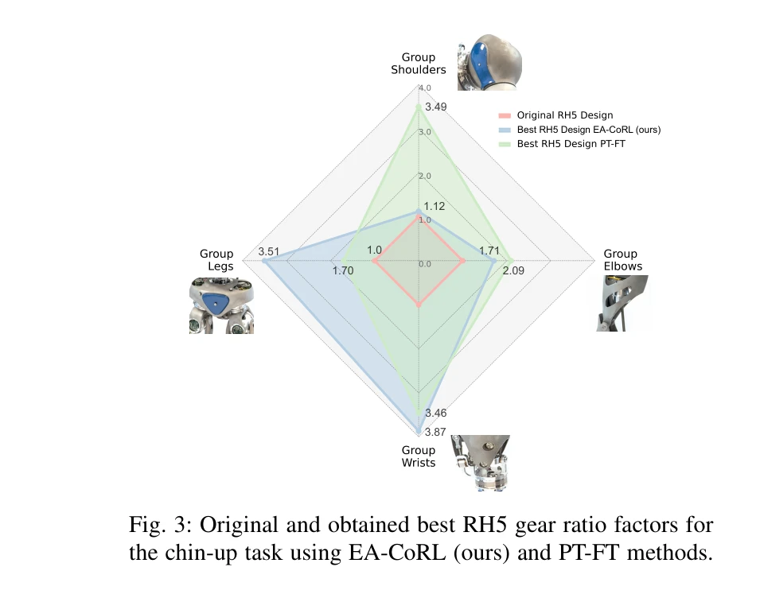

# Evolutionary Continuous Adaptive RL-Powered Co-Design for Humanoid Chin-Up Performance

> **저자**: Tianyi Jin, Melya Boukheddimi, Rohit Kumar, Gabriele Fadini, Frank Kirchner | **날짜**: 2025-09-30 | **URL**: [https://arxiv.org/abs/2509.26082](https://arxiv.org/abs/2509.26082)

---

## Essence

*Fig. 2: Overview of the EA-CoRL framework methodology.*

EA-CoRL은 진화 알고리즘과 강화학습을 결합하여 휴머노이드 로봇의 하드웨어 설계와 제어 정책을 동시에 최적화하는 프레임워크이며, RH5 로봇의 기어비와 턱걸이 정책을 공동 설계하여 기존에 불가능했던 고동적 작업을 실현한다.

## Motivation

- **Known**: 휴머노이드 로봇 설계는 전통적으로 순차적 프로세스를 따르며, 최근 최적제어나 강화학습 기반 공동 설계 방법들이 제안되었으나 강화학습 정책은 특정 설계 매개변수에 밀접하게 연결되어 설계 변화 시 적응이 어렵다.
- **Gap**: 기존 RL 기반 공동 설계는 설계 변화에 따른 정책 적응의 어려움을 충분히 해결하지 못했으며, 넓은 설계 공간 탐색과 지속적인 정책 적응을 동시에 달성하는 방법이 부족하다.
- **Why**: 휴머노이드 로봇이 턱걸이와 같은 고동적 작업을 수행하려면 하드웨어와 제어가 조화롭게 설계되어야 하며, 이는 설계 비용을 최소화하면서 로봇 성능을 극대화하는 데 중요하다.
- **Approach**: EA-CoRL은 CMA-ES 진화 알고리즘으로 설계 공간을 탐색하면서(외부 루프), 각 설계 후보에 대해 RL 기반 정책을 지속적으로 적응·미세조정하는(내부 루프) 이층 구조를 사용한다.

## Achievement

*Fig. 3: Original and obtained best RH5 gear ratio factors for*

- **EA-CoRL 프레임워크**: Design Evolution과 Policy Continuous Adaptation 두 개 컴포넌트를 통합한 모델 무관의 공동 설계 알고리즘 제시
- **넓은 설계 공간 탐색**: 연속 정책 적응이 기저 접근법 대비 더 넓은 설계 공간을 탐색하고 조기 수렴을 방지함을 입증
- **기존 불가능 작업 실현**: 기어비만 변경하여(구조적 하드웨어 수정 없이) RH5의 턱걸이 작업을 가능하게 함
- **성능 우수성**: 최신 RL 기반 공동 설계 방법과 비교하여 더 높은 적응도(fitness score) 달성

## How

*Fig. 2: Overview of the EA-CoRL framework methodology.*

- CMA-ES를 사용한 외부 루프: 기어비 등 설계 매개변수의 다변량 정규분포에서 샘플링하여 로봇 설계 후보 생성
- 정책 미세조정을 위한 내부 루프: 사전학습된 기저 정책을 warm start로 사용하여 각 새로운 설계에 대해 RL로 정책 적응
- Warm start 기법: 이전 설계의 정책을 초기값으로 활용하여 학습 효율성 증대
- Domain randomization: RL 정책의 견고성과 다양한 설계에 대한 일반화 능력 강화
- 모델 무관 접근: 특정 시뮬레이터나 로봇 구조에 의존하지 않는 범용 프레임워크 설계

## Originality

- 진화 알고리즘(CMA-ES)과 RL의 결합: 기존 연구에서 주로 링크 길이 최적화에 집중한 반면, 이 논문은 기어비 같은 액추에이터 매개변수 공동 설계에 초점
- 지속적 정책 적응 메커니즘: 각 진화 단계에서 정책을 동적으로 업데이트하는 방식으로 설계-정책 간 동기화 강화
- 턱걸이라는 고도로 동적인 작업: 기존 공동 설계 논문들이 주로 보행(locomotion) 작업에 집중했으나, 전신 조작 작업으로 확장
- 실제 로봇 검증 지향: 하드웨어 비용 최소화를 고려한 실용적 설계 최적화 철학

## Limitation & Further Study

- **설계 매개변수 범위 제한**: 기어비만 변경 대상이며, 링크 길이, 질량 분포 등 다른 설계 요소는 제외
- **시뮬레이션 기반 검증**: 실제 RH5 로봇에서의 검증 결과가 제시되지 않았으며, 시뮬레이션-현실 간 간극(sim-to-real gap)에 대한 논의 부족
- **계산 비용**: CMA-ES와 RL의 다층 최적화로 인한 학습 시간이 명시되지 않음
- **일반화성**: 턱걸이 작업 외 다른 고동적 작업(예: 점프, 백플립)에 대한 검증 필요
- **설계 수렴 분석**: 최적 설계에 수렴하는 이유나 설계 공간의 다중봉우리(multimodal) 특성에 대한 깊이 있는 분석 부족
- **후속 연구**: (1) 실 로봇 배포 및 sim-to-real 전이 학습 연구, (2) 더 많은 설계 차원 동시 최적화, (3) 온라인 적응 메커니즘 개발

## Evaluation

- Novelty: 4/5
- Technical Soundness: 3/5
- Significance: 4/5
- Clarity: 4/5
- Overall: 4/5

**총평**: EA-CoRL은 진화 알고리즘과 강화학습의 효과적 결합을 통해 휴머노이드 로봇의 공동 설계 문제를 해결하는 실용적이고 혁신적인 접근법을 제시하며, 기존에 불가능했던 고동적 작업을 실현함으로써 로봇 설계 자동화 분야에 의미 있는 기여를 한다. 다만 실 로봇 검증과 설계 공간의 확장이 후속 과제이다.

## Related Papers

- 🔗 후속 연구: [[papers/1351_DoublyAware_Dual_Planning_and_Policy_Awareness_for_Temporal/review]] — EA-CoRL의 하드웨어-제어 공동 설계 방법에 DoublyAware의 uncertainty 처리를 적용하면 더욱 견고한 시스템 최적화가 가능하다.
- 🏛 기반 연구: [[papers/1567_Mechanical_Intelligence-Aware_Curriculum_Reinforcement_Learn/review]] — Mechanical Intelligence-Aware Curriculum의 하드웨어 특성 고려 학습이 EA-CoRL의 공동 설계 최적화에 필수적인 이론적 기반을 제공한다.
- 🔄 다른 접근: [[papers/1295_Booster_Gym_An_End-to-End_Reinforcement_Learning_Framework_f/review]] — 둘 다 RL 기반 최적화를 다루지만 EA-CoRL은 하드웨어-제어 공동 설계에, Booster Gym은 일반적 RL 프레임워크에 집중한다.
- 🏛 기반 연구: [[papers/1351_DoublyAware_Dual_Planning_and_Policy_Awareness_for_Temporal/review]] — EA-CoRL의 진화 알고리즘과 RL 결합 방식이 DoublyAware의 dual awareness 학습에 이론적 기반을 제공한다.
