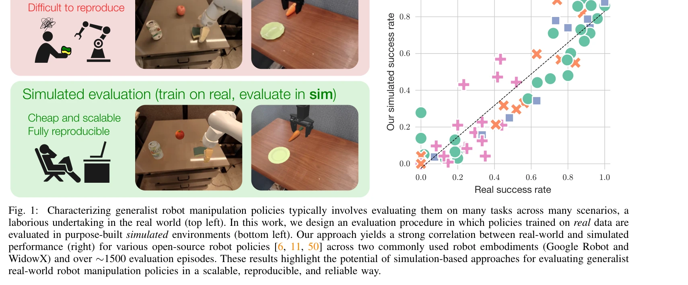
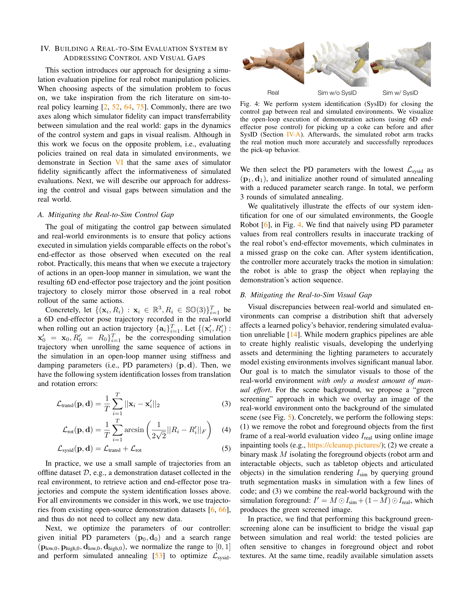

# Evaluating Real-World Robot Manipulation Policies in Simulation

> **저자**: Xuanlin Li, Kyle Hsu, Jiayuan Gu, Karl Pertsch, Oier Mees, Homer Rich Walke, Chuyuan Fu, Ishikaa Lunawat, Isabel Sieh, Sean Kirmani, Sergey Levine, Jiajun Wu, Chelsea Finn, Hao Su, Quan Vuong, Ted Xiao | **날짜**: 2024-05-09 | **URL**: [https://arxiv.org/abs/2405.05941](https://arxiv.org/abs/2405.05941)

---

## Essence

*Fig. 1:*

실제 로봇 데이터로 훈련한 조작 정책을 시뮬레이션 환경에서 평가하기 위해 SIMPLER라는 시뮬레이션 환경 모음을 제안하고, 제어 및 시각적 차이를 완화하여 실제 성능과 높은 상관관계를 달성한다.

## Motivation

- **Known**: 시뮬레이션 기반 평가는 자율주행 분야에서 널리 사용되지만, 로봇 조작은 객체와의 다양한 상호작용으로 인해 더 복잡하다. Sim-to-real 전이 학습은 가능함이 입증되었지만, real-to-sim 평가에 대한 체계적 연구는 부족하다.
- **Gap**: 일반화된 로봇 조작 정책의 실제 평가는 비용이 많이 들고 재현이 어려우며, 정책 능력이 확대될수록 이 문제는 악화된다. 현재는 완전한 디지털 트윈 구축이 필요하지만 이는 확장성이 낮다.
- **Why**: 조작 정책의 능력이 다양해지면서 평가의 부담이 급증하고 있으며, 신뢰할 수 있고 확장 가능한 평가 프레임워크가 필요하다. 시뮬레이션 기반 평가가 실현 가능한 해결책이 될 수 있다.
- **Approach**: 제어 차이를 offline system identification으로, 시각적 차이를 'green-screening'과 texture baking으로 해결하되 완전한 디지털 트윈이 아닌 '충분히 현실적인' 환경 구축을 목표로 한다. RT-1/Bridge-V2 로봇 셋업에 대한 SIMPLER 환경을 구축하고 대규모 paired sim-and-real 평가를 수행한다.

## Achievement

*Fig. 1:*

- **SIMPLER 환경 모음**: 구글 로봇과 WidowX 등 실제 로봇 셋업을 위한 오픈소스 시뮬레이션 평가 환경 제공
- **강한 상관관계 입증**: 약 1500개 평가 에피소드를 통해 시뮬레이션 성능과 실제 성능 간 높은 상관관계(Figure 1) 달성
- **행동 모드 일치**: SIMPLER이 distribution shift에 대한 정책의 민감도 등 실제 정책 행동 모드를 정확히 반영함을 증명
- **확장 가능한 워크플로우**: 새로운 평가 환경 구축을 위한 오픈소스 워크플로우 공개로 향후 연구 촉진

## How

*Fig. 4: We perform system identification (SysID) for closing the*

- Offline system identification을 통해 로봇 제어기의 동역학 차이 모델링 및 보정
- Green-screening' 기법으로 시뮬레이션 렌더링에 실제 배경 합성", '실제 환경 이미지로부터 추출한 texture를 시뮬레이션 객체에 baking
- RT-1, RT-1-X, Octo 등 여러 open-source 정책에 대한 paired sim-and-real 평가 수행
- Mean Maximum Rank Violation (MMRV) 메트릭을 통해 정책 순위 일치도 정량화

## Originality

- Real-to-sim 평가 관점에서의 체계적 연구로, 기존 sim-to-real 학습 연구와 정반대 방향 제시
- 완전한 디지털 트윈이 아닌 '충분히 현실적인' 환경 구축이라는 실용적 철학 도입", '제어 및 시각적 차이를 명확히 분리하여 각각 해결책 제시한 체계적 접근
- 대규모 paired 평가를 통해 시뮬레이션 평가의 신뢰성을 실증적으로 입증

## Limitation & Further Study

- Google Robot과 Bridge-V2 두 가지 셋업에만 국한되어 다른 로봇 플랫폼으로의 일반화 검증 필요
- 시뮬레이션 환경의 '충분한 현실성' 기준이 주관적이며, 다양한 작업 유형에 대한 일반적 지침 부족", 'Texture baking과 green-screening 기법의 한계로 복잡한 조명 조건이나 물리적 특성(마찰, 질량) 정확도 제한
- 후속 연구로는 더 많은 로봇 플랫폼으로의 확장, 시각적 도메인 랜더마이제이션 고도화, 동적 객체 처리 개선 필요

## Evaluation

- Novelty: 4/5
- Technical Soundness: 3/5
- Significance: 4/5
- Clarity: 4/5
- Overall: 4/5

**총평**: 로봇 조작 정책 평가의 확장성과 재현성 문제를 실질적으로 해결하는 중요한 기여이며, 체계적인 실험과 오픈소스 공개를 통해 커뮤니티에 즉시 영향을 미칠 수 있는 실용적인 프레임워크를 제시한다.

## Related Papers

- 🔗 후속 연구: [[papers/1335_Code-as-Monitor_Constraint-aware_Visual_Programming_for_Reac/review]] — 시뮬레이션 기반 정책 평가가 constraint-aware monitoring과 결합하여 더 robust한 평가 체계 구축
- 🧪 응용 사례: [[papers/1417_GRUtopia_Dream_General_Robots_in_a_City_at_Scale/review]] — SIMPLER 환경을 GRUtopia 대규모 도시 환경에서 정책 평가 벤치마크로 확장 적용
- 🏛 기반 연구: [[papers/1535_RoboArena_Distributed_Real-World_Evaluation_of_Generalist_Ro/review]] — 실제 로봇 조작 정책의 시뮬레이션 평가 한계를 극복하기 위한 실제 환경 기반 평가 프레임워크를 제공한다.
- 🏛 기반 연구: [[papers/1608_Perceptive_Humanoid_Parkour_Chaining_Dynamic_Human_Skills_vi/review]] — 생성형 모션 매칭 기법이 인간 동작 데이터 합성을 위한 핵심 이론적 기초를 제공합니다.
- 🔄 다른 접근: [[papers/1335_Code-as-Monitor_Constraint-aware_Visual_Programming_for_Reac/review]] — 로봇 정책 평가를 constraint satisfaction으로 접근하는 것과 시뮬레이션 기반 평가의 상호보완적 방법론
- 🏛 기반 연구: [[papers/1417_GRUtopia_Dream_General_Robots_in_a_City_at_Scale/review]] — GRUtopia 대규모 시뮬레이션 환경이 SIMPLER와 같은 정책 평가 벤치마크의 확장 기반 제공
