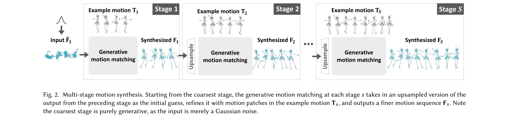
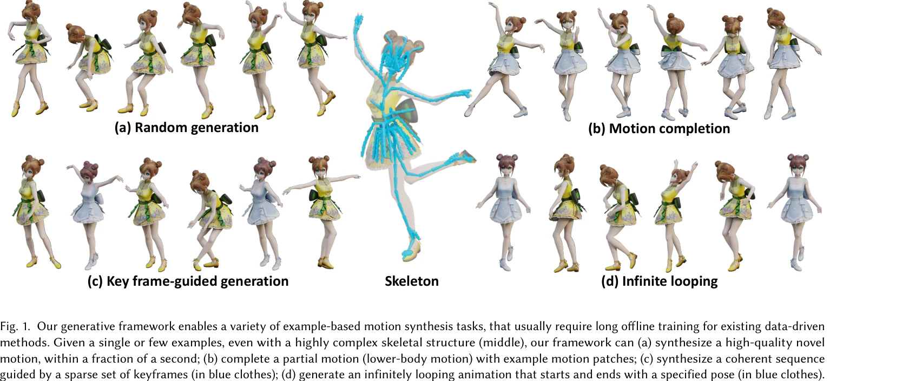
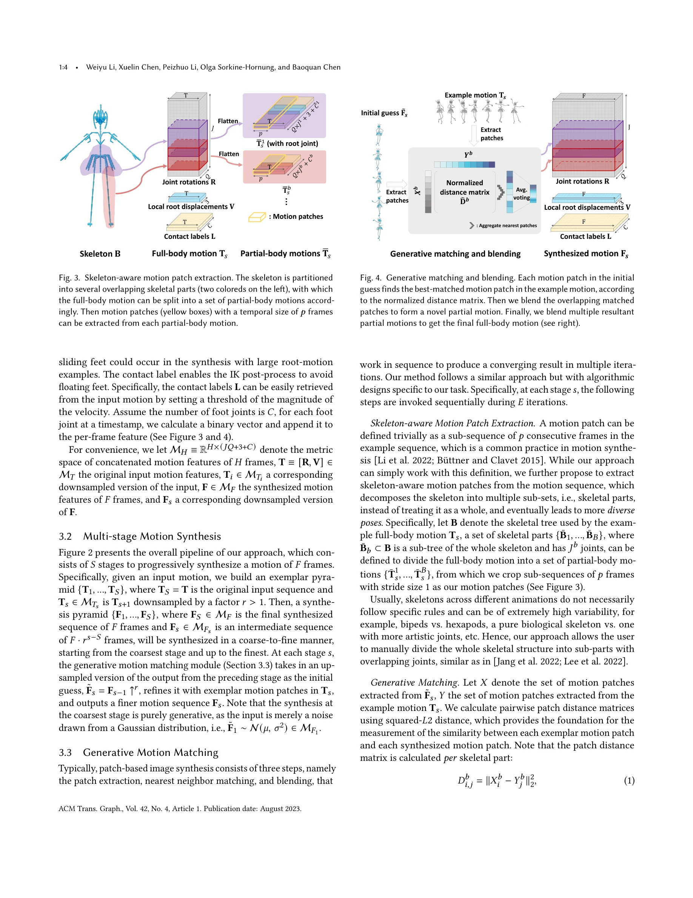

# Example-based Motion Synthesis via Generative Motion Matching

> **저자**: Weiyu Li, Xuelin Chen, Peizhuo Li, Olga Sorkine-Hornung, Baoquan Chen | **날짜**: 2023-06-01 | **URL**: [https://arxiv.org/abs/2306.00378](https://arxiv.org/abs/2306.00378)

---

## Essence

*Fig. 2. Multi-stage motion synthesis. Starting from the coarsest stage, the generative motion matching at each stage 𝑠ta*

GenMM은 단일 또는 소수의 예제 모션으로부터 다양한 고품질 모션을 생성하는 학습-무료 생성 모델로, Motion Matching의 bidirectional visual similarity를 generative cost function으로 활용하여 복잡한 스켈레톤 구조에서도 빠르게 작동한다.

## Motivation

- **Known**: Motion Matching은 대규모 mocap 데이터베이스에서 가장 잘 맞는 모션 패치를 검색하여 고품질 애니메이션을 생성하는 산업 표준 방법이다. 딥러닝 기반 모션 생성은 다양한 모션을 합성할 수 있으나 장시간의 학습, 아티팩트 발생, 복잡한 스켈레톤에서의 확장성 문제를 가진다.
- **Gap**: 기존 방법들은 제한된 예제로부터 다양한 모션을 생성하면서 동시에 고품질을 유지하고 빠른 추론 속도를 달성하기 어렵다. Motion Matching은 대규모 데이터베이스에 의존하므로 소수 예제만으로는 충분하지 않다.
- **Why**: 모션 캡처 데이터 수집의 비용과 시간이 높아 제한된 데이터로 고품질 모션을 생성할 수 있는 효율적인 방법이 산업과 학계에서 필요하며, 이는 애니메이션 제작 워크플로우의 자동화를 가능하게 한다.
- **Approach**: Granot et al.의 이미지 합성 아이디어에서 영감을 받아, bidirectional similarity를 motion matching의 생성 cost function으로 도입하고, 다단계 프레임워크를 통해 서로 다른 temporal resolution에서 점진적으로 모션을 정제한다. 최상위 단계에 노이즈를 입력하여 생성 다양성을 확보한다.

## Achievement

*Fig. 1. Our generative framework enables a variety of example-based motion synthesis tasks, that usually require long of*

- **학습-무료 고속 생성**: 사전 학습 없이 분초 내에 고품질 모션 시퀀스를 합성
- **복잡한 스켈레톤 확장성**: 433개 조인트를 가진 복잡한 캐릭터에서도 안정적으로 작동하는 반면 신경망 기반 방법은 실패
- **Motion Matching 품질 상속**: Motion Matching의 고충실도와 자연성을 유지하면서 생성 능력 추가
- **다양한 응용**: 모션 완성(motion completion), 키프레임 유도 생성, 무한 루핑, 모션 재조립 등 Motion Matching만으로는 불가능한 작업 실현
- **다중 예제 확장**: 여러 시퀀스 입력을 쉽게 처리하여 모든 예제를 커버하도록 유도 가능

## How

*Fig. 3. Skeleton-aware motion patch extraction. The skeleton is partitioned*

- Bidirectional similarity를 cost function으로 사용하여 합성 시퀀스의 패치 분포가 예제와 일치하도록 강제
- 다단계 프레임워크에서 가장 성긴(coarse) 단계부터 시작하여 순차적으로 업샘플링 및 정제하며 진행
- Skeleton-aware 패치 추출로 스켈레톤 구조를 반영한 효율적인 모션 표현
- Generative matching and blending을 통해 초기 추측(노이즈)을 예제 모션 패치와 매칭하고 블렌딩하여 점진적 개선
- 각 단계에서 bidirectional similarity를 최소화하는 최적화 과정 수행

## Originality

- Motion Matching에 bidirectional similarity 개념을 처음으로 적용하여 생성 모델화
- 이미지 합성의 패치 기반 생성 아이디어를 모션 도메인에 창의적으로 전이
- 소수 예제만으로도 다양한 모션을 생성하면서 고품질을 유지하는 새로운 패러다임 제시
- Multi-stage progressive refinement를 통해 계층적 시간 해상도에서의 패치 분포 일치 달성

## Limitation & Further Study

- 예제 모션의 질이 최종 결과의 상한선이므로, 저품질 입력에서는 출력도 제한적
- Bidirectional similarity 계산의 계산 복잡도가 매우 큰 스켈레톤에서 병목이 될 가능성
- 모션 스타일 전이나 캐릭터 간 모션 변환 같은 고수준 제어는 어려움
- 후속 연구에서는 조건부 생성 제어 강화, 더 효율적인 similarity 계산 알고리즘, 그리고 음성이나 텍스트 같은 다른 모달리티와의 조건부 합성이 필요

## Evaluation

- Novelty: 4/5
- Technical Soundness: 3/5
- Significance: 4/5
- Clarity: 4/5
- Overall: 4/5

**총평**: GenMM은 Motion Matching과 생성 모델을 창의적으로 결합하여 제한된 데이터에서도 고품질 다양한 모션을 빠르게 생성하는 실용적이고 우아한 솔루션을 제시한다. 산업 적용 가능성과 이론적 기여 모두에서 높은 가치를 가진다.

## Related Papers

- 🔄 다른 접근: [[papers/1400_Flexible_Motion_In-betweening_with_Diffusion_Models/review]] — motion synthesis를 diffusion이 아닌 generative matching 방법으로 수행한다
- 🔗 후속 연구: [[papers/1507_Kimodo_Scaling_Controllable_Human_Motion_Generation/review]] — example-based synthesis를 더 확장 가능한 controllable generation으로 발전시켰다
- 🏛 기반 연구: [[papers/1275_ASE_Large-Scale_Reusable_Adversarial_Skill_Embeddings_for_Ph/review]] — physics-based motion generation의 기본 프레임워크를 제공한다
- ⚖️ 반론/비판: [[papers/1400_Flexible_Motion_In-betweening_with_Diffusion_Models/review]] — learning-free generation과 대비되는 diffusion 학습 기반 접근법이다
