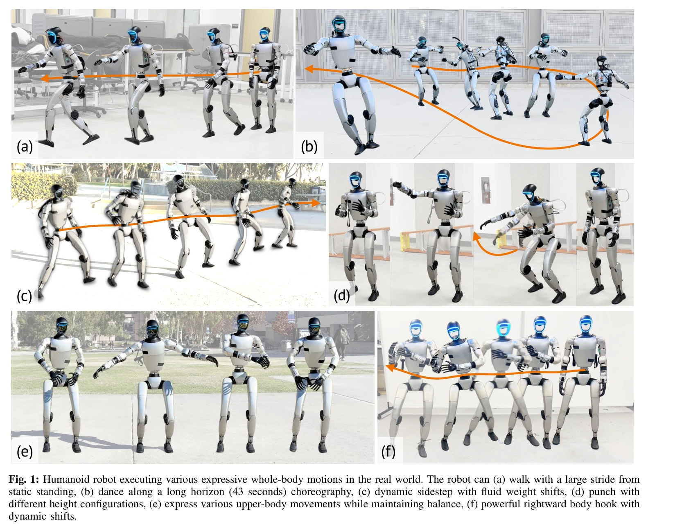
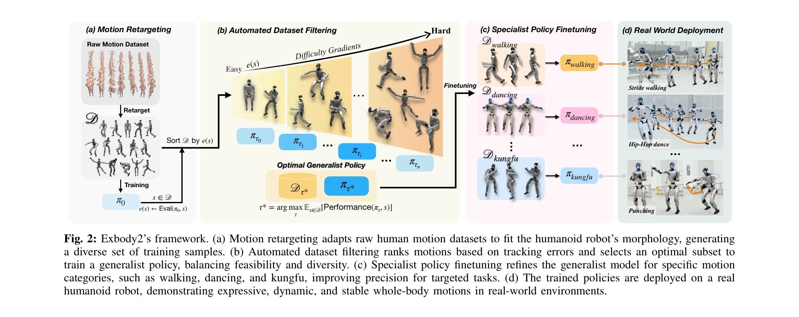

# ExBody2: Advanced Expressive Humanoid Whole-Body Control

> **저자**: Mazeyu Ji, Xuanbin Peng, Fangchen Liu, Jialong Li, Ge Yang, Xuxin Cheng, Xiaolong Wang | **날짜**: 2024-12-17 | **URL**: [https://arxiv.org/abs/2412.13196](https://arxiv.org/abs/2412.13196)

---

## Essence

*Fig. 1: Humanoid robot executing various expressive whole-body motions in the real world. The robot can (a) walk with a *

휴머노이드 로봇이 인간 모션 캡처 데이터와 시뮬레이션 데이터를 활용하여 표현력 있는 전신 움직임을 수행하면서 안정성을 유지할 수 있게 하는 Advanced Expressive Whole-Body Control (Exbody2) 방법을 제안한다.

## Motivation

- **Known**: 기존 연구들은 강화학습과 sim-to-real 전이를 통해 복잡한 전신 기술을 습득하거나, 인간 모션 데이터를 활용한 모션 모방을 시도했으나 표현력과 안정성 사이의 trade-off 문제가 남아있다.
- **Gap**: 인간 모션 데이터에는 로봇의 물리적 한계를 초과하는 움직임이 포함되어 있으며, 기존의 수동 필터링이나 언어 레이블 기반 데이터 정제 방식은 비효율적이고 불완전하다.
- **Why**: 휴머노이드 로봇이 인간 수준의 표현력과 신뢰성 있는 전신 제어를 동시에 달성하는 것은 일상 공간에서 활동하는 로봇의 실용성 향상에 필수적이다.
- **Approach**: 자동화된 데이터 정제를 통한 generalist policy 학습과 특정 모션 그룹에 대한 specialist policy fine-tuning, 그리고 속도 추적과 신체 랜드마크 추적을 분리하는 decoupled motion-velocity control 전략을 결합한다.

## Achievement

*Fig. 1: Humanoid robot executing various expressive whole-body motions in the real world. The robot can (a) walk with a *

- **자동화된 데이터 정제**: 초기 정책의 추적 오류를 평가하여 불가능한 하체 모션을 자동으로 제거하면서 다양성을 보존하는 Feasibility-Diversity Principle 제안
- **Generalist-Specialist 파이프eline**: 다양한 모션에 대한 적응성을 지닌 generalist policy와 특정 태스크의 정확도를 높인 specialist policy로 구성
- **Decoupled Motion-Velocity Control**: 키포인트 추적과 속도 제어를 분리하여 다음 단계에서의 추적 실패를 감소시키고 표현력 있는 움직임 재현 가능
- **Teacher-Student Framework**: 특권 정보(root velocity, 정확한 신체 위치 등)를 사용한 teacher policy로부터 student policy를 학습하여 실제 로봇 배포 가능
- **실세계 검증**: Unitree G1에서 걷기, 웅크리기, 춤 등 다양한 표현력 있는 움직임을 안정적으로 수행 증명

## How

*Fig. 2: Exbody2’s framework. (a) Motion retargeting adapts raw human motion datasets to fit the humanoid robot’s morphol*

- 인간 모션 데이터를 로봇 형태에 맞게 retarget하는 전처리 단계 수행
- 미필터링 모션 데이터셋 D에 대해 초기 정책 π0를 학습하고, 각 모션에 대한 하체 추적 오류 e(s)를 평가
- 추적 오류 기반으로 불가능한 모션을 자동 제거하여 정제된 데이터셋으로 generalist policy π 학습
- Generalist policy에 특정 모션 그룹 데이터를 fine-tuning하여 specialist policy 생성
- Decoupled control을 위해 키포인트를 로컬 프레임으로 변환하고 속도 추적과 신체 추적을 분리된 목표로 설정
- PPO를 사용한 teacher policy 학습 (특권 정보 사용) 후, DAgger 스타일 distillation으로 student policy 훈련
- 학습된 student policy를 실제 Unitree G1 로봇에 배포 및 검증

## Originality

- 기존 수동 필터링이나 언어 레이블 기반 방식과 달리, 정책의 실제 추적 오류를 기반으로 자동 데이터 정제하는 novel한 접근
- Feasibility-Diversity Principle을 통해 하체 실현 가능성과 상체 다양성의 균형을 수학적으로 정식화
- Decoupled motion-velocity control로 속도 기반 이동 가이드와 표현력 있는 모션 모방을 분리한 창의적 설계
- Teacher-student framework에서 특권 정보를 효과적으로 활용하여 sim-to-real 갭을 좁히는 체계적 접근

## Limitation & Further Study

- Specialist policy의 추가 fine-tuning이 다른 모션의 성능을 저하시키는 trade-off 명시 (향후 다중 작업 최적화 필요)
- 자동 데이터 정제의 threshold 설정이 경험적 결과에 기반하며, 다양한 로봇 플랫폼에 대한 일반화 미흡
- Real-world 실험이 단일 로봇(Unitree G1)에 한정되어 다른 휴머노이드 로봇에의 적용 효과 미검증
- 장시간 동작(43초 댄스) 중 누적 오류에 대한 분석 및 보상 메커니즘 부재
- 외부 섭동(external perturbations)에 대한 robust성 평가 미포함

## Evaluation

- Novelty: 4/5
- Technical Soundness: 4/5
- Significance: 4/5
- Clarity: 4/5
- Overall: 4/5

**총평**: 본 논문은 자동화된 데이터 정제와 decoupled control 전략을 통해 휴머노이드 로봇의 표현력 있는 전신 제어 문제를 효과적으로 해결하며, 실세계 검증을 통해 높은 실용성을 입증한다.

## Related Papers

- 🔗 후속 연구: [[papers/1390_Expressive_Whole-Body_Control_for_Humanoid_Robots/review]] — ExBody2의 Advanced Expressive Whole-Body Control은 기존 ExBody의 표현력 있는 전신 제어 방법을 시뮬레이션과 모션 캡처 데이터 통합으로 한층 발전시킨 버전입니다.
- 🔄 다른 접근: [[papers/1354_DreamControl_Human-Inspired_Whole-Body_Humanoid_Control_for/review]] — ExBody2의 모션 캡처와 시뮬레이션 데이터 결합 방식과 DreamControl의 diffusion prior 기반 접근법은 표현력 있는 휴머노이드 제어를 위한 서로 다른 방법론입니다.
- 🔄 다른 접근: [[papers/1354_DreamControl_Human-Inspired_Whole-Body_Humanoid_Control_for/review]] — DreamControl의 diffusion prior 기반 가이드와 ExBody2의 모션 캡처 데이터 활용은 표현력 있는 전신 움직임 달성을 위한 서로 다른 방법론입니다.
- 🏛 기반 연구: [[papers/1390_Expressive_Whole-Body_Control_for_Humanoid_Robots/review]] — 기본 Expressive Whole-Body Control 방법은 ExBody2의 Advanced 버전에서 시뮬레이션 데이터와 모션 캡처의 통합적 활용을 위한 핵심 기술적 기반을 제공합니다.
- 🏛 기반 연구: [[papers/1443_Hierarchical_Intention-Aware_Expressive_Motion_Generation_fo/review]] — ExBody2의 전신 표현적 제어 기술이 HIAER의 감정적 제스처 생성의 기반이 된다
