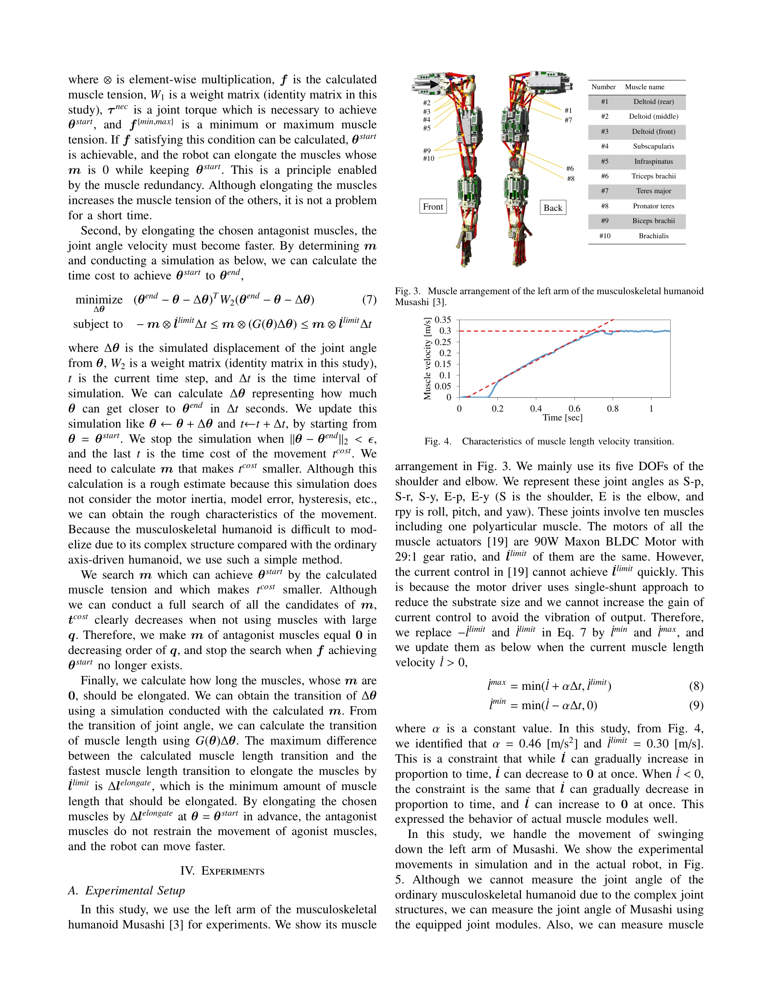

# Exceeding the Maximum Speed Limit of the Joint Angle for the Redundant Tendon-driven Structures of Musculoskeletal Humanoids

> **저자**: Kento Kawaharazuka, Yuya Koga, Kei Tsuzuki, Moritaka Onitsuka, Yuki Asano, Kei Okada, Koji Kawasaki, Masayuki Inaba | **날짜**: 2025-02-18 | **URL**: [https://arxiv.org/abs/2502.12808](https://arxiv.org/abs/2502.12808)

---

## Essence

*Fig. 2.*

중복 힘줄-구동 근골격계 로봇의 관절 각속도 제한을 극복하기 위해 길항근 억제 또는 사전 신장 두 가지 방법을 제안하고 실제 로봇 실험으로 검증한다.

## Motivation

- **Known**: 근골격계 로봇은 fail-safe redundant actuation과 variable stiffness control 등의 생체모방 이점을 가지며, 중복 근육 배치가 이를 가능하게 한다. 기존 관절 각속도 최적화는 소프트웨어 기반 방법들이 있었다.
- **Gap**: 중복 근육 배치에서 가장 느린 길항근이 전체 관절 각속도를 제한하는 문제가 미해결 상태이다. 근골격계 로봇의 하드웨어 특성을 활용하여 이 제한을 극복하는 방법이 부재하다.
- **Why**: 망치질, 골프 스윙 등 고속 동작에서 관절 각속도 향상은 로봇의 실용성을 크게 증대시키며, 중복 근육 구조의 이점을 충분히 활용할 수 있다.
- **Approach**: 길항근의 moment arm과 actuator 속도 한계를 지표 q로 정량화하고, 느린 길항근을 억제하거나 사전에 신장시키는 두 가지 단순한 제어 방법을 제안한다.

## Achievement

*Fig. 3. Muscle arrangement of the left arm of the musculoskeletal humanoid*

- **길항근 억제 방법 (Antagonist Inhibition Method)**: 큰 q 값을 가진 길항근의 모터 전류를 0으로 설정하여 backdrivability를 활용해 수동적으로 신장되도록 함
- **길항근 사전 신장 방법 (Muscle Pre-elongation Method)**: quadratic programming을 통해 시작 자세 달성 가능성을 보장하면서 특정 길항근을 미리 신장시켜 최대 관절 각속도를 증가시킴
- **실제 로봇 검증**: 근골격계 로봇 Musashi를 이용한 실험으로 두 방법의 유효성과 장단점을 비교 검증함

## How

*Fig. 2.*

- Muscle Jacobian G(θ)를 이용하여 moment arm r을 계산하고, 지표 q = r/ḷimit로 muscle velocity 한계 도달 용이성 평가
- 길항근 억제: 간단한 임계값 기반 제어로 q[i] > C인 근육의 전류를 0으로 설정
- 길항근 사전 신장: 마스크 m을 정의하여 elongation할 근육 선택, 식 (6)의 quadratic programming으로 θstart 달성 가능성 확인
- 시뮬레이션 (식 7)을 통해 마스크 m 후보에 대해 tcost를 계산하고 최적의 m 선택
- gravity와 body inertia의 영향을 고려하여 agonist muscle 중심의 제어 설계

## Originality

- 중복 근육 구조의 제약 조건을 문제가 아닌 이점으로 재해석하고 하드웨어 특성을 직접 활용하는 새로운 관점 제시
- Moment arm 기반 지표 q를 통한 정량적 병목 분석 방법 개발
- Backdrivability를 활용한 단순하면서도 효과적인 길항근 억제 제어 방식 제안
- Muscle redundancy를 활용하여 특정 근육을 선택적으로 신장시키는 최적화 프레임워크 제시

## Limitation & Further Study

- 시뮬레이션이 motor inertia, model error, hysteresis 등을 고려하지 않아 rough estimate에 그침
- 방법 A는 backdrivability 가정이 필수적이므로 적용 가능한 로봇 형태 제한
- 방법 B는 quadratic programming과 시뮬레이션 계산량이 높아 실시간 적용에 어려움 가능
- 복잡한 근골격계 구조의 정밀한 모델링 부재로 실제 성능과 시뮬레이션 간 오차 가능성
- 후속 연구: 모터 특성을 반영한 더 정밀한 동역학 모델 개발, 실시간 최적화 알고리즘 개선, 다양한 운동 패턴에 대한 적응형 제어 확장

## Evaluation

- Novelty: 4/5
- Technical Soundness: 3/5
- Significance: 4/5
- Clarity: 4/5
- Overall: 4/5

**총평**: 근골격계 로봇의 중복 근육 구조에서 관절 각속도 제한을 극복하는 창의적인 솔루션을 제시하고 실제 로봇으로 검증한 의미 있는 연구이나, 시뮬레이션 정확도 개선과 실시간 적용 가능성 향상이 향후 과제로 남아있다.

## Related Papers

- 🏛 기반 연구: [[papers/1300_Characteristics_Management_and_Utilization_of_Muscles_in_Mus/review]] — 중복 힘줄 구동 시스템의 관절 속도 제한 극복이 근육골격 구조의 Redundancy 특성 활용에 기초합니다.
- 🔄 다른 접근: [[papers/1389_Explosive_Output_to_Enhance_Jumping_Ability_A_Variable_Reduc/review]] — 길항근 억제/사전 신장과 가변 감속비의 서로 다른 관절 성능 향상 접근법을 비교 연구할 수 있습니다.
- 🧪 응용 사례: [[papers/1603_ORCA_An_Open-Source_Reliable_Cost-Effective_Anthropomorphic/review]] — 관절 각속도 제한 극복 기술이 17-DoF 힘줄 구동 로봇 손의 고속 조작에 적용 가능합니다.
- 🔗 후속 연구: [[papers/1300_Characteristics_Management_and_Utilization_of_Muscles_in_Mus/review]] — 근육골격 구조의 5가지 특성 분석이 중복 힘줄 구동 시스템의 관절 속도 제한 극복 연구로 확장됩니다.
- 🔄 다른 접근: [[papers/1389_Explosive_Output_to_Enhance_Jumping_Ability_A_Variable_Reduc/review]] — 가변 감속비와 길항근 제어의 서로 다른 관절 성능 최적화 방법을 비교 연구할 수 있습니다.
