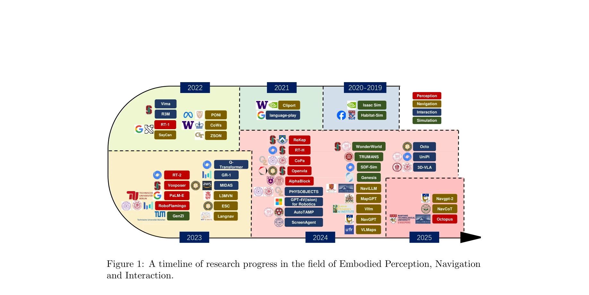

# Exploring Embodied Multimodal Large Models: Development, Datasets, and Future Directions

> **저자**: Shoubin Chen, Zehao Wu, Kai Zhang, Chunyu Li, Baiyang Zhang, Fei Ma, Fei Richard Yu, Qingquan Li | **날짜**: 2025-02-21 | **URL**: [https://arxiv.org/abs/2502.15336](https://arxiv.org/abs/2502.15336)

---

## Essence

*Figure 1: A timeline of research progress in the field of Embodied Perception, Navigation*

Embodied Multimodal Large Models (EMLMs)는 Large Language Models, Large Vision Models 등의 기초 모델들을 결합하여 지각, 인지, 행동을 물리적 환경에서 통합하는 체계적인 종합 리뷰이다. 본 논문은 300개 논문을 분석하여 EMLMs의 발전, 데이터셋, 및 미래 방향에 대한 첫 번째 체계적 분석을 제공한다.

## Motivation

- **Known**: Large Models(LLMs, LVMs)와 multimodal learning 기술이 발전하고 있으며, embodied intelligence 개념이 인지과학과 로봇공학에서 확립되었다. 최근 이러한 기술들이 로봇 조작, 자율 주행, 인간-로봇 상호작용 등 현실 애플리케이션에 적용되고 있다.
- **Gap**: 기존 리뷰들은 전통적 LLMs, 언어-시각 모델에 초점을 맞추거나 너무 광범위한 embodied intelligence 전체를 다루면서 multimodal large models의 역할을 깊이 있게 다루지 못했다. 또한 최근 급속한 발전 이전에 발표된 리뷰들이 많아 최신 발전을 반영하지 못하고 있다.
- **Why**: EMLMs는 AI의 추상적 추론 능력과 현실의 복잡성을 연결하여 지각, 행동, 학습을 인간 인지에 더 가깝게 구현할 수 있기 때문이다. 로봇공학, 자율주행, 가상환경 등 다양한 도메인에서의 응용 가능성이 높다.
- **Approach**: 본 논문은 foundational models(LLM, LVM)의 발전부터 시작하여, embodied perception, navigation, interaction, simulation 등 EMLMs의 4대 주요 영역을 체계적으로 분석한다. 또한 multimodal datasets의 영향과 scalability, generalization, real-time decision-making 등의 주요 과제를 다룬다.

## Achievement

*Figure 1: A timeline of research progress in the field of Embodied Perception, Navigation*

- **첫 번째 체계적 리뷰**: 300개 연구논문을 분석한 EMLMs 분야의 첫 번째 종합적 체계적 리뷰를 제시했다.
- **Full-Stack 분석**: Foundational models, embodied perception, embodied navigation, embodied interaction, simulation, datasets을 포함한 포괄적 스택 분석을 제공한다.
- **벤치마크 데이터셋 정리**: EMLMs 학습 및 평가에 사용되는 벤치마크 데이터셋들을 수집 방법, 데이터 포맷, 기능성, 플랫폼 적용성 등 다각도로 분석했다.
- **연구 로드맵 제시**: Embodied agents 응용 분야에 대한 insights와 미래 연구 방향을 체계적으로 제시한다.

## How

*Figure 1: A timeline of research progress in the field of Embodied Perception, Navigation*

- Foundational models의 발전 추적: LLMs, LVMs, transformer 기반 아키텍처의 진화 분석
- 4대 EMLMs 영역별 기술 동향 분석: embodied perception, navigation, interaction, simulation 각각의 최신 방법론 검토
- Multimodal datasets 특성 분류: 데이터 형식, 기능성, 적용 가능 플랫폼, 장단점 등을 체계적으로 카테고리화
- 주요 과제 식별: Scalability, generalization, real-time decision-making, multimodal integration의 병목 분석
- Timeline 구성: 2019-2025년 Embodied Perception, Navigation, Interaction의 주요 연구 사례를 시간순으로 정렬

## Originality

- 최초의 EMLMs 통합 리뷰로서, 기존 리뷰들이 LLMs나 전체 embodied intelligence에만 초점을 맞춘 것과 달리 multimodal large models과 embodied tasks의 통합을 중점적으로 분석한다.
- Full-stack 분석 관점에서 foundational models부터 simulation까지 전체 기술 스택을 포괄적으로 다루어 부분적 분석의 한계를 극복한다.
- 최신 발전(2024-2025)을 포함한 최신 리뷰로서 RT-1, RT-2, GPT-4V for Robotics, Octo, 3D-VLA 등 최근 모델들을 체계적으로 분석한다.
- Dataset 중심 분석을 통해 모델 학습의 기초가 되는 데이터 특성을 상세히 분류하고 평가한다.

## Limitation & Further Study

- 리뷰 논문의 특성상 새로운 알고리즘이나 모델 아키텍처를 제안하지 않으며, 기존 연구의 종합 분석에 그친다.
- Embodied agents의 물리적 플랫폼 개발(하드웨어 엔지니어링)은 범위에서 제외되어 full embodied system의 완전한 이해를 제한할 수 있다.
- Real-world deployment와 실제 성능 평가 데이터의 부족으로, 현실 환경에서의 성능 격차(sim-to-real gap)에 대한 심층 분석이 제한적일 수 있다.
- 후속 연구로는 EMLMs의 안전성(safety), 해석 가능성(interpretability), 일반화(generalization) 개선을 위한 구체적 기술 개발이 필요하다.

## Evaluation

- Novelty: 4/5
- Technical Soundness: 3/5
- Significance: 4/5
- Clarity: 4/5
- Overall: 4/5

**총평**: 본 리뷰는 EMLMs 분야의 첫 번째 체계적 종합 분석으로서, foundational models부터 embodied tasks까지 full-stack을 다루며 최신 연구 동향을 포괄적으로 정리했다. 명확한 구조와 풍부한 사례로 이 급속히 발전하는 분야의 현황과 미래 방향을 제시하는 매우 가치 있는 리뷰이다.

## Related Papers

- 🧪 응용 사례: [[papers/1346_Cross-Platform_Scaling_of_Vision-Language-Action_Models_from/review]] — embodied multimodal 모델의 cross-platform 배포를 위한 하드웨어별 성능 최적화 전략
- 🏛 기반 연구: [[papers/1397_Foundation_Model_Driven_Robotics_A_Comprehensive_Review/review]] — EMLM 체계적 리뷰가 foundation model 기반 로봇공학 연구의 multimodal 통합 방향성 제시
- 🏛 기반 연구: [[papers/1357_DreamZero_World_Action_Models_are_Zero-shot_Policies/review]] — VLA 모델 전체 스택 리뷰가 embodied multimodal 모델 발전의 포괄적 기초 자료 제공
- 🔄 다른 접근: [[papers/1397_Foundation_Model_Driven_Robotics_A_Comprehensive_Review/review]] — foundation model 기반 로봇공학과 embodied multimodal 모델의 상호보완적 발전 방향
- 🔄 다른 접근: [[papers/1305_Aligning_Cyber_Space_with_Physical_World_A_Comprehensive_Sur/review]] — embodied multimodal model을 각각 사이버-물리 융합과 개발-데이터-평가라는 다른 관점에서 조사한다
- 🔗 후속 연구: [[papers/1346_Cross-Platform_Scaling_of_Vision-Language-Action_Models_from/review]] — VLA 모델의 cross-platform scaling 연구가 embodied multimodal 모델의 실용적 배포 전략으로 확장
- 🔗 후속 연구: [[papers/1350_Deep_Reinforcement_Learning_for_Robotics_A_Survey_of_Real-Wo/review]] — DRL 분류체계가 embodied multimodal 모델의 강화학습 통합 연구로 발전
