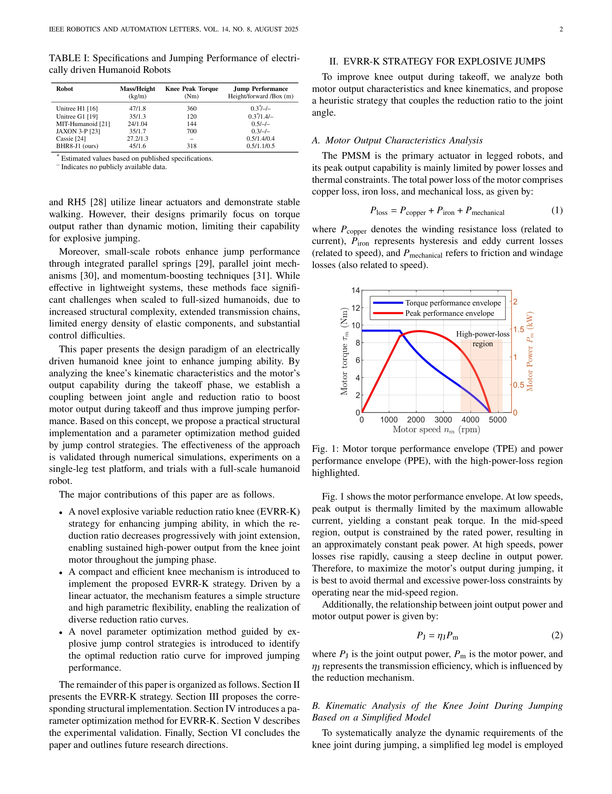

# Explosive Output to Enhance Jumping Ability: A Variable Reduction Ratio Design Paradigm for Humanoid Robots Knee Joint

> **저자**: Xiaoshuai Ma, Haoxiang Qi, Qingqing Li, Haochen Xu, Xuechao Chen, Junyao Gao, Zhangguo Yu, Qiang Huang | **날짜**: 2025-06-14 | **URL**: [https://arxiv.org/abs/2506.12314](https://arxiv.org/abs/2506.12314)

---

## Essence

*Fig. 1: Motor torque performance envelope (TPE) and power*

휴머노이드 로봇의 무릎 관절에 가변 감속비 설계를 도입하여 점프 시 폭발적 출력을 유지하고 점프 성능을 28.1% 향상시킨 연구이다.

## Motivation

- **Known**: 휴머노이드 로봇의 점프 능력은 유압식 Atlas에 비해 현저히 낮으며, 전기 구동 로봇은 모터의 열 제약과 고속에서의 전력 손실로 인해 장시간 고출력 유지가 어렵다.
- **Gap**: 무릎-CoM 전달비가 관절 확장에 따라 증가하는데, 이는 점프 초기 고토크와 후기 고속도 요구사항과 불일치한다. 고정 감속비 관절은 이 문제를 해결할 수 없다.
- **Why**: 점프는 휴머노이드 로봇의 민첩성과 장애물 넘기 능력을 크게 향상시키는 중요한 운동이며, 전기 구동 로봇의 점프 성능 개선은 실용적 로봇 개발의 핵심 과제이다.
- **Approach**: 모터 출력 특성과 무릎 운동학을 분석하여 관절 각도에 따라 감속비를 동적으로 감소시키는 EVRR-K 전략을 제안하고, 선형 액추에이터 기반 가이드로드 메커니즘으로 구현한다.

## Achievement

*Fig. 4: Schematic of the high-explosiveness variable reduction*

- **EVRR-K 전략**: 관절 확장에 따라 감속비를 점진적으로 감소시켜 초기 고토크와 후기 저속 증가를 동시에 달성하며 지속적 고출력 유지
- **단일 관절 플랫폼 성능**: 63 cm 수직 점프로 고정 감속비 대비 28.1% 이론적 개선 달성
- **완전 휴머노이드 로봇 성능**: 1.1 m 장거리 점프, 0.5 m 수직 점프, 0.5 m 박스 점프 실현

## How

*Fig. 2: Prototype system used to analyze knee joint requirements*

- PMSM의 토크-전력 봉투(TPE, PPE) 분석을 통해 최적 운영 영역 도출
- 간단한 2자유도 다리 모델(무릎 능동, 고관절 및 발목 수동)로 점프 시 무릎 관절의 CoM 전달비 λ(q₂) 계산
- 선형 액추에이터 구동 가이드로드 메커니즘으로 가변 감속비 메커니즘 물리 구현
- 폭발적 점프 제어 전략 기반 파라미터 최적화 방법론으로 최적 감속비 곡선 결정
- 단일 관절 플랫폼 실험과 전체 휴머노이드 로봇 통합 실험으로 검증

## Originality

- 관절 각도와 감속비를 동적으로 결합하는 새로운 설계 패러다임으로서 기존 고정 감속비 접근법과 본질적 차별성
- 모터의 전력 손실 분석(구리손, 철손, 기계손)과 운동학적 요구사항을 명확히 연결하는 이론적 기초
- 선형 액추에이터 기반 간단한 구조로 다양한 감속비 곡선 실현 가능한 설계 유연성
- 점프 제어 전략으로 역방향 최적화하는 파라미터 결정 방법

## Limitation & Further Study

- 단일 관절 플랫폼 실험이 보행 안정성과 연속 점프 능력 검증 미흡
- 가변 감속비 메커니즘의 마찰 및 응답 지연에 대한 상세 분석 부재
- 완전 휴머노이드 로봇 성능이 Cassie(1.4 m)나 Unitree G1(1.4 m) 수준과 비교할 때 장거리 점프에서 여전히 제약
- 후속 연구에서 다리 아래쪽 관절(발목)과의 통합 최적화, 경사지와 유연한 지면에서의 성능 평가 필요

## Evaluation

- Novelty: 4/5
- Technical Soundness: 4/5
- Significance: 4/5
- Clarity: 4/5
- Overall: 4/5

**총평**: 전기 구동 휴머노이드 로봇의 점프 성능 향상을 위한 혁신적이고 실용적인 설계 패러다임을 제시하며, 이론적 분석과 실험 검증이 충분하고 로봇 공학에 유의미한 기여를 한다.

## Related Papers

- 🔄 다른 접근: [[papers/1326_DecARt_Leg_Design_and_Evaluation_of_a_Novel_Humanoid_Robot_L/review]] — 가변 감속비와 decoupled actuation의 서로 다른 점프 및 민첩성 향상 메커니즘을 비교 분석할 수 있습니다.
- 🔄 다른 접근: [[papers/1388_Exceeding_the_Maximum_Speed_Limit_of_the_Joint_Angle_for_the/review]] — 가변 감속비와 길항근 제어의 서로 다른 관절 성능 최적화 방법을 비교 연구할 수 있습니다.
- 🧪 응용 사례: [[papers/1300_Characteristics_Management_and_Utilization_of_Muscles_in_Mus/review]] — 폭발적 출력 메커니즘이 근육골격 구조의 Nonlinear Elasticity 특성 활용에 응용됩니다.
- 🏛 기반 연구: [[papers/1300_Characteristics_Management_and_Utilization_of_Muscles_in_Mus/review]] — 근육의 Nonlinear Elasticity 특성이 가변 감속비 설계의 폭발적 출력 메커니즘 이해에 기초가 됩니다.
- 🔄 다른 접근: [[papers/1326_DecARt_Leg_Design_and_Evaluation_of_a_Novel_Humanoid_Robot_L/review]] — decoupled actuation과 가변 감속비의 서로 다른 민첩한 보행을 위한 구동 시스템 설계 접근법을 비교할 수 있습니다.
- 🔄 다른 접근: [[papers/1388_Exceeding_the_Maximum_Speed_Limit_of_the_Joint_Angle_for_the/review]] — 길항근 억제/사전 신장과 가변 감속비의 서로 다른 관절 성능 향상 접근법을 비교 연구할 수 있습니다.
