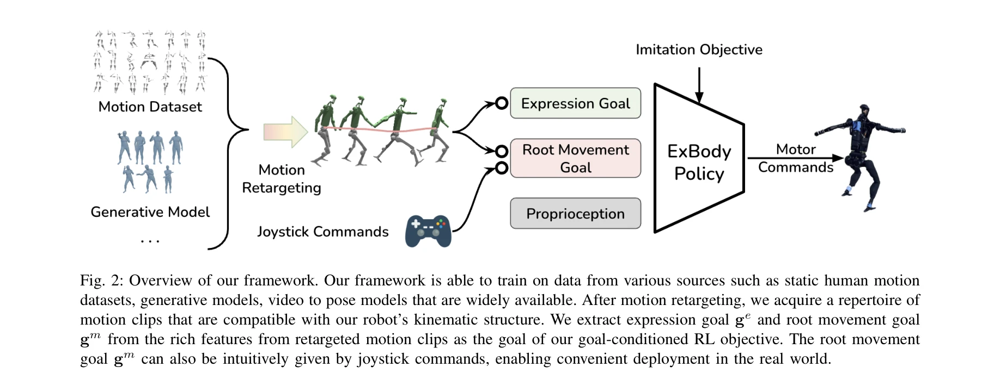
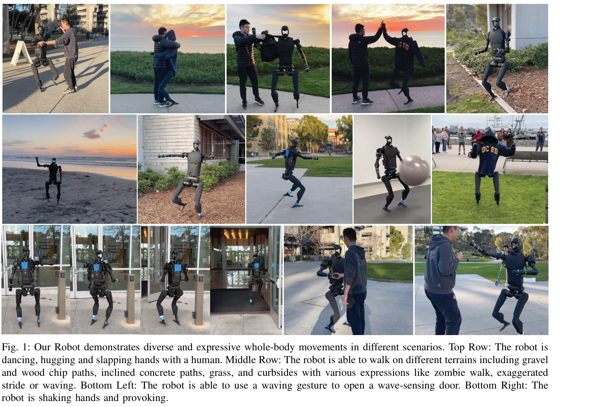

# Expressive Whole-Body Control for Humanoid Robots

> **저자**: Xuxin Cheng, Yandong Ji, Junming Chen, Ruihan Yang, Ge Yang, Xiaolong Wang | **날짜**: 2024-02-26 | **URL**: [https://arxiv.org/abs/2402.16796](https://arxiv.org/abs/2402.16796)

---

## Essence

*Fig. 2: Overview of our framework. Our framework is able to train on data from various sources such as static human moti*

인간형 로봇이 인간의 모션 캡처 데이터를 학습하여 표현력 있는 전신 움직임을 수행하도록 강화학습 기반의 제어 정책을 제안하며, 상체는 참조 모션을 모방하되 하체는 속도 명령만 따르도록 제약을 완화하여 실제 로봇에서의 동작을 가능하게 함.

## Motivation

- **Known**: 기존의 physics-based character animation은 그래픽 분야에서 자연스러운 제어 정책을 생성하지만, 현실의 로봇 하드웨어에 과도한 액추에이터 이득을 요구하고 자유도 불일치 문제가 있음. 심화강화학습 기반 보행 제어는 다양한 다리 로봇에서 견고성을 입증했음.
- **Gap**: 인간 모션 캡처 데이터의 큰 자유도와 로봇의 제한된 자유도 사이의 간극, 그리고 그래픽 기법의 현실 로봇 적용 불가능성으로 인해 다양한 표현력 있는 인간형 로봇 제어가 실제 환경에서 실현되지 못함.
- **Why**: 인간형 로봇이 단순한 작업 수행을 넘어 인간과 자연스럽고 표현력 있게 상호작용할 수 있다면 로봇의 활용도와 수용성이 크게 증가할 수 있으며, 이는 인간-로봇 협력의 새로운 가능성을 열어줌.
- **Approach**: 상체 모방 제약과 하체 속도 추적을 분리하는 이중 목표 강화학습 프레임워크를 도입하고, 시뮬레이션에서 다양한 지형으로 훈련 후 Sim2Real 전이를 통해 실제 Unitree H1 로봇에 배포함.

## Achievement

*Fig. 1: Our Robot demonstrates diverse and expressive whole-body movements in different scenarios. Top Row: The robot is*

- **다양한 표현력 있는 동작**: 로봇이 춤추기, 악수하기, 손 흔들기, 좀비 보행 등 다양한 스타일의 보행과 상체 표현을 인간과 함께 실제 환경에서 수행 가능
- **견고한 지형 적응성**: 자갈길, 나무칩 길, 잔디, 경사진 포장도로, 연석 등 다양한 지형에서 안정적으로 동작
- **소수 모션 데이터로 효율적 학습**: 780개의 CMU MoCap 데이터(약 3.7시간)를 활용하여 기존 방법 대비 훨씬 적은 학습 데이터로 우수한 성능 달성
- **배포 용이성**: 조이스틱 명령으로 직관적 제어 가능하며 단일 네트워크로 운영되어 실시간 배포에 적합

## How

*Fig. 2: Overview of our framework. Our framework is able to train on data from various sources such as static human moti*

- CMU MoCap 데이터에서 신체 상호작용, 무거운 물체 조작, 거친 지형 모션을 제외하여 큐레이션
- 인간 모션을 로봇의 운동학 구조에 맞게 retargeting하여 호환 가능한 모션 클립 라이브러리 구성
- 목표 공간을 표현 목표 Ge(상체 관절 9개, 키포인트 18개)와 근 움직임 목표 Gm(속도, 자세, 높이)으로 분리
- 강화학습 보상 함수를 상체 모방 항(expression goal)과 하체 속도 추적 항(root movement goal)으로 설계
- 다양한 지형과 매개변수 변동성으로 시뮬레이션 훈련 시 도메인 랜더마이제이션 적용
- 정책 상태 분포를 분석하여 학습 효율성 검증 및 모션 샘플링 전략 최적화

## Originality

- 기존 physics-based character animation과 RL 기반 보행 제어의 한계를 동시에 극복하는 하이브리드 접근법
- 상체와 하체의 제약 조건을 차등적으로 적용하는 이중 목표 설계로 기존의 일괄적 모방 전략과 차별화
- CMU MoCap 같은 기존 대규모 모션 데이터셋을 로봇 제어에 효과적으로 재활용하는 새로운 방법론
- 실제 인간형 로봇(Unitree H1)에서 처음으로 다양한 표현력 있는 모션을 성공적으로 시연한 학습 기반 접근

## Limitation & Further Study

- 현재 방법은 상체 모션만 표현력 있게 모방하고 하체는 속도만 추적하므로, 하체의 표현력 있는 동작(예: 발차기, 점프)은 제한됨
- CMU MoCap 데이터의 편향된 분포(Fig. 3)가 특정 유형의 모션에 대한 학습 성능에 영향을 미칠 수 있음
- 현재 연구는 보행 중심이며, 물체 조작과 같은 전신 상호작용이 필요한 복잡한 작업에 대한 확장이 필요
- Unitree H1 로봇 특화로 다른 인간형 로봇 플랫폼으로의 일반화 가능성 검증 부족
- 후속 연구로는 diffusion model이나 video-to-skeleton 모델 같은 다양한 모션 생성 소스의 활용, 하체 표현력 확장, 복잡한 조작 작업의 통합 등이 필요

## Evaluation

- Novelty: 4/5
- Technical Soundness: 3/5
- Significance: 4/5
- Clarity: 4/5
- Overall: 4/5

**총평**: 본 논문은 인간 모션 캡처 데이터를 실제 인간형 로봇에 효과적으로 적용하는 창의적인 문제 분해 방식과 차등적 제약 설계로, 학습 기반 인간형 로봇 제어 분야에서 처음으로 다양한 표현력 있는 동작을 실현함. 명확한 동기, 실제 로봇 검증, 그리고 우수한 성과에도 불구하고 기술적 신규성이 개별 컴포넌트 수준에서는 제한적이며, 하체 표현력과 다양한 작업 확장에 대한 연구가 필요함.

## Related Papers

- 🏛 기반 연구: [[papers/1387_ExBody2_Advanced_Expressive_Humanoid_Whole-Body_Control/review]] — 기본 Expressive Whole-Body Control 방법은 ExBody2의 Advanced 버전에서 시뮬레이션 데이터와 모션 캡처의 통합적 활용을 위한 핵심 기술적 기반을 제공합니다.
- 🔄 다른 접근: [[papers/1381_EMOTION_Expressive_Motion_Sequence_Generation_for_Humanoid_R/review]] — 모션 캡처 데이터 기반의 표현력 있는 전신 움직임 학습과 EMOTION의 LLM 기반 동적 제스처 생성은 휴머노이드 표현성을 위한 서로 다른 데이터 소스와 방법론을 사용합니다.
- 🏛 기반 연구: [[papers/1289_Bi-Level_Motion_Imitation_for_Humanoid_Robots/review]] — 표현적 전신 제어에서 VLM 기반 사회적 맥락 이해가 기초가 된다
- 🔗 후속 연구: [[papers/1387_ExBody2_Advanced_Expressive_Humanoid_Whole-Body_Control/review]] — ExBody2의 Advanced Expressive Whole-Body Control은 기존 ExBody의 표현력 있는 전신 제어 방법을 시뮬레이션과 모션 캡처 데이터 통합으로 한층 발전시킨 버전입니다.
- 🔄 다른 접근: [[papers/1381_EMOTION_Expressive_Motion_Sequence_Generation_for_Humanoid_R/review]] — EMOTION의 LLM 기반 동적 제스처 생성과 ExBody의 모션 캡처 데이터 기반 표현력 있는 전신 제어는 휴머노이드 표현성 향상을 위한 서로 다른 접근법입니다.
- 🏛 기반 연구: [[papers/1382_EMP_Executable_Motion_Prior_for_Humanoid_Robot_Standing_Uppe/review]] — Expressive Whole-Body Control의 전신 표현 방법이 EMP의 상체 동작 모방과 하체 안정성 조화의 이론적 기반이 된다.
- 🏛 기반 연구: [[papers/1471_Humanoid_Policy__Human_Policy/review]] — Humanoid Policy의 VAE 기반 동작 표현은 expressive whole-body control의 기반 기술이 된다.
