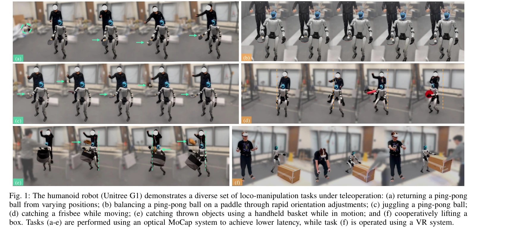
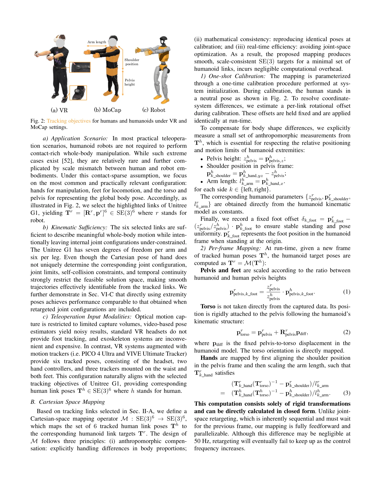

# ExtremControl: Low-Latency Humanoid Teleoperation with Direct Extremity Control

> **저자**: Ziyan Xiong, Lixing Fang, Junyun Huang, Kashu Yamazaki, Hao Zhang, Chuang Gan | **날짜**: 2026-02-11 | **URL**: [https://arxiv.org/abs/2602.11321](https://arxiv.org/abs/2602.11321)

---

## Essence

*Fig. 1: The humanoid robot (Unitree G1) demonstrates a diverse set of loco-manipulation tasks under teleoperation: (a) r*

ExtremControl은 SE(3) 포즈 기반의 직접 제어와 velocity feedforward 제어를 통해 50ms의 극저지연 인간형 텔레오퍼레이션을 실현하는 프레임워크이다.

## Motivation

- **Known**: 기존 인간형 로봇 텔레오퍼레이션 시스템들은 인간-로봇 동작 재타겟팅과 position-only PD 제어에 의존하며, 대부분 200ms 내외의 지연을 보인다.
- **Gap**: 전신 재타겟팅으로 인한 지연과 position-only PD 제어의 한계가 있어서, 빠른 피드백이 필요한 동적 작업 수행이 어렵다.
- **Why**: 저지연 텔레오퍼레이션은 반응성 높은 동적 작업 수행을 가능하게 하고 다양한 로봇 학습 데이터 수집에 필수적이다.
- **Approach**: 선택된 강체 링크들의 SE(3) 포즈에 직접 작동하는 Cartesian 공간 매핑과 velocity feedforward 제어를 결합하여 지연을 최소화한다.

## Achievement

*Fig. 1: The humanoid robot (Unitree G1) demonstrates a diverse set of loco-manipulation tasks under teleoperation: (a) r*

- **극저지연 달성**: 기존 200ms 대비 50ms의 end-to-end 지연 달성으로 약 4배 개선
- **전신 제어 능력**: 팔, 다리, 몸통을 포함한 6개 극단부 링크의 완전한 제어 가능
- **다중 입력 지원**: optical MoCap과 VR 기반 모션 추적 모두 지원하는 통합 시스템
- **고도의 동적 작업 수행**: 탁구공 발란싱, 저글링, 프리즈비 캐칭 등 rapid feedback이 필요한 작업 실현
- **이론적 통합**: 로봇 기구학, 역학, 정책 학습을 포함한 통일된 이론적 표현 제공

## How

*Fig. 2: Tracking objectives for humans and humanoids under VR and*

- Cartesian-space mapping M : SE(3)⁶ → SE(3)⁶를 통해 인간 링크 포즈를 로봇 링크 타겟으로 직접 변환
- 선택된 6개 극단부 링크 (양손, 양발, 골반, 몸통)의 SE(3) 포즈를 추적 목표로 설정하여 전신 재타겟팅 회피
- velocity feedforward 제어항을 저수준 PD 제어기에 추가하여 약 100ms의 응답 시간 단축
- 전신 임피던스 보정(whole-body impedance calibration)을 통해 시뮬레이션과 실제 로봇 배포 간 밀접한 연결
- anthropomorphic compensation을 포함한 Cartesian 매핑으로 인간과 로봇의 신체 비율 차이 처리
- optical flow 기반 지연 추정 방법론 제시로 텔레오퍼레이션 시스템의 end-to-end 지연 측정

## Originality

- 기존 position-only PD 패러다임에서 벗어나 velocity feedforward를 도입하여 제어 응답 시간 혁신적 단축
- 전신 재타겟팅을 회피하고 선택된 극단부 링크의 직접 SE(3) 제어로 새로운 제어 인터페이스 제시
- VR과 optical MoCap을 모두 지원하는 통합 Cartesian-space mapping 설계의 참신성
- optical flow 기반 비디오 분석 지연 추정법 제시로 기존 방법과 객관적 비교 가능하게 함

## Limitation & Further Study

- contact-rich 전신 조작 작업에 대한 검증 부족 (저자가 명시적으로 contact-sparse 가정 설정)
- 극단부 6개 링크만 사용하여 미세한 신체 제어나 복잡한 손가락 동작 표현의 한계
- VR 시스템의 추적 정확도와 노이즈가 최종 성능에 미치는 영향에 대한 심화 분석 부재
- 다양한 체형과 신체 비율을 가진 사용자 대상 확장성 검증 필요
- 장시간 운영 시 시스템 안정성과 임피던스 보정 유지에 대한 평가 필요

## Evaluation

- Novelty: 4/5
- Technical Soundness: 3/5
- Significance: 4/5
- Clarity: 4/5
- Overall: 4/5

**총평**: ExtremControl은 velocity feedforward 제어의 도입과 극단부 링크 기반 직접 제어를 통해 인간형 로봇 텔레오퍼레이션의 지연 문제를 근본적으로 해결한 혁신적 연구이다. 50ms의 극저지연을 달성하여 탁구공 저글링 등 고도의 동적 작업을 가능하게 함으로써 텔레오퍼레이션 기반 로봇 학습의 실용성을 크게 향상시켰다.

## Related Papers

- 🔄 다른 접근: [[papers/1341_Dexterous_Teleoperation_of_20-DoF_ByteDexter_Hand_via_Human/review]] — ExtremControl의 SE(3) 포즈 기반 직접 제어와 ByteDexter의 최적화 기반 모션 재타겟팅은 50ms 극저지연 달성을 위한 서로 다른 텔레오퍼레이션 패러다임입니다.
- 🧪 응용 사례: [[papers/1397_Fauna_Sprout_A_lightweight_approachable_developer-ready_huma/review]] — ExtremControl의 50ms 극저지연 텔레오퍼레이션 기술은 Sprout의 VR 기반 whole-body control에 직접 적용하여 실시간성을 극대화할 수 있습니다.
- 🧪 응용 사례: [[papers/1240_A_Closed-Form_Geometric_Retargeting_Solver_for_Upper_Body_Hu/review]] — 저지연 휴머노이드 텔레오퍼레이션에서 3kHz 고속 상체 retargeting이 직접 적용된다
- 🔄 다른 접근: [[papers/1341_Dexterous_Teleoperation_of_20-DoF_ByteDexter_Hand_via_Human/review]] — ByteDexter의 최적화 기반 모션 재타겟팅과 ExtremControl의 SE(3) 포즈 기반 직접 제어는 서로 다른 원격조종 패러다임을 제시합니다.
- 🔗 후속 연구: [[papers/1397_Fauna_Sprout_A_lightweight_approachable_developer-ready_huma/review]] — Sprout의 VR 기반 텔레오퍼레이션 시스템은 ExtremControl의 50ms 극저지연 제어 기술을 통합하여 더욱 반응성이 뛰어난 인간-로봇 상호작용을 구현할 수 있습니다.
- 🔗 후속 연구: [[papers/1448_High-Speed_and_Impact_Resilient_Teleoperation_of_Humanoid_Ro/review]] — 고속 충격 복원력 텔레오퍼레이션이 직접 제어를 통한 저지연 휴머노이드 텔레오퍼레이션 ExtremControl로 확장되었다.
