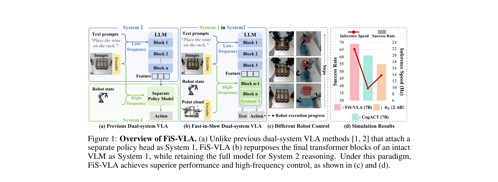
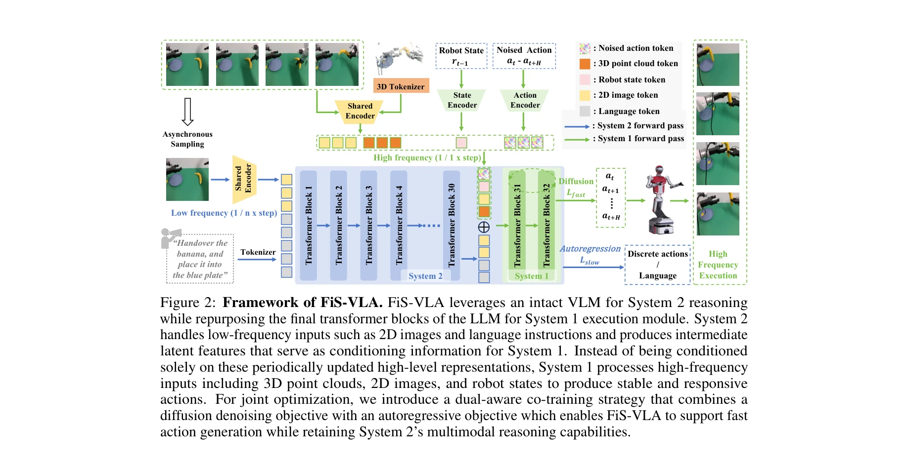

# Fast-in-Slow: A Dual-System Foundation Model Unifying Fast Manipulation within Slow Reasoning

> **저자**: Hao Chen, Jiaming Liu, Chenyang Gu, Zhuoyang Liu, Renrui Zhang, Xiaoqi Li, Xiao He, Yandong Guo, Chi-Wing Fu, Shanghang Zhang, Pheng-Ann Heng | **날짜**: 2025-06-02 | **URL**: [https://arxiv.org/abs/2506.01953](https://arxiv.org/abs/2506.01953)

---

## Essence

*Figure 1: Overview of FiS-VLA. (a) Unlike previous dual-system VLA methods [1, 2] that attach a*

Fast-in-Slow (FiS)는 VLM 기반의 System 2 내부에 System 1 실행 모듈을 매개변수 공유로 통합한 통합 dual-system VLA 모델로, 고속 제어와 추론 능력을 동시에 달성한다.

## Motivation

- **Known**: 최근 VLA 모델들은 internet-scale pretrained VLM의 상식 추론 능력을 활용하지만 낮은 실행 빈도로 인해 제약을 받는다. Kahneman의 dual-system 이론에 영감을 받은 접근법들은 VLM 기반 System 2와 독립적인 System 1 정책 모델을 분리하여 설계하고 있다.
- **Gap**: 기존 dual-system VLA 방법들은 System 1을 별도의 경량 모델로 유지하여 System 2의 internet-scale pretrained 지식을 완전히 활용하지 못하고, System 1이 풍부한 추론 능력에 접근하기 어렵다.
- **Why**: 로봇 조작에서 일반화된 정책과 실행 효율성의 균형이 필수적이며, 높은 제어 빈도와 정밀한 추론을 동시에 달성하는 것은 실제 응용에 매우 중요하다.
- **Approach**: VLM의 최종 transformer 블록을 System 1으로 재목적화하여 두 시스템이 동일한 기초 모델에서 파생되도록 통합하고, heterogeneous modality input과 asynchronous operating frequency를 적용하여 조정된 추론과 실행을 구현한다.

## Achievement

*Figure 1: Overview of FiS-VLA. (a) Unlike previous dual-system VLA methods [1, 2] that attach a*

- **통합 dual-system 아키텍처**: System 1을 System 2 내부에 매개변수 공유로 임베드하여 원활한 조정 가능
- **고주파 제어 달성**: 117.7 Hz 제어 빈도로 실시간 폐루프 제어 가능
- **SOTA 성능**: 시뮬레이션에서 8%, 실제 작업에서 11% 성공률 개선
- **이질적 설계**: System 2는 2D 관찰/언어 처리, System 1은 robot state/이미지/point cloud 입력 처리

## How

*Figure 2: Framework of FiS-VLA. FiS-VLA leverages an intact VLM for System 2 reasoning*

- VLM의 최종 transformer 블록들을 System 1 실행 모듈로 재목적화하며 전체 VLM을 System 2로 유지
- System 2는 저주파(multimodal latent representation 생성), System 1은 고주파(rapid action 실행) 비동기 운영
- System 1을 위해 fast 3D embedding 전략으로 point cloud를 토큰화하고 공유 vision encoder 사용
- Dual-aware co-training 전략: System 1은 diffusion modeling으로 noised action을 latent vector로 주입, System 2는 autoregressive next-token prediction으로 추론 능력 보존
- 860K 이상의 trajectory로 pretrain 후 고품질 자체 수집 데이터로 fine-tuning
- 1:4의 운영 주파수 비율(System 2:System 1) 설정

## Originality

- 기존의 별도 System 1 정책 모델 부착 방식을 탈피하여, VLM의 내부 블록 자체를 System 1로 재활용하는 혁신적 구조
- Heterogeneous modality input과 asynchronous frequency를 동시에 적용한 설계
- Diffusion modeling과 autoregressive prediction을 dual-aware co-training으로 결합한 훈련 전략
- Neuroscientific 이중 과정 인지 연구에 영감을 받아 로봇 조작에 적용한 이론적 근거

## Limitation & Further Study

- 평가가 주로 단일 팔 시뮬레이션과 이중 팔 실제 작업에 제한되어 다양한 로봇 플랫폼 검증 필요
- Point cloud 기반 3D 정보 처리가 센서 의존도가 높을 수 있음
- Action chunk size 8로 설정된 실험이 다른 chunk 크기에서의 성능 변화 분석 필요
- 대규모 pretrain 데이터(860K+) 필요로 한 리소스 요구사항이 높음
- 실제 환경에서의 다양한 동역학 및 불확실성 대응 능력에 대한 추가 분석 필요

## Evaluation

- Novelty: 4/5
- Technical Soundness: 3/5
- Significance: 4/5
- Clarity: 4/5
- Overall: 4/5

**총평**: FiS-VLA는 dual-system VLA의 구조적 한계를 혁신적으로 해결하고 높은 제어 빈도와 추론 능력을 동시에 달성한 중요한 기여이며, 매개변수 공유를 통한 통합 설계와 이질적 입력/주파수의 체계적 활용이 로봇 조작 분야에 큰 영향을 미칠 것으로 예상된다.

## Related Papers

- ⚖️ 반론/비판: [[papers/1351_DeeR-VLA_Dynamic_Inference_of_Multimodal_Large_Language_Mode/review]] — 단일 모델 내 동적 추론과 dual-system 분리 아키텍처의 계산 효율성 접근법 비교
- 🔗 후속 연구: [[papers/1403_Gemini_Robotics_15_Pushing_the_Frontier_of_Generalist_Robots/review]] — Fast-in-Slow 구조가 Gemini Robotics의 motion transfer와 embodied thinking 능력으로 확장
- 🔄 다른 접근: [[papers/1395_FlowPolicy_Enabling_Fast_and_Robust_3D_Flow-based_Policy_via/review]] — 단일 추론 단계 policy 생성과 dual-system 구조의 서로 다른 속도 최적화 접근법
- 🏛 기반 연구: [[papers/1403_Gemini_Robotics_15_Pushing_the_Frontier_of_Generalist_Robots/review]] — Gemini Robotics의 motion transfer 메커니즘이 dual-system VLA 모델 설계의 기초 아이디어 제공
- 🔄 다른 접근: [[papers/1351_DeeR-VLA_Dynamic_Inference_of_Multimodal_Large_Language_Mode/review]] — 계산 효율성 향상을 위해 동적 조기 종료와 dual-system 아키텍처의 서로 다른 접근법
