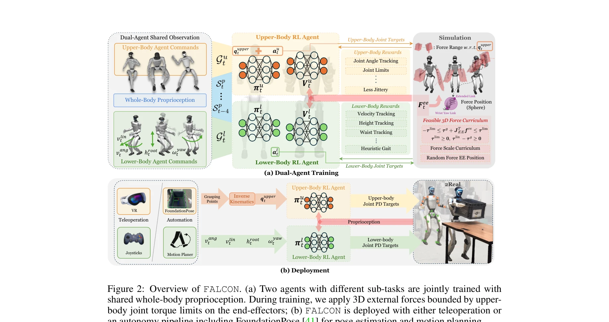
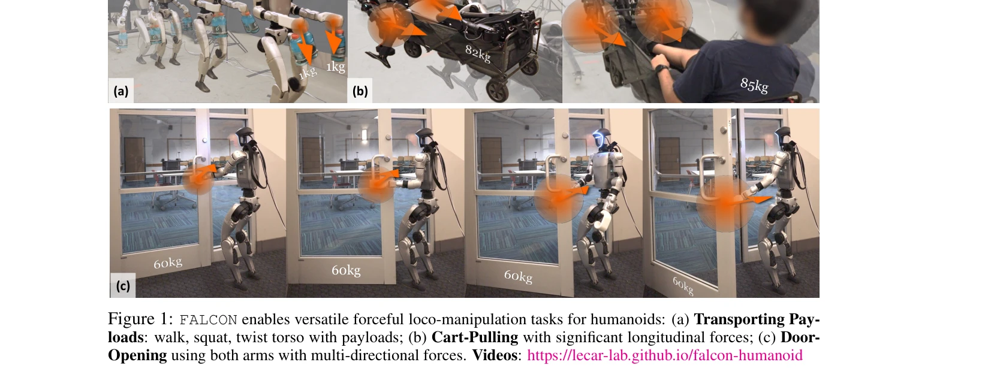

# FALCON: Learning Force-Adaptive Humanoid Loco-Manipulation

> **저자**: Yuanhang Zhang, Yifu Yuan, Prajwal Gurunath, Ishita Gupta, Shayegan Omidshafiei, Ali-akbar Agha-mohammadi, Marcell Vazquez-Chanlatte, Liam Pedersen, Tairan He, Guanya Shi | **날짜**: 2025-05-10 | **URL**: [https://arxiv.org/abs/2505.06776](https://arxiv.org/abs/2505.06776)

---

## Essence

*Figure 2: Overview of FALCON. (a) Two agents with different sub-tasks are jointly trained with*

FALCON은 이족 로봇의 강력한 로코-조작 작업을 위해 dual-agent reinforcement learning 프레임워크를 제시하며, 하체는 안정적인 보행을, 상체는 정확한 엔드-이펙터 위치 추적을 담당한다.

## Motivation

- **Known**: RL 기반 이족 로봇 제어는 보행과 조작 분야에서 진전을 이루었으나, Lower-RL-Upper-IK는 강한 힘 상호작용을 모델링하지 못하고 Monolithic-Whole-body-RL은 탐색 비효율성으로 인해 가벼운 작업에만 성공했다.
- **Gap**: 이족 로봇의 강력한 외부 힘 교란(0-100N) 하에서의 정밀하고 강건한 전신 제어는 아직 미해결되어 있으며, 특히 관절 토크 제한을 고려하면서 동적 로코-조작을 수행하는 것이 매우 어렵다.
- **Why**: 이족 로봇이 물건 운반, 손수레 끌기, 문 열기 등 실제 산업 및 생활 서비스 작업을 수행하려면 안정성을 유지하면서도 상당한 힘을 적응적으로 처리할 수 있어야 한다.
- **Approach**: FALCON은 하체와 상체에 대한 맞춤형 보상으로 전신 제어를 분해하되 공유 고유수용감각으로 함께 학습하며, 관절 토크 제한을 준수하면서 외부 힘을 점진적으로 증가시키는 3D force curriculum을 설계했다.

## Achievement

*Figure 1: FALCON enables versatile forceful loco-manipulation tasks for humanoids: (a) Transporting Pay-*

- **성능 향상**: 상체 관절 추적 정확도를 기준선 대비 2배 향상시키면서 강건한 보행과 더 빠른 학습 수렴을 달성
- **일반화 능력**: 동일한 학습 설정으로 Unitree G1과 Booster T1 두 가지 이족 로봇 플랫폼에 배포 가능한 정책 획득
- **실제 작업 수행**: 물체 운반(0-20N), 손수레 끌기(0-100N), 문 열기(0-40N) 등 다양한 강력한 로코-조작 작업을 실제 환경에서 완수
- **학습 효율성**: 구현별 보상이나 curriculum 튜닝 없이 정책 학습 가능

## How

*Figure 2: Overview of FALCON. (a) Two agents with different sub-tasks are jointly trained with*

- Dual-agent 분해: 하체 에이전트(보행 안정성)와 상체 에이전트(엔드-이펙터 추적 + 암묵적 힘 보상) 설계 및 공유 전신 고유수용감각으로 함께 학습
- 3D force curriculum: 역학(inverse dynamics)을 통해 관절 토크 제약을 준수하면서 외부 힘의 크기를 점진적으로 증가
- Joint training: 두 에이전트가 상호 인식하도록 하여 외부 힘으로 인한 전신 동역학 변화에 조정된 대응 가능
- Sim-to-real: 시뮬레이션에서 학습한 정책을 실제 로봇에 직접 배포하여 검증

## Originality

- Lower-RL-Upper-IK와 Monolithic-Whole-body-RL의 단점을 극복하는 새로운 dual-agent 분해 방식으로, 상호 인식하는 joint training 구조 도입
- 관절 토크 제약을 명시적으로 고려하는 3D force curriculum 설계로 강력한 로코-조작 상황에서의 안전성과 성능을 동시에 확보
- 이족 로봇에서 0-100N 범위의 강한 외부 힘 적응을 RL로 학습하는 것은 기존 연구와 구별되는 도전적인 시도

## Limitation & Further Study

- 실험은 두 가지 이족 로봇 플랫폼(Unitree G1, Booster T1)에서만 검증되었으므로 다른 형태의 이족 로봇으로의 일반화 가능성은 미지수
- 시뮬레이션 환경의 마찰, 접촉 역학 등이 실제 환경과 완벽하게 일치하지 않아 sim-to-real gap이 존재할 수 있음
- 관절 토크 제약을 역학을 통해 고려하지만, 예기치 않은 충격이나 매우 불규칙한 접촉 상황에서의 강건성은 추가 연구 필요
- 후속 연구로 더 복잡한 다중 물체 조작, 동적 접촉 환경, 그리고 온라인 학습 기능 추가 가능

## Evaluation

- Novelty: 4/5
- Technical Soundness: 4/5
- Significance: 4/5
- Clarity: 4/5
- Overall: 4/5

**총평**: FALCON은 이족 로봇의 강력한 로코-조작을 위한 실질적이고 효율적인 해결책을 제시하며, dual-agent learning과 force curriculum의 조합을 통해 강건성과 정확성을 모두 달성한 주목할 만한 기여이다. 실제 로봇 환경에서의 성공적인 배포와 다양한 작업의 실현은 이 분야의 중요한 진전을 나타낸다.

## Related Papers

- 🏛 기반 연구: [[papers/1378_Embracing_Bulky_Objects_with_Humanoid_Robots_Whole-Body_Mani/review]] — 대형 물체 전신 조작 기술이 FALCON의 로코-조작에서 하체 안정성과 상체 조작의 협응 제어 방법의 기반이 된다.
- 🔗 후속 연구: [[papers/1393_FAME_Force-Adaptive_RL_for_Expanding_the_Manipulation_Envelo/review]] — FALCON의 dual-agent 프레임워크에 FAME의 force-adaptive 방법을 통합하면 외부 힘에 더 강건한 로코-조작이 가능하다.
- 🔄 다른 접근: [[papers/1451_HiWET_Hierarchical_World-Frame_End-Effector_Tracking_for_Lon/review]] — 둘 다 하체-상체 협응을 다루지만 FALCON은 dual-agent 접근, HiWET은 계층적 end-effector 추적 방식을 사용한다.
- 🔗 후속 연구: [[papers/1378_Embracing_Bulky_Objects_with_Humanoid_Robots_Whole-Body_Mani/review]] — FALCON의 이족 로코-조작 프레임워크에 대형 물체 포용 기술을 통합하면 더욱 다양한 조작 과제 수행이 가능하다.
- 🏛 기반 연구: [[papers/1393_FAME_Force-Adaptive_RL_for_Expanding_the_Manipulation_Envelo/review]] — FALCON의 dual-agent 로코-조작 프레임워크가 FAME의 force-adaptive 제어에서 하체-상체 협응의 이론적 기반을 제공한다.
- 🔄 다른 접근: [[papers/1394_FARM_Frame-Accelerated_Augmentation_and_Residual_Mixture-of-/review]] — 고동역 humanoid 제어를 다른 적응적 학습 방법으로 접근한다
- 🔗 후속 연구: [[papers/1435_HAFO_A_Force-Adaptive_Control_Framework_for_Humanoid_Robots/review]] — HAFO의 dual-agent framework는 FALCON의 force-adaptive control을 더욱 강한 외력 상호작용 환경으로 확장한다.
- 🏛 기반 연구: [[papers/1508_Kinematics-Aware_Multi-Policy_Reinforcement_Learning_for_For/review]] — Kinematics-aware multi-policy RL은 FALCON의 force-adaptive control 개념을 산업 환경으로 확장한다.
- 🔄 다른 접근: [[papers/1558_Load-Aware_Locomotion_Control_for_Humanoid_Robots_in_Industr/review]] — 두 논문 모두 load-aware 휴머노이드 제어를 다루지만, 산업용 운반 vs 일반적 힘 적응이라는 서로 다른 적용 영역에 집중함
