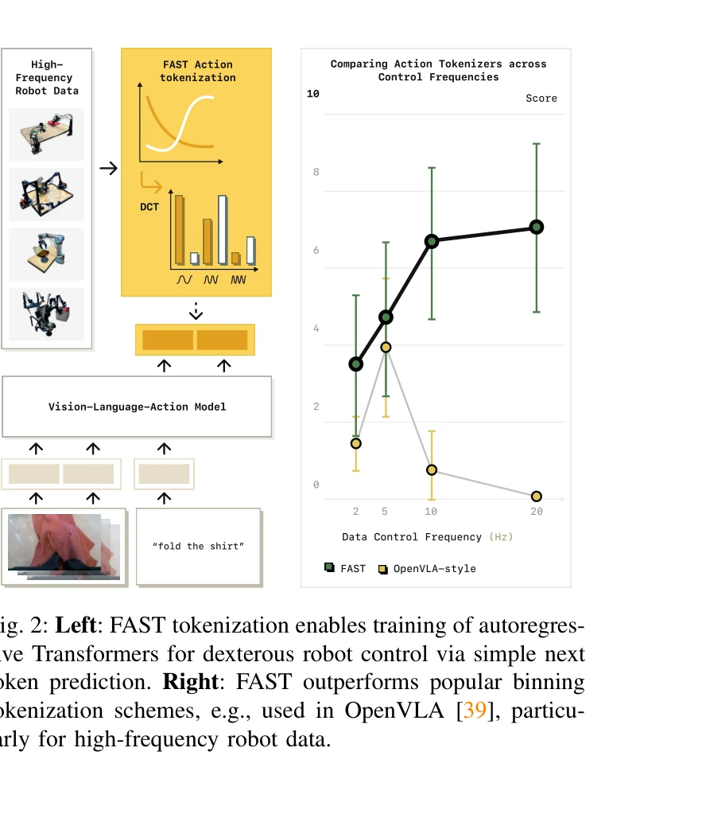
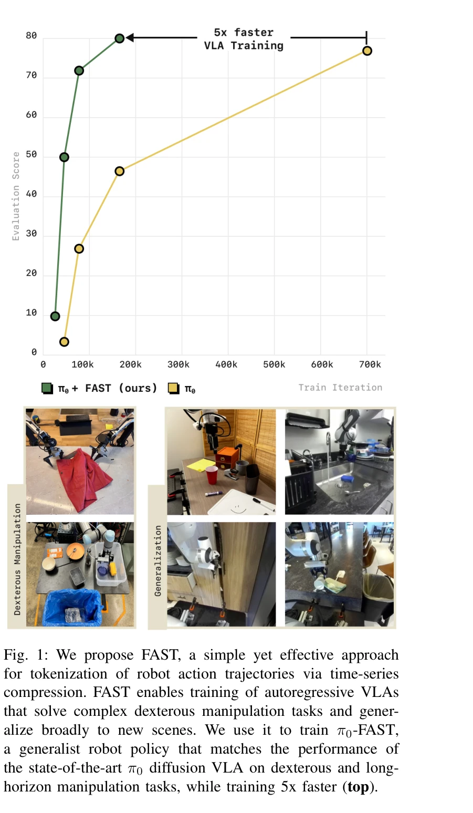
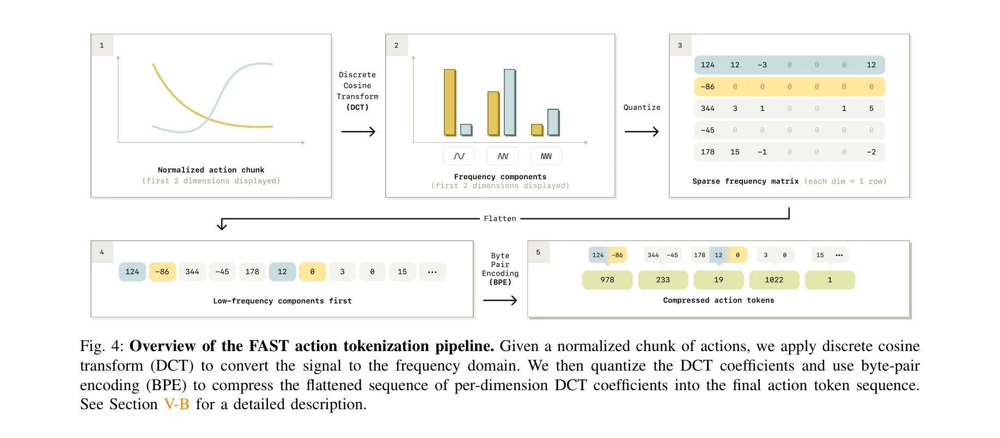

# FAST: Efficient Action Tokenization for Vision-Language-Action Models

> **저자**: Karl Pertsch, Kyle Stachowicz, Brian Ichter, Danny Driess, Suraj Nair, Quan Vuong, Oier Mees, Chelsea Finn, Sergey Levine | **날짜**: 2025-01-16 | **URL**: [https://arxiv.org/abs/2501.09747](https://arxiv.org/abs/2501.09747)

---

## Essence

*Fig. 2: Left: FAST tokenization enables training of autoregres-*

Robot action tokenization을 위해 discrete cosine transform (DCT) 기반의 FAST 방식을 제안하여, 고주파 고정밀 로봇 제어 작업에서 autoregressive VLA를 효과적으로 학습할 수 있게 함.

## Motivation

- **Known**: Transformer 기반 vision-language-action (VLA) 모델은 복잡한 로봇 행동을 잘 포착하지만, 연속 action 신호의 tokenization 방식 선택이 성능에 중요한 영향을 미침. 기존 per-dimension per-timestep binning 방식은 단순하고 널리 사용되고 있음.
- **Gap**: 현재의 simple binning tokenization 방식은 고주파 데이터에서 시간 단계 간 높은 상관관계로 인해 dexterous skill 학습에서 성능이 급격히 저하됨. 이로 인해 autoregressive VLA가 diffusion 기반 모델에 비해 고주파 제어 작업에서 뒤떨어짐.
- **Why**: Autoregressive 모델은 계산 효율성과 확장성 측면에서 우수하지만, action tokenization의 한계로 고정밀 조작 작업에 적용되지 못하고 있음. 이를 해결하면 더 빠르고 효율적인 VLA 학습이 가능해짐.
- **Approach**: Action sequence를 DCT 기반 time-series compression을 통해 tokenize하여 연속 신호 간의 상관관계를 줄임. 1M 개의 실제 로봇 trajectory로 학습한 범용 tokenizer FAST+를 제공함.

## Achievement

*Fig. 1: We propose FAST, a simple yet effective approach*

- **고주파 제어 작업 해결**: FAST tokenization으로 표준 binning 방식이 완전히 실패하는 고주파(20Hz 이상) dexterous 작업에서 autoregressive VLA 학습 성공
- **DROID 데이터셋 적용**: 처음으로 대규모 multitask 로봇 조작 데이터셋 DROID에서 효율적인 VLA 학습 달성
- **성능 및 효율성**: Diffusion VLA와 동등한 성능을 유지하면서 training time 5배 단축
- **범용 tokenizer**: FAST+ tokenizer로 단일 팔, 양팔, mobile robot 등 다양한 로봇의 action space 지원
- **대규모 학습**: 10k 시간의 로봇 데이터로 scaling 가능함을 입증

## How

*Fig. 4: Overview of the FAST action tokenization pipeline. Given a normalized chunk of actions, we apply discrete cosine*

- Action sequence에서 시간 상관관계를 제거하기 위해 discrete cosine transform (DCT)를 적용하여 frequency domain으로 변환
- DCT 계수를 quantization하여 action sequence를 discrete token으로 변환
- Action chunk 내 시간 단계 간 높은 상관관계를 압축으로 해결하여 next token prediction objective의 효과성 향상
- 학습된 FAST+ tokenizer를 pi0 VLA와 결합하여 π0-FAST 정책 구축
- 다양한 로봇 embodiment, action space, control frequency를 포함한 1M trajectory로 범용 tokenizer 학습

## Originality

- Audio spectrogram과 JPEG 압축에서 영감을 받아 처음으로 robot action tokenization에 DCT 기반 frequency-domain 압축 적용
- Per-dimension per-timestep binning이라는 관례적 방식에서 벗어나 time-series compression 관점으로 문제 재정의
- Byte-pair encoding, VQ-VAE 등 기존 압축 방식과 달리 continuous signal 특성에 맞춘 DCT 기반 설계
- 범용 action tokenizer FAST+의 개발로 다양한 로봇에 즉시 적용 가능한 실용적 솔루션 제시

## Limitation & Further Study

- DCT 기반 tokenization의 frequency domain 해석에 대한 심층적 이론적 분석 부족
- Hyperparameter 선택(예: quantization level, token vocabulary size)의 민감도 분석 제한적
- FAST+ tokenizer 학습에 사용된 1M trajectory의 특성과 분포가 명시되지 않아 generalization 범위 불명확
- Real robot 실험이 제한적이며 대부분 시뮬레이션 환경에서의 평가 - 실제 dexterous manipulation 평가 확대 필요
- Vector-quantized 방식과의 상세한 ablation study 및 성능 비교 분석 보완 필요
- 후속연구: 다양한 주파수 특성 신호에 대한 최적 DCT 파라미터 자동 선택 메커니즘 개발, online learning으로 FAST+ 업데이트, cross-embodiment transfer learning 성능 향상

## Evaluation

- Novelty: 4/5
- Technical Soundness: 3/5
- Significance: 4/5
- Clarity: 4/5
- Overall: 4/5

**총평**: 고주파 로봇 제어 작업에서 autoregressive VLA의 실용성을 크게 높이는 우아하고 효과적인 tokenization 방법론을 제시함. DCT 기반 접근의 새로움, 광범위한 실험, 5배 빠른 학습과 동등한 성능 달성은 로봇 학습 커뮤니티에 즉각적인 임팩트를 줄 수 있는 우수한 논문임.

## Related Papers

- 🔗 후속 연구: [[papers/1366_Discrete_Diffusion_VLA_Bringing_Discrete_Diffusion_to_Action/review]] — DCT 기반 action tokenization이 discrete diffusion VLA의 효율적인 action representation을 위한 구체적 구현을 제공한다.
- 🔄 다른 접근: [[papers/1588_TinyVLA_Towards_Fast_Data-Efficient_Vision-Language-Action_M/review]] — TinyVLA의 data-efficient approach가 FAST의 고주파 제어에 특화된 tokenization과 다른 효율성 접근을 제시한다.
- 🏛 기반 연구: [[papers/1510_OpenVLA_An_Open-Source_Vision-Language-Action_Model/review]] — OpenVLA의 vision-language-action model이 FAST의 효율적인 action tokenization을 적용할 수 있는 기반 모델이다.
- 🔄 다른 접근: [[papers/1624_VQ-VLA_Improving_Vision-Language-Action_Models_via_Scaling_V/review]] — 둘 다 action tokenization이지만 VQ-VLA는 vector quantization, FAST는 효율적 토큰화로 다른 접근법이다
- 🏛 기반 연구: [[papers/1366_Discrete_Diffusion_VLA_Bringing_Discrete_Diffusion_to_Action/review]] — DCT 기반의 FAST action tokenization이 discrete diffusion VLA의 효율적인 action representation 기반을 제공한다.
