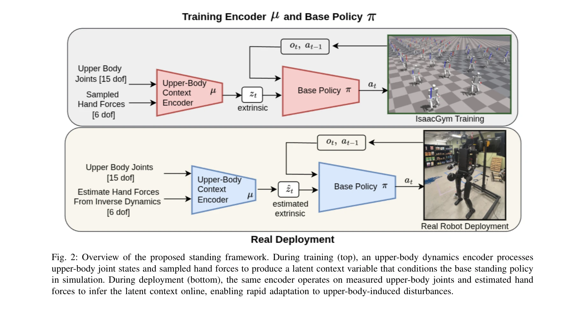
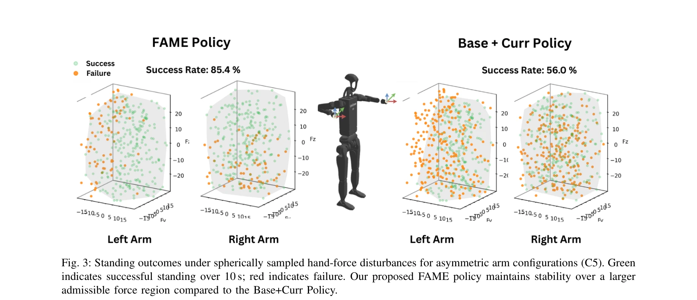

# FAME: Force-Adaptive RL for Expanding the Manipulation Envelope of a Full-Scale Humanoid

> **저자**: Niraj Pudasaini, Yutong Zhang, Jensen Lavering, Alessandro Roncone, Nikolaus Correll | **날짜**: 2026-03-09 | **URL**: [https://arxiv.org/abs/2603.08961](https://arxiv.org/abs/2603.08961)

---

## Essence

*Fig. 2: Overview of the proposed standing framework. During training (top), an upper-body dynamics encoder processes*

인양팔 조작 중 외부 손 힘으로 인한 균형 교란을 해결하기 위해 상체 관절 구성과 상호작용 힘에 조건화된 latent context encoder를 학습하는 force-adaptive RL 프레임워크 FAME을 제안한다.

## Motivation

- **Known**: Model-based 방법들(LIPM, MPC, trajectory optimization)은 동적 조건에서 어려움을 겪고 있으며, 최근 DRL 기반 균형 제어 연구들이 진행 중이다. 또한 RMA 등의 latent context adaptation 기법들이 환경 변동 대응에 성공했다.
- **Gap**: 기존 연구들은 상체 자세 커리큘럼이나 force-aware 학습을 개별적으로 적용했으나, force-induced disturbance의 latent 표현을 학습하여 적응적 균형 제어를 구현한 연구는 부족하다.
- **Why**: 휴머노이드 로봇의 양팔 조작 시 손에 가해지는 외력은 운동학적 체인을 통해 전파되어 하체 균형을 교란하므로, 이를 효과적으로 처리하는 것이 조작 범위 확대의 핵심이다.
- **Approach**: 상체 관절 상태와 양팔 상호작용 힘을 입력받는 context encoder와 하체 제어 policy를 결합하고, 훈련 중 구 좌표계 샘플링 3D 힘과 상체 자세 커리큘럼을 적용하며, 배포 시 역학 기반 힘 추정으로 wrist force/torque 센서 없이 온라인 적응을 구현한다.

## Achievement

*Fig. 3: Standing outcomes under spherically sampled hand-force disturbances for asymmetric arm configurations (C5). Gree*

- **시뮬레이션 성능 향상**: FAME이 73.84% 기립 성공률을 달성하여 Base+Curr 기준 51.40%, Base 정책 29.44%를 크게 상회
- **센서 프리 배포**: 관절 토크와 Jacobian 매핑을 통한 wrist 상호작용 힘 추정으로 전용 force/torque 센서 제거
- **조작 범위 확대**: 다양한 상체 자세와 3D 힘 교란에 대해 robust한 양팔 조작 환경 구현
- **실세계 검증**: Unitree H12 휴머노이드에서 비대칭 단팔 당기기와 대칭 양팔 하중 시나리오로 실증

## How

*Fig. 2: Overview of the proposed standing framework. During training (top), an upper-body dynamics encoder processes*

- 상체 dynamics encoder: 상체 관절 상태 R^15와 양팔 상호작용 힘 [F_L, F_R] ∈ R^6을 입력으로 하여 latent context ẑ_t 생성
- 기저 정책(base standing policy): latent context에 조건화되어 하체 제어를 수행하는 RL 정책
- 훈련 중 다양성 주입: (i) 각 손에 spherically sampled 3D 힘 적용, (ii) 상체 자세 커리큘럼으로 점진적 pose range 확대
- 배포 시 온라인 적응: 측정된 상체 관절과 역학 기반 추정 손 힘을 encoder에 입력하여 실시간 latent context 추론
- curriculum 설계: 초기 고정 자세에서 시작하여 점진적으로 arm configuration 다양성 증가

## Originality

- Latent context adaptation 패러다임을 structured, task-relevant disturbance(상체 자세-양팔 힘 결합)에 적용한 첫 시도
- RMA 등 기존 domain randomization 기법을 상체-하체 coupling 문제에 창의적으로 재구성
- Torque 기반 역학 추정을 통한 센서 프리 배포 전략의 개발
- 상체 자세 커리큘럼과 force-based context 학습의 체계적 결합

## Limitation & Further Study

- 시뮬레이션과 실제 로봇 간 physics 차이(마찰, 접촉 동역학 등)로 인한 sim-to-real gap 미측정
- 실세계 검증이 제한적(Unitree H12, 특정 하중 시나리오)이며 더 많은 휴머노이드와 작업에 대한 일반화 필요
- 상체 자세 커리큘럼의 최적 설계 원리가 명확하지 않으며, 다양한 로봇 형태에 대한 adaptive curriculum 구성 방법 미제시
- 5개 고정 상체 자세 구성에서만 평가되었으므로 연속적 시간 변화 자세에 대한 성능 검증 필요
- 후속연구: (i) 다양한 로봇 플랫폼으로의 확장, (ii) 동적 조작 태스크(pushing, pulling with motion)로의 확대, (iii) 불확실한 환경 변수(인체 상호작용, 동적 객체)에 대한 강건성 평가

## Evaluation

- Novelty: 4/5
- Technical Soundness: 3/5
- Significance: 4/5
- Clarity: 4/5
- Overall: 4/5

**총평**: FAME은 latent context adaptation을 인양팔 조작 중 하체 균형 유지에 창의적으로 적용하여 조작 범위를 실질적으로 확대했으며, 센서 프리 배포 및 Unitree H12 실증을 통해 실용성을 입증한 우수한 연구이다.

## Related Papers

- 🏛 기반 연구: [[papers/1392_FALCON_Learning_Force-Adaptive_Humanoid_Loco-Manipulation/review]] — FALCON의 dual-agent 로코-조작 프레임워크가 FAME의 force-adaptive 제어에서 하체-상체 협응의 이론적 기반을 제공한다.
- 🔗 후속 연구: [[papers/1423_GentleHumanoid_Learning_Upper-body_Compliance_for_Contact-ri/review]] — FAME의 외부 힘 적응과 GentleHumanoid의 compliance 제어를 결합하면 다양한 접촉 상황에서 안전한 조작이 가능하다.
- 🔄 다른 접근: [[papers/1435_HAFO_A_Force-Adaptive_Control_Framework_for_Humanoid_Robots/review]] — 둘 다 외부 힘 적응을 다루지만 FAME은 조작 중 균형 교란에, HAFO는 일반적 force-adaptive 제어에 집중한다.
- 🔗 후속 연구: [[papers/1392_FALCON_Learning_Force-Adaptive_Humanoid_Loco-Manipulation/review]] — FALCON의 dual-agent 프레임워크에 FAME의 force-adaptive 방법을 통합하면 외부 힘에 더 강건한 로코-조작이 가능하다.
- 🏛 기반 연구: [[papers/1423_GentleHumanoid_Learning_Upper-body_Compliance_for_Contact-ri/review]] — impedance control 기반 compliance가 FAME의 외부 힘 적응에서 안전한 접촉 상호작용의 이론적 기반을 제공한다.
