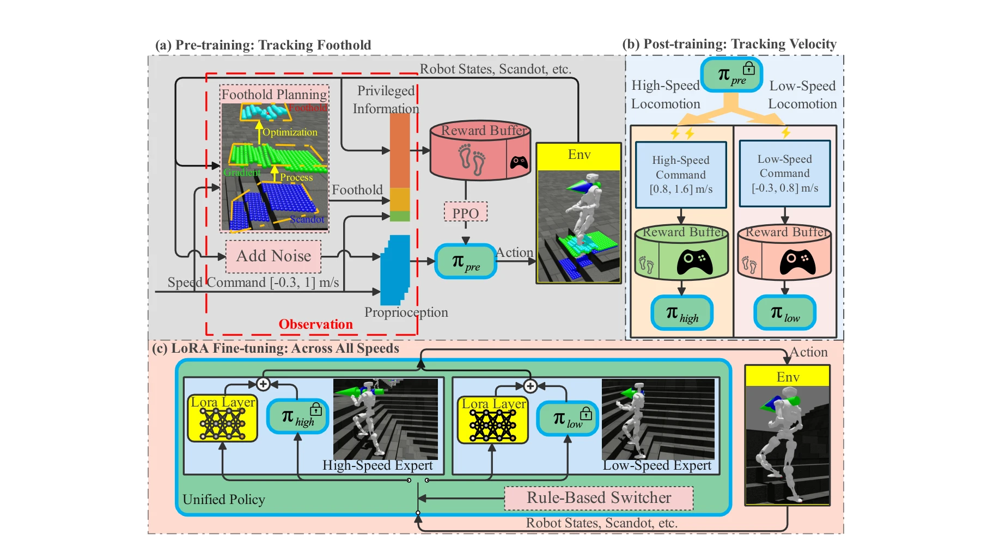
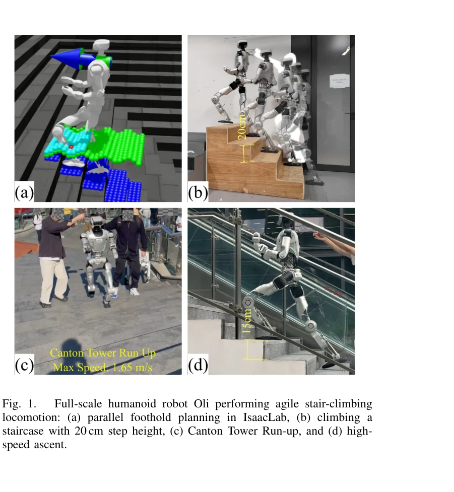

# FastStair: Learning to Run Up Stairs with Humanoid Robots

> **저자**: Yan Liu, Tao Yu, Haolin Song, Hongbo Zhu, Nianzong Hu, Yuzhi Hao, Xiuyong Yao, Xizhe Zang, Hua Chen, Jie Zhao | **날짜**: 2026-01-15 | **URL**: [https://arxiv.org/abs/2601.10365](https://arxiv.org/abs/2601.10365)

---

## Essence

*Fig. 2.*

FastStair는 model-based foothold planner와 model-free RL을 결합한 다단계 학습 프레임워크로, 휴머노이드 로봇의 고속 안정적인 계단 등반을 실현한다.

## Motivation

- **Known**: RL은 동적 보행을 생성하지만 계단에서 안정성이 불충분하고, model-based planner는 안정성을 보장하지만 보수적이어서 고속 성능이 제한된다.
- **Gap**: 동적 민첩성과 엄격한 안정성 사이의 상충 관계를 해결하는 통합 접근법이 부재하며, planner의 보수성을 극복하면서도 안전성을 유지하는 방법이 미흡하다.
- **Why**: 계단 등반은 인간 환경에서 흔하지만 로봇에게는 도전적인 과제이며, 고속 안정적인 등반 능력은 실제 응용 배포의 핵심 요구사항이다.
- **Approach**: DCM 기반 foothold planner를 RL 훈련 루프에 통합하여 탐색을 동적으로 실현 가능한 영역으로 유도하고, 다단계 학습과 LoRA를 통해 속도별 전문가 정책을 통합한다.

## Achievement

*Fig. 1.*

- **고속 계단 등반**: 최대 1.65 m/s의 속도로 안정적인 등반 달성
- **장거리 성능**: 33계단 나선 계단(계단당 17 cm 상승)을 12초에 완주
- **알고리즘 혁신**: foothold 최적화를 병렬 이산 탐색으로 재구성하여 훈련 속도를 약 25배 가속화
- **멀티 전문가 통합**: LoRA를 통해 속도별 전문가를 단일 네트워크에 통합하여 매끄러운 속도 범위 전환
- **실제 성과**: Canton Tower Robot Run Up Competition 우승

## How

*Fig. 2.*

- DCM 기반 foothold planner를 GPU 병렬 이산 탐색으로 재구성하여 실시간 guidance 제공
- Pre-training 단계에서 planner가 생성한 실현 가능한 접점을 추적하도록 RL 정책 학습
- Post-training 단계에서 base policy를 저속/고속 전문가로 미세조정하여 속도별 action distribution 차이 대응
- LoRA 계층으로 두 전문가를 단일 네트워크에 통합하고 전체 속도 범위에서 재훈련하여 안정적 전환
- 실제 Oli 휴머노이드 로봇에 배포하여 검증

## Originality

- Model-based planner를 explicit stability reward로 통합하는 혁신적 approach로 RL 탐색 공간을 가이드
- Foothold 최적화를 병렬 이산 탐색으로 재구성하는 '최적화-as-탐색' 방법론으로 계산 오버헤드 제거", '속도별 전문가 분해 및 LoRA 통합을 통해 planner 보수성을 극복하면서 안정성 유지하는 새로운 프레임워크
- DCM 기반 planner를 선택하여 ALIP-MPC 방식보다 계산 효율과 제약 공식화가 우월

## Limitation & Further Study

- Planner의 보수성 극복을 위해 다단계 학습이 필요하여 훈련 복잡도 증가
- 속도별 전문가 분해는 특정 작업(계단 등반)에 특화되어 일반화 가능성 제한
- 시스템은 scandot 기반 지형 인식에 의존하므로 인식 오류에 대한 견고성 미검토
- 실제 하드웨어 배포는 Oli 로봇에만 검증되었으며 다른 휴머노이드 플랫폼으로의 이전성 불명확
- 후속 연구: (1) 불규칙한 계단, 경사로 등 다양한 지형에의 적용, (2) 지형 인식 오류에 대한 견고성 강화, (3) 다양한 로봇 체형에 대한 일반화

## Evaluation

- Novelty: 4/5
- Technical Soundness: 3/5
- Significance: 4/5
- Clarity: 4/5
- Overall: 4/5

**총평**: FastStair는 model-based planning과 model-free RL의 상충관계를 창의적으로 해결하고 다단계 학습 프레임워크로 실제 고속 계단 등반을 달성한 탁월한 연구이며, Canton Tower 우승으로 실제 성과를 입증했다.

## Related Papers

- 🏛 기반 연구: [[papers/1361_E-SDS_Environment-aware_See_it_Do_it_Sorted_-_Automated_Envi/review]] — E-SDS의 환경 인식 보상 생성 방법이 FastStair의 계단 등반과 같은 특정 지형 과제에 대한 적응적 학습을 가능하게 한다.
- 🔄 다른 접근: [[papers/1409_Gait-Adaptive_Perceptive_Humanoid_Locomotion_with_Real-Time/review]] — 둘 다 복잡한 지형을 다루지만 FastStair는 계단 등반에 특화, Gait-Adaptive는 일반적 지형 적응에 집중한다.
- 🔗 후속 연구: [[papers/1553_Let_Humanoids_Hike_Integrative_Skill_Development_on_Complex/review]] — Let Humanoids Hike의 복잡한 지형 스킬과 FastStair의 고속 계단 등반을 결합하면 다양한 야외 환경에서의 고속 이동이 가능하다.
- 🧪 응용 사례: [[papers/1301_Chasing_Stability_Humanoid_Running_via_Control_Lyapunov_Func/review]] — 휴머노이드 계단 달리기에서 CLF 기반 안정성 제어가 적용된다
- 🧪 응용 사례: [[papers/1361_E-SDS_Environment-aware_See_it_Do_it_Sorted_-_Automated_Envi/review]] — E-SDS의 환경 인식 보상 생성 방법을 FastStair의 계단 등반과 같은 특정 지형 과제에 직접 적용할 수 있다.
- 🏛 기반 연구: [[papers/1409_Gait-Adaptive_Perceptive_Humanoid_Locomotion_with_Real-Time/review]] — 복잡한 지형에서의 보행 적응 방법이 FastStair의 계단 등반과 같은 특정 지형 과제에 필수적인 기반 기술을 제공한다.
- 🔗 후속 연구: [[papers/1289_3D_FlowMatch_Actor_Unified_3D_Policy_for_Single-_and_Dual-Ar/review]] — FlowPolicy의 빠르고 robust한 3D flow 기반 정책이 3D FlowMatch Actor의 30배 빠른 학습/추론 성능을 더욱 향상시킬 수 있다.
