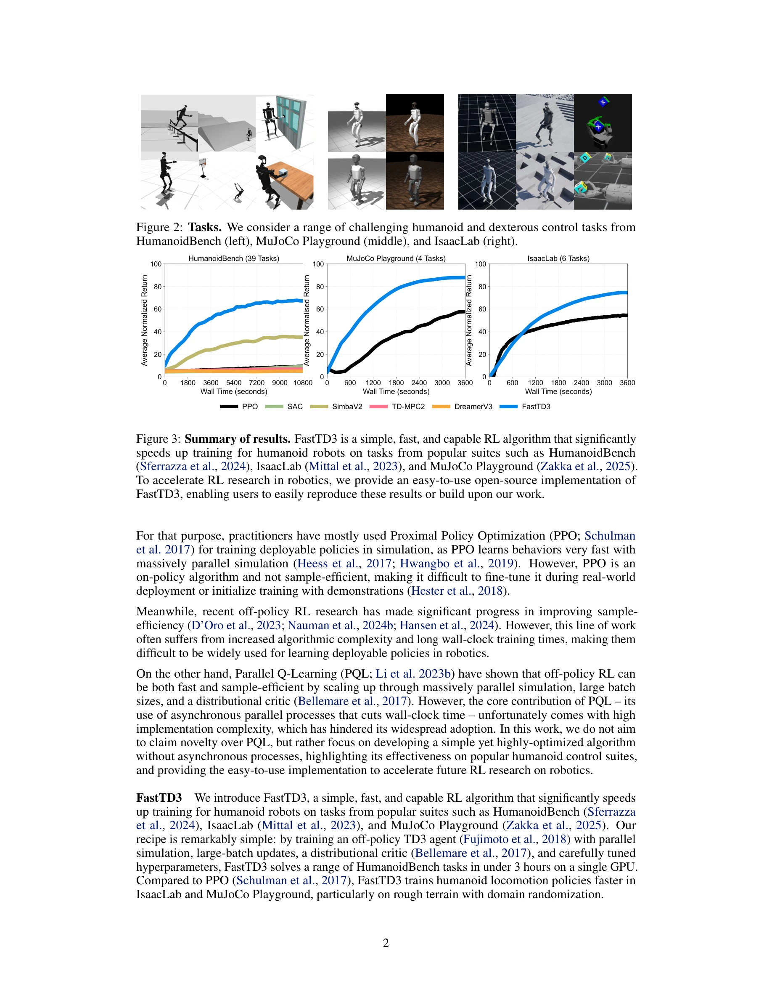

# FastTD3: Simple, Fast, and Capable Reinforcement Learning for Humanoid Control

> **저자**: Younggyo Seo, Carmelo Sferrazza, Haoran Geng, Michal Nauman, Zhao-Heng Yin, Pieter Abbeel | **날짜**: 2025-05-28 | **URL**: [https://arxiv.org/abs/2505.22642](https://arxiv.org/abs/2505.22642)

---

## Essence

*Figure 3: Summary of results. FastTD3 is a simple, fast, and capable RL algorithm that significantly*

FastTD3는 병렬 시뮬레이션, 대용량 배치 업데이트, 분포형 critic, 최적화된 하이퍼파라미터를 활용한 간단한 TD3 변형으로, 휴머노이드 로봇 제어 작업을 단일 A100 GPU에서 3시간 이내에 해결한다.

## Motivation

- **Known**: TD3와 같은 off-policy RL 알고리즘은 sample-efficient하지만 학습이 느리며, PPO는 빠르지만 on-policy이고 sample-efficient하지 않다. 최근 PQL이 병렬 시뮬레이션과 분포형 critic으로 빠른 학습을 달성했으나 구현이 복잡하다.
- **Gap**: 효과적이면서도 간단한 구현의 빠른 off-policy RL 알고리즘이 필요하며, 로봇 제어에서 실제로 잘 작동하는 알고리즘의 실증적 검증이 부족하다.
- **Why**: 로봇 공학에서 RL 기반 정책 학습의 느린 학습 시간은 보상 설계 반복과 실시간 미세 조정을 어렵게 만드는 주요 병목이며, 간단하면서 빠른 알고리즘은 연구와 실제 적용 모두에 중요하다.
- **Approach**: TD3 기반 알고리즘에 병렬 환경, 초대형 배치(32,768), C51 기반 분포형 critic, Clipped Double Q-learning을 적용하고 HumanoidBench, IsaacLab, MuJoCo Playground에서 평가한다.

## Achievement

- **빠른 학습**: HumanoidBench 39개 작업을 3시간 이내에 해결하며 PPO, SAC, SimbaV2, TD-MPC2, DreamerV3보다 현저히 빠른 수렴
- **안정적 성능**: 병렬 시뮬레이션과 대용량 배치로 높은 안정성 유지하며 학습 곡선의 분산 감소
- **실시간 배포 성공**: 시뮬레이션에서 학습한 정책을 실제 Booster T1 휴머노이드 로봇으로 성공적으로 전이 (off-policy RL의 첫 사례)
- **간단한 구현**: 복잡한 비동기 처리 없이 PyTorch 기반 가볍고 사용하기 쉬운 오픈소스 코드 제공
- **다양한 작업 지원**: 로코모션, 조작(dexterous), 거친 지형 도메인 랜더마이제이션 등 다양한 작업에 효과적

## How

*Figure 5: Effect of design choices (1 / 2). We investigate the effect of (a) parallel environments,*

- **병렬 환경**: 128개까지의 병렬 환경으로 결정론적 정책 그래디언트 알고리즘의 탐색 다양성 증가
- **대용량 배치 업데이트**: 배치 크기 32,768으로 critic에 안정적인 학습 신호 제공 및 데이터 재사용률 향상
- **분포형 critic**: C51 (Categorical 51-atom distributional RL) 적용으로 value function 표현력 개선
- **Clipped Double Q-learning**: 과정추정(overestimation) 방지로 학습 안정성 강화
- **하이퍼파라미터 최적화**: 각 환경 스위트에 맞춘 신중한 하이퍼파라미터 튜닝 수행

## Originality

- PQL의 핵심 아이디어를 인정하면서도, 비동기 프로세스 없는 간단한 구현으로 동등한 성능 달성이 주요 기여
- TD3에 분포형 critic 통합으로 off-policy 결정론적 정책 그래디언트 알고리즘의 효과성 입증
- 첫 실제 휴머노이드 로봇 배포 사례로, 시뮬레이션-현실 갭 해결의 실질적 증명
- 새로운 알고리즘보다는 기존 기술의 최적 조합에 중점하여 재현성과 실용성 강조

## Limitation & Further Study

- **알고리즘 신규성 부족**: 개별 컴포넌트(TD3, C51, 병렬 시뮬레이션)는 모두 기존 방법이며 주로 조합과 최적화에 초점
- **제한된 환경**: HumanoidBench, IsaacLab, MuJoCo Playground에만 평가하며 다른 도메인(매니퓰레이션 무기, 엔드-투-엔드 비전) 일반화 불명확
- **하이퍼파라미터 의존성 높음**: 신중한 하이퍼파라미터 튜닝이 필수이나 원칙적 선택 방법 미제시
- **계산 자원 집약적**: 단일 A100 GPU 사용이나 병렬 환경 128개 운영으로 상당한 계산 비용 필요
- **후속 연구**: SR-SAC, BBF, BRO, SimbaV2 등 최신 방법들을 FastTD3에 통합하는 효과 미검증으로 향후 개선 여지 큼

## Evaluation

- Novelty: 2/5
- Technical Soundness: 3/5
- Significance: 4/5
- Clarity: 4/5
- Overall: 3/5

**총평**: FastTD3는 기존 기법의 최적 조합으로 로봇 제어에서 실질적인 성능 향상과 첫 실제 배포 사례를 달성하며, 간단한 구현의 오픈소스 제공으로 높은 실용성을 갖지만, 알고리즘 신규성이 제한적이고 특정 환경에 최적화된 점이 아쉽다.

## Related Papers

- 🔄 다른 접근: [[papers/1414_General_Humanoid_Whole-Body_Control_via_Pretraining_and_Fast/review]] — General Humanoid Control의 pretraining 접근과 FastTD3의 단순한 TD3 최적화가 서로 다른 humanoid training 전략
- 🔗 후속 연구: [[papers/1505_Keep_on_Going_Learning_Robust_Humanoid_Motion_Skills_via_Sel/review]] — Keep on Going의 robust motion skills이 FastTD3의 빠른 학습을 더 안정적이고 지속가능한 방향으로 발전
- 🏛 기반 연구: [[papers/1425_GMT_General_Motion_Tracking_for_Humanoid_Whole-Body_Control/review]] — GMT의 general motion tracking이 FastTD3에서 달성하고자 하는 whole-body control의 이론적 기반
- ⚖️ 반론/비판: [[papers/1595_OmniXtreme_Breaking_the_Generality_Barrier_in_High-Dynamic_H/review]] — OmniXtreme의 high-dynamic generality가 FastTD3의 단순함과 속도 중심 접근의 한계를 보완하는 대조적 관점
- 🏛 기반 연구: [[papers/1534_Learning_Sim-to-Real_Humanoid_Locomotion_in_15_Minutes/review]] — FastTD3 알고리즘을 기반으로 인간형 로봇의 보행 학습을 15분 내에 완료하는 실용적 레시피를 제공한다.
