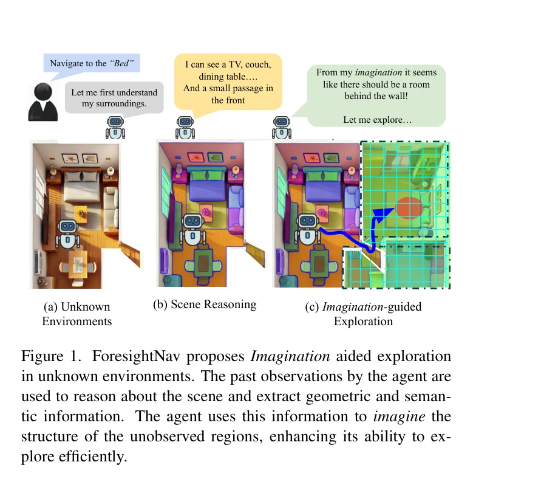
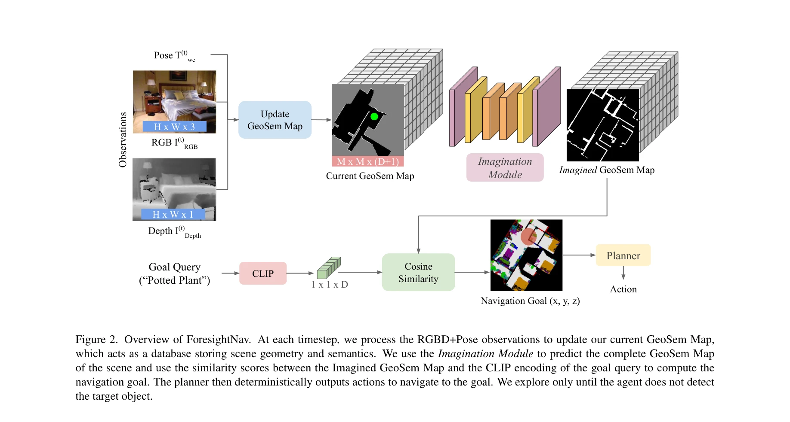

# ForesightNav: Learning Scene Imagination for Efficient Exploration

> **저자**: Hardik Shah, Jiaxu Xing, Nico Messikommer, Boyang Sun, Marc Pollefeys, Davide Scaramuzza | **날짜**: 2025-04-22 | **URL**: [https://arxiv.org/abs/2504.16062](https://arxiv.org/abs/2504.16062)

---

## Essence

*Figure 1. ForesightNav proposes Imagination aided exploration*

ForesightNav는 로봇이 인간처럼 상상력을 활용하여 미탐사 지역의 점유 및 의미정보를 예측하고, 이를 기반으로 효율적인 장기 네비게이션 목표를 선택하는 탐색 전략을 제안한다.

## Motivation

- **Known**: 기존 Object Goal Navigation 방법들은 강화학습 기반 또는 Vision-Language Model 기반 접근을 사용하지만, 전자는 일반화가 어렵고 후자는 공간정보 이해가 제한적이다. 점유 맵 예측 연구도 확장성과 평가 측면에서 한계가 있다.
- **Gap**: 미탐사 영역의 기하학적 구조와 의미정보를 동시에 예측하면서도 현실적인 부분 관찰을 반영한 훈련 데이터 생성 방식과 실제 네비게이션 성능 기반의 평가 벤치마크가 부족하다.
- **Why**: 로봇에 상상력 기반 추론 능력을 갖추면 미탐사 환경에서 더 효율적으로 탐색할 수 있으며, 이는 가정용 서비스, 수색 구조, 배송, 산업 검사 등 실제 응용에 필수적이다.
- **Approach**: 현재 및 과거 관찰로부터 점유 맵의 미탐사 영역을 예측하는 신경망 기반 Imagination Module을 제안하고, 이를 CLIP 기반의 의미 정보(GeoSem Maps)로 강화하여 장기 네비게이션 목표 선택을 지원한다.

## Achievement

*Figure 2. Overview of ForesightNav. At each timestep, we process the RGBD+Pose observations to update our current GeoSem*

- **Imagination Module의 효과**: Structured3D 검증 데이터셋에서 PointNav는 100% 완료율, ObjectNav는 67% SPL 달성
- **현실적 훈련 데이터 생성**: 미탐사 점유 마스크 생성을 위해 2D 그리드 환경에서 에이전트를 시뮬레이션하는 독특한 방법 제안
- **포괄적 평가 벤치마크**: 3,500개 실내 장면을 포함한 Structured3D 기반 ObjectNav 폐루프 평가 벤치마크 도입으로 일반화 능력 검증

## How

*Figure 2. Overview of ForesightNav. At each timestep, we process the RGBD+Pose observations to update our current GeoSem*

- RGBD 이미지와 포즈 정보를 시간에 따라 누적하여 부분 관찰 점유 맵 구성
- U-Net 스타일의 신경망을 이용해 부분 관찰로부터 전체 점유 맵 예측
- LSeg를 통해 RGB 이미지에서 CLIP 특성 공간의 의미 임베딩 추출
- 예측된 점유 맵과 의미 특성을 결합한 GeoSem Maps 생성
- 예측된 지역의 의미 값을 기반으로 frontier 점수 매기기 및 장기 목표 선택
- 선택된 목표로 향하는 단기 경로 계획 및 실행

## Originality

- 인간의 상상력 개념을 로봇 탐색에 명시적으로 통합한 첫 시도로, 기존 end-to-end RL 또는 zero-shot VLM 방식과 구별됨
- 기하학과 의미정보를 통합하는 GeoSem Maps 표현 방식이 중간 레벨 표현의 이점을 활용
- 실제 에이전트 시뮬레이션을 통한 현실적인 부분 관찰 데이터 생성으로 기존 무작위 마스킹 방식의 한계 극복
- 네비게이션 성능을 직접 평가하는 작업 중심의 벤치마크 방식

## Limitation & Further Study

- Structured3D 실내 환경에서만 평가되었으며, 실제 로봇 환경에서의 성능 검증 부재
- 동적 장애물이나 변화하는 환경에서의 상상 모듈의 강건성이 미검토됨
- 점유 맵 예측의 계산 비용과 실시간성 분석 부족
- 다양한 건축 스타일이나 아파트 유형에 대한 일반화 능력 평가 필요
- 향후 연구로 실제 로봇 플랫폼에서의 검증, 동적 환경 적응, 다중 에이전트 협력 시나리오 확대 제안

## Evaluation

- Novelty: 4/5
- Technical Soundness: 3/5
- Significance: 4/5
- Clarity: 4/5
- Overall: 4/5

**총평**: ForesightNav는 인간의 상상력 메커니즘을 로봇 탐색에 통합하는 개념적으로 신선한 접근으로, 실험 결과 탐색 효율성 개선을 보여주나 실제 로봇 환경 검증이 필요하다.

## Related Papers

- 🔗 후속 연구: [[papers/1378_Embodied_Navigation_Foundation_Model/review]] — NavFoM의 범용 네비게이션이 ForesightNav의 상상력 기반 탐색 전략을 일반화한다.
- 🔄 다른 접근: [[papers/1402_GC-VLN_Instruction_as_Graph_Constraints_for_Training-free_Vi/review]] — GC-VLN도 언어 지시를 통한 효율적인 네비게이션 전략을 제안한다.
- 🏛 기반 연구: [[papers/1461_LM-Nav_Robotic_Navigation_with_Large_Pre-Trained_Models_of_L/review]] — LM-Nav의 대규모 모델 기반 네비게이션이 ForesightNav의 장기 목표 선택에 기초가 된다.
- 🔄 다른 접근: [[papers/1402_GC-VLN_Instruction_as_Graph_Constraints_for_Training-free_Vi/review]] — ForesightNav도 언어 지시 기반의 효율적인 네비게이션 전략을 제안한다.
