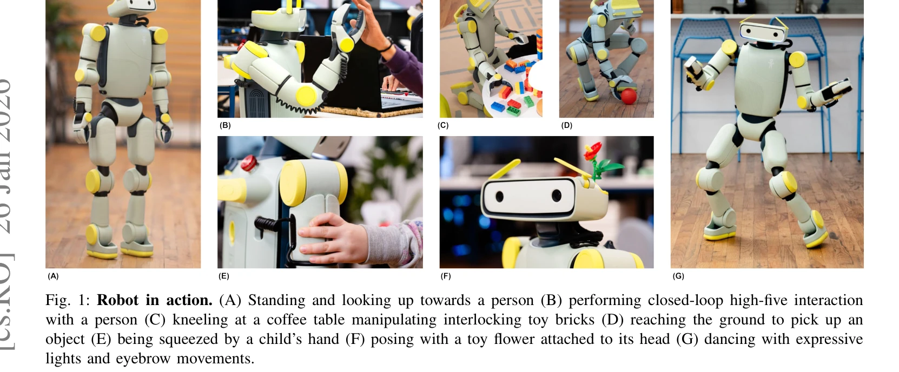

# Fauna Sprout: A lightweight, approachable, developer-ready humanoid robot

> **저자**: Fauna Robotics, :, Diego Aldarondo, Ana Pervan, Daniel Corbalan, Dave Petrillo, Bolun Dai, Aadhithya Iyer, Nina Mortensen, Erik Pearson, Sridhar Pandian Arunachalam, Emma Reznick, David Weis, Jacob Davison, Samuel Patterson, Tess Carella, Michael Suguitan, David Ye, Oswaldo Ferro, Nilesh Suriyarachchi, Spencer Ling, Erik Su, Daniel Giebisch, Peter Traver, Sam Fonseca, Mack Mor, Rohan Singh, Sertac Guven, Kangni Liu, Yaswanth Kumar Orru, Ashiq Rahman Anwar Batcha, Shruthi Ravindranath, Silky Arora, Hugo Ponte, Dez Hernandez, Utsav Chaudhary, Zack Walker, Michael Kelberman, Ivan Veloz, Christina Santa Lucia, Kat Casale, Helen Han, Michael Gromis, Michael Mignatti, Jason Reisman, Kelleher Guerin, Dario Narvaez, Christopher Anderson, Anthony Moschella, Robert Cochran, Josh Merel | **날짜**: 2026-01-26 | **URL**: [https://arxiv.org/abs/2601.18963](https://arxiv.org/abs/2601.18963)

---

## Essence

*Fig. 1: Robot in action. (A) Standing and looking up towards a person (B) performing closed-loop high-five interaction*

Sprout는 인간 환경에서의 안전하고 표현력 있는 장기 배포를 위해 설계된 경량의 개발자 친화적 휴머노이드 로봇 플랫폼이다. 안전성, 표현력, 접근성을 강조하면서 whole-body control, 조작, VR 기반 텔레오퍼레이션, 사회적 상호작용을 통합한다.

## Motivation

- **Known**: 최근 learned control, 대규모 시뮬레이션, generative model의 발전으로 범용 로봇 제어기 개발이 가속화되었다. 그러나 대부분의 기존 휴머노이드는 폐쇄형 산업용 시스템이거나 배포 및 운영이 어려운 학술 프로토타입이다.
- **Gap**: 인간 환경에서의 안전하고 표현력 있는 장기 배포에 적합한 접근 가능한 플랫폼이 부족하다. 개발자가 깊은 저수준 제어 전문성 없이 휴머노이드에 접근할 수 있는 인프라가 필요하다.
- **Why**: 접근 가능한 휴머노이드 플랫폼은 PC, 스마트폰, VR처럼 광범위한 참여와 실험을 가능하게 하여 구체화된 지능(embodied intelligence)의 발전을 촉진한다. 인간 환경에서의 안전한 운영은 현실적 배포와 사회적 상호작용 연구를 가능하게 한다.
- **Approach**: 1.07m 높이와 22.7kg의 경량 형태, compliant control, 제한된 joint torque, soft exterior를 통해 안전성을 확보한다. 통합된 hardware-software 스택으로 low-level 모터 제어부터 high-level 자율성까지 추상화 수준을 제공하며, 표현적 헤드로 사회적 상호작용을 가능하게 한다.

## Achievement

*Fig. 2: Hardware overview. Key features of the Sprout robot platform from different perspectives: (A) and (B) are true-c*

- **안전성 설계**: 제한된 kinetic energy, soft panel, 최소화된 pinch point, backdrivable motor를 통해 인간 근처 안전 운영 지원
- **표현적 상호작용**: articulated neck, actuated eyebrow, LED array로 비언어적 상호작용 신호 제공
- **개발자 접근성**: 모듈식 hardware-software 아키텍처로 저수준 모터 제어부터 high-level planning까지 다양한 추상화 레벨 지원
- **통합 기능**: whole-body control, integrated gripper, VR 기반 teleoperation, mapping, navigation 기능 통합
- **실용성**: 후면 손잡이, 교체 가능한 배터리, 내구성 있는 gripper로 일상 운영 편의성 제공

## How

*Fig. 2: Hardware overview. Key features of the Sprout robot platform from different perspectives: (A) and (B) are true-c*

- 경량 형태(1.07m, 22.7kg)로 kinetic energy 및 충격력 최소화
- Soft exterior panel과 최소화된 pinch point로 접촉 위험 감소
- Backdrivable motor와 conservative joint torque limit로 부상 가능성 완화
- Compliant controller를 통한 whole-body behavior 실행으로 접촉력 최소화
- Modular hardware-software architecture로 다층 API 제공 (sensing, actuation, logging, whole-body control, planning)
- Articulated neck과 actuated eyebrow, LED array로 social interaction 신호 생성
- GPU-accelerated physics simulation (IsaacLab, MuJoCo) 기반 learned control 통합
- Hierarchical control 구조로 high-level vision/language 조건 신호를 low-level control policy로 매핑

## Originality

- 기존 산업용 폐쇄형 또는 학술 프로토타입과 달리 안전성, 표현력, 개발자 접근성을 동등하게 강조하는 설계 철학
- 소형 휴머노이드에서 expressive head (non-screen 기반 눈썹과 조명)를 채택하여 물리적 구체화 강조
- Compliant control을 통한 전신 안전 행동 실행 방식
- 저수준 제어부터 고수준 자율성까지 모듈식 추상화 계층 제공으로 다양한 전문 수준 개발자 지원
- 실제 인간 환경에서의 장기 배포를 위한 실용적 설계 (배터리 교체, 수동 이동 등)

## Limitation & Further Study

- 논문이 발췌 문본이므로 구체적인 성능 평가 결과가 제시되지 않음 (locomotion 속도, manipulation 정확도, 안전성 검증 데이터 부재)
- Expressive head의 표현 능력이 actuated eyebrow와 LED로 제한되어 있어 facial expression의 정교함이 제한적일 수 있음
- Lightweight 설계로 인한 load capacity와 작업 성능의 트레이드오프 미검토
- VR 기반 teleoperation의 지연(latency)과 사용성 평가 부재
- 실제 인간-로봇 상호작용 안전성에 대한 정량적 평가 및 사고 데이터 미제시
- **후속연구**: 다양한 실제 환경에서의 장기 배포 결과, human-robot interaction 연구, language-conditioned 정책 통합, 비용 효율성 분석 필요

## Evaluation

- Novelty: 4/5
- Technical Soundness: 3/5
- Significance: 4/5
- Clarity: 4/5
- Overall: 4/5

**총평**: Sprout는 접근 가능한 휴머노이드 플랫폼이라는 로봇 분야의 중요한 갭을 해결하며, 안전성과 표현력을 동시에 달성하는 설계 철학이 독창적이다. 다만 구체적인 성능 평가와 실제 배포 데이터가 발표되면 그 가치가 더욱 입증될 것으로 예상된다.

## Related Papers

- 🔗 후속 연구: [[papers/1391_ExtremControl_Low-Latency_Humanoid_Teleoperation_with_Direct/review]] — Sprout의 VR 기반 텔레오퍼레이션 시스템은 ExtremControl의 50ms 극저지연 제어 기술을 통합하여 더욱 반응성이 뛰어난 인간-로봇 상호작용을 구현할 수 있습니다.
- 🧪 응용 사례: [[papers/1341_Dexterous_Teleoperation_of_20-DoF_ByteDexter_Hand_via_Human/review]] — Sprout의 whole-body control과 사회적 상호작용 통합 플랫폼은 ByteDexter Hand의 정밀한 20-DoF 손동작 제어를 전신 조작으로 확장하는 응용 사례입니다.
- 🧪 응용 사례: [[papers/1285_Berkeley_Humanoid_A_Research_Platform_for_Learning-based_Con/review]] — 개발자 친화적 휴머노이드 플랫폼에서 Berkeley Humanoid의 연구 플랫폼 설계가 적용된다
- 🧪 응용 사례: [[papers/1341_Dexterous_Teleoperation_of_20-DoF_ByteDexter_Hand_via_Human/review]] — ByteDexter Hand의 정밀한 손동작 제어 기술은 Sprout 휴머노이드의 VR 기반 텔레오퍼레이션 시스템에 직접 적용 가능합니다.
- 🧪 응용 사례: [[papers/1391_ExtremControl_Low-Latency_Humanoid_Teleoperation_with_Direct/review]] — ExtremControl의 50ms 극저지연 텔레오퍼레이션 기술은 Sprout의 VR 기반 whole-body control에 직접 적용하여 실시간성을 극대화할 수 있습니다.
