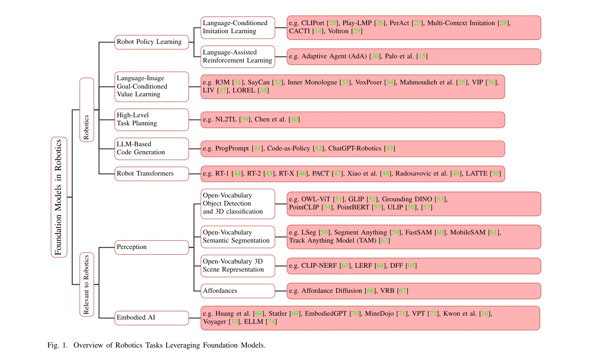

# Foundation Models in Robotics: Applications, Challenges, and the Future

> **저자**: Roya Firoozi, Johnathan Tucker, Stephen Tian, Anirudha Majumdar, Jiankai Sun, Weiyu Liu, Yuke Zhu, Shuran Song, Ashish Kapoor, Karol Hausman, Brian Ichter, Danny Driess, Jiajun Wu, Cewu Lu, Mac Schwager | **날짜**: 2023-12-13 | **URL**: [https://arxiv.org/abs/2312.07843](https://arxiv.org/abs/2312.07843)

---

## Essence

*Fig. 1. Overview of Robotics Tasks Leveraging Foundation Models.*

본 논문은 로봇 자동화 스택의 지각, 의사결정, 제어 전반에 걸쳐 foundation model의 응용을 포괄적으로 조사하며, 로봇 도메인 적용 시 데이터 부족, 실시간 성능, 안전성 보장 등의 주요 과제를 제시한다.

## Motivation

- **Known**: Foundation model은 대규모 인터넷 데이터로 사전 학습되어 우수한 일반화 능력을 보이며, 기존 로봇 학습은 특정 작업별 소규모 데이터셋에 의존한다. VLM과 LLM이 시각-언어 이해와 상식 추론을 제공할 수 있다는 것이 알려져 있다.
- **Gap**: Foundation model의 로봇 분야 적용은 아직 초기 단계로, 로봇 관련 학습 데이터의 심각한 부족, 불확실성 정량화, 실시간 실행 가능성, 그리고 안전성 평가 방법론이 확립되지 않았다.
- **Why**: Foundation model은 제한된 데이터 환경에서의 로봇 학습 효율을 획기적으로 개선할 수 있으며, zero-shot 일반화 능력은 미지의 환경에서 로봇의 적응성을 크게 높일 수 있다.
- **Approach**: 본 논문은 perception, decision-making, control 영역에서 foundation model을 활용하는 최근 연구들을 체계적으로 분류 및 분석하고, 로봇 자동화 통합 시 직면하는 기술적, 안전성 관련 과제들을 상세히 논의한다.

## Achievement

*Fig. 1. Overview of Robotics Tasks Leveraging Foundation Models.*

- **Foundation Model 응용 분류**: Perception (open-vocabulary detection/segmentation, 3D 표현 학습), Decision-making (LLM 기반 태스크 플래닝, 언어 조건 모방 학습), Control (Transformer 기반 정책, in-context learning) 영역별로 체계화
- **주요 기술 동향 정리**: Language-grounded 3D scene understanding, code generation을 통한 태스크 플래닝, vision-language model의 affordance 학습 등 신흥 기법들의 성과 제시
- **핵심 과제 식별**: 데이터 부족(로봇 규모 학습 데이터 스케일링 방법 부재), 불확실성 정량화(instance/distribution 수준), 실시간 성능(inference latency), 안전성 평가(배포 전/중/후 검증) 등 5개 주요 분야의 구체적 문제 제시
- **해결 방안 제시**: 비구조화 플레이 데이터 활용, synthetic data 생성, VLM 기반 데이터 증강, 불확실성 정량화 프레임워크, 배포 전 안전 테스트 및 OOD detection 방안 제안

## How

- Foundation model의 유형별 분류: LLM, Vision Transformer, VLM(vision-language model), embodied multimodal LM, visual generative model 등의 특성과 로봇 적용 가능성 분석
- 로봇 응용 도메인별 체계적 리뷰: policy learning (language-conditioned imitation learning, language-assisted RL), task planning (language instruction, code generation), open-vocabulary navigation/manipulation, perception (object detection, semantic segmentation, 3D 표현)
- 데이터 스케일링 전략 검토: unlabeled video 및 human play data 활용, inpainting 기반 data augmentation, simulation을 통한 synthetic data 생성, VLM을 활용한 자동 라벨링
- 불확실성 및 안전성 평가 프레임워크: instance-level (언어 ambiguity, LLM hallucination), distribution-level uncertainty, distribution shift, calibration 관점의 분석
- 실시간 성능 개선 경로: 모델 경량화, inference acceleration, 구조화된 생성(structured generation)을 통한 latency 감소 방안 검토

## Originality

- 로봇 도메인의 foundation model 응용에 대한 최초의 포괄적 학술 조사(concurrent survey 제외)로, perception-decision making-control의 통합 관점 제시
- 기술적 성과뿐 아니라 실제 배포를 위한 안전성, 불확실성 정량화, 실시간 성능 등 실무적 과제를 동등한 비중으로 다룬 점
- 로봇 데이터 부족 문제를 다층적으로 접근하는 해결책(self-supervised learning, synthetic data, VLM 기반 augmentation 등)을 체계화

## Limitation & Further Study

- 조사 논문의 특성상 new empirical result나 novel algorithm 제시 부재
- Foundation model 자체의 근본적 한계(hallucination, OOD robustness 등)에 대한 깊이 있는 분석 부족
- 실제 로봇 플랫폼에서의 end-to-end 통합 사례 및 성능 비교 데이터 제한
- 후속 연구 방향: (1) 로봇 특화 foundation model 개발, (2) 엄격한 불확실성 정량화 방법론 수립, (3) closed-loop 배포 환경에서의 distribution shift 대응, (4) 안전성 검증 표준화, (5) 실시간 실행 가능한 경량 모델 개발

## Evaluation

- Novelty: 3/5
- Technical Soundness: 3/5
- Significance: 4/5
- Clarity: 4/5
- Overall: 4/5

**총평**: 본 논문은 로봇 자동화에서 foundation model의 역할을 체계적으로 정리한 중요한 조사 논문으로, 기술적 성과뿐 아니라 안전성과 실시간 성능이라는 실무적 과제를 균형있게 다루어 해당 분야의 나침반 역할을 할 수 있다.

## Related Papers

- 🏛 기반 연구: [[papers/1350_Deep_Reinforcement_Learning_for_Robotics_A_Survey_of_Real-Wo/review]] — feature-based와 GAN-based 학습 방법론 비교가 DRL 문제 공식화의 이론적 기초 제공
- 🧪 응용 사례: [[papers/1409_GR-2_A_Generative_Video-Language-Action_Model_with_Web-Scale/review]] — demonstration learning 방법론 선택 기준이 GR-2와 같은 generative 모델 훈련에 적용
- 🔄 다른 접근: [[papers/1545_Robot_Learning_in_the_Era_of_Foundation_Models_A_Survey/review]] — 로봇 분야의 foundation model 적용에 대한 포괄적 조사에서 서로 다른 관점과 체계를 제시한다.
