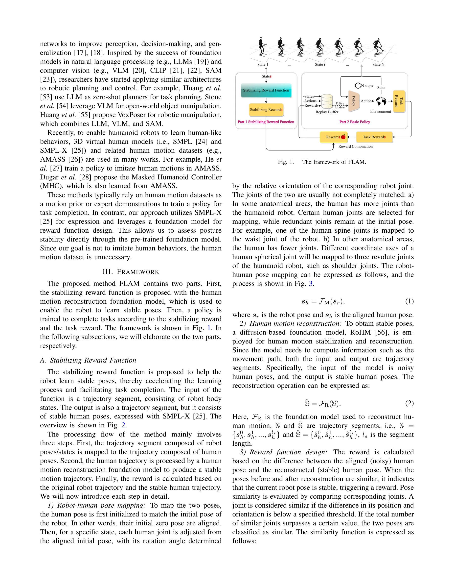
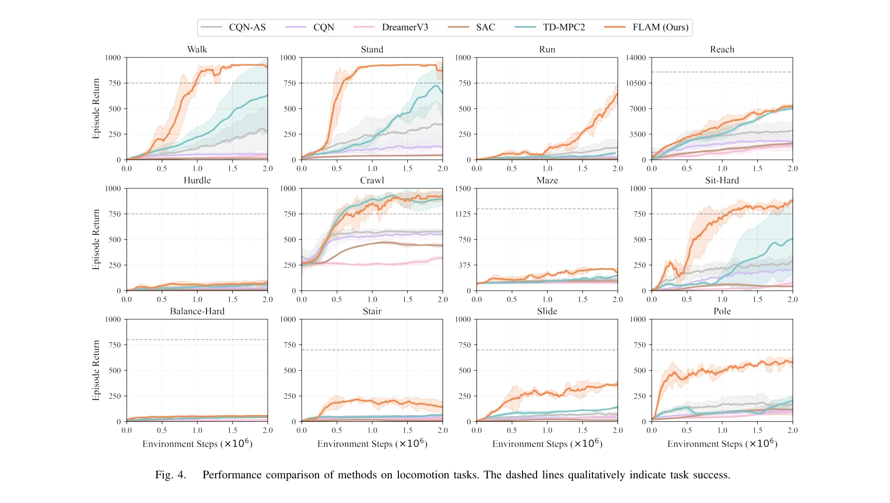
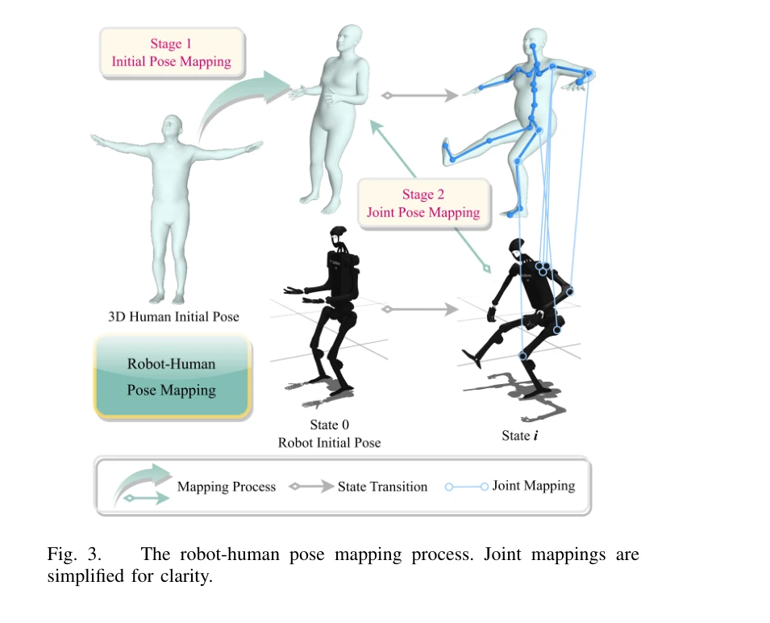

# FLAM: Foundation Model-Based Body Stabilization for Humanoid Locomotion and Manipulation

> **저자**: Xianqi Zhang, Hongliang Wei, Wenrui Wang, Xingtao Wang, Xiaopeng Fan, Debin Zhao | **날짜**: 2025-03-28 | **URL**: [https://arxiv.org/abs/2503.22249](https://arxiv.org/abs/2503.22249)

---

## Essence

*Fig. 1.*

본 논문은 휴머노이드 로봇의 전신 제어를 위해 human motion reconstruction 기반의 안정화 보상 함수를 설계하여 RL 정책 학습을 개선하는 FLAM 방법을 제안한다. 로봇 자세를 3D 가상 인간 모델로 매핑한 후 안정화된 자세로 재구성하여 얻은 보상을 과제 보상과 결합함으로써 안정적이고 효율적인 학습을 달성한다.

## Motivation

- **Known**: 휴머노이드 로봇 제어에 RL이 널리 사용되고 있으며, 최근 foundation model과 3D 가상 인간 모델(SMPL, SMPL-X)이 로봇 정책 학습에 활용되고 있다. 기존 RL 방법들은 과제 보상만으로 전신 제어를 학습하려 한다.
- **Gap**: 기존 RL 방법들은 신체 안정성이 휴머노이드 로봇의 운동 및 조작에 미치는 영향을 명시적으로 고려하지 않으며, 높은 자유도와 복잡한 보상 함수 설계로 인해 과제 보상만으로는 높은 성능을 달성하기 어렵다.
- **Why**: 안정적인 자세 유지는 복잡한 운동학습의 기초이며, foundation model을 활용한 안정화 보상은 정책 학습을 가속화하고 과제 완성을 촉진할 수 있기 때문에 중요하다.
- **Approach**: FLAM은 pre-trained human motion reconstruction model을 사용하여 안정화 보상 함수를 설계하고, 이를 과제 보상과 결합하여 기본 정책을 학습한다. 로봇 자세를 SMPL 모델로 매핑한 후 안정화 및 재구성을 통해 보상을 계산한다.

## Achievement

*Fig. 4.*

- **foundation model 기반 안정화 방법**: human motion reconstruction model을 활용한 새로운 안정화 보상 함수 설계로 안정적 자세 학습 촉진
- **성능 개선**: FLAM이 휴머노이드 로봇 벤치마크에서 최신 RL 방법들을 능가하는 성능 달성
- **학습 효율 향상**: 안정화 보상과 과제 보상의 결합으로 정책 학습 과정 가속화 및 수렴 개선

## How

*Fig. 3.*

- 로봇 자세를 3D 가상 인간 모델(SMPL)로 매핑
- human motion reconstruction 모델을 통해 매핑된 자세 안정화 및 재구성
- 재구성 전후 자세 차이를 이용한 안정화 보상 함수 계산
- 안정화 보상과 과제 특정 보상을 가중 결합하여 정책 학습 가이드
- 기본 RL 정책(value-based 또는 policy-based)과의 통합

## Originality

- Foundation model(human motion reconstruction)을 로봇 제어의 안정화 보상 함수 설계에 직접 활용한 새로운 접근
- SMPL과 같은 3D 가상 인간 모델과 human motion dataset의 사전 학습 지식을 명시적으로 활용하여 휴머노이드 로봇의 자세 안정성 개선
- 인간의 점진적 학습 과정(기초 자세 유지 → 복잡한 운동)을 모방한 보상 설계 철학

## Limitation & Further Study

- SMPL 모델의 자유도가 로봇 시스템의 실제 자유도와 차이가 있을 수 있으며, 이에 따른 매핑 손실 분석 부족
- Human motion reconstruction 모델의 성능에 크게 의존하므로, 모델 오류가 보상 신호에 미치는 영향 미분석
- 실제 로봇 하드웨어에서의 검증 결과가 제시되지 않아 시뮬레이션-실제 갭(sim-to-real gap) 해결 미흡
- 안정화 보상과 과제 보상의 가중치 조정 기준과 일반화 가능성에 대한 상세 논의 부족
- 후속 연구: 다양한 로봇 형태와 과제에 대한 일반화 능력 평가, 실제 로봇 실험, 동적 환경에서의 성능 검증 필요

## Evaluation

- Novelty: 4/5
- Technical Soundness: 3/5
- Significance: 4/5
- Clarity: 4/5
- Overall: 4/5

**총평**: 본 논문은 foundation model을 활용한 창의적인 안정화 보상 설계로 휴머노이드 로봇 제어에 새로운 관점을 제시하며, 실험 결과도 우수하다. 다만 실제 하드웨어 검증과 시뮬레이션-실제 갭 해결 방안이 제시된다면 더욱 강력한 기여가 될 수 있다.

## Related Papers

- 🔗 후속 연구: [[papers/1358_Dribble_Master_Learning_Agile_Humanoid_Dribbling_through_Leg/review]] — FLAM의 인간 동작 기반 안정화 방법을 드리블링과 같은 동적 기술에 적용하면 더욱 안정적인 볼 컨트롤이 가능하다.
- 🏛 기반 연구: [[papers/1382_EMP_Executable_Motion_Prior_for_Humanoid_Robot_Standing_Uppe/review]] — 인간 동작 reconstruction 기반 보상이 EMP의 상체 동작 모방에서 전신 안정성을 유지하는 핵심 방법론이 된다.
- 🔄 다른 접근: [[papers/1582_Natural_Humanoid_Robot_Locomotion_with_Generative_Motion_Pri/review]] — 둘 다 자연스러운 humanoid 동작을 추구하지만 FLAM은 foundation model 기반, Natural Humanoid는 generative motion prior 기반이다.
- 🏛 기반 연구: [[papers/1358_Dribble_Master_Learning_Agile_Humanoid_Dribbling_through_Leg/review]] — FLAM의 human motion reconstruction 기반 안정화 방법이 드리블링 동작의 전신 균형 제어에 필수적인 기반 기술을 제공한다.
