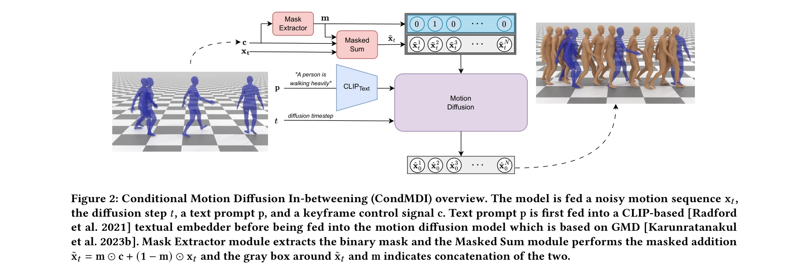

# Flexible Motion In-betweening with Diffusion Models

> **저자**: Setareh Cohan, Guy Tevet, Daniele Reda, Xue Bin Peng, Michiel van de Panne | **날짜**: 2024-05-17 | **URL**: [https://arxiv.org/abs/2405.11126](https://arxiv.org/abs/2405.11126)

---

## Essence

*Figure 2: Conditional Motion Diffusion In-betweening (CondMDI) overview. The model is fed a noisy motion sequence x𝑡,*

본 논문은 diffusion model을 기반으로 한 CondMDI를 제안하여, 텍스트 조건과 유연한 keyframe 제약을 만족하는 다양한 인간 모션을 생성하는 motion in-betweening 방법을 제시한다.

## Motivation

- **Known**: Motion in-betweening은 character animation에서 핵심 작업이며, 최근 diffusion model이 다양하고 현실적인 human motion 생성에 우수한 능력을 보였다. 하지만 기존 diffusion 기반 방법들은 keyframe 조건화에 표준 해결책이 없고 sparse keyframe과 partial pose 지정을 제한적으로만 지원한다.
- **Gap**: 기존 diffusion 기반 in-betweening 방법(MDM, PriorMDM, GMD)은 dense keyframe 패턴에 제한되거나, sparse-in-time 제약을 충분히 지원하지 않으며, 전체 pose 지정이 아닌 pelvis 위치만 허용한다.
- **Why**: Motion in-betweening은 character animation에서 labor-intensive한 작업이며, 더 유연하고 일반화된 방법은 animation 제작 효율을 크게 향상시킬 수 있다. 또한 text conditioning과 sparse keyframe의 결합은 더욱 직관적인 사용자 제어를 가능하게 한다.
- **Approach**: CondMDI는 masked conditional diffusion model로, random sampling된 keyframe과 joint를 관찰/미관찰 표시하는 mask와 함께 학습하여, inference 시 임의의 dense 또는 sparse keyframe 배치와 partial keyframe 제약을 유연하게 처리한다.

## Achievement

*Figure 3: Our model is capable of generating high-quality*

- **통합된 유연한 모델**: 임의의 시간적 위치와 밀도의 keyframe, partial pose 지정, 텍스트 조건을 동시에 지원하는 단일의 통합된 모델 구현
- **고품질 다양한 모션 생성**: HumanML3D 데이터셋에서 지정된 keyframe을 정확히 만족하면서도 높은 품질과 다양성을 갖는 모션 생성 달성
- **빠른 추론 속도**: 대체 diffusion 기반 방법들 대비 빠른 추론 시간 유지
- **추론 시 유연한 조건화**: guidance와 imputation 기반 접근법 비교를 통해 inference-time keyframing의 다양한 설계 선택 제시

## How

*Figure 2: Conditional Motion Diffusion In-betweening (CondMDI) overview. The model is fed a noisy motion sequence x𝑡,*

- Random sampling을 통해 모든 가능한 motion in-betweening 시나리오에 대해 학습하여 flexible한 inference-time 조건화 실현
- Mask mechanism으로 관찰된 keyframe과 unobserved 영역을 구분하여 모델이 sparse 및 partial keyframe 처리 학습
- Text embedding과 keyframe constraint를 diffusion model의 conditioning 메커니즘에 통합
- Guidance와 imputation-based 접근법을 평가하여 inference-time keyframing의 대안적 설계 비교
- HumanML3D 데이터셋에서 text-conditioned 설정으로 평가 및 검증

## Originality

- 기존 방법들의 fixed keyframe pattern 제한을 벗어나, 완전히 임의의 sparse/dense keyframe 배치를 처리하는 unified framework 제시
- Masked conditional diffusion을 motion in-betweening에 최초로 적용하여 random sampling된 keyframe과 joint로 학습하는 novel training scheme 도입
- Partial keyframe constraint (full pose가 아닌 joint 부분집합)을 diffusion 기반 in-betweening에서 체계적으로 지원
- Text conditioning과 spatial keyframe constraint의 seamless한 결합으로 더욱 직관적인 사용자 제어 가능화

## Limitation & Further Study

- 평가가 주로 HumanML3D 데이터셋에 제한되어, 다양한 motion capture 데이터셋에 대한 일반화 성능 미검증
- Inference 속도 개선에 대한 구체적인 수치 비교가 충분하지 않음
- Contact constraint (발의 접지 조건 등)에 대한 명시적 처리 부재
- 매우 긴 모션 시퀀스나 매우 sparse한 keyframe(예: 시작/종료만 지정) 시나리오에 대한 성능 한계 미분석
- Guidance vs. imputation 방법론의 상세한 이론적 비교 부족

## Evaluation

- Novelty: 4/5
- Technical Soundness: 3/5
- Significance: 4/5
- Clarity: 4/5
- Overall: 4/5

**총평**: 본 논문은 masked conditional diffusion을 motion in-betweening에 창의적으로 적용하여, flexible하고 통합된 해결책을 제시한 의미 있는 기여이다. 임의의 sparse/dense keyframe과 partial pose를 지원하며 text conditioning을 결합한 설계는 character animation 제작을 현실적으로 개선할 수 있는 실용적 가치를 갖는다.

## Related Papers

- 🔄 다른 접근: [[papers/1346_Diffusion_Forcing_for_Multi-Agent_Interaction_Sequence_Model/review]] — diffusion 기반 motion generation을 다른 conditioning 방법으로 구현한다
- ⚖️ 반론/비판: [[papers/1386_Example-based_Motion_Synthesis_via_Generative_Motion_Matchin/review]] — learning-free generation과 대비되는 diffusion 학습 기반 접근법이다
- 🔗 후속 연구: [[papers/1507_Kimodo_Scaling_Controllable_Human_Motion_Generation/review]] — controllable motion generation을 keyframe constraints로 더 유연하게 확장했다
- 🔄 다른 접근: [[papers/1346_Diffusion_Forcing_for_Multi-Agent_Interaction_Sequence_Model/review]] — multi-agent interaction modeling을 다른 diffusion 기법으로 접근한 연구다
- 🔄 다른 접근: [[papers/1386_Example-based_Motion_Synthesis_via_Generative_Motion_Matchin/review]] — motion synthesis를 diffusion이 아닌 generative matching 방법으로 수행한다
- 🏛 기반 연구: [[papers/1611_PhysDiff_Physics-Guided_Human_Motion_Diffusion_Model/review]] — diffusion 기반 motion in-betweening 기술이 PhysDiff의 물리 제약 통합 방법론에 기반이 된다
- 🧪 응용 사례: [[papers/1300_A_Survey_on_Vision-Language-Action_Models_for_Autonomous_Dri/review]] — 생성형 world model이 자율주행 VLA의 환경 예측과 계획 능력에 구체적 적용을 제공한다
