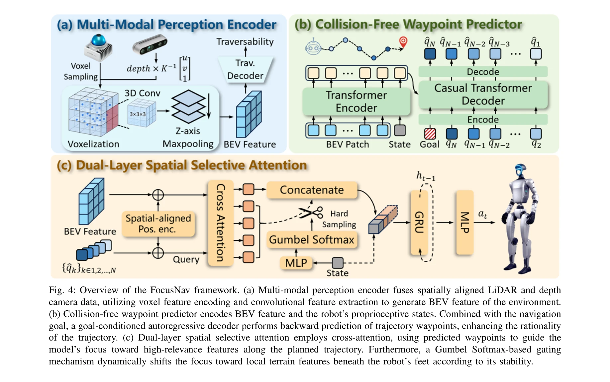
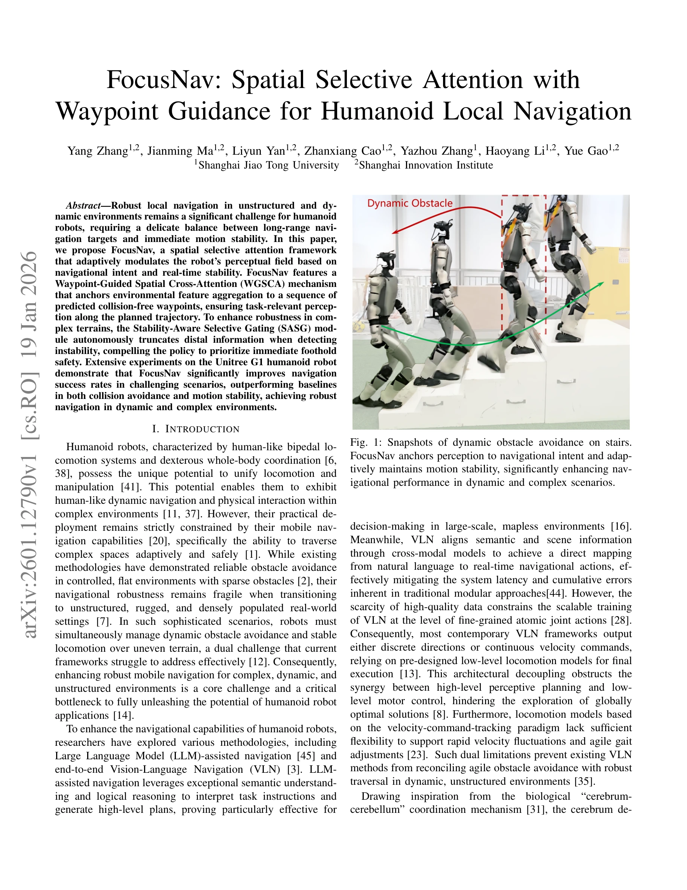

# FocusNav: Spatial Selective Attention with Waypoint Guidance for Humanoid Local Navigation

> **저자**: Yang Zhang, Jianming Ma, Liyun Yan, Zhanxiang Cao, Yazhou Zhang, Haoyang Li, Yue Gao | **날짜**: 2026-01-19 | **URL**: [https://arxiv.org/abs/2601.12790](https://arxiv.org/abs/2601.12790)

---

## Essence

*Fig. 4: Overview of the FocusNav framework. (a) Multi-modal perception encoder fuses spatially aligned LiDAR and depth*

FocusNav는 인간형 로봇의 복잡한 환경 내 지역 네비게이션을 위해 Waypoint-Guided Spatial Cross-Attention (WGSCA)와 Stability-Aware Selective Gating (SASG) 모듈을 결합한 공간 선택적 주의 프레임워크이다.

## Motivation

- **Known**: 인간형 로봇의 지역 네비게이션에서 LiDAR/RGB-D 센서를 활용한 환경 인식과 velocity-command-tracking 기반의 운동 제어가 사용되고 있다. 또한 cross-attention 메커니즘이 시각 네비게이션 성능 향상에 효과적임이 알려져 있다.
- **Gap**: 기존 방법들은 높은 수준의 지각 계획과 낮은 수준의 운동 제어 간의 분리로 인해 지형 적응과 동적 장애물 회피를 동시에 달성하기 어렵다. 특히 불규칙한 지형에서 안정적인 보행과 장애물 회피를 조화시키는 것이 미해결 과제이다.
- **Why**: 인간형 로봇의 실제 배포는 복잡하고 동적인 환경에서의 강건한 네비게이션 능력에 의해 크게 제약받고 있다. 이를 해결하면 로봇의 조작과 이동을 통합하여 실제 응용 분야에서의 활용도를 크게 높일 수 있다.
- **Approach**: 생물학적 뇌-소뇌 조정 메커니즘에서 영감을 받아 Perception-Prediction-Attention (PPA) 패러다임을 기반으로 FocusNav를 개발하였다. WGSCA 메커니즘으로 예측된 충돌 없는 waypoint에 환경 특성을 고정시키고, SASG 모듈로 불안정성 감지 시 원거리 정보를 제거하여 즉각적인 지형 안정성을 우선시한다.

## Achievement

*Fig. 1: Snapshots of dynamic obstacle avoidance on stairs.*

- **Waypoint-Guided Spatial Cross-Attention (WGSCA)**: 예측된 충돌 없는 waypoint 시퀀스에 기반하여 환경 특성 집계를 공간적으로 고정시키며, 계획된 궤적을 따라 과제 관련 인식을 보장한다.
- **Stability-Aware Selective Gating (SASG) 모듈**: 로봇의 안정성 감소를 감지할 때 원거리 환경 정보를 자동으로 제거하여 정책이 즉각적인 발판 안전을 우선시하도록 강제한다.
- **실제 로봇 검증**: Unitree G1 인간형 로봇에서 광범위한 실험을 수행하여 네비게이션 성공률, 충돌 회피 효율, 운동 안정성에서 기존 방법들을 크게 능가함을 입증하였다.

## How

*Fig. 4: Overview of the FocusNav framework. (a) Multi-modal perception encoder fuses spatially aligned LiDAR and depth*

- GuideOracle 정책을 학습하여 simulation 환경의 완전한 가시성을 활용한 최적의 waypoint 추적을 달성하고, 이를 비전 기반 네비게이션 정책 학습의 감독 신호로 활용한다.
- 다중 모달 인식 인코더(Multi-modal perception encoder)를 사용하여 LiDAR와 depth camera 데이터를 처리한다.
- WGSCA 메커니즘에서 예측된 waypoint를 기준으로 spatial cross-attention을 수행하여 궤적 관련 환경 특성에 집중한다.
- SASG 모듈에서 실시간 안정성 지표를 모니터링하며, 불안정성 감지 시 인식 필드를 동적으로 조절하여 근거리 지형 정보의 가중치를 높인다.
- end-to-end 학습을 통해 고수준 인식 계획과 저수준 운동 제어를 통합하여 전역 최적화를 추구한다.

## Originality

- 생물학적 뇌-소뇌 조정 메커니즘을 로봇 네비게이션에 적용한 PPA 패러다임의 구체적 구현으로, 기존 velocity-command-tracking 기반 방법과 차별화된다.
- waypoint 시퀀스를 attention 메커니즘의 앵커로 사용하는 WGSCA는 task 관련 인식과 네비게이션 의도를 명시적으로 정렬하는 새로운 접근이다.
- 로봇의 동적 안정성을 모니터링하여 인식 필드를 적응적으로 조절하는 SASG 모듈은 지형 적응과 장애물 회피의 상충관계를 해결하는 혁신적 방법이다.
- GuideOracle을 통한 privileged policy 활용은 simulation과 현실 간의 격차를 줄이기 위한 효과적인 감독 신호 생성 전략이다.

## Limitation & Further Study

- 실험이 Unitree G1 단일 플랫폼에서만 수행되어 다양한 인간형 로봇으로의 일반화 가능성이 미명확하다.
- simulation에서 훈련된 모델의 실제 환경 적응 능력에 대한 상세한 domain adaptation 분석이 부족하다.
- 동적 환경에서의 다중 에이전트 상호작용이나 매우 복잡한 사회적 네비게이션 시나리오에 대한 평가가 제시되지 않았다.
- WGSCA와 SASG 각 모듈의 개별 기여도에 대한 ablation study가 자세히 제시되지 않아 설계 결정의 필요성을 완전히 입증하기 어렵다.
- 후속 연구로 다양한 로봇 플랫폼과 극한 환경(급경사, 수중 등)에서의 확장과 사회적 네비게이션 과제 통합이 필요하다.

## Evaluation

- Novelty: 4/5
- Technical Soundness: 3/5
- Significance: 4/5
- Clarity: 4/5
- Overall: 4/5

**총평**: FocusNav는 생물학적 원리에서 영감을 받아 선택적 주의, waypoint 기반 경로 계획, 안정성 기반 적응적 인식이라는 혁신적 요소들을 통합하여 인간형 로봇의 복잡한 환경 네비게이션 문제를 효과적으로 해결한다. 실제 로봇 실험을 통한 검증이 우수하나, 다양한 플랫폼과 환경으로의 일반화 가능성 증명과 ablation study 강화가 후속 과제이다.

## Related Papers

- 🔗 후속 연구: [[papers/1361_E-SDS_Environment-aware_See_it_Do_it_Sorted_-_Automated_Envi/review]] — FocusNav의 spatial attention과 E-SDS의 환경 인식을 결합하면 더욱 정교한 지형 인식 네비게이션이 가능하다.
- 🏛 기반 연구: [[papers/1424_Geometry-Aware_Predictive_Safety_Filters_on_Humanoids_From_P/review]] — Geometry-aware safety의 공간 인식 방법이 FocusNav의 waypoint 기반 공간 선택적 주의에 필수적인 이론적 기반을 제공한다.
- 🔄 다른 접근: [[papers/1612_Visual_Language_Maps_for_Robot_Navigation/review]] — 둘 다 언어 기반 네비게이션을 다루지만 FocusNav는 공간 선택적 주의에, Visual Language Maps는 의미적 공간 매핑에 집중한다.
- 🔗 후속 연구: [[papers/1424_Geometry-Aware_Predictive_Safety_Filters_on_Humanoids_From_P/review]] — Poisson safety function의 기하학적 안전성과 FocusNav의 공간 선택적 주의를 결합하면 더욱 안전한 환경 네비게이션이 가능하다.
- 🔗 후속 연구: [[papers/1537_Learning_Social_Navigation_from_Positive_and_Negative_Demons/review]] — FocusNav의 waypoint guidance 개념을 긍정/부정 시연 기반 밀도 보상과 결합하여 사회적 환경에 특화시킨 발전된 형태임
