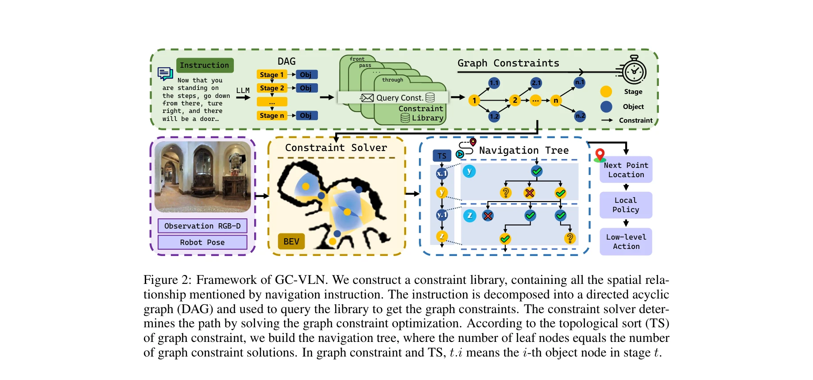
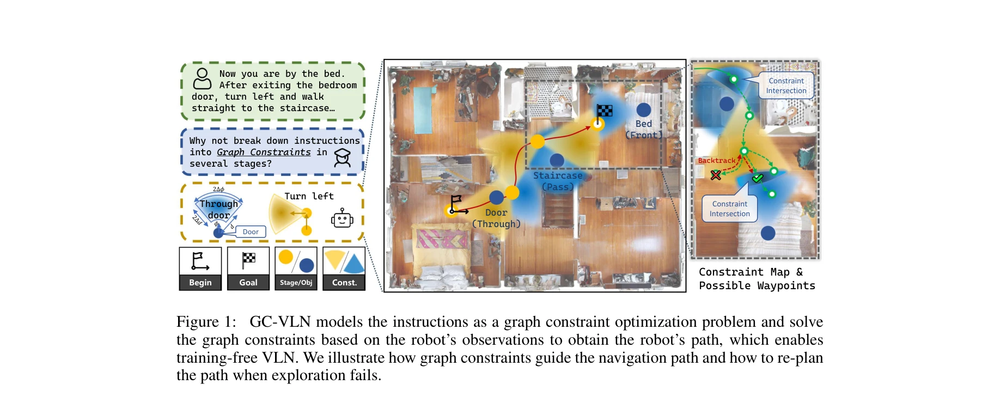

# GC-VLN: Instruction as Graph Constraints for Training-free Vision-and-Language Navigation

> **저자**: Hang Yin, Haoyu Wei, Xiuwei Xu, Wenxuan Guo, Jie Zhou, Jiwen Lu | **날짜**: 2025-09-12 | **URL**: [https://arxiv.org/abs/2509.10454](https://arxiv.org/abs/2509.10454)

---

## Essence

*Figure 2: Framework of GC-VLN. We construct a constraint library, containing all the spatial rela-*

GC-VLN은 자연언어 지시를 그래프 제약 최적화 문제로 재구성하여 연속 환경에서 학습 없이 작동하는 비전-언어 네비게이션 프레임워크를 제안한다. 공간 제약 라이브러리와 제약 솔버를 통해 zero-shot 환경 적응을 실현한다.

## Motivation

- **Known**: 기존 VLN 방법들은 이산 환경에서만 작동하거나 시뮬레이터에서 비지도 학습이 필요하여 실제 환경 배포가 어렵다. VLN-CE는 연속 환경을 지원하지만 대부분의 zero-shot 방법도 시뮬레이터 학습에 의존한다.
- **Gap**: 학습 없이 연속 환경에서 작동 가능한 VLN 프레임워크가 부족하며, sim-to-real 간극을 완전히 제거하는 방법이 필요하다.
- **Why**: 로봇의 실제 배포 가능성 확대와 주석 데이터 부족 문제 해결을 위해 완전한 training-free 접근법이 중요하며, 이는 새로운 환경과 지시에 대한 우수한 일반화를 가능하게 한다.
- **Approach**: 지시를 directed acyclic graph로 분해하고 공간 관계 제약 라이브러리를 구성하여 그래프 제약을 구축한 후, 제약 솔버로 waypoint 좌표를 결정하는 그래프 제약 최적화 문제를 해결한다. 네비게이션 트리와 백트래킹으로 불확실한 해의 개수를 처리한다.

## Achievement

*Figure 1:*

- **Training-free 연속 환경 VLN**: 시뮬레이터 학습 없이 연속 환경 R2R-CE, RxR-CE에서 작동 가능
- **향상된 성능**: 기존 zero-shot VLN 방법 대비 success rate와 navigation efficiency에서 현저한 개선
- **실제 환경 검증**: 실세계 실험을 통해 새로운 환경과 지시 세트에 대한 강력한 일반화 능력 입증
- **해 불확실성 처리**: navigation tree와 backtracking 메커니즘으로 no solution/multiple solutions 문제 해결

## How

*Figure 2: Framework of GC-VLN. We construct a constraint library, containing all the spatial rela-*

- 자연언어 지시를 LLM으로 처리하여 multi-stage directed acyclic graph (DAG)로 분해
- 6가지 유형(known distance, known angle, unknown angle/distance의 unary/multi-constraint)의 공간 제약으로 구성된 constraint library 구축
- DAG를 constraint library에 쿼리하여 graph constraint K 구성
- Constraint solver로 graph constraint K의 waypoint 좌표를 점진적으로 결정
- Topological sort (TS)를 기반으로 navigation tree 구축하여 모든 가능한 해 탐색
- Local policy로 low-level action (turning, moving forward) 생성하여 로봇 제어
- RGB-D 관측과 BEV 표현을 통해 환경 인식 및 제약 검증

## Originality

- 지시를 그래프 제약 최적화 문제로 공식화하는 새로운 관점 제시
- VLN 지시의 모든 공간 관계를 체계적으로 분류한 constraint library 설계
- 완전 training-free 접근으로 sim-to-real 간극 원천 차단
- Navigation tree와 backtracking으로 제약 솔버의 불확실한 해 개수를 우아하게 처리
- LLM 기반 DAG 분해와 constraint 기반 최적화의 조합으로 기존 방법과 차별화

## Limitation & Further Study

- Constraint solver의 계산 복잡도 분석 미흡 - 대규모 환경에서의 확장성 검증 필요
- 지시 분해 정확도가 전체 성능에 미치는 영향 미상세 - LLM 의존성 분석 강화 필요
- 실세계 실험 규모가 제한적 - 더 다양한 실제 환경(실내/실외, 복잡도)에서의 검증 필요
- 복합적인 공간 관계나 모호한 지시에 대한 robustness 평가 부재
- 다국어 지시나 문화 특정적 공간 표현에 대한 일반화 가능성 미검토

## Evaluation

- Novelty: 4/5
- Technical Soundness: 3/5
- Significance: 4/5
- Clarity: 4/5
- Overall: 4/5

**총평**: GC-VLN은 VLN-CE에서 처음으로 완전한 training-free 접근을 달성한 혁신적 연구로, constraint 기반 최적화 프레임워크의 창의성과 실세계 검증을 통한 실용성이 우수하다. 다만 계산 복잡도 분석과 대규모 실제 환경 실험 확대로 한층 강화될 수 있다.

## Related Papers

- 🏛 기반 연구: [[papers/1367_EgoActor_Grounding_Task_Planning_into_Spatial-aware_Egocentr/review]] — DivScene의 대규모 네비게이션 데이터가 GC-VLN의 제약 최적화 검증에 활용된다.
- 🔄 다른 접근: [[papers/1396_ForesightNav_Learning_Scene_Imagination_for_Efficient_Explor/review]] — ForesightNav도 언어 지시 기반의 효율적인 네비게이션 전략을 제안한다.
- 🔗 후속 연구: [[papers/1561_SayPlan_Grounding_Large_Language_Models_using_3D_Scene_Graph/review]] — SayPlan의 3D scene graph가 GC-VLN의 그래프 제약 표현을 확장한다.
- 🔄 다른 접근: [[papers/1367_EgoActor_Grounding_Task_Planning_into_Spatial-aware_Egocentr/review]] — GC-VLN도 학습 없이 작동하는 vision-language 네비게이션 프레임워크를 제안한다.
- 🔄 다른 접근: [[papers/1396_ForesightNav_Learning_Scene_Imagination_for_Efficient_Explor/review]] — GC-VLN도 언어 지시를 통한 효율적인 네비게이션 전략을 제안한다.
- 🔗 후속 연구: [[papers/1595_TRAVEL_Training-Free_Retrieval_and_Alignment_for_Vision-and-/review]] — TRAVEL의 landmark 추출과 경로 검색이 GC-VLN의 graph constraint 기반 접근법과 결합되어 더 효율적인 training-free navigation을 달성
