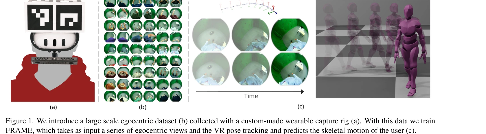
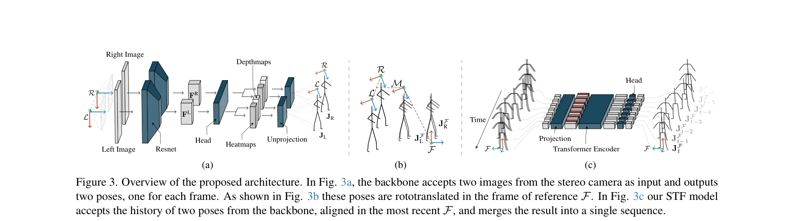

# FRAME: Floor-aligned Representation for Avatar Motion from Egocentric Video

> **저자**: Andrea Boscolo Camiletto, Jian Wang, Eduardo Alvarado, Rishabh Dabral, Thabo Beeler, Marc Habermann, Christian Theobalt | **날짜**: 2025-03-29 | **URL**: [https://arxiv.org/abs/2503.23094](https://arxiv.org/abs/2503.23094)

---

## Essence

*Figure 1. We introduce a large scale egocentric dataset (b) collected with a custom-made wearable capture rig (a). With *

VR/AR 애플리케이션을 위해 머리 장착형 스테레오 카메라를 이용한 자아중심 모션 캡처의 문제를 해결하기 위해, 대규모 실제 데이터셋과 기하학적으로 안전한 FRAME 아키텍처를 제안한다.

## Motivation

- **Known**: 기존의 자아중심 모션 캡처 방법들은 synthetic 데이터에 의존하며, 현실 데이터로의 일반화가 어렵고 하반신 추정에서 부정확함이 알려져 있다.
- **Gap**: 자아중심 뷰에서의 심각한 폐색, 실제 세계 학습 데이터의 부족, 그리고 기존 방법들이 egocentric 설정의 기하학적 특성을 명시적으로 활용하지 못하는 점이 문제이다.
- **Why**: VR/AR 애플리케이션에서 정확한 바디 포즈 예측은 몰입감 있는 아바타 표현과 상호작용을 위해 필수적이며, 실시간 성능도 중요하다.
- **Approach**: 경량 VR 기반 데이터 수집 설정을 통해 기존보다 6배 큰 실제 데이터셋을 구축하고, 디바이스 포즈와 카메라 피드를 기하학적으로 명시적으로 통합하는 FRAME 아키텍처를 제안한다.

## Achievement

*Figure 1. We introduce a large scale egocentric dataset (b) collected with a custom-made wearable capture rig (a). With *

- **대규모 실제 데이터셋**: 기존 260k 프레임 대비 6배 큰 규모의 자아중심 스테레오 카메라 데이터셋 구축
- **높은 정확도**: MPJPE 기준으로 기존 최고 성능 대비 28% 개선
- **실시간 성능**: 최신 하드웨어에서 300 FPS로 실행 가능
- **합성 데이터 제거**: 실제 데이터 학습만으로도 충분해 synthetic pretraining 불필요
- **우수한 모션 품질**: floor penetration과 foot skating 같은 일반적 인공물 제거

## How

*Figure 3. Overview of the proposed architecture. In Fig. 3a, the backbone accepts two images from the stereo camera as i*

- 경량 VR 기반 수집 장비에 스테레오 자아중심 카메라와 실시간 6D 포즈 추적 센서 통합
- 카메라 좌표계에서의 3D 포즈 예측 후 바닥 정렬 참조 프레임(floor-aligned reference frame)으로 회전변환
- 디바이스 포즈와 카메라 내재 파라미터를 명시적으로 활용한 기하학적 다중모달 통합
- k-fold Cross Training Caching Strategy를 통한 향상된 일반화 전략 적용
- 이전 카메라-상대 또는 골반-상대 추정의 한계를 극복하는 바닥 정렬 표현 사용

## Originality

- 자아중심 모션 캡처 분야에서 기존보다 6배 큰 규모의 실제 데이터셋 최초 구축
- 체크보드 없이 경량 ArUco 보드와 VR 디바이스 내장 추적을 활용한 혁신적 데이터 수집 방식
- 기하학적 특성을 명시적으로 활용하는 multimodal integration 방식으로 기존의 암묵적 학습과 구별
- floor-aligned 표현을 통한 새로운 좌표계 정의로 하반신 정확도와 현실성 향상
- k-fold Cross Training Caching Strategy라는 새로운 일반화 훈련 전략 제시

## Limitation & Further Study

- 합성 데이터 없이 순수 실제 데이터만 사용하므로, 매우 드문 동작에 대한 커버리지 제한 가능성
- 수집 장비의 특정 설정(스테레오 카메라 구성, VR 장비)에 의존적일 수 있음
- 현재 평가가 주로 수집된 데이터셋 범위 내에서 이루어졌으므로 다른 카메라 설정이나 환경으로의 외삽(extrapolation) 효과는 불명확
- 후속 연구로 다양한 카메라 구성과 실외 환경으로의 일반화 검증 필요
- 손/손가락 세부 추적 같은 미세한 모션 캡처로의 확장 가능성 탐색 가치

## Evaluation

- Novelty: 4/5
- Technical Soundness: 3/5
- Significance: 4/5
- Clarity: 4/5
- Overall: 4/5

**총평**: 자아중심 모션 캡처의 핵심 제약인 데이터 부족을 대규모 실제 데이터셋으로 해결하고, 기하학적으로 명확한 아키텍처 설계를 통해 성능과 속도를 동시에 달성한 우수한 연구이다. 실용적 VR/AR 응용을 위한 견고한 기초를 제공한다.

## Related Papers

- 🔄 다른 접근: [[papers/1305_ClimbingCap_Multi-Modal_Dataset_and_Method_for_Rock_Climbing/review]] — egocentric motion capture를 다른 센서와 알고리즘으로 구현한 접근법이다
- 🔗 후속 연구: [[papers/1372_DROID_A_Large-Scale_In-The-Wild_Robot_Manipulation_Dataset/review]] — egocentric video를 로봇 학습 데이터로 확장 활용하는 방법이다
- 🏛 기반 연구: [[papers/1481_HumanoidPano_Hybrid_Spherical_Panoramic-LiDAR_Cross-Modal_Pe/review]] — egocentric perception의 기본 표현 방법론을 제공한다
- 🔄 다른 접근: [[papers/1305_ClimbingCap_Multi-Modal_Dataset_and_Method_for_Rock_Climbing/review]] — egocentric motion capture를 다른 센서 모달리티와 환경에서 수행하는 접근법이다
