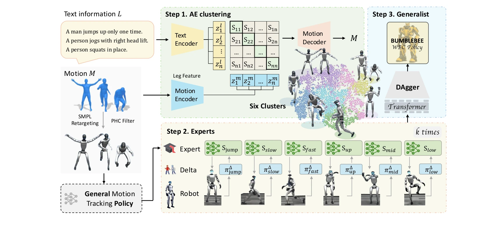
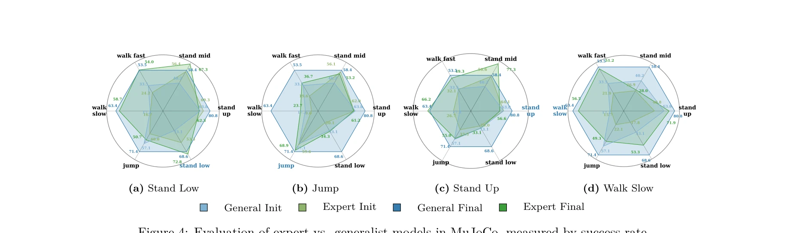

# From Experts to a Generalist: Toward General Whole-Body Control for Humanoid Robots

> **저자**: Yuxuan Wang, Ming Yang, Ziluo Ding, Yu Zhang, Weishuai Zeng, Xinrun Xu, Haobin Jiang, Zongqing Lu | **날짜**: 2025-06-15 | **URL**: [https://arxiv.org/abs/2506.12779](https://arxiv.org/abs/2506.12779)

---

## Essence

*Figure 2: Overview of the BumbleBee framework. The left section illustrates the data curation stage, which*

BumbleBee는 모션 클러스터링과 sim-to-real 적응을 결합한 expert-generalist 학습 프레임워크로, 인간형 로봇의 일반적인 전신 제어를 달성한다.

## Motivation

- **Known**: 기존 연구들은 단일 모션 특화 정책 학습에는 뛰어나지만, 서로 다른 모션 간의 제어 요구사항 충돌과 데이터 분포 불일치로 인해 다양한 행동에 걸쳐 일반화하기 어렵다.
- **Gap**: 여러 모션 타입을 하나의 정책으로 통합 학습할 때 gradient 충돌과 데이터 분포 불일치가 발생하며, 이를 효과적으로 해결하는 구조화된 접근법이 부족하다.
- **Why**: 인간형 로봇이 실제 환경에서 다양한 작업을 수행하려면 여러 모션을 민첩하고 견고하게 제어할 수 있어야 하며, 이는 로봇 자동화의 실용성을 크게 향상시킨다.
- **Approach**: Autoencoder 기반 클러스터링으로 모션을 행동적으로 유사한 그룹으로 분할한 후, 각 클러스터에서 expert 정책을 학습하고, delta action 모델링을 통해 sim-to-real 갭을 해소한 뒤, 모든 expert를 하나의 generalist 정책으로 증류한다.

## Achievement

*Figure 4: Evaluation of expert vs. generalist models in MuJoCo, measured by success rate.*

- **Expert-Generalist 파이프라인**: 모션 클러스터링을 통해 diverse 모션 간의 충돌을 완화하고 각 타입에 특화된 expert 정책을 효과적으로 학습
- **자동 회귀 클러스터링 방법**: leg 특화 kinematic feature와 텍스트 설명을 모두 활용하는 autoencoder 기반 클러스터링으로 의미론적 및 운동학적 정렬 달성
- **Sim-to-real 적응**: 클러스터별 delta action 모델을 통해 simulation과 현실 간의 discrepancy를 보상하는 iterative 정제 방식 제안
- **실제 성능 입증**: 두 개의 시뮬레이터와 실제 인간형 로봇에서 state-of-the-art 전신 제어 성능 달성, 장시간 연속 동작(총 135초) 추적 성공

## How

*Figure 2: Overview of the BumbleBee framework. The left section illustrates the data curation stage, which*

- AMASS 데이터셋에서 SMPL 형식의 인간 모션을 로봇 특화 표현으로 retarget하고 PHC 필터로 정제
- Forward kinematics를 적용하여 joint 각도를 3D 좌표로 변환하고, foot velocity를 추가로 포함한 kinematic feature 추출
- Motion encoder(kinematic feature)와 text encoder(HumanML3D 주석)를 통해 latent representation을 생성하고 autoencoder로 clustering
- 전체 데이터셋에서 훈련된 일반 tracking policy를 각 클러스터별로 fine-tune하여 expert policy 획득
- 각 expert를 실제 로봇에 배포하여 실세계 궤적 수집 및 cluster별 delta action 모델 훈련
- Delta 모델을 이용한 iterative 정제로 expert 정책들을 개선
- Transformer 기반 아키텍처를 사용하여 모든 expert를 하나의 unified generalist 정책으로 knowledge distillation

## Originality

- Mixture of Experts 개념을 인간형 로봇 전신 제어에 적용한 첫 시도로, expert-generalist 파이프라인의 novel 디자인
- Kinematic feature(특히 leg 정보)와 텍스트 semantic을 함께 활용하는 hybrid clustering 방식의 독창성
- 클러스터별 delta action 모델링을 통한 targeted sim-to-real 적응 전략의 차별성
- Long-horizon 연속 모션 추적에서의 실제 성공 사례 제시로 practical robustness 입증

## Limitation & Further Study

- 클러스터 수(6개)의 선택이 heuristic하며, elbow method 기반 선택이 최적성을 보장하지 않음 - 자동 클러스터 수 결정 방법 연구 필요
- Delta action 모델이 각 클러스터별로 학습되므로 새로운 모션 타입에 대한 적응 성능이 제한될 수 있음 - zero-shot generalization 능력 향상 필요
- 실제 로봇 실험이 단일 플랫폼에서만 수행되어 다른 인간형 로봇 구조로의 일반화 가능성 미검증
- 텍스트 주석 의존성으로 인해 주석이 없는 데이터셋에 대한 applicability 제한 - fully unsupervised clustering 방법 연구

## Evaluation

- Novelty: 4/5
- Technical Soundness: 4/5
- Significance: 4/5
- Clarity: 4/5
- Overall: 4/5

**총평**: BumbleBee는 expert-generalist 프레임워크를 통해 인간형 로봇의 다양한 모션 학습 시 발생하는 근본적인 문제를 창의적으로 해결하며, hybrid clustering과 cluster별 sim-to-real 적응 등의 기술적 기여와 실제 로봇에서의 성공적인 구현으로 로봇 제어 분야에 유의미한 기여를 한다.

## Related Papers

- 🔄 다른 접근: [[papers/1475_Humanoid_Whole-Body_Locomotion_on_Narrow_Terrain_via_Dynamic/review]] — MetaMorph의 universal transformer controller가 BumbleBee의 expert-generalist framework와 다른 방식으로 일반화를 달성한다.
- 🔗 후속 연구: [[papers/1413_GBC_Generalized_Behavior-Cloning_Framework_for_Whole-Body_Hu/review]] — GBC의 generalized behavior-cloning이 BumbleBee의 expert-generalist learning을 더 일반적인 whole-body control로 확장한다.
- 🏛 기반 연구: [[papers/1425_Human2Robot_Learning_Robot_Actions_from_Paired_Human-Robot_V/review]] — General motion tracking for humanoid이 BumbleBee의 whole-body control 달성에 필요한 기술적 기반을 제공한다.
- 🏛 기반 연구: [[papers/1593_OmniH2O_Universal_and_Dexterous_Human-to-Humanoid_Whole-Body/review]] — 다양한 입력을 통합하는 OmniH2O의 일반화된 접근법이 전신 제어를 위한 전문가-일반가 프레임워크의 기반이 된다.
- 🏛 기반 연구: [[papers/1456_HOVER_Versatile_Neural_Whole-Body_Controller_for_Humanoid_Ro/review]] — HOVER의 통합 전신 제어기는 experts에서 generalist로의 발전 과정에서 중요한 기반이 된다.
