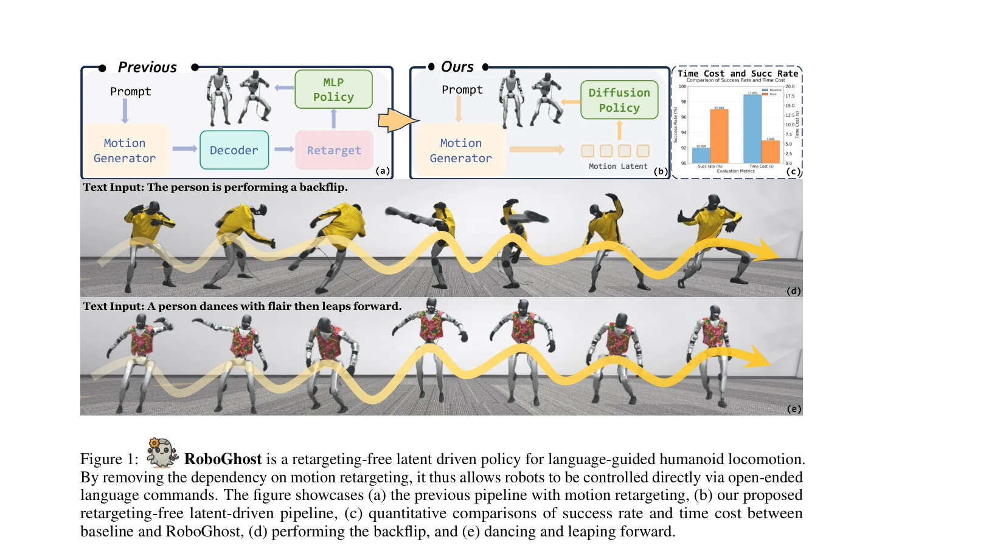

# From Language to Locomotion: Retargeting-free Humanoid Control via Motion Latent Guidance

> **저자**: Zhe Li, Cheng Chi, Yangyang Wei, Boan Zhu, Yibo Peng, Tao Huang, Pengwei Wang, Zhongyuan Wang, Shanghang Zhang, Chang Xu | **날짜**: 2025-10-17 | **DOI**: [10.48550/arXiv.2510.14952](https://doi.org/10.48550/arXiv.2510.14952)

---

## Essence

*Figure 2: Overview of RoboGhost. We propose a two-stage approach: a motion latent is first generated, then a*

RoboGhost는 언어-기반 인형로봇 제어를 위해 motion latent를 직접 사용하는 retargeting-free 프레임워크로, 기존의 motion decoding-retargeting-tracking 파이프라인을 제거하여 지연 시간을 단축하고 제어 정확도를 향상시킨다.

## Motivation

- **Known**: 기존 언어-기반 인형로봇 제어는 human motion decoding, robot morphology로의 retargeting, physics-based controller를 통한 tracking의 세 단계 파이프라인을 사용해왔으며, 최근에는 text-to-motion 생성 모델과 diffusion model 기반의 policy learning 기법들이 발전하고 있다.
- **Gap**: 기존 파이프라인은 누적 오류, 높은 지연 시간, 약한 semantic-control 결합이라는 한계가 있으며, motion retargeting이 병목이 되어 실시간 제어와 높은 충실도를 동시에 달성하기 어렵다.
- **Why**: 자연언어는 인형로봇 제어의 직관적 인터페이스이며, 실시간 반응성과 높은 제어 정확도를 갖춘 언어-기반 인형로봇 시스템은 로봇 자동화와 인간-로봇 상호작용 분야에서 매우 중요하다.
- **Approach**: Motion latent를 첫 번째 조건 신호로 취급하여 diffusion-based humanoid policy를 직접 조건화하며, hybrid causal transformer-diffusion motion generator를 통해 장기간 일관성과 안정성을 보장한다. 또한 MoE-기반 teacher policy와 latent-driven diffusion student policy를 결합하여 일반화 능력을 향상시킨다.

## Achievement

*Figure 1:*

- **배포 지연 시간 단축**: 기존 파이프라인의 17.85초에서 5.84초로 약 67% 감소
- **성공률 및 추적 정확도 개선**: 기존 방법 대비 5% 높은 성공률과 감소된 tracking error 달성
- **Retargeting-free 아키텍처**: motion decoding과 retargeting 단계 제거로 누적 오류 감소 및 semantic intent 보존
- **다중 모달리티 확장성**: 텍스트 외에 이미지, 오디오, 음악 등 다양한 입력 모달리티 지원 가능
- **실제 로봇 검증**: Unitree G1 등 실제 인형로봇에서 smooth하고 semantically aligned locomotion 달성

## How

*Figure 2: Overview of RoboGhost. We propose a two-stage approach: a motion latent is first generated, then a*

- **Motion Generator**: continuous autoregressive framework와 causal autoencoder를 결합하여 text input으로부터 compact latent motion representation lref 생성
- **Hybrid Transformer-Diffusion Architecture**: causal transformer로 장기간 의존성 캡처 및 전역 일관성 보장, diffusion component로 안정성과 확률성 확보
- **MoE-based Teacher Policy**: retargeted dataset으로 강화학습 수행하여 다양한 task에 대한 일반화 능력 확보
- **Latent-driven Diffusion Student Policy**: motion latent 조건 하에서 noise로부터 직접 executable action denoise, DDIM-accelerated sampling으로 실시간 배포 가능
- **Causal Adaptive Sampling**: temporal coherence 유지와 정보 손실 방지를 위한 적응형 샘플링 전략 적용

## Originality

- Motion latent를 first-class conditioning signal로 취급하는 새로운 개념적 접근으로 기존 motion tracking 패러다임 전환
- 인형로봇 제어 분야에서 처음으로 diffusion-based policy를 motion latent로 조건화하는 기술 도입
- Transformer와 diffusion의 장점을 결합한 hybrid architecture로 temporal coherence와 stochastic stability 동시 달성
- Retargeting-free 설계로 모프로지 의존성 제거 및 다양한 로봇 플랫폼으로의 일반화 가능성 제시

## Limitation & Further Study

- **모션 분포 제한**: continuous autoregressive 기반 generator가 extreme한 동작(예: 복잡한 파쿠르)에 대해 제약이 있을 수 있음
- **Latent space 해석성**: motion latent의 내부 표현 구조가 불명확하여 디버깅 및 제어 미세조정이 어려울 수 있음
- **실시간 성능 한계**: DDIM sampling 가속화에도 불구하고 모바일 로봇이나 극도로 빠른 반응이 필요한 환경에서의 성능 미검증
- **다중 모달리티 통합 상세성 부족**: 이미지, 오디오, 음악 확장에 대한 구체적 구현 및 성능 평가 부재
- **후속 연구**: (1) 더 복잡한 인간 동작에 대한 생성 및 실행 능력 확대, (2) 실시간 온라인 학습 기능 추가, (3) 다양한 로봇 플랫폼과 환경에서의 robust 일반화 검증

## Evaluation

- Novelty: 4/5
- Technical Soundness: 3/5
- Significance: 4/5
- Clarity: 4/5
- Overall: 4/5

**총평**: RoboGhost는 언어-기반 인형로봇 제어의 근본적인 파이프라인 개선을 제시하며, retargeting-free 설계와 diffusion policy의 결합으로 실질적인 배포 효율성과 제어 정확도를 동시에 달성한 혁신적인 연구이다. 다중 모달리티 확장성과 실제 로봇 검증으로 실용적 가치도 입증되었으나, 극단적 동작 생성과 세부 실시간 성능 평가 측면에서 추가 개선이 필요하다.

## Related Papers

- 🔗 후속 연구: [[papers/1314_Commanding_Humanoid_by_Free-form_Language_A_Large_Language_A/review]] — RoboGhost의 retargeting-free 접근법이 Humanoid-LLA의 언어-행동 매핑을 motion latent 공간에서 더욱 직접적으로 구현한다
- 🔄 다른 접근: [[papers/1407_FRoM-W1_Towards_General_Humanoid_Whole-Body_Control_with_Lan/review]] — RoboGhost와 FRoM-W1은 언어 기반 휴머노이드 제어에서 motion latent 직접 활용 vs 단계별 프레임워크라는 서로 다른 설계 철학을 보여준다
- ⚖️ 반론/비판: [[papers/1415_General_Motion_Tracking_for_Humanoid_Whole-Body_Control/review]] — RoboGhost의 retargeting-free 접근법이 기존 motion retargeting의 한계를 지적하며, GMR이 해결하려는 문제의 근본적 해결책을 제시한다
- 🔗 후속 연구: [[papers/1314_Commanding_Humanoid_by_Free-form_Language_A_Large_Language_A/review]] — RoboGhost의 retargeting-free 접근법이 Humanoid-LLA의 언어-행동 매핑을 더욱 직접적이고 효율적으로 구현한다
- ⚖️ 반론/비판: [[papers/1415_General_Motion_Tracking_for_Humanoid_Whole-Body_Control/review]] — GMR의 motion retargeting 품질 개선 접근법이 RoboGhost의 retargeting-free 철학과 대비되어, 동작 변환의 두 가지 패러다임을 비교할 수 있다
