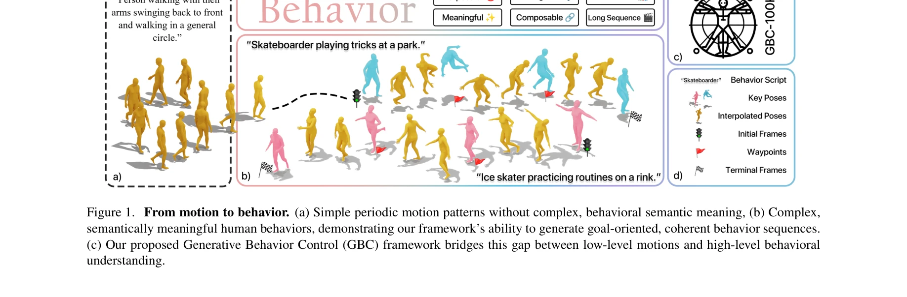
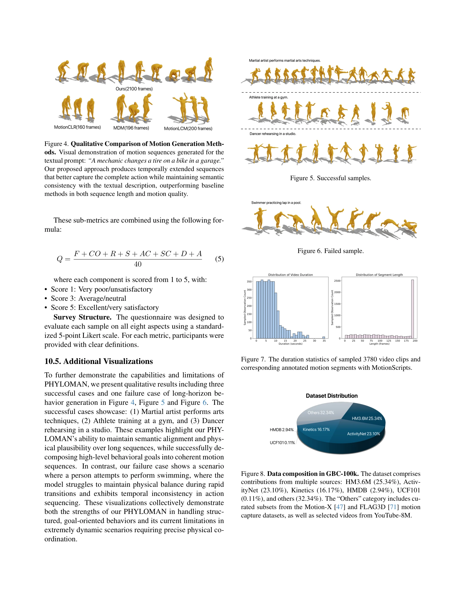
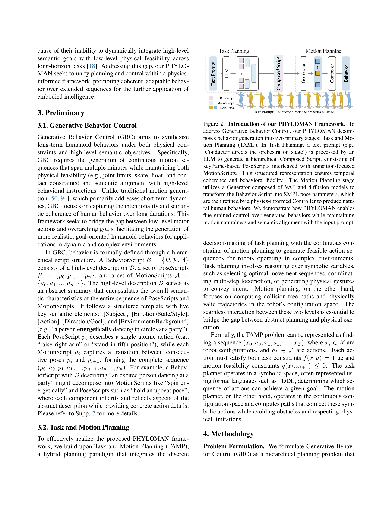

# From Motion to Behavior: Hierarchical Modeling of Humanoid Generative Behavior Control

> **저자**: Jusheng Zhang, Jinzhou Tang, Sidi Liu, Mingyan Li, Sheng Zhang, Jian Wang, Keze Wang | **날짜**: 2025-05-28 | **URL**: [https://arxiv.org/abs/2506.00043](https://arxiv.org/abs/2506.00043)

---

## Essence

*Figure 1. From motion to behavior. (a) Simple periodic motion patterns without complex, behavioral semantic meaning, (b)*

인간의 행동을 계층적으로 모델링하는 Generative Behavior Control (GBC) 프레임워크를 제안하며, LLM 기반 행동 계획과 physics-informed 모션 제어를 결합하여 기존 방법 대비 10배 더 긴 시퀀스의 의미론적으로 일관된 인간 행동을 생성한다.

## Motivation

- **Known**: 기존 인간 모션 생성 연구는 단기 저수준 모션 합성 또는 고수준 행동 계획 중 하나에만 집중했으며, 3D pose estimation, motion generation, physics-informed control 등의 기술들은 개별적으로 발전했다.
- **Gap**: 시간적 일관성 유지, 물리적 타당성 보장, 고수준 목표와 저수준 행동 간의 의미론적 간격을 동시에 해결하는 통합 프레임워크와 계층적 행동 계획이 주석된 벤치마크가 부재하다.
- **Why**: 일상 환경에서 실시간 로봇 제어, 인간-컴퓨터 상호작용, 영상 이해 등 실제 응용 시스템에서 장시간에 걸쳐 물리적으로 타당하면서 의미론적으로 일관된 행동 생성이 필수적이다.
- **Approach**: LLM으로 고수준 행동 계획을 생성하고, Task and Motion Planning (TAMP) 프레임워크와 결합하여 저수준 모션으로 분해한 후, physics-informed refinement를 통해 장시간 시퀀스의 물리적 현실성을 보장하는 hierarchical 구조를 제안한다.

## Achievement

*Figure 4. Qualitative Comparison of Motion Generation Meth-*

- **GBC-100K 데이터셋**: 약 100K개의 video-SMPL 쌍으로 구성되며, 계층적 텍스트 주석(고수준 목표, 의미 계획, 모션 계획)을 포함하여 기존 벤치마크의 한계를 극복한다.
- **PHYLOMAN 프레임워크**: LLM 기반 계획, parallel motion generation pipeline, physics-informed refinement를 통합하여 기존 방법 대비 10배 더 긴 의미론적으로 일관되고 물리적으로 타당한 행동 시퀀스를 생성한다.
- **성능 개선**: GBC-100K와 HumanML3D에서의 실험을 통해 시간적 안정성, 행동 충실도, 물리적 일관성에서 state-of-the-art 방법들을 크게 상회함을 입증한다.

## How

*Figure 2. Introduction of our PHYLOMAN Framework. To*

- LLM을 활용한 계층적 계획 분해: 고수준 행동 지시를 PoseScripts와 MotionScripts를 통해 실행 가능한 모션 시퀀스로 체계적으로 분해
- Parallel motion generation pipeline: 여러 의미론적으로 정렬된 움직임을 동시에 합성하여 시간적 일관성 유지
- Physics-informed refinement mechanism: 시뮬레이터 기반 제어 정책을 적용하여 장시간 시퀀스 전반에 걸쳐 물리적 현실성 보장
- Multi-level 텍스트 주석: 고수준 목표(goal), 중간 수준 의미 계획(semantic plan), 저수준 모션 계획(motion plan)의 3단계 계층 구조로 데이터 주석

## Originality

- **Motion에서 Behavior로의 패러다임 전환**: 기존의 단순 모션 생성을 넘어 목표 지향적이고 의도를 포함한 행동 모델링으로 전환
- **LLM과 TAMP의 혁신적 결합**: 인지과학 기반의 계층적 행동 분해와 로보틱스의 물리 제약 보장을 통합
- **계층적 멀티모달 데이터셋**: 비디오, SMPL, 계층적 텍스트 주석을 동시에 제공하는 대규모 데이터셋의 최초 구성
- **10배 확장된 시퀀스 길이**: 기존 방법들의 한계를 크게 뛰어넘는 장시간 일관된 행동 생성 성능 달성

## Limitation & Further Study

- **환경 상호작용 제한**: 현재 프레임워크는 개인 행동(individual behavior)에 집중하며, 객체 조작이나 다인 상호작용 같은 복잡한 환경 상호작용은 향후 연구 필요
- **LLM 의존성**: LLM의 생성 오류가 행동 계획 품질에 직접 영향을 미치므로, LLM의 신뢰성 향상과 오류 복구 메커니즘 필요
- **데이터셋 다양성**: 특정 환경(실내, 실외)과 문화적 차이가 충분히 반영되지 않았으므로, 더 광범위한 데이터 수집 필요
- **실시간 성능**: 물리 시뮬레이션 기반 refinement의 계산 비용으로 인한 실시간 응용 제약, 효율성 개선 필요

## Evaluation

- Novelty: 4/5
- Technical Soundness: 4/5
- Significance: 4/5
- Clarity: 4/5
- Overall: 4/5

**총평**: 본 논문은 인간 행동 모델링을 motion generation에서 behavior modeling으로 격상시키는 혁신적 접근을 제시하며, 계층적 계획-모션 분해, LLM-로보틱스 통합, 대규모 멀티모달 데이터셋을 통해 10배 확장된 시퀀스 생성을 실현했다. 기술적 완성도와 실제 응용 가치가 우수하나, 환경 상호작용 확장과 실시간 성능 개선이 향후 과제로 남아있다.

## Related Papers

- 🔗 후속 연구: [[papers/1407_FRoM-W1_Towards_General_Humanoid_Whole-Body_Control_with_Lan/review]] — GBC의 계층적 행동 모델링이 FRoM-W1의 휴머노이드 전신 제어를 더 긴 시퀀스와 의미론적 일관성을 갖도록 확장한다
- 🏛 기반 연구: [[papers/1439_IPR-1_Interactive_Physical_Reasoner/review]] — HARMON의 자연언어 기반 동작 생성 방법론이 GBC의 LLM 기반 행동 계획 단계에 필요한 기반 기술을 제공한다
- 🔄 다른 접근: [[papers/1490_HYPERmotion_Learning_Hybrid_Behavior_Planning_for_Autonomous/review]] — GBC와 HYPERmotion 모두 휴머노이드의 복잡한 행동 계획을 다루지만, 계층적 모델링 vs 하이브리드 계획이라는 서로 다른 접근법을 사용한다
- 🔗 후속 연구: [[papers/1439_IPR-1_Interactive_Physical_Reasoner/review]] — HARMON의 자연언어 기반 휴머노이드 동작 생성이 GBC의 계층적 행동 모델링에서 언어-동작 매핑 부분의 구체적인 구현 방법을 제공한다
- 🏛 기반 연구: [[papers/1407_FRoM-W1_Towards_General_Humanoid_Whole-Body_Control_with_Lan/review]] — FRoM-W1의 H-GPT와 H-ACT 단계별 접근법이 GBC의 더 복잡한 계층적 행동 모델링에 기본적인 구조적 기반을 제공한다
- 🔄 다른 접근: [[papers/1490_HYPERmotion_Learning_Hybrid_Behavior_Planning_for_Autonomous/review]] — HYPERmotion과 GBC 모두 휴머노이드의 복잡한 작업 수행을 다루지만, 하이브리드 계획 vs 계층적 모델링이라는 서로 다른 아키텍처 접근법을 사용한다
