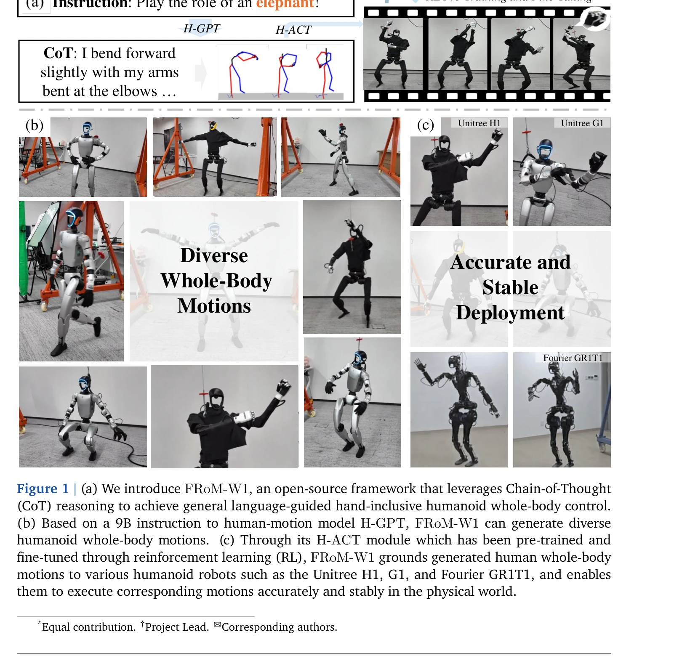
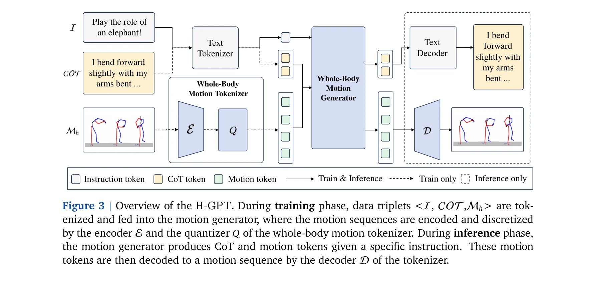

# FRoM-W1: Towards General Humanoid Whole-Body Control with Language Instructions

> **저자**: Peng Li, Zihan Zhuang, Yangfan Gao, Yi Dong, Sixian Li, Changhao Jiang, Shihan Dou, Zhiheng Xi, Enyu Zhou, Jixuan Huang, Hui Li, Jingjing Gong, Xingjun Ma, Tao Gui, Zuxuan Wu, Qi Zhang, Xuanjing Huang, Yu-Gang Jiang, Xipeng Qiu | **날짜**: 2026-01-19 | **DOI**: [10.48550/arXiv.2601.12799](https://doi.org/10.48550/arXiv.2601.12799)

---

## Essence

*Figure 2 | The inference pipeline of FRoM-W1. (a) H-GPT first translates language instructions*

FRoM-W1은 자연어 지시를 통해 휴머노이드 로봇의 전신 동작을 제어하는 오픈소스 프레임워크로, H-GPT를 이용한 인간 동작 생성과 H-ACT를 이용한 실제 로봇 배포의 두 단계로 구성된다.

## Motivation

- **Known**: 휴머노이드 로봇은 인상적인 동작을 수행할 수 있지만 대부분 하드코딩되거나 태스크별로 학습되어 다재다능성이 제한된다. 대규모 언어 모델과 모션 생성 기술이 발전하고 있다.
- **Gap**: 대규모의 자연어-휴머노이드 동작 쌍 데이터셋이 부족하고, 생성된 동작을 실제 물리 환경에서 안정적으로 실행하기 어렵다.
- **Why**: 자연어를 통한 휴머노이드 로봇 제어는 인간-로봇 상호작용을 가능하게 하며, 로봇의 자율성과 적응성을 크게 향상시킨다.
- **Approach**: 인간 모션 데이터의 풍부함을 활용하여 H-GPT로 전신 인간 동작을 생성하고, Chain-of-Thought를 통해 언어 이해를 강화한 후, H-ACT에서 인간 동작을 로봇별로 retarget하고 RL을 통해 안정적인 실행을 보장한다.

## Achievement

*Figure 1 | (a) We introduce FRoM-W1, an open-source framework that leverages Chain-of-Thought*

- **H-GPT 모델**: 9B 규모의 모델로 자연어 지시로부터 고품질의 전신 인간 동작 생성, CoT 기술 적용으로 다양한 명령 이해 능력 확보
- **H-ACT 모듈**: 인간-휴머노이드 동작 retargeting과 배포를 위한 통합 모듈로, RL 사전학습 및 미세조정을 통해 정확하고 안정적인 동작 추적
- **벤치마크 성능**: HumanML3D-X에서 기존 T2M-GPT 대비 FID 지표 2.5배 개선, MPJPE 15% 향상
- **완전 오픈소스화**: 모델 코드, 체크포인트, 평가 벤치마크, 배포 모듈 전체 공개

## How

*Figure 3 | Overview of the H-GPT. During training phase, data triplets <I, COT,Mℎ> are tok-*

- VQ-VAE를 사용하여 인간 전신 동작 시퀀스를 토큰으로 변환
- LLaMA-3.1 기반 H-GPT 모델 훈련으로 자연어-동작 생성 매핑 학습
- Chain-of-Thought 기술로 추상적 지시를 구체적 동작 프리미티브로 분해
- SMPL-X 인간 동작을 각 로봇 플랫폼의 형태에 맞게 retarget
- IsaacGym 시뮬레이션 환경에서 전신 휴머노이드 컨트롤러를 RL로 사전학습
- 추론 단계에서 RL 미세조정(RFT)으로 동작 추적 정확도 및 안정성 향상
- 모듈식 배포 인터페이스를 통해 실제 로봇(Unitree H1, G1 등)에 배포

## Originality

- 인간 데이터의 풍부함을 활용하여 로봇 데이터 부족 문제 해결하는 창의적 접근
- Chain-of-Thought를 동작 생성에 처음 적용하여 명령 이해의 일반화 능력 강화
- RL 사전학습과 추론 중 미세조정의 이단계 전략으로 현실적 안정성 확보
- 인간 뇌의 대뇌/소뇌 역할 비유를 통한 아키텍처 설계 영감

## Limitation & Further Study

- 평가가 주로 Unitree H1/G1에 집중되어 다양한 로봇 플랫폼에서의 일반화 능력 검증 부족
- retargeting 과정에서 인간-로봇 형태 차이(손가락 개수 등)로 인한 정보 손실 가능성
- 복잡한 동역학 상황이나 환경 상호작용을 포함한 평가 미흡
- CoT 적용의 효과를 정량적으로 분리하여 분석한 ablation study 제한적
- 실시간 성능, 계산 비용, 배포 시간 등에 대한 상세 분석 부족
- 후속 연구로 다양한 로봇 형태에 대한 범용 컨트롤러 개발과 환경 상호작용 능력 추가 필요

## Evaluation

- Novelty: 4/5
- Technical Soundness: 4/5
- Significance: 4/5
- Clarity: 4/5
- Overall: 4/5

**총평**: FRoM-W1은 자연어 기반 휴머노이드 로봇 전신 제어라는 도전적 문제를 체계적으로 해결하는 종합적 프레임워크로, 뛰어난 기술적 구현과 광범위한 오픈소스 공개를 통해 휴머노이드 지능 개발을 크게 앞당길 것으로 기대된다.

## Related Papers

- 🔄 다른 접근: [[papers/1314_Commanding_Humanoid_by_Free-form_Language_A_Large_Language_A/review]] — FRoM-W1과 Humanoid-LLA는 자연어 지시 기반 휴머노이드 전신 제어에서 단계별 프레임워크 vs 통합 언어-행동 모델이라는 서로 다른 아키텍처를 제시한다
- 🏛 기반 연구: [[papers/1406_From_Motion_to_Behavior_Hierarchical_Modeling_of_Humanoid_Ge/review]] — FRoM-W1의 H-GPT와 H-ACT 단계별 접근법이 GBC의 더 복잡한 계층적 행동 모델링에 기본적인 구조적 기반을 제공한다
- 🔗 후속 연구: [[papers/1426_HumanPlus_Humanoid_Shadowing_and_Imitation_from_Humans/review]] — HumanPlus의 인간 모방 학습이 FRoM-W1의 휴머노이드 제어 프레임워크를 실제 인간 데이터로부터 학습하는 방향으로 확장한다
- 🔄 다른 접근: [[papers/1314_Commanding_Humanoid_by_Free-form_Language_A_Large_Language_A/review]] — FRoM-W1과 함께 자연어 지시 기반 휴머노이드 전신 제어의 두 가지 접근법으로, 통합 모션 어휘 vs 단계별 프레임워크를 비교할 수 있다
- 🏛 기반 연구: [[papers/1368_EgoDemoGen_Egocentric_Demonstration_Generation_for_Viewpoint/review]] — Genie의 generative interactive environment가 DiWA의 world model 활용 방법론에 이론적 기반을 제공한다.
- 🔗 후속 연구: [[papers/1406_Genie_Envisioner_A_Unified_World_Foundation_Platform_for_Rob/review]] — Genie의 generative interactive environment 개념이 Genie Envisioner의 로봇 조작 특화 플랫폼으로 확장된다.
- 🏛 기반 연구: [[papers/1442_JARVIS-1_Open-World_Multi-task_Agents_with_Memory-Augmented/review]] — 생성형 상호작용 환경이 멀티태스크 에이전트의 훈련과 평가를 위한 기반을 제공합니다.
- 🔄 다른 접근: [[papers/1626_WHALE_Towards_Generalizable_and_Scalable_World_Models_for_Em/review]] — 생성형 인터랙티브 환경과 행동 조건화 월드 모델이 환경 모델링에서 서로 다른 접근 방식을 제시합니다.
- 🔗 후속 연구: [[papers/1631_World_Models/review]] — World Models의 imagination-based learning이 Genie의 generative interactive environment와 결합되어 더 포괄적인 시뮬레이션 환경을 구축할 수 있음
- 🔄 다른 접근: [[papers/1632_World_Simulation_with_Video_Foundation_Models_for_Physical_A/review]] — 둘 다 생성형 환경 모델이지만 Genie는 게임 환경, Cosmos는 물리 AI용 실세계 시뮬레이션에 특화됐다
- 🏛 기반 연구: [[papers/1347_D2E_Scaling_Vision-Action_Pretraining_on_Desktop_Data_for_Tr/review]] — Genie는 D2E의 게임 환경 데이터 활용에 대한 생성형 상호작용 환경의 이론적 기반을 제공한다
- 🔄 다른 접근: [[papers/1405_From_Language_to_Locomotion_Retargeting-free_Humanoid_Contro/review]] — RoboGhost와 FRoM-W1은 언어 기반 휴머노이드 제어에서 motion latent 직접 활용 vs 단계별 프레임워크라는 서로 다른 설계 철학을 보여준다
- 🔗 후속 연구: [[papers/1406_From_Motion_to_Behavior_Hierarchical_Modeling_of_Humanoid_Ge/review]] — GBC의 계층적 행동 모델링이 FRoM-W1의 휴머노이드 전신 제어를 더 긴 시퀀스와 의미론적 일관성을 갖도록 확장한다
