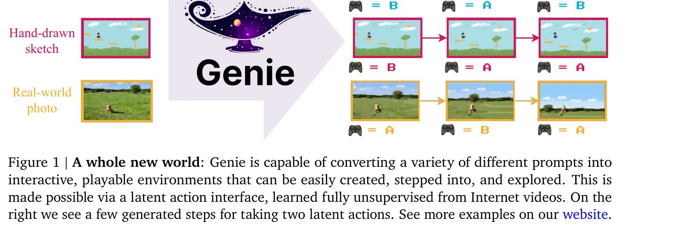
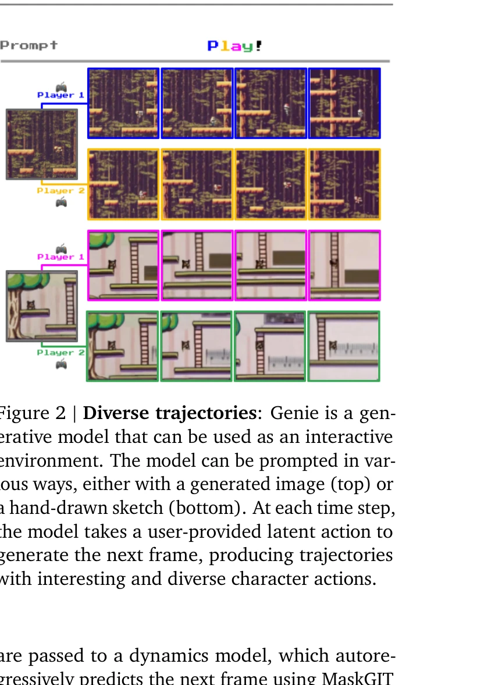
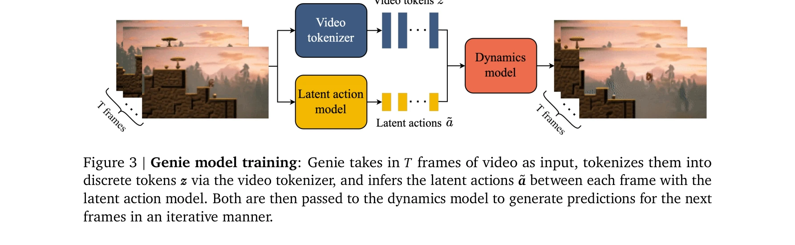

# Genie: Generative Interactive Environments

> **저자**: Jake Bruce, Michael Dennis, Ashley Edwards, Jack Parker-Holder, Yuge Shi, Edward Hughes, Matthew Lai, Aditi Mavalankar, Richie Steigerwald, Chris Apps, Yusuf Aytar, Sarah Bechtle, Feryal Behbahani, Stephanie Chan, Nicolas Heess, Lucy Gonzalez, Simon Osindero, Sherjil Ozair, Scott Reed, Jingwei Zhang, Konrad Zolna, Jeff Clune, Nando de Freitas, Satinder Singh, Tim Rocktäschel | **날짜**: 2024-02-23 | **URL**: [https://arxiv.org/abs/2402.15391](https://arxiv.org/abs/2402.15391)

---

## Essence

*Figure 1 | A whole new world: Genie is capable of converting a variety of different prompts into*

Genie는 인터넷 비디오로부터 완전히 비감독 방식으로 학습된 첫 번째 생성형 인터랙티브 환경으로, 텍스트, 이미지, 스케치 등 다양한 프롬프트로부터 프레임 단위로 제어 가능한 가상 세계를 생성할 수 있다.

## Motivation

- **Known**: 생성형 AI는 언어와 이미지 생성에서 큰 성과를 보였으며, 최근 비디오 생성 모델도 스케일에 따라 성능이 향상되는 경향을 보이고 있다.
- **Gap**: 기존 비디오 생성 모델은 상호작용성이 부족하며, 인터랙티브 환경을 만들기 위해서는 보통 행동 레이블이나 도메인 특화 데이터가 필요하다.
- **Why**: 프롬프트에서 생성된 상호작용 가능한 환경은 몰입적 경험을 제공하며, 행동 레이블 없이 학습된 잠재 행동 공간은 미래의 일반화된 에이전트 훈련을 위한 무한한 데이터를 제공할 수 있다.
- **Approach**: Genie는 시공간 비디오 토크나이저, 자기회귀 동역학 모델, 간단하고 확장 가능한 잠재 행동 모델로 구성되며, 200,000시간 이상의 인터넷 게임 영상에서 완전 비감독으로 훈련된다.

## Achievement

*Figure 2 | Diverse trajectories: Genie is a gen-*

- **첫 번째 비감독 인터랙티브 환경 생성**: 행동 레이블이나 도메인 특화 데이터 없이 프레임 단위 제어 가능성을 달성
- **다양한 프롬프트 지원**: 텍스트, 합성 이미지, 실제 사진, 손 그림 스케치 등 여러 형식의 입력으로 제어 가능
- **Foundation Model 수준의 규모**: 11B 파라미터 모델로 미학습 이미지 프롬프트로도 완전히 새로운 상상의 가상 세계 생성 가능
- **확장성 검증**: 40M에서 2.7B 파라미터까지의 엄격한 스케일링 분석으로 아키텍처의 우아한 확장성 증명
- **행동 임의화 학습 가능성**: 학습된 잠재 행동 공간으로 미학습 액션 프리 영상에서 정책 추론 가능

## How

*Figure 3 | Genie model training: Genie takes in 𝑇frames of video as input, tokenizes them into*

- **ST-transformer 아키텍처**: 메모리 효율적인 interleaved spatial-temporal attention으로 O(10^4) 토큰 처리
- **Latent Action Model (LAM)**: VQ-VAE 기반 목적함수로 비감독 방식에서 행동 인코딩, 이산 codebook으로 어휘 크기 제한 (|A|=8)
- **Video Tokenizer**: VQ-VAE를 이용한 시공간 압축으로 이산 표현 생성
- **Dynamics Model**: MaskGIT을 사용한 자기회귀 다음 프레임 예측으로 비디오 토큰과 잠재 행동을 조건으로
- **2단계 훈련**: 먼저 비디오 토크나이저 훈련, 그 후 잠재 행동 모델과 동역학 모델의 공동 훈련
- **데이터**: 필터링된 30,000시간의 인터넷 게임플레이 비디오와 RT1 로봇 데이터셋에서 검증

## Originality

- **행동 레이블 없는 학습**: 인터넷 비디오에서 완전 비감독으로 의미 있는 잠재 행동을 학습하는 새로운 방식
- **프레임 수준 제어**: 기존 비디오 생성 모델의 비디오 수준 제어를 넘어 프레임 단위 인터랙션 실현
- **ST-transformer 최적화**: 이산 FFW 배치로 계산 효율성과 모델 용량의 새로운 균형
- **Foundation World Model 개념**: 행동 임의화 가능성으로 다양한 RL 환경에 적용 가능한 일반화된 세계 모델

## Limitation & Further Study

- **도메인 특화성**: 2D 플랫포머 게임과 로봇 도메인 중심으로 훈련되어 3D 환경이나 다른 도메인 일반화 성능 불명확
- **행동 공간 제한**: |A|=8의 이산 행동 어휘는 인터랙션 표현력을 제한하며, 인간 조종성 vs. 세밀한 제어 간의 트레이드오프
- **장기 일관성**: 프레임 단위 자기회귀 생성으로 인한 오류 축적과 장시간 상호작용에서의 시각적 일관성 유지 문제 미분석
- **평가 방식**: 생성된 환경의 상호작용성과 제어성에 대한 정량적 평가 지표 부족, 사용자 연구 데이터 제시 필요
- **후속 연구**: (1) 더 큰 행동 공간과 연속 행동의 효과 분석, (2) 3D 및 다양한 도메인으로의 확장, (3) 실시간 상호작용 성능 최적화

## Evaluation

- Novelty: 4/5
- Technical Soundness: 4/5
- Significance: 4/5
- Clarity: 4/5
- Overall: 4/5

**총평**: Genie는 비감독 행동 학습과 인터랙티브 환경 생성의 새로운 패러다임을 제시하는 매우 혁신적인 연구로, Foundation Model 규모에서 프레임 단위 제어성을 달성하며 미래의 일반화된 에이전트 훈련을 위한 중요한 기초를 마련한다.

## Related Papers

- 🏛 기반 연구: [[papers/1417_GRUtopia_Dream_General_Robots_in_a_City_at_Scale/review]] — Genie의 생성형 인터랙티브 환경이 GRUtopia 대규모 시뮬레이션 도시 구축의 생성 모델 기반
- 🔗 후속 연구: [[papers/1359_DualTHOR_A_Dual-Arm_Humanoid_Simulation_Platform_for_Conting/review]] — 생성형 환경 모델이 DualTHOR와 같은 특화된 시뮬레이션 플랫폼 구축으로 발전
- 🏛 기반 연구: [[papers/1292_A_Comprehensive_Survey_on_World_Models_for_Embodied_AI/review]] — interactive environment 생성의 기초 모델이 world model의 환경 시뮬레이션 능력에 이론적 토대를 제공한다
- 🏛 기반 연구: [[papers/1551_RoboTwin_20_A_Scalable_Data_Generator_and_Benchmark_with_Str/review]] — Genie의 generative interactive environment 개념을 로봇 조작 영역에서 실제 적용 가능한 데이터 생성 시스템으로 구현한다.
- 🔗 후속 연구: [[papers/1417_GRUtopia_Dream_General_Robots_in_a_City_at_Scale/review]] — Genie의 생성형 환경 아이디어가 GRUtopia의 대규모 3D 도시 시뮬레이션으로 구체화
