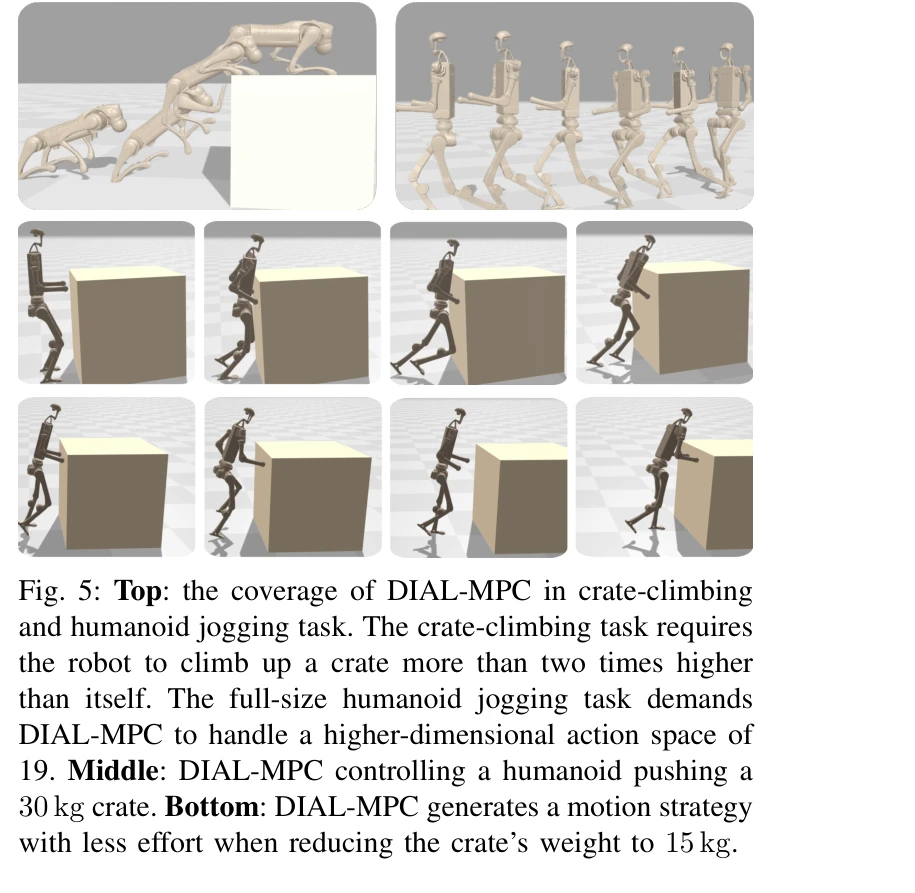

# Full-Order Sampling-Based MPC for Torque-Level Locomotion Control via Diffusion-Style Annealing

> **저자**: Haoru Xue, Chaoyi Pan, Zeji Yi, Guannan Qu, Guanya Shi | **날짜**: 2024-09-23 | **URL**: [https://arxiv.org/abs/2409.15610](https://arxiv.org/abs/2409.15610)

---

## Essence

*Fig. 1: Diffusion-inspired annealing for legged MPC (DIAL-*

DIAL-MPC는 diffusion 프로세스의 iterative refinement 개념을 sampling-based MPC에 적용하여 사족 로봇의 full-order torque-level 제어를 실시간으로 수행할 수 있는 training-free 방법이다.

## Motivation

- **Known**: Sampling-based MPC (예: MPPI)는 비볼록 문제에 유연하게 대응할 수 있으나 고차원 문제에서 높은 분산과 부최적 해를 낸다. NMPC는 full-order 동역학을 다루기 어려워 축약된 모델에 제한된다.
- **Gap**: High-dimensional, contact-rich legged locomotion에서 global coverage와 local convergence를 동시에 달성하는 full-order real-time 최적 제어 방법이 부재하다.
- **Why**: 사족 로봇의 민첩한 제어는 산업 및 탐사 로봇 응용에 필수적이며, training-free 방법은 새로운 작업과 환경에 빠르게 적응할 수 있어 실무적 가치가 크다.
- **Approach**: MPPI와 single-step diffusion의 동치성을 증명한 후, diffusion의 annealing 개념을 sampling-based MPC에 적용하여 trajectory-wise와 action-wise 두 수준의 iterative refinement를 수행한다.

## Achievement

*Fig. 5: Top: the coverage of DIAL-MPC in crate-climbing*

- **Diffusion-MPPI 동치성 증명**: Proposition 1을 통해 MPPI 업데이트가 diffused distribution의 score function으로 표현됨을 보였다.
- **DIAL-MPC 프레임워크 개발**: Bi-level diffusion-inspired annealing 프로세스로 global coverage와 local convergence의 균형을 달성했다.
- **성능 향상**: 표준 MPPI 대비 tracking error 13.4배 감소, 강화학습 정책 대비 어려운 climbing task에서 50% 우수한 성능을 달성했다.
- **Real-world 검증**: 무게를 실은 quadruped jumping 등 정밀한 실시간 50Hz 제어를 실현했다.

## How

*Fig. 4: Coverage and convergence trade-off in sampling-*

- MPPI 업데이트를 convolved target distribution p1의 score function gradient로 재해석하여 diffusion과의 연결 고리를 확립한다.
- Landscape analysis를 통해 diffusion의 annealing이 왜 non-smooth 최적화에 효과적인지 이론적으로 설명한다.
- Sampling variance를 점진적으로 감소시키는 trajectory-wise annealing과 제어 수평선별로 refinement하는 action-wise annealing을 결합한다.
- Isaac Gym 등 병렬화 가능한 시뮬레이터를 활용하여 sampling 비용을 감소시키면서 real-time 성능을 보장한다.

## Originality

- Sampling-based MPC를 diffusion process의 관점에서 재해석한 새로운 이론적 기틀을 제시했다.
- MPPI와 diffusion의 동치성을 수학적으로 증명하고 이를 활용한 annealing 기법은 기존 MPPI의 empirical한 문제를 원칙적으로 해결한다.
- Bi-level (trajectory-wise, action-wise) annealing 구조는 고차원 비볼록 최적화에 대한 창의적인 접근이다.

## Limitation & Further Study

- DIAL-MPC의 계산 비용은 여전히 높으며, real-time 성능은 병렬 시뮬레이터의 성능에 의존한다.
- 이론적 수렴성 보장이 명시적으로 제시되지 않았으며, hyperparameter (온도 λ, annealing schedule 등) 튜닝의 민감성 분석이 부족하다.
- 후속 연구에서는 더 복잡한 contact dynamics (sliding, rolling 등)와 부분 관측 상황에서의 확장이 필요하다.
- 다양한 형태의 legged robot (육족, 이족 등)과 실제 환경 (미끄러운 지면, 동적 장애물 등)에서의 일반화 성능 검증이 필요하다.

## Evaluation

- Novelty: 4/5
- Technical Soundness: 3/5
- Significance: 4/5
- Clarity: 4/5
- Overall: 4/5

**총평**: 본 논문은 diffusion process와 sampling-based MPC의 깊은 연결을 밝히고 이를 기반으로 full-order legged robot 제어를 실시간으로 달성한 혁신적 연구이다. 이론과 실험이 잘 조화되어 있으며, training-free 방법으로서의 실무적 가치가 매우 크다.

## Related Papers

- 🏛 기반 연구: [[papers/1351_DoublyAware_Dual_Planning_and_Policy_Awareness_for_Temporal/review]] — DIAL-MPC의 diffusion 기반 iterative refinement가 DoublyAware의 uncertainty-aware MPC 구현에 필수적인 샘플링 방법론을 제공한다.
- 🔄 다른 접근: [[papers/1322_Cost-Matching_Model_Predictive_Control_for_Efficient_Reinfor/review]] — 둘 다 MPC를 다루지만 DIAL-MPC는 training-free diffusion 기반, Cost-Matching은 효율적 RL 기반 접근을 사용한다.
- 🔗 후속 연구: [[papers/1346_Cross-Platform_Scaling_of_Vision-Language-Action_Models_from/review]] — Diffusion Forcing의 다중 에이전트 상호작용과 DIAL-MPC의 샘플링 방법을 결합하면 복잡한 다중 로봇 제어가 가능하다.
- 🔄 다른 접근: [[papers/1351_DoublyAware_Dual_Planning_and_Policy_Awareness_for_Temporal/review]] — 둘 다 MPC 기반이지만 DoublyAware는 uncertainty 분해에, DIAL-MPC는 diffusion 기반 샘플링에 초점을 맞춘다.
- 🔄 다른 접근: [[papers/1322_Cost-Matching_Model_Predictive_Control_for_Efficient_Reinfor/review]] — 효율적 학습에서 비용 매칭 대신 샘플링 기반 MPC 접근 방식을 제시한다
- 🏛 기반 연구: [[papers/1325_cuRoboV2_Dynamics-Aware_Motion_Generation_with_Depth-Fused_D/review]] — torque-level locomotion control의 기본 동역학 모델링을 제공한다
- 🔄 다른 접근: [[papers/1521_Learning_Differentiable_Reachability_Maps_for_Optimization-b/review]] — 두 논문 모두 휴머노이드 locomotion을 위한 최적화 기반 제어를 다루지만, learned reachability vs full-order sampling이라는 다른 접근법을 사용함
