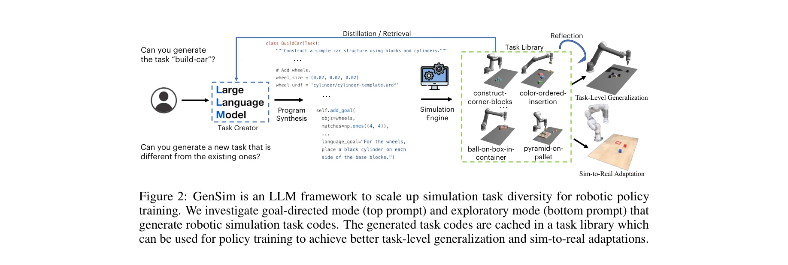
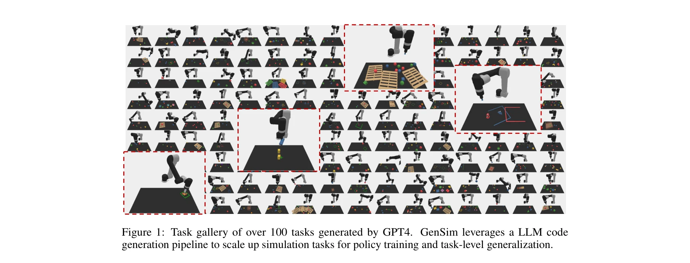
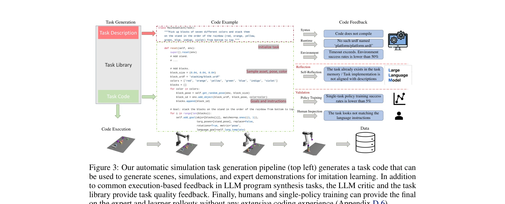

# GenSim: Generating Robotic Simulation Tasks via Large Language Models

> **저자**: Lirui Wang, Yiyang Ling, Zhecheng Yuan, Mohit Shridhar, Chen Bao, Yuzhe Qin, Bailin Wang, Huazhe Xu, Xiaolong Wang | **날짜**: 2023-10-02 | **URL**: [https://arxiv.org/abs/2310.01361](https://arxiv.org/abs/2310.01361)

---

## Essence

*Figure 2: GenSim is an LLM framework to scale up simulation task diversity for robotic policy*

GenSim은 LLM의 코드 생성 능력을 활용하여 로봇 시뮬레이션 작업을 자동으로 생성하는 프레임워크로, 기존 10개의 수작업 작업을 100개 이상으로 확장하여 작업 수준의 일반화를 달성한다.

## Motivation

- **Known**: 시뮬레이션은 로봇 정책 학습을 위한 비용 효율적인 데이터 생성 방법이지만, 기존 방법들은 장면 수준의 다양성(객체 인스턴스, 포즈)에만 집중하여 작업 수준의 일반화가 어렵다.
- **Gap**: 새로운 작업을 설계하고 검증하는 인간의 노력이 필요하여 작업 수준의 다양성을 확보하기 어렵고, 이로 인해 생성된 정책의 작업 수준 일반화 능력이 제한된다.
- **Why**: 작업 수준 다양성이 풍부한 시뮬레이션 데이터는 로봇 정책의 일반화 능력을 크게 향상시킬 수 있으며, 이는 실세계 적용 시 sim-to-real 전이 성능을 개선하여 로봇 정책의 실용성을 높인다.
- **Approach**: LLM의 추론 및 코드 생성 능력을 활용하여 task creator가 자연어 지시와 코드를 생성하고, task library를 통해 고품질 작업을 캐싱하며, 생성된 작업으로 다중작업 정책을 학습한다.

## Achievement

*Figure 1: Task gallery of over 100 tasks generated by GPT4. GenSim leverages a LLM code*

- **대규모 작업 생성**: GPT4를 사용하여 기존 10개의 수작업 작업을 100개 이상으로 10배 확장하고, goal-directed와 exploratory 두 가지 생성 모드 제시
- **LLM 벤치마킹**: GPT-3.5, GPT-4, Code-Llama 등 최신 LLM들의 로봇 시뮬레이션 작업 생성 능력을 평가하고, task library 기반 finetuning으로 성능 개선
- **정책 학습 개선**: 생성된 작업으로 학습한 다중작업 정책이 인도메인 일반화 50% 개선, 미지 작업으로의 zero-shot 전이 40% 달성
- **Sim-to-real 전이**: 최소한의 sim-to-real 적응으로 생성된 작업 기반 정책이 실제 환경에서 미지 장기 작업에 대해 25% 성능 향상

## How

*Figure 3: Our automatic simulation task generation pipeline (top left) generates a task code that can*

- Task creator 모듈이 자연어 처리를 통해 작업 설명 생성 후 코드 구현을 수행
- Few-shot prompting으로 task library에서 참조 작업과 코드를 검색하여 구현 가이드 제공
- 생성된 코드에 대해 syntax 검사, runtime 검증, 환경 실행 성공률 확인, policy training을 통한 달성 가능성 검증, 인간 검사 등 5단계 피드백 루프 운영
- Goal-directed 모드에서는 목표 작업을 입력받아 task curriculum 제안하는 하향식 접근
- Exploratory 모드에서는 기존 작업에서 부트스트랩하여 반복적으로 새로운 작업을 제안하는 상향식 접근
- 생성된 작업으로 language-conditioned multitask policy를 supervised finetuning하여 정책의 작업 수준 일반화 능력 향상

## Originality

- LLM의 코드 생성 능력을 로봇 시뮬레이션 작업 자동 생성에 처음으로 체계적으로 적용하여 작업 수준 다양성 확보
- Goal-directed와 exploratory 두 가지 비대칭적 생성 모드를 제안하여 특정 목표 달성과 탐색적 학습을 동시에 지원
- Task library 기반의 검색-증강 생성(retrieval-augmented generation) 방식으로 LLM이 로봇 코딩 규약을 체계적으로 학습하도록 설계
- Syntax, runtime, environment, policy training, human inspection 등 다층적 피드백 루프를 통한 생성 코드 검증 및 개선 메커니즘 제안

## Limitation & Further Study

- 현재 Ravens benchmark의 push/pick-and-place 같은 기본 동작에 기반하므로, 더 복잡한 다중 로봇 협력이나 동적 환경에서의 확장성 미검증
- 생성된 작업의 품질은 LLM의 성능에 크게 의존하므로, 더 작은 오픈소스 LLM의 경우 성능 저하 가능성
- Sim-to-real 전이 실험이 제한적이며, 더 다양한 실제 환경과 작업에서의 일반화 성능 검증 필요
- 작업 생성 과정에서 사용되는 프롬프트 엔지니어링의 영향도가 크므로, 프롬프트 설계의 과학화와 자동화 연구 필요
- Task library 초기화에 필요한 수작업 작업 수(10개)의 최소화 방안과, 새로운 도메인으로의 전이 학습 방법론 개발 필요

## Evaluation

- Novelty: 4/5
- Technical Soundness: 3/5
- Significance: 4/5
- Clarity: 4/5
- Overall: 4/5

**총평**: GenSim은 LLM의 코드 생성 능력을 로봇 시뮬레이션에 창의적으로 적용하여 작업 수준 다양성을 획기적으로 확대하고, 실증적으로 정책 일반화와 sim-to-real 전이 성능을 크게 향상시킨 혁신적인 연구이다. 다만 복잡한 환경과 더 다양한 실제 로봇에서의 일반화 검증이 필요하다.

## Related Papers

- 🏛 기반 연구: [[papers/1321_Bootstrap_Your_Own_Skills_Learning_to_Solve_New_Tasks_with_L/review]] — GenSim의 LLM 기반 시뮬레이션 작업 자동 생성이 BOSS의 스킬 체이닝 학습을 위한 다양한 환경과 작업을 제공하는 기반 인프라 역할을 한다
- 🔗 후속 연구: [[papers/1540_RoboGen_Towards_Unleashing_Infinite_Data_for_Automated_Robot/review]] — RoboGen의 자동화된 로봇 데이터 생성이 GenSim의 시뮬레이션 작업 생성을 실제 로봇 궤적 데이터 생성으로 확장한 구현체이다
- 🔄 다른 접근: [[papers/1477_MineDojo_Building_Open-Ended_Embodied_Agents_with_Internet-S/review]] — GenSim과 MineDojo 모두 LLM을 활용한 대규모 작업 환경 구축을 다루지만, 로봇 시뮬레이션 vs 게임 환경이라는 서로 다른 도메인을 적용한다
- 🔗 후속 연구: [[papers/1477_MineDojo_Building_Open-Ended_Embodied_Agents_with_Internet-S/review]] — MineDojo의 인터넷 규모 멀티모달 지식베이스가 GenSim의 LLM 기반 시뮬레이션 작업 생성을 더 대규모이고 다양한 환경으로 확장한 구현체이다
- 🔄 다른 접근: [[papers/1540_RoboGen_Towards_Unleashing_Infinite_Data_for_Automated_Robot/review]] — 로봇 시뮬레이션 작업 생성에서 RoboGen의 생성형 모델 활용과 GenSim의 LLM 기반 접근 방식을 자동화 수준에서 비교할 수 있다.
- 🔗 후속 연구: [[papers/1321_Bootstrap_Your_Own_Skills_Learning_to_Solve_New_Tasks_with_L/review]] — GenSim의 LLM 기반 작업 생성이 BOSS의 스킬 체이닝 방법론을 시뮬레이션 환경에서 대규모로 확장할 수 있는 방법을 제시한다
