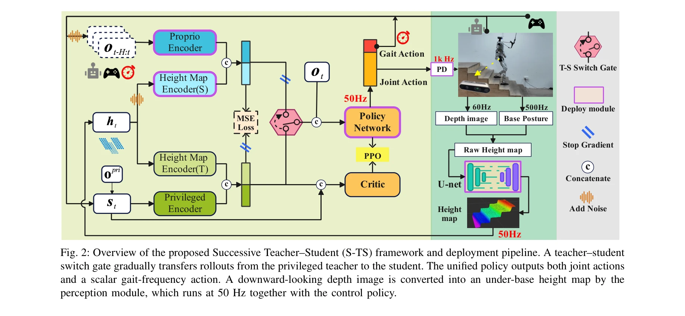
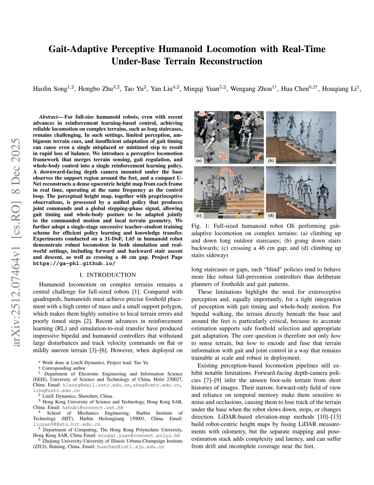

# Gait-Adaptive Perceptive Humanoid Locomotion with Real-Time Under-Base Terrain Reconstruction

> **저자**: Haolin Song, Hongbo Zhu, Tao Yu, Yan Liu, Mingqi Yuan, Wengang Zhou, Hua Chen, Houqiang Li | **날짜**: 2025-12-08 | **URL**: [https://arxiv.org/abs/2512.07464](https://arxiv.org/abs/2512.07464)

---

## Essence

*Fig. 2: Overview of the proposed Successive Teacher–Student (S-TS) framework and deployment pipeline. A teacher–student*

인간형 로봇의 복잡한 지형 주행을 위해 아래쪽 깊이 카메라로부터 실시간 지형 재구성, 보행 적응 제어, 전신 움직임을 통합하는 강화학습 정책을 제안한다.

## Motivation

- **Known**: 강화학습 기반 제어의 발전에도 불구하고 계단과 같은 복잡한 지형에서 인간형 로봇의 안정적인 주행은 여전히 도전적이며, 기존 전방향 깊이 카메라나 LiDAR 기반 방식은 시야 제한, 시간 지연, 로봇 중심 맵핑의 복잡성 등으로 제약을 가진다.
- **Gap**: 기존 방식들은 지형 감지와 보행 타이밍 조절을 분리하여 처리하며, 발 아래 영역에 대한 정확한 실시간 인식과 보행 패턴의 긴밀한 결합이 부족하다.
- **Why**: 발을 정확히 배치하고 보행 리듬을 지형에 맞춰 동적으로 조절할 수 있다면 계단 오르내림과 넓은 간격 통과 같은 고도로 어려운 과제를 해결할 수 있으며, 이는 실제 환경에서 인간형 로봇의 실용성을 크게 향상시킨다.
- **Approach**: 아래쪽 깊이 카메라로부터 단일 프레임의 egocentric height map을 U-Net으로 실시간 재구성하고, 이를 고유감각 정보와 함께 통합 정책에 입력하여 관절 명령과 보행 주파수를 동시에 출력하도록 한다. Successive Teacher–Student 단일 단계 학습 스킴으로 효율적 지식 전달을 수행한다.

## Achievement

*Fig. 1: Full-sized humanoid robot Oli performing gait-*

- **실시간 지형 재구성**: 단일 깊이 프레임으로부터 50 Hz 주파수에서 dense egocentric height map을 복원하는 lightweight U-Net 모듈
- **통합 정책**: 전신 관절 목표와 보행 주파수를 동시에 출력하여 지형 인식 기반 보행 적응을 실현
- **효율적 학습**: Successive Teacher–Student 프레임워크로 privileged observation에서 partial observation으로의 단일 단계 지식 전달
- **광범위 검증**: 31-DoF, 1.65 m 인간형 로봇 Oli에서 시뮬레이션 및 실제 환경에서 계단 오르내림, 후진 주행, 46 cm 간격 통과 등을 실현

## How

*Fig. 2: Overview of the proposed Successive Teacher–Student (S-TS) framework and deployment pipeline. A teacher–student*

- 아래쪽 방향 깊이 카메라를 베이스 아래에 장착하여 발 주변의 지지 영역 감지
- U-Net 아키텍처로 단일 깊이 프레임을 dense height map으로 변환하여 self-occlusion 처리
- Proprioceptive encoder와 height map encoder로 관찰값 인코딩
- 통합 정책 네트워크 πθ가 joint action과 scalar gait-frequency action을 동시 출력
- Teacher-Student 비대칭 Actor-Critic 접근법으로 privileged observation(noise-free)과 student partial observation(Gaussian noise 추가) 간의 지도 학습
- T-S Switch Gate로 점진적으로 teacher에서 student로 상호작용 전이
- PD 제어기로 50 Hz 정책 출력을 1 kHz 저수준 제어로 변환

## Originality

- 기존의 전방향 카메라나 로봇 중심 LiDAR 맵핑과 달리 아래쪽 깊이 카메라로 발 아래 영역에 특화된 국소 지형 인식 달성
- 지형 감지와 보행 타이밍을 단일 통합 정책으로 결합하여 end-to-end 지형 인식 기반 보행 적응 구현
- 단일 프레임 깊이 이미지에서 self-occlusion을 극복하고 실시간 height map 재구성하는 경량 U-Net 설계
- Successive Teacher–Student 단일 단계 학습으로 privileged 관찰에서 현실적 부분 관찰로의 안정적 지식 전달

## Limitation & Further Study

- 아래쪽 카메라의 좁은 시야각 때문에 먼 거리 지형 예측은 불가능하며, 단기적 국소 지형만 인식 가능
- U-Net 기반 height map 재구성은 극단적 occlusion이나 반사 표면에서 오류가 발생할 수 있음
- 학습은 시뮬레이션에서 수행되며 sim-to-real 전이의 안정성에 대한 상세한 분석 부족
- 보행 주파수 적응의 학습된 전략이 어떤 지형 특징에 반응하는지에 대한 해석가능성 연구 필요
- 후속 연구로는 전방향 카메라와의 다중 센서 융합, 장거리 지형 예측 모듈 추가, 더 복잡한 지형(경사, 불규칙한 표면) 확대 테스트 필요

## Evaluation

- Novelty: 4/5
- Technical Soundness: 4/5
- Significance: 4/5
- Clarity: 4/5
- Overall: 4/5

**총평**: 본 논문은 아래쪽 깊이 카메라 기반 실시간 지형 재구성과 보행 타이밍 적응을 통합한 혁신적인 인간형 로봇 주행 프레임워크를 제시하며, 복잡한 실제 지형에서의 광범위한 검증을 통해 강화학습 기반 로봇 제어의 실용성을 크게 향상시킨다.

## Related Papers

- 🏛 기반 연구: [[papers/1395_FastStair_Learning_to_Run_Up_Stairs_with_Humanoid_Robots/review]] — 복잡한 지형에서의 보행 적응 방법이 FastStair의 계단 등반과 같은 특정 지형 과제에 필수적인 기반 기술을 제공한다.
- 🔗 후속 연구: [[papers/1361_E-SDS_Environment-aware_See_it_Do_it_Sorted_-_Automated_Envi/review]] — 실시간 지형 재구성과 E-SDS의 환경 인식 보상 생성을 결합하면 더욱 적응적인 지형 주행이 가능하다.
- 🔄 다른 접근: [[papers/1533_Learning_Perceptive_Humanoid_Locomotion_over_Challenging_Ter/review]] — 둘 다 지형 인식 보행을 다루지만 전자는 실시간 하부 카메라 기반, 후자는 일반적 perceptive locomotion에 집중한다.
- 🔗 후속 연구: [[papers/1361_E-SDS_Environment-aware_See_it_Do_it_Sorted_-_Automated_Envi/review]] — 실시간 지형 재구성과 E-SDS의 환경 인식을 결합하면 더욱 정교한 지형 적응 보행이 가능하다.
- 🔄 다른 접근: [[papers/1395_FastStair_Learning_to_Run_Up_Stairs_with_Humanoid_Robots/review]] — 둘 다 복잡한 지형을 다루지만 FastStair는 계단 등반에 특화, Gait-Adaptive는 일반적 지형 적응에 집중한다.
