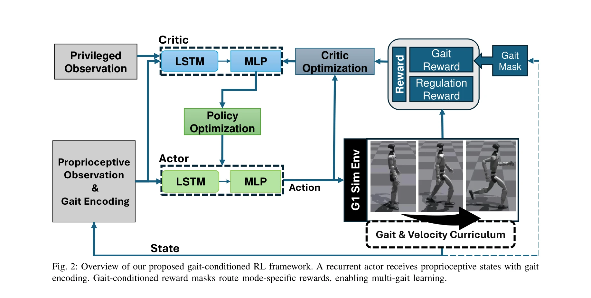

# Gait-Conditioned Reinforcement Learning with Multi-Phase Curriculum for Humanoid Locomotion

> **저자**: Tianhu Peng, Lingfan Bao, Chengxu Zhou | **날짜**: 2025-05-27 | **URL**: [https://arxiv.org/abs/2505.20619](https://arxiv.org/abs/2505.20619)

---

## Essence

*Fig. 1: Human-like multi-gait locomotion on the Unitree G1*

본 논문은 humanoid 로봇이 서기, 걷기, 달리기 및 부드러운 전환을 단일 recurrent policy로 수행하도록 하는 gait-conditioned RL 프레임워크를 제시하며, gait-specific reward routing과 biomechanically inspired reward 항들을 통해 motion capture 데이터 없이 자연스럽고 안정적인 locomotion을 달성한다.

## Motivation

- **Known**: Reference-based 방법들(AMP 등)은 motion capture 데이터에 의존하며 morphology mismatch 문제가 있고, reference-free RL 방법들은 training 속도가 느리며 복잡한 동작에 어려움을 겪는다. 다중 기술 통합을 위해서는 주로 multi-policy distillation, mixture-of-experts 같은 복잡한 구조가 필요했다.
- **Gap**: MoCap 없이 자연스럽고 효율적인 인간형 multi-gait 제어를 단일 unified policy로 안정적으로 학습하고, 부드러운 gait transition을 explicit expert나 motion reference 없이 달성하는 방법이 부족하다.
- **Why**: Humanoid 로봇의 실제 배치에는 다양한 locomotion mode의 seamless 전환이 필수적이며, MoCap-free 방식은 새로운 환경과 robot morphology에 대한 generalization을 향상시킨다. 또한 single unified policy 설계는 시스템 복잡도를 줄이고 interpretability를 증진한다.
- **Approach**: Gait ID를 기반으로 gait-specific objective를 동적으로 활성화하는 compact reward routing mechanism과 straight-knee stance, coordinated arm-leg swing 같은 biomechanically grounded reward term들을 도입한다. 또한 생물학적 motor development에 영감을 받은 structured multi-phase curriculum을 통해 progressive skill acquisition을 구현한다.

## Achievement

*Fig. 1: Human-like multi-gait locomotion on the Unitree G1*

- **Unified reference-free framework**: Standing, walking, running, gait transition을 단일 recurrent policy로 학습하며 motion capture 데이터가 필요 없다.
- **Gait-conditioned reward routing**: One-hot gait ID를 통해 reward interference를 완화하고 stable multi-gait learning을 지원한다.
- **Biomechanically natural motion**: Angular momentum control, arm-leg phase symmetry, straight-knee support를 명시적으로 promote하여 자연스럽고 에너지 효율적인 gait를 달성한다.
- **Sim-to-real validation**: Simulation에서 robust standing, walking, running, gait transition을 성공적으로 달성하고, Unitree G1 humanoid 실제 로봇에서 standing, walking, walk-to-stand transition을 검증한다.
- **Scalable curriculum design**: Multi-phase curriculum이 complexity와 command space를 점진적으로 확장하며 diverse environment에서 versatile control을 가능하게 한다.

## How

*Fig. 2: Overview of our proposed gait-conditioned RL framework. A recurrent actor receives proprioceptive states with ga*

- POMDP 기반 문제 설정으로 humanoid locomotion을 정식화하고 partially observable state에 gait ID를 포함시킨다.
- Reward function을 gait-specific components로 분해하고 one-hot gait ID를 사용하여 각 gait mode마다만 해당 reward 항들을 활성화한다.
- Angular momentum penalization, arm-leg coordination, foot drag minimization, push-off dynamics 같은 biomechanical reward term들을 수동으로 설계한다.
- Recurrent neural network policy를 사용하여 temporal dynamics와 periodic gait 구조를 capture한다.
- Multi-phase curriculum을 통해 먼저 standing을 학습한 후 walking, running, transition으로 순차적으로 확장하고 각 단계에서 command space를 증가시킨다.
- Simulation에서 PPO 기반 policy gradient method로 end-to-end 학습을 수행하고 sim-to-real transfer를 통해 real robot에서 검증한다.

## Originality

- Gait-specific reward routing mechanism을 통해 single unified policy 내에서 multi-behavior learning의 reward interference를 해결한 novel approach이다.
- MoCap이나 analytical trajectory reference 없이 biomechanically grounded reward shaping만으로 natural humanoid locomotion을 달성하는 것이 기존 reference-based method들과 다르다.
- Gait ID를 단순히 policy conditioning이 아닌 reward structure 자체에 통합하여 더 효과적인 multi-gait control을 가능하게 한 설계이다.
- Biological motor development에 영감을 받은 구체적인 multi-phase curriculum strategy를 humanoid locomotion에 체계적으로 적용했다.
- Single recurrent policy로 standing, walking, running, smooth transition을 모두 통합 학습하면서 multi-policy distillation이나 mixture-of-experts 같은 복잡한 architecture를 회피한 점이 distinctive하다.

## Limitation & Further Study

- 실제 로봇 검증이 Unitree G1에 국한되어 있으며 다른 humanoid platform이나 제약 있는 morphology에 대한 generalization 정도가 불명확하다.
- Biomechanical reward term들의 상대적 가중치 설정이 수동으로 이루어지므로 hyperparameter tuning의 민감도와 재현성에 대한 분석이 부족하다.
- Multi-phase curriculum의 각 단계 전환 기준과 command space 확장 전략에 대한 이론적 근거나 ablation study가 제시되지 않았다.
- Jumping, obstacle crossing, complex terrain navigation 같은 더욱 도전적인 locomotion mode로의 확장 가능성과 scalability에 대해 논의하지 않았다.
- Real robot에서 검증된 동작이 standing, walking, walk-to-stand transition에만 제한되어 있으며 running이나 complex transition의 실제 성능이 보여지지 않았다.
- **후속 연구**: (1) 다양한 humanoid morphology에 대한 transfer learning 연구, (2) 자동화된 reward weight 최적화 방법 개발, (3) 더 복잡한 환경과 동작(jumping, stair climbing, manipulation during locomotion)으로 확장, (4) 실제 robot에서의 long-horizon stability와 disturbance rejection 능력 평가.

## Evaluation

- Novelty: 4/5
- Technical Soundness: 3/5
- Significance: 4/5
- Clarity: 4/5
- Overall: 4/5

**총평**: 본 논문은 gait-conditioned reward routing과 biomechanically inspired reward shaping을 결합하여 MoCap 없이 unified single-policy humanoid multi-gait control을 달성한 주목할 만한 연구이며, 실제 로봇 검증과 scalable 설계 철학이 강점이다. 다만 실제 robot 검증 범위의 제한과 curriculum design의 이론적 근거 부족이 후속 개선의 여지를 남긴다.

## Related Papers

- 🏛 기반 연구: [[papers/1358_Dribble_Master_Learning_Agile_Humanoid_Dribbling_through_Leg/review]] — Gait-Conditioned RL의 다양한 보행 모드와 전환 방법이 드리블링과 같은 복잡한 동적 기술의 기반 제어 기술이 된다.
- 🔗 후속 연구: [[papers/1363_ECO_Energy-Constrained_Optimization_with_Reinforcement_Learn/review]] — ECO의 에너지 효율성과 gait-conditioned 보행을 결합하면 에너지 최적화된 다양한 보행 패턴을 달성할 수 있다.
- 🔄 다른 접근: [[papers/1578_MoRE_Mixture_of_Residual_Experts_for_Humanoid_Lifelike_Gaits/review]] — 둘 다 다양한 보행 모드를 다루지만 Gait-Conditioned는 명시적 조건화, MoRE는 residual expert 기반 접근을 사용한다.
- 🔗 후속 연구: [[papers/1358_Dribble_Master_Learning_Agile_Humanoid_Dribbling_through_Leg/review]] — Gait-Conditioned RL의 다단계 보행 전환 방법을 드리블링 중 방향 전환과 속도 변화에 적용할 수 있다.
- 🔄 다른 접근: [[papers/1363_ECO_Energy-Constrained_Optimization_with_Reinforcement_Learn/review]] — ECO는 에너지 제약을 명시적으로 다루고 Gait-Conditioned RL은 자연스러운 보행 패턴으로 에너지 효율성을 추구한다.
