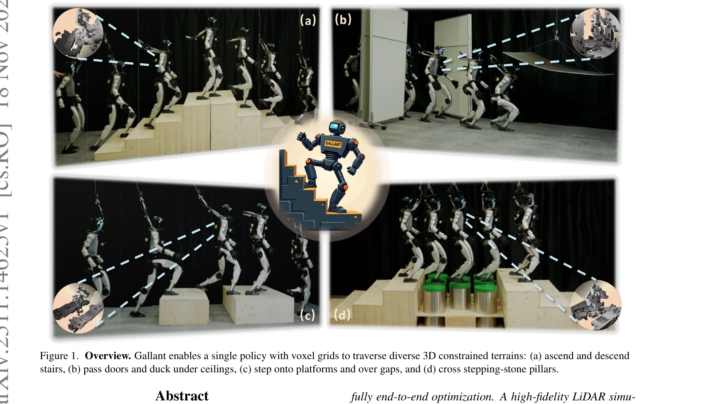
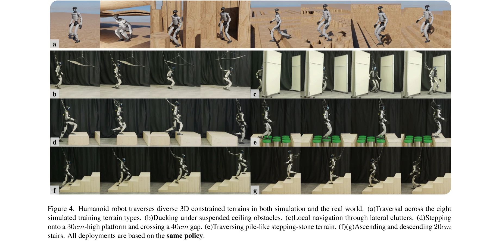
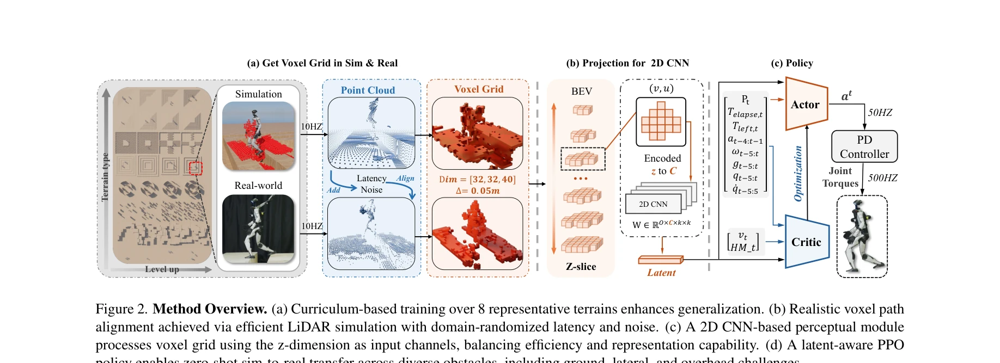

# Gallant: Voxel Grid-based Humanoid Locomotion and Local-navigation across 3D Constrained Terrains

> **저자**: Qingwei Ben, Botian Xu, Kailin Li, Feiyu Jia, Wentao Zhang, Jingping Wang, Jingbo Wang, Dahua Lin, Jiangmiao Pang | **날짜**: 2025-11-18 | **URL**: [https://arxiv.org/abs/2511.14625](https://arxiv.org/abs/2511.14625)

---

## Essence

*Figure 1. Overview. Gallant enables a single policy with voxel grids to traverse diverse 3D constrained terrains: (a) as*

본 논문은 voxel grid 기반의 인식 표현을 활용하여 인간형 로봇이 3D 제약 지형(계단, 천장, 옆쪽 장애물 등)에서 강건한 주행과 로컬 내비게이션을 수행할 수 있게 하는 Gallant 프레임워크를 제시한다.

## Motivation

- **Known**: 기존 방법들은 elevation map이나 depth image를 활용하여 인간형 로봇의 주행을 제어해왔으나, 이는 2.5D 또는 좁은 시야각으로 인해 오버헤드 제약이나 다층 구조 같은 완전한 3D 환경 정보를 포착하지 못한다.
- **Gap**: LiDAR 기반 point cloud는 풍부한 3D 정보를 제공하지만 계산 비용이 높아 실시간 배포에 부적합하며, 기존 elevation map 방식은 지면 수준의 장애물만 처리 가능하고 옆쪽 또는 오버헤드 제약을 무시한다.
- **Why**: 실제 환경에서 인간형 로봇이 안전하고 강건하게 동작하려면 지면, 옆쪽, 위쪽의 모든 3D 구조를 동시에 인식하고 대응해야 하며, 이는 단일 정책으로 다양한 복잡한 지형을 처리하는 데 필수적이다.
- **Approach**: Voxel grid를 robot-centric 인식 표현으로 사용하여 sparse한 point cloud를 구조화하고, z-grouped 2D CNN을 통해 높이 슬라이스를 채널로 처리하여 3D CNN 대비 효율적인 특징 추출을 수행한다. 또한 고충실도 LiDAR 시뮬레이션을 통해 실시간 스캔과 sensor noise를 모델링하여 sim-to-real 갭을 좁힌다.

## Achievement

*Figure 4. Humanoid robot traverses diverse 3D constrained terrains in both simulation and the real world. (a)Traversal a*

- **3D 전공간 장애물 처리**: 지면 수준 장애물, 옆쪽 클러터, 오버헤드 제약, 다층 구조를 단일 정책으로 처리 가능하여 기존 elevation map 방식의 한계 극복
- **높은 성공률**: 계단 오르내리기와 높은 플랫폼으로의 스텝업에서 약 100% 성공률 달성
- **효율적인 인식 모듈**: z-grouped 2D CNN이 3D CNN 대비 우수한 성능을 유지하면서 낮은 추론 지연으로 실시간 배포 가능
- **고충실도 시뮬레이션 환경**: 동적 LiDAR 시뮬레이션과 8가지 대표 지형 패밀리를 통한 확장 가능한 학습 및 zero-shot sim-to-real 전이

## How

*Figure 2. Method Overview. (a) Curriculum-based training over 8 representative terrains enhances generalization. (b) Rea*

- Voxel grid: LiDAR point cloud를 robot-centric 좌표계에서 voxel로 양자화하여 sparse하면서도 multi-layer 구조 정보 보존
- Z-grouped 2D CNN: 높이 차원을 채널로 취급하여 각 높이 슬라이스를 2D convolution으로 처리, sparsity 활용으로 계산 효율성 달성
- LiDAR 시뮬레이션: sensor noise 및 latency 모델링과 robot 자체 moving link의 동적 스캔을 포함하여 현실적 관찰 생성
- POMDP 기반 학습: PPO를 활용한 actor-critic 정책 학습, goal-reaching reward 사용으로 속도 추적과 장애물 회피 통합
- Curriculum 학습: 8개의 대표 지형 패밀리(지면 장애물, 옆쪽 클러터, 오버헤드 제약 등) 활용하여 구조적 정칙성 학습 유도

## Originality

- 인간형 로봇 주행에서 voxel grid를 직접 인식 표현으로 처음 적용하여, elevation map의 정보 손실과 point cloud의 계산 복잡성 사이의 최적 균형점 제시
- Z-grouped 2D CNN을 sparse voxel grid에 맞춤 설계하여 3D CNN 대비 효율적인 특징 추출 방법 제시
- 동적 LiDAR 시뮬레이션 파이프라인 개발로 robot 자체의 moving link 스캔을 포함한 고충실도 데이터 생성 가능
- 단일 정책으로 ground, lateral, overhead 제약을 동시 처리하는 최초의 humanoid 로컬 내비게이션 시스템 구현

## Limitation & Further Study

- 실험이 특정 humanoid 플랫폼에 국한되어 있어 다른 로봇 형태로의 일반화 가능성 미검증
- 8m×8m 블록 기반의 고정된 에피소드 지평선(10초)으로 인해 더 복잡하거나 장거리 내비게이션 시나리오에 대한 성능 불명확
- Voxel grid의 해상도 선택 및 시간적 누적 전략에 대한 상세 분석 부재로 최적 설계 가이드라인 제시 부족
- 후속 연구: 고해상도 voxel 표현의 메모리-성능 trade-off 분석, 동적 환경에서의 robust 인식 및 제어, 다양한 로봇 morphology로의 확장, 실제 배포에서의 장시간 안정성 검증

## Evaluation

- Novelty: 4/5
- Technical Soundness: 3/5
- Significance: 4/5
- Clarity: 4/5
- Overall: 4/5

**총평**: 본 논문은 voxel grid를 humanoid 주행의 인식 표현으로 창의적으로 활용하고, z-grouped 2D CNN과 고충실도 LiDAR 시뮬레이션을 통합한 실용적인 full-stack 솔루션을 제시함으로써, 기존 elevation map의 한계를 극복하고 3D 제약 환경에서 강건한 단일 정책 학습을 최초로 달성했다.

## Related Papers

- 🔗 후속 연구: [[papers/1533_Learning_Perceptive_Humanoid_Locomotion_over_Challenging_Ter/review]] — Challenging terrain에서의 perceptive humanoid learning이 GR-RL의 장기 복잡 조작을 지형 인식으로 확장한다.
- 🔄 다른 접근: [[papers/1411_Gallant_Voxel_Grid-based_Humanoid_Locomotion_and_Local-navig/review]] — Gallant의 voxel grid 기반 3D 지형 인식이 GR-RL의 vision-language-action과 다른 공간 표현 방법을 제시한다.
- 🔗 후속 연구: [[papers/1620_VLA-RL_Towards_Masterful_and_General_Robotic_Manipulation_wi/review]] — VLA-RL의 masterful manipulation이 GR-RL의 고정밀 전문가 정책 학습을 더욱 일반화된 관점으로 확장한다.
- 🧪 응용 사례: [[papers/1245_A_Hybrid_Autoencoder_for_Robust_Heightmap_Generation_from_Fu/review]] — Gallant의 voxel grid 기반 네비게이션 시스템이 높이맵 생성 결과를 실제 humanoid 보행 제어에 활용할 수 있다.
- 🔗 후속 연구: [[papers/1352_DemoDiffusion_One-Shot_Human_Imitation_using_pre-trained_Dif/review]] — Gallant의 voxel grid 기반 navigation이 DPL의 depth 기반 지형 재구성을 실제 locomotion 제어에 활용하는 방법을 제시한다.
