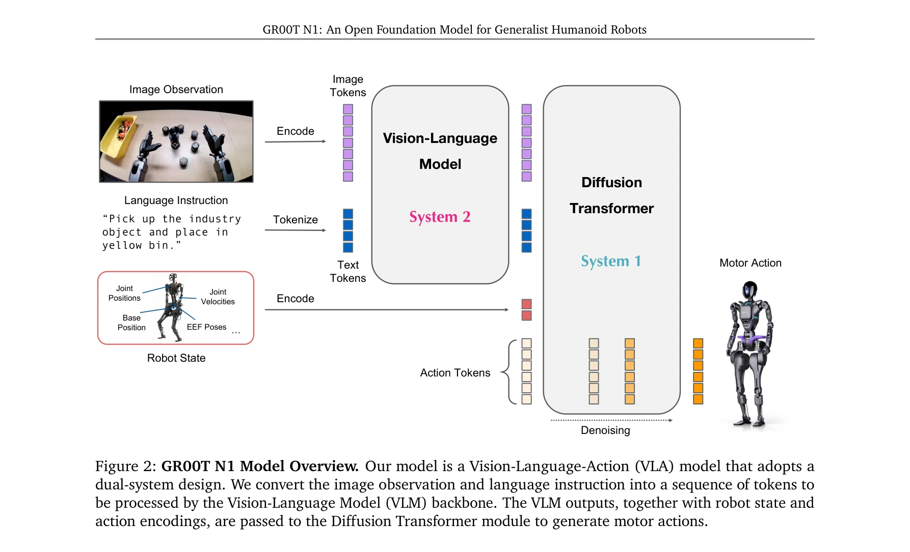
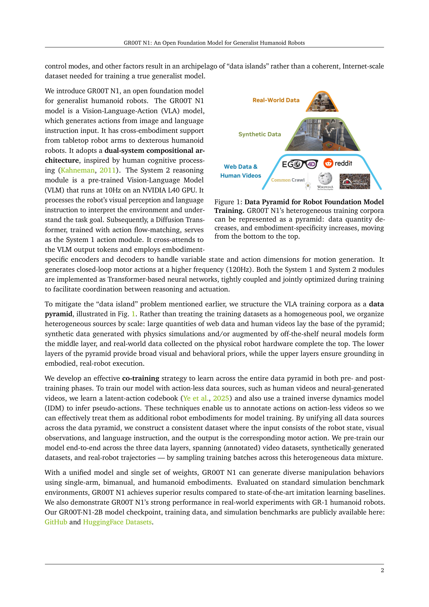
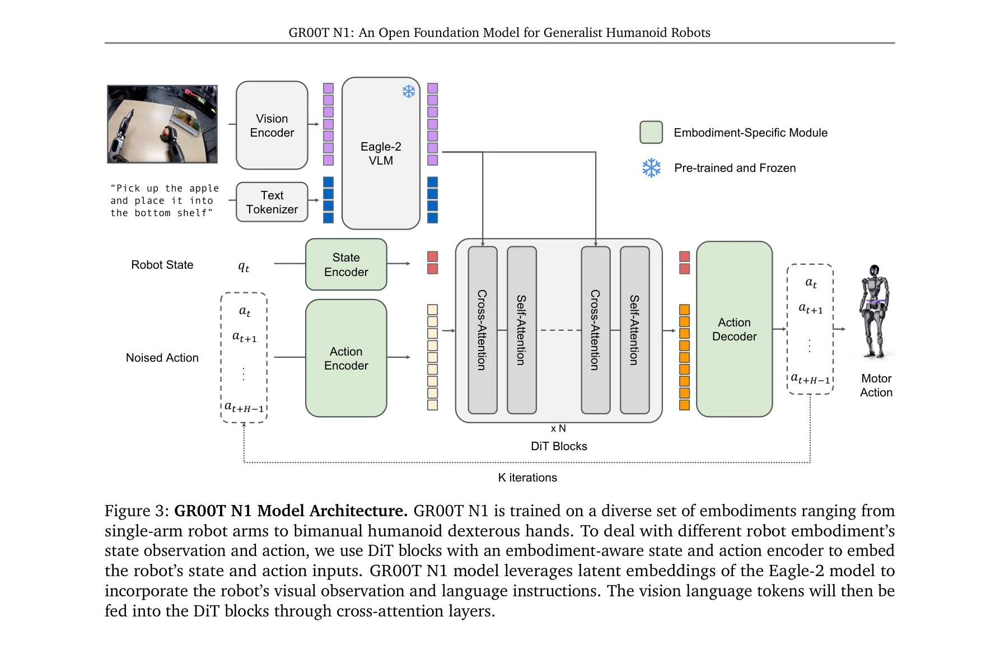

# GR00T N1: An Open Foundation Model for Generalist Humanoid Robots

> **저자**: , , Johan Bjorck, Fernando Castañeda, Nikita Cherniadev, Xingye Da, Runyu Ding, Linxi "Jim" Fan, Yu Fang, Dieter Fox, Fengyuan Hu, Spencer Huang, Joel Jang, Zhenyu Jiang, Jan Kautz, Kaushil Kundalia, Lawrence Lao, Zhiqi Li, Zongyu Lin, Kevin Lin, Guilin Liu, Edith Llontop, Loic Magne, Ajay Mandlekar, Avnish Narayan, Soroush Nasiriany, Scott Reed, You Liang Tan, Guanzhi Wang, Zu Wang, Jing Wang, Qi Wang, Jiannan Xiang, Yuqi Xie, Yinzhen Xu, Zhenjia Xu, Seonghyeon Ye, Zhiding Yu, Ao Zhang, Hao Zhang, Yizhou Zhao, Ruijie Zheng, Yuke Zhu | **날짜**: 2025-03-18 | **URL**: [https://arxiv.org/abs/2503.14734](https://arxiv.org/abs/2503.14734)

---

## Essence

*Figure 2: GR00T N1 Model Overview. Our model is a Vision-Language-Action (VLA) model that adopts a*

GR00T N1은 Vision-Language-Action (VLA) 듀얼 시스템 아키텍처를 가진 범용 휴머노이드 로봇 재단 모델로, 웹 데이터, 인간 비디오, 합성 데이터, 실제 로봇 궤적의 이질적 혼합으로 훈련되어 여러 로봇 embodiment에서 우수한 성능을 달성한다.

## Motivation

- **Known**: 최근 휴머노이드 로봇 하드웨어가 발전했으며, foundation model이 다양한 AI 분야에서 성공적이다는 것이 알려져 있다. 그러나 로봇 데이터는 스케일이 작고 'data island' 문제로 인해 진정한 범용 로봇 모델 구축이 어렵다.
- **Gap**: 기존의 cross-embodied learning 접근법은 이질적인 로봇 embodiment 간 변이성으로 인해 일관된 대규모 데이터셋을 만들지 못하고 있으며, 실제 로봇 데이터 부족 문제를 해결할 효과적인 전략이 부재하다.
- **Why**: 범용 휴머노이드 로봇을 개발하기 위해서는 다양한 작업을 처리할 수 있는 지능형 모델과 실제 환경의 변이성을 견딜 수 있는 강건성이 필수적이며, 이는 인간 수준의 물리적 지능을 달성하는 데 중요하다.
- **Approach**: 데이터 피라미드 전략으로 이질적 데이터 소스를 계층화하고, Vision-Language Model (System 2)과 Diffusion Transformer (System 1)의 듀얼 시스템 설계로 추론과 액션 생성을 분리하며, latent-action codebook과 inverse dynamics model을 활용해 액션 없는 데이터를 주석 처리한다.

## Achievement

*Figure 1: Data Pyramid for Robot Foundation Model*

- **모델 아키텍처**: Eagle-2 VLM과 flow-matching 기반 DiT를 통합한 2.2B 파라미터 VLA 모델로 L40 GPU에서 63.9ms의 추론 시간 달성
- **데이터 전략**: 웹 데이터, 인간 비디오, 합성 데이터, 실제 로봇 데이터를 피라미드 구조로 조직화하여 효과적인 사전 훈련 가능
- **벤치마크 성능**: 여러 robot embodiment에 걸쳐 표준 시뮬레이션 벤치마크에서 최신 imitation learning 베이스라인 능가
- **실제 배포**: Fourier GR-1 휴머노이드 로봇에서 언어 조건 bimanual 조작 작업에 높은 성능과 데이터 효율성 입증
- **공개 공개**: GR00T-N1-2B 모델 체크포인트, 훈련 데이터, 시뮬레이션 벤치마크를 공개 제공

## How

*Figure 3: GR00T N1 Model Architecture. GR00T N1 is trained on a diverse set of embodiments ranging from*

- State and Action Encoders: 서로 다른 차원의 로봇 상태와 액션을 처리하기 위해 embodiment별 MLP를 사용하여 공유 embedding dimension으로 투영
- Vision-Language Backbone: Eagle-2 VLM을 사전 훈련 및 고정하여 이미지와 텍스트 토큰 인코딩
- Diffusion Transformer: Flow-matching 기반 액션 생성으로 noised action을 반복적으로 denoising
- Cross-Attention 메커니즘: DiT 블록에서 VLM 출력 토큰과 state/action 임베딩을 cross-attend하여 조정
- Latent-Action Codebook: 액션 주석 없는 인간 비디오와 신경망 생성 비디오를 위해 latent action space 학습
- Inverse Dynamics Model: pseudo-action을 추론하여 추가적인 robot embodiment으로 취급 가능하게 변환
- Co-training 전략: 데이터 피라미드 전체에서 이질적 데이터 혼합으로 사전 훈련 및 사후 훈련 수행

## Originality

- **Dual-system 아키텍처**: 인간 인지 처리(Kahneman의 System 1/2)에 영감받은 추론(VLM)과 액션 생성(DiT) 분리 설계
- **데이터 피라미드 프레임워크**: 단순히 데이터를 합치는 대신 embodiment-specificity에 따라 계층화하는 혁신적 접근
- **Pseudo-action 생성**: Latent-action codebook과 IDM을 결합하여 액션 레이블이 없는 비디오를 훈련 데이터로 활용
- **Cross-embodiment 일관성**: 가변 state/action 차원을 처리하는 embodiment-specific encoder/decoder로 여러 로봇 형태 지원
- **Flow-matching 기반 정책**: 기존 확산 모델 대신 flow-matching을 사용하여 효율적인 액션 생성

## Limitation & Further Study

- **데이터 질 의존성**: 모델 성능이 웹 데이터와 인간 비디오의 품질에 크게 의존하며, 가비지 in/out 문제 가능성
- **시뮬레이션-실제 간극**: 주로 시뮬레이션 벤치마크에서 평가되었으며 실제 환경 복잡도 제한적 검증
- **Embodiment 일반화 한계**: 데이터 피라미드 구조에서 상층의 실제 로봇 데이터는 여전히 제한적이어서 새로운 embodiment 적응 능력 불명확
- **계산 오버헤드**: System 2 (10Hz) + System 1 (120Hz) 듀얼 시스템으로 인한 엣지 로봇 배포 시 계산 자원 요구
- **후속 연구 방향**: (1) 더 많은 실제 로봇 데이터 수집으로 상층 피라미드 강화, (2) 새로운 embodiment에 대한 zero-shot adaptation 능력 평가, (3) 로봇 간 전이 학습 메커니즘 연구

## Evaluation

- Novelty: 4/5
- Technical Soundness: 3/5
- Significance: 4/5
- Clarity: 4/5
- Overall: 4/5

**총평**: GR00T N1은 이질적 데이터 소스를 효과적으로 통합하는 데이터 피라미드 전략과 인지 처리 영감의 dual-system 아키텍처를 통해 범용 휴머노이드 로봇 기초 모델 개발에 중요한 기여를 하며, 공개 모델 공개를 통해 커뮤니티에 실질적 영향을 미칠 것으로 기대된다.

## Related Papers

- 🔄 다른 접근: [[papers/1427_GR00T_N1_An_Open_Foundation_Model_for_Generalist_Humanoid_Ro/review]] — 동일한 GR00T N1 모델이지만 다른 논문에서 다루는 접근이나 응용 관점의 차이를 보여준다.
- 🏛 기반 연구: [[papers/1281_Being-H0_Vision-Language-Action_Pretraining_from_Large-Scale/review]] — Being-H0의 large-scale human video pretraining이 GR00T N1의 heterogeneous data mixture 학습에 방법론적 기반을 제공한다.
- 🔗 후속 연구: [[papers/1510_OpenVLA_An_Open-Source_Vision-Language-Action_Model/review]] — OpenVLA의 오픈소스 접근이 GR00T N1의 foundation model을 더 접근 가능한 형태로 확장한다.
- 🔗 후속 연구: [[papers/1278_Behavior_Foundation_Model_for_Humanoid_Robots/review]] — GR00T N1은 BFM의 개념을 일반화하여 더 광범위한 인간형 로봇 기초 모델로 확장한다
- 🧪 응용 사례: [[papers/1476_MimicPlay_Long-Horizon_Imitation_Learning_by_Watching_Human/review]] — GaussGym의 실시간 물리 시뮬레이션 환경이 HWM의 실제 배포 검증에 필수적이다
- 🔄 다른 접근: [[papers/1608_Vision-Language-Action_VLA_Models_Concepts_Progress_Applicat/review]] — GR00T N1이 VLA와 다른 foundation model 접근으로 generalist humanoid 문제를 해결하는 대안적 방법론
- 🔄 다른 접근: [[papers/1557_LiPS_Large-Scale_Humanoid_Robot_Reinforcement_Learning_with/review]] — GPU 병렬 시뮬레이션으로 휴머노이드 강화학습을 최적화하는 LiPS와 3D Gaussian 기반 실시간 학습 환경이 동일한 대규모 시뮬레이션 문제를 다룬다.
- 🔗 후속 연구: [[papers/1510_KungfuBot2_Learning_Versatile_Motion_Skills_for_Humanoid_Who/review]] — GR00T의 일반적인 휴머노이드 제어 프레임워크를 다양한 동작 기술 학습에 특화시킨 발전된 형태로 볼 수 있음
- 🔗 후속 연구: [[papers/1421_Genie_Sim_30__A_High-Fidelity_Comprehensive_Simulation_Platf/review]] — GaussGym과 함께 실제-시뮬레이션 간 전이를 위한 상호 보완적인 시뮬레이션 프레임워크를 구성한다.
