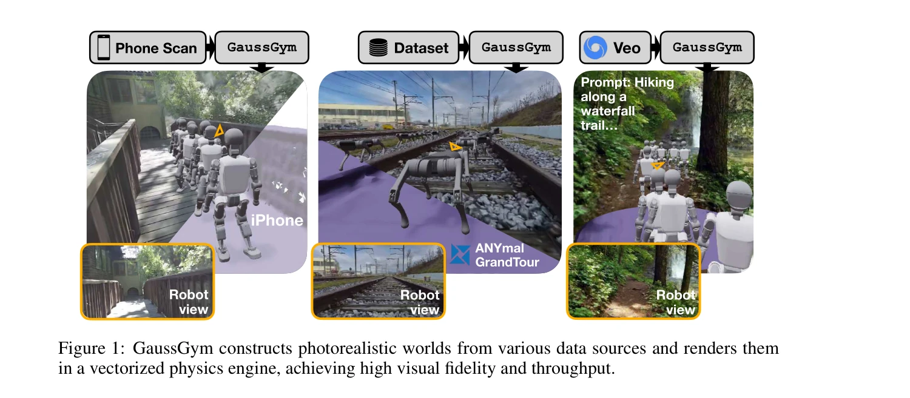
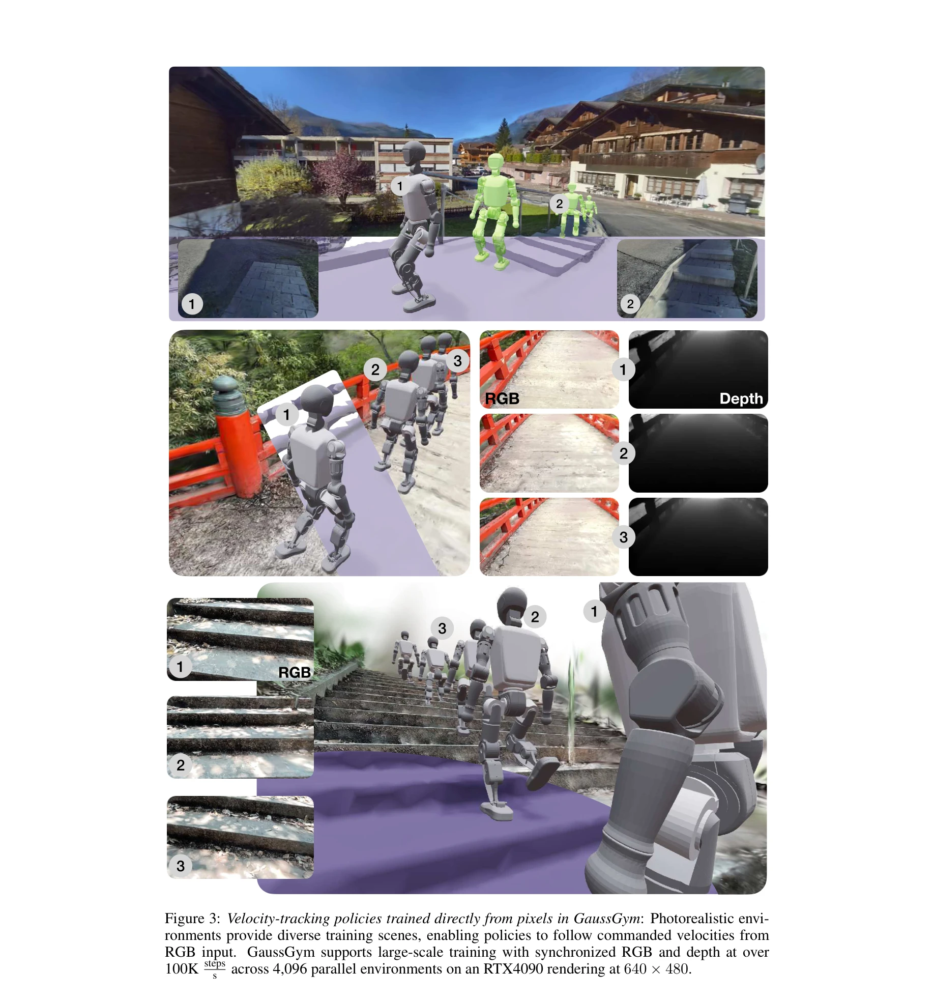
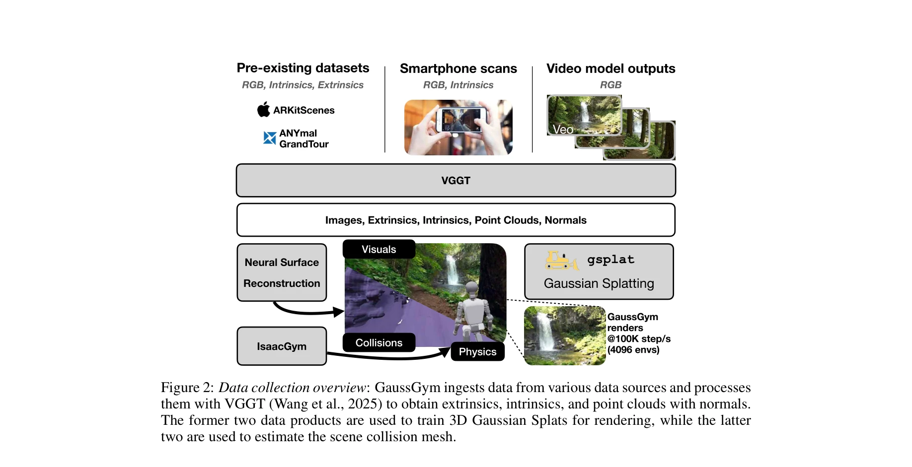

# GaussGym: An open-source real-to-sim framework for learning locomotion from pixels

> **저자**: Alejandro Escontrela, Justin Kerr, Arthur Allshire, Jonas Frey, Rocky Duan, Carmelo Sferrazza, Pieter Abbeel | **날짜**: 2025-10-17 | **URL**: [https://arxiv.org/abs/2510.15352](https://arxiv.org/abs/2510.15352)

---

## Essence

*Figure 1: GaussGym constructs photorealistic worlds from various data sources and renders them*

3D Gaussian Splatting을 IsaacGym과 통합하여 100,000 steps/초 이상의 고속 시뮬레이션을 유지하면서도 포토리얼리스틱한 렌더링을 실현하는 로봇 학습 프레임워크이다. RGB 픽셀로부터 직접 보행 정책을 학습할 수 있으며 sim-to-real 전이를 지원한다.

## Motivation

- **Known**: 기존 시뮬레이터들은 높은 처리량과 정확한 물리 시뮬레이션을 제공하지만, 시각 정보 렌더링이 느리거나 부정확하여 대부분의 로봇 정책은 LiDAR 또는 깊이 입력에만 의존한다. 3D Gaussian Splatting은 빠른 렌더링 속도로 주목받고 있다.
- **Gap**: 포토리얼리스틱 시각 렌더링과 고속 GPU 병렬 시뮬레이션을 동시에 실현하는 통합 프레임워크가 부족하며, RGB 픽셀로부터 직접 학습할 때의 visual sim-to-real gap이 해결되지 않았다.
- **Why**: 시각적 의미론(semantic cues)을 활용할 수 있는 정책이 더 강력한 네비게이션과 의사결정을 가능하게 하며, 다양한 데이터 소스(iPhone 스캔, 생성 모델 비디오 등)를 활용하여 확장 가능한 로봇 학습을 실현할 수 있다.
- **Approach**: 3D Gaussian Splatting을 IsaacGym 내 렌더러로 통합하고, 다양한 입력 소스(SLAM, 스마트폰 스캔, 생성 모델)로부터 photorealistic 환경을 구성한다. 기하학 재구성 보조 손실을 통해 RGB 기반 학습의 어려움을 완화한다.

## Achievement

*Figure 3: Velocity-tracking policies trained directly from pixels in GaussGym: Photorealistic envi-*

- **GaussGym 프레임워크 공개**: 2,500개 장면을 포함하며 다양한 데이터 소스(수동 스캔, 오픈소스 데이터셋, 생성 모델)를 지원하는 오픈소스 포토리얼리스틱 시뮬레이터 개발
- **극한의 처리량**: RTX 4090 단일 GPU에서 4,096개 로봇 × 640×480 해상도로 100,000 steps/초 이상의 시뮬레이션 달성
- **Visual Sim-to-Real 전이**: 기하학 재구성 보조 손실을 통해 RGB 정책 학습을 개선하고 실제 계단 오르기에서 zero-shot 전이 시연
- **시각적 의미론 활용**: RGB 정책이 깊이만으로는 감지 불가능한 특정 영역 회피 등 환경의 시각적 의미를 성공적으로 학습

## How

*Figure 2: Data collection overview: GaussGym ingests data from various data sources and processes*

- VGGT를 사용한 데이터 처리 파이프라인으로 다양한 입력(iPhone 스캔, SLAM, 비디오)에서 카메라 외재/내재 파라미터와 점군 추출
- 3D Gaussian Splatting으로 photorealistic scene 렌더링 및 깊이 맵을 부산물로 생성
- 추출된 점군과 법선으로부터 충돌 메시 추정 (물리 시뮬레이션용)
- IsaacGym의 벡터화 물리 엔진과 3DGS 렌더러 통합으로 동기화된 병렬 시뮬레이션
- 기하학 재구성 보조 손실(ground-truth mesh 기반)을 정책 학습에 추가하여 RGB 기반 학습 성능 향상
- Humanoid와 Quadruped 로봇에 대한 보행/네비게이션 정책 훈련 및 실제 환경 전이 평가

## Originality

- 3D Gaussian Splatting을 벡터화 물리 시뮬레이터(IsaacGym)에 렌더러로 직접 통합하여 포토리얼리즘과 처리량의 경계를 무너뜨린 혁신
- iPhone 스캔, SLAM, 생성 모델(Veo) 출력 등 다양한 데이터 소스를 통합 파이프라인으로 처리하는 유연한 씬 생성 시스템
- 기하학 재구성 보조 손실을 통한 visual sim-to-real gap 해결 방안 제시
- RGB 픽셀 기반 정책이 의미적 환경 특성을 학습하는 능력 체계적으로 입증

## Limitation & Further Study

- RGB 기반 정책 학습이 여전히 도전적이며, 기하학 재구성 보조 손실 없이는 성능 저하가 심각함 (일반화 가능성 제한)
- Sim-to-real 전이는 계단 오르기 단일 작업만 시연되어 광범위한 실제 환경 적용성 미확인
- 생성 모델(Veo) 출력의 multi-view 일관성에 대한 체계적인 평가 부재
- 큰 규모 장면에서의 3DGS 수렴 속도 및 메모리 효율성에 대한 상세 분석 부족
- **후속 연구**: (1) 보조 손실 없이도 RGB 정책 학습을 안정화하는 기법 개발, (2) 더 복잡한 manipulative 작업으로 확대, (3) 동적 씬 지원, (4) 생성 모델과의 반복적 개선 루프 구축

## Evaluation

- Novelty: 4/5
- Technical Soundness: 4/5
- Significance: 4/5
- Clarity: 4/5
- Overall: 4/5

**총평**: GaussGym은 포토리얼리스틱 시뮬레이션과 극한의 처리량을 결합한 획기적인 프레임워크로서, visual sim-to-real gap 해소를 위한 체계적 접근을 제시하고 오픈소스 공개로 커뮤니티 기여도 높다. 다만 RGB 기반 학습의 근본적 어려움과 real-world 전이의 제한된 입증이 향후 개선 과제이다.

## Related Papers

- 🧪 응용 사례: [[papers/1290_3D_Gaussian_Splatting_for_Real-Time_Radiance_Field_Rendering/review]] — 3D Gaussian Splatting을 실제 로봇 학습 환경에 통합 구현한 사례다
- 🔄 다른 접근: [[papers/1421_Genie_Sim_30__A_High-Fidelity_Comprehensive_Simulation_Platf/review]] — 고성능 시뮬레이션 환경을 다른 아키텍처로 구축한 접근법이다
- 🔗 후속 연구: [[papers/1420_Habitat_20_Training_Home_Assistants_to_Rearrange_their_Habit/review]] — 물리 시뮬레이션 플랫폼을 photorealistic rendering으로 확장했다
- 🏛 기반 연구: [[papers/1420_Habitat_20_Training_Home_Assistants_to_Rearrange_their_Habit/review]] — 로봇 학습을 위한 고성능 시뮬레이션 환경의 기반을 제공한다
- 🏛 기반 연구: [[papers/1469_ManiSkill3_GPU_Parallelized_Robotics_Simulation_and_Renderin/review]] — GaussGym의 real-to-sim framework가 GPU 가속 시뮬레이션의 기반 기술을 제공함
- 🔄 다른 접근: [[papers/1625_VR-Robo_A_Real-to-Sim-to-Real_Framework_for_Visual_Robot_Nav/review]] — GaussGym의 실시간 렌더링과 물리 시뮬레이션이 VR-Robo의 3D Gaussian Splatting 기반 접근법과 유사하지만 다른 구현을 보인다
- 🧪 응용 사례: [[papers/1290_3D_Gaussian_Splatting_for_Real-Time_Radiance_Field_Rendering/review]] — 3D Gaussian Splatting을 로봇 학습 환경에 직접 적용한 실용적 구현이다
