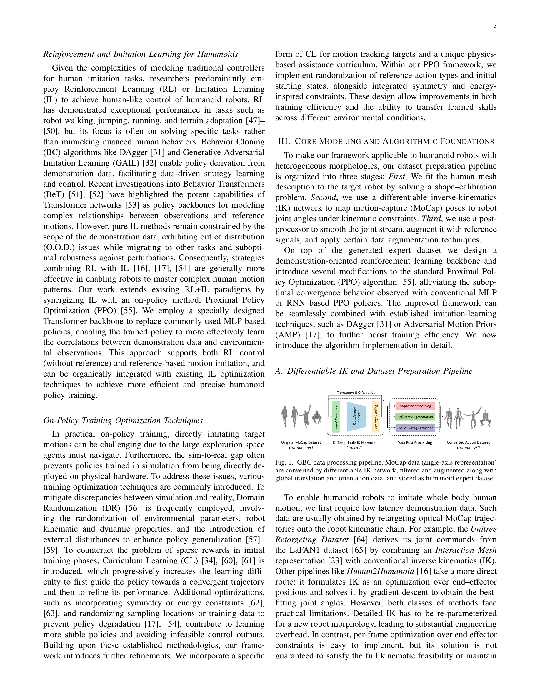

# GBC: Generalized Behavior-Cloning Framework for Whole-Body Humanoid Imitation

> **저자**: Yifei Yao, Chengyuan Luo, Jiaheng Du, Wentao He, Jun-Guo Lu | **날짜**: 2025-08-13 | **DOI**: [10.48550/arXiv.2508.09960](https://doi.org/10.48550/arXiv.2508.09960)

---

## Essence

*Fig. 1. GBC data processing pipeline. MoCap data (angle-axis representation)*

GBC는 이질적인 휴머노이드 로봇 형태에 관계없이 인간 동작 데이터를 로봇 제어 정책으로 변환하는 통합 행동 복제 프레임워크이다. Differentiable IK 네트워크, DAgger-MMPPO 알고리즘, MMTransformer 아키텍처를 통해 end-to-end 인간 모션 모방을 실현한다.

## Motivation

- **Known**: 기존 연구는 텔레조작, IK 기반 역운동학, 강화학습, Behavior Cloning 등 다양한 방법으로 휴머노이드 제어를 시도해왔다. 그러나 로봇 형태의 이질성과 MoCap 데이터 변환의 일반화 문제로 인해 특정 로봇에 맞춤화된 솔루션만 존재했다.
- **Gap**: 기존 방법들은 로봇별 형태 차이에 대응하는 범용 데이터 처리 파이프라인이 부족하고, 행동 복제 학습에서 공변량 편이(covariate shift)와 기계적 제약 미반영 문제를 효과적으로 해결하지 못했다.
- **Why**: 휴머노이드 로봇의 광범위한 배포를 위해서는 서로 다른 로봇 형태에 보편적으로 적용 가능한 통합 제어 정책 학습 체계가 필수적이다. 인간 동작 모방 능력은 서비스 로봇과 산업용 로봇의 실용화를 가속화한다.
- **Approach**: 적응형 Differentiable IK 네트워크로 MoCap 데이터를 자동 변환하는 데이터 파이프라인, DAgger 기반 개선 알고리즘과 MMTransformer 백본으로 강건한 모방 정책을 학습, Isaac Lab 기반 오픈소스 플랫폼으로 배포를 간편화한다.

## Achievement

- **실시간 Differentiable MoCap 처리 파이프라인**: 최적화된 Differentiable IK 네트워크와 후처리 및 데이터 증강으로 MoCap 데이터를 다양한 로봇 형태에 적응 가능한 물리적으로 타당한 시연 데이터로 변환
- **DAgger-MMPPO 알고리즘 및 MMTransformer 네트워크**: 로봇의 자중심 관찰(egocentric observation)과 참조 동작 상태를 서로 다른 양식으로 모델링하여 두 단계 강화학습을 통한 효율적 행동 모방 달성
- **오픈소스 Isaac Lab 기반 플랫폼**: GPU 가속화된 스케줄링, 커리큘럼 학습, 물리 기반 보조, 확률화 전략 통합으로 설정 파일만으로 데이터 생성부터 학습까지 전 워크플로우 실행 가능
- **다중 로봇 검증**: Unitree G1, Unitree H1-2, Fourier GR1, Turin 등 이질적 휴머노이드에서 범용 전신 모방 정책 학습 및 미학습 동작으로의 전이 성능 입증

## How

- **MoCap 데이터 전처리**: AMASS 포맷 호환 인간 MoCap 데이터 입수, 각도-축 표현(angle-axis representation) 처리
- **Differentiable IK 네트워크**: 신경망 기반 역운동학으로 다중해 문제 해결, 연속 프레임 간 운동학적 연속성 보장
- **관절 매핑**: 인간 관절-로봇 관절 대응 관계 정의 (예: Unitree H1-2 대응표 구성)
- **DAgger 기반 학습**: 전문가 시연 데이터와 실제 관찰 간 분포 불일치 완화, 온라인 피드백을 통한 정책 개선
- **MMTransformer 아키텍처**: BERT 스타일 인코더로 로봇 상태와 참조 동작의 다중 양식 특징 융합
- **PPO 기반 강화학습**: 안정적 정책 최적화, AMP(Adversarial Motion Priors) 등 추가 IL 방법 통합 가능
- **Post-processing 및 Data Augmentation**: 최적화 기반 후처리로 IK 오류 완화, 다양한 증강 전략으로 일반화 강화

## Originality

- **첫 번째 범용 행동 복제 프레임워크**: 이질적 휴머노이드 형태에 보편 적용 가능한 end-to-end 시스템으로서 산업 최초의 통합 솔루션
- **Differentiable IK 네트워크의 혁신적 활용**: 신경망 기반 역운동학으로 최적화 기반 방법의 수렴 불안정성과 실시간성 문제를 동시에 해결
- **MMTransformer 다중 양식 모델링**: 로봇 자중심 관찰과 참조 동작을 구별되는 양식으로 취급하여 시간적 패턴과 교차 양식 의존성을 효과적으로 학습
- **완전한 오픈소스 생태계**: Isaac Lab/Isaac Sim 기반으로 설정 파일 구성만으로 완전한 워크플로우 실행 가능하게 구현한 실용적 시스템

## Limitation & Further Study

- **MoCap 품질 의존성**: 원본 MoCap 데이터의 오류나 노이즈가 학습된 정책 성능에 직접 영향
- **물리 시뮬레이션 기반 검증**: 실제 하드웨어 로봇 배포 전 sim-to-real 성능 격차 미측정
- **동역학 모델링 제약**: 복잡한 비선형 동역학이나 마찰, 접촉력 등을 명시적으로 모델링하지 않음
- **로봇 형태 커버리지 한정**: Unitree, Fourier, Turin 등 특정 로봇 계열에만 검증, 다양한 상용 휴머노이드 형태에 대한 확장성 미지수
- **후속 연구 방향**: (1) 실제 로봇 하드웨어에서의 sim-to-real 전이 학습 연구, (2) 온라인 학습을 통한 적응적 정책 업데이트, (3) 더 다양한 휴머노이드 형태에 대한 검증 및 형태 외삽(morphology extrapolation) 연구

## Evaluation

- Novelty: 4/5
- Technical Soundness: 4/5
- Significance: 4/5
- Clarity: 4/5
- Overall: 4/5

**총평**: GBC는 이질적 휴머노이드 로봇의 범용 제어 정책 학습을 위한 첫 번째 통합 프레임워크로서, Differentiable IK, DAgger-MMPPO, MMTransformer의 시너지를 통해 실용적이고 검증된 솔루션을 제시한다. 오픈소스 플랫폼 제공과 다중 로봇 실험으로 학술적 기여뿐 아니라 산업 응용 잠재력이 높다.

## Related Papers

- 🧪 응용 사례: [[papers/1359_DualTHOR_A_Dual-Arm_Humanoid_Simulation_Platform_for_Conting/review]] — GBC의 cross-humanoid 행동 복제가 DualTHOR 플랫폼에서 다양한 humanoid 형태 실험에 적용
- 🔗 후속 연구: [[papers/1417_GRUtopia_Dream_General_Robots_in_a_City_at_Scale/review]] — 통합 행동 복제 프레임워크가 GRUtopia 대규모 환경에서 다양한 로봇 형태 지원으로 확장
- 🧪 응용 사례: [[papers/1556_Lightning_Grasp_High_Performance_Procedural_Grasp_Synthesis/review]] — GraspVLA의 foundation model 기반 그래스프가 Lightning Grasp의 절차적 알고리즘과 상호보완적 접근법을 보여줌
- 🔗 후속 연구: [[papers/1404_From_Experts_to_a_Generalist_Toward_General_Whole-Body_Contr/review]] — GBC의 generalized behavior-cloning이 BumbleBee의 expert-generalist learning을 더 일반적인 whole-body control로 확장한다.
