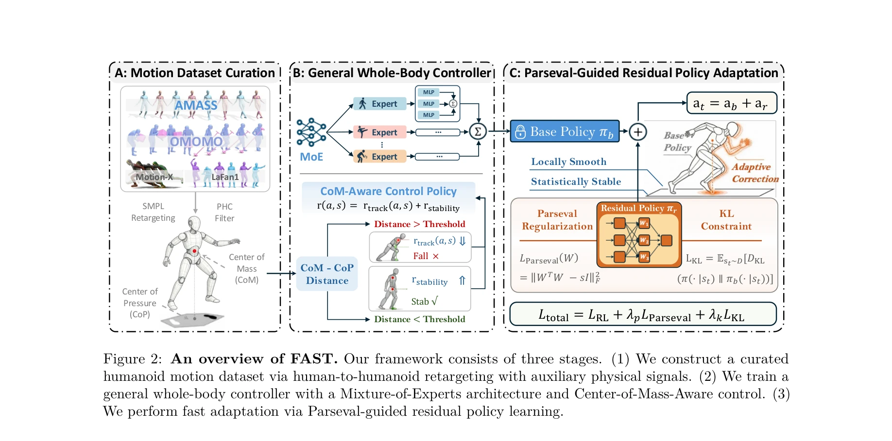
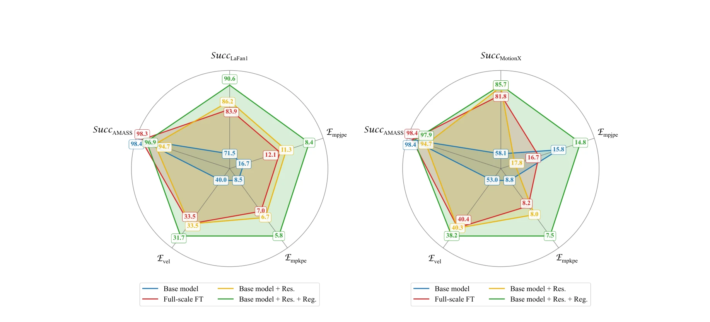

# General Humanoid Whole-Body Control via Pretraining and Fast Adaptation

> **저자**: Zepeng Wang, Jiangxing Wang, Shiqing Yao, Yu Zhang, Ziluo Ding, Ming Yang, Yuxuan Wang, Haobin Jiang, Chao Ma, Xiaochuan Shi, Zongqing Lu | **날짜**: 2026-02-12 | **DOI**: [10.48550/arXiv.2602.11929](https://doi.org/10.48550/arXiv.2602.11929)

---

## Essence

*Figure 2: An overview of FAST. Our framework consists of three stages. (1) We construct a curated*

FAST는 대규모 사전학습과 경량 잔차 정책 적응을 결합한 휴머노이드 로봇의 일반적인 전신 제어 프레임워크로, Parseval 정규화와 Center-of-Mass 인식 제어를 통해 분포 외 모션에 대한 빠른 적응과 강건한 균형을 동시에 달성한다.

## Motivation

- **Known**: 기존 휴머노이드 제어 방법들은 AMASS, OMOMO 등 정제된 모션 데이터셋에서 학습되며, 대규모 사전학습이나 작업별 학습을 통해 성능을 확보해왔다. 잔차 학습(residual learning)도 동역학 보정을 위해 널리 연구되었다.
- **Gap**: 실제 모션 참조는 비디오, 텍스트 생성, 텔레연산 등 이질적인 소스에서 오며 큰 분포 변화를 보이는데, 기존 방법들은 이러한 분포 외 모션에 대해 추적 실패를 겪거나 새로운 모션으로 적응할 때 성능 저하가 발생한다. 또한 추론 지연 및 계산 제약으로 인해 대규모 모델 배포가 어렵다.
- **Why**: 휴머노이드 로봇이 현실 환경에서 다양한 작업을 수행하려면 일반적이고 빠르게 적응 가능한 제어기가 필수적이며, 저지연 고주파 추론과 강건한 균형을 동시에 만족하는 솔루션이 필요하다.
- **Approach**: FAST는 (1) 대규모 모션 데이터셋 정제와 Center-of-Mass 신호 통합, (2) Mixture-of-Experts 구조와 CoM 인식 목적 함수를 갖춘 기본 정책 학습, (3) Parseval 정규화와 KL 제약을 적용한 경량 잔차 정책 적응의 세 단계로 구성된다.

## Achievement

*Figure 3: Fast adaptation on LaFan1 and MotionX (target) with performance retention on AMASS (source).*

- **일반화된 전신 제어**: 영점사격(zero-shot) 고동역학 모션 추적, 텍스트-모션 및 비디오 기반 모션, 실시간 원격조종 등 다양한 제어 시나리오를 통합 프레임워크로 지원
- **강건한 적응**: Parseval 정규화를 통한 직교성 제약과 KL 제약으로 분포 외 모션에 대한 빠른 적응을 가능하게 하면서 재앙적 망각(catastrophic forgetting) 완화
- **균형 강화**: Center-of-Mass와 Center-of-Pressure 거리를 모니터링하는 CoM 인식 제어로 물리적으로 부자연스러운 참조 모션에 대한 균형 성능 향상
- **실증적 검증**: 시뮬레이션 및 실제 휴머노이드 로봇 배포에서 기존 기준선(SONIC, GMT, KungfuBot2)을 강건성, 적응 효율성, 일반화에서 지속적으로 상회

## How

*Figure 2: An overview of FAST. Our framework consists of three stages. (1) We construct a curated*

- AMASS, OMOMO, LaFan1, Motion-X 등 공개 모션 데이터셋을 SMPL 형식의 인간-휴머노이드 망상(retargeting)을 통해 정제된 모션 데이터셋 구성
- Mixture-of-Experts(MoE) 아키텍처로 서로 다른 모션 분포 처리 및 전문화
- 추적 보상 r_track(a, s)과 안정성 보상 r_stability를 결합한 CoM 인식 보상 함수 설계
- 기본 정책 π_b 위에 경량 잔차 정책 π_r을 학습하되, L_Parseval = ||W^T W - sI||_F^2로 가중치 직교성 유지
- KL 발산 L_KL = 𝔼[D_KL(π(·|s_t) ∥ π_b(·|s_t))]로 기본 정책으로부터의 과도한 이탈 방지
- 최종 손실함수 L_total = L_RL + λ_p L_Parseval + λ_k L_KL로 세 목표의 균형 조절

## Originality

- **Parseval 정규화의 적용**: 신경망 가중치의 직교성을 명시적으로 강제하여 잔차 정책의 안정성을 보장하는 새로운 접근법
- **CoM 인식 제어**: Center-of-Mass와 Center-of-Pressure 기반의 명시적 안정성 객체를 도입하여 물리적 타당성이 낮은 모션에 대한 강건성 향상
- **통합 프레임워크**: 영점사격 추적, 빠른 적응, 실시간 원격조종을 하나의 일관된 프레임워크로 통합하고 경량성과 배포 가능성 유지
- **이질적 모션 소스 처리**: 비디오, 텍스트 생성, 라이브 원격조종 등 다양한 품질의 모션 참조를 효율적으로 처리하는 메커니즘

## Limitation & Further Study

- **모션 데이터셋 의존성**: 사전학습 성능이 AMASS, OMOMO 등 초기 데이터셋의 품질과 다양성에 크게 영존하며, 매우 이질적인 로봇 형태나 물리 특성으로의 일반화 범위 미제시
- **적응 데이터 요구량 미상**: Parseval 정규화와 KL 제약 하에서 효과적인 적응에 필요한 최소 데이터 양 및 적응 시간에 대한 명확한 분석 부재
- **실제 배포 환경 한계**: 실제 실험이 BeingBeyond의 특정 휴머노이드 플랫폼으로 제한되어 있으며, 다른 형태의 휴머노이드나 복잡한 지형에서의 성능 미평가
- **후속 연구 방향**: (1) 적응 효율성의 이론적 근거와 수렴 보장 제공, (2) 더 극단적인 분포 외 시나리오(예: 낙상 후 복구, 충격 대응) 구성, (3) 다중 휴머노이드 플랫폼 간 전이 학습 메커니즘 개발

## Evaluation

- Novelty: 4/5
- Technical Soundness: 3/5
- Significance: 4/5
- Clarity: 4/5
- Overall: 4/5

**총평**: FAST는 대규모 사전학습과 경량 적응을 균형있게 결합하면서 Parseval 정규화라는 새로운 수학적 도구를 도입하여 휴머노이드 전신 제어의 일반성과 강건성을 동시에 달성한 우수한 연구로, 시뮬레이션과 실제 배포 모두에서 강력한 성과를 입증했다.

## Related Papers

- 🏛 기반 연구: [[papers/1365_EGM_Efficiently_Learning_General_Motion_Tracking_Policy_for/review]] — EGM의 효율적 모션 추적 방법이 FAST의 일반적 전신 제어에서 다양한 동작에 대한 빠른 적응의 기반 기술이 된다.
- 🔗 후속 연구: [[papers/1375_Embodiment-Aware_Generalist_Specialist_Distillation_for_Unif/review]] — FAST의 사전학습-적응 프레임워크에 EAGLE의 embodiment-aware 방법을 적용하면 여러 로봇에 대한 빠른 적응이 가능하다.
- 🔄 다른 접근: [[papers/1510_KungfuBot2_Learning_Versatile_Motion_Skills_for_Humanoid_Who/review]] — 둘 다 일반적 휴머노이드 제어를 추구하지만 FAST는 사전학습-적응, OpenVLA는 대규모 vision-language-action 모델 기반이다.
- 🔄 다른 접근: [[papers/1365_EGM_Efficiently_Learning_General_Motion_Tracking_Policy_for/review]] — EGM은 효율적 데이터 활용과 MoE 구조에, FAST는 사전학습과 잔차 적응에 초점을 맞춰 일반적 제어를 달성한다.
- 🔗 후속 연구: [[papers/1509_OpenHelix_A_Short_Survey_Empirical_Analysis_and_Open-Source/review]] — Ground Slow, Move Fast의 dual-system foundation model과 OpenHelix의 dual-system VLA가 상호 보완적인 아키텍처 접근을 제시한다.
- 🔗 후속 연구: [[papers/1425_GMT_General_Motion_Tracking_for_Humanoid_Whole-Body_Control/review]] — GMT의 Adaptive Sampling과 Motion MoE는 General Humanoid Whole-Body Control의 일반적 제어 패러다임을 구체적으로 구현한다.
- 🔄 다른 접근: [[papers/1555_LHM-Humanoid_Learning_a_Unified_Policy_for_Long-Horizon_Huma/review]] — 두 논문 모두 사전학습을 통한 일반적 휴머노이드 제어를 다루지만, 장기간 통합 정책 vs 빠른 적응이라는 서로 다른 접근법을 제시함
- 🔗 후속 연구: [[papers/1567_Mechanical_Intelligence-Aware_Curriculum_Reinforcement_Learn/review]] — 일반적인 전신 제어 사전학습 개념을 병렬 구동 메커니즘이라는 특수한 하드웨어 구조에 맞춰 curriculum RL로 발전시킨 형태임
- 🔄 다른 접근: [[papers/1569_MetaWorld-X_Hierarchical_World_Modeling_via_VLM-Orchestrated/review]] — 사전학습된 일반화된 정책을 빠른 적응으로 특화시키는 접근법으로 계층적 전문가 정책과 다른 방식의 일반화 전략을 제시합니다.
- 🔄 다른 접근: [[papers/1396_FastTD3_Simple_Fast_and_Capable_Reinforcement_Learning_for_H/review]] — General Humanoid Control의 pretraining 접근과 FastTD3의 단순한 TD3 최적화가 서로 다른 humanoid training 전략
