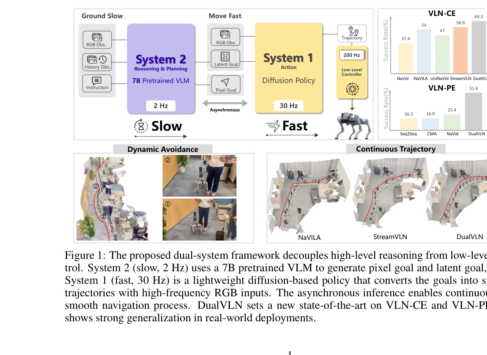
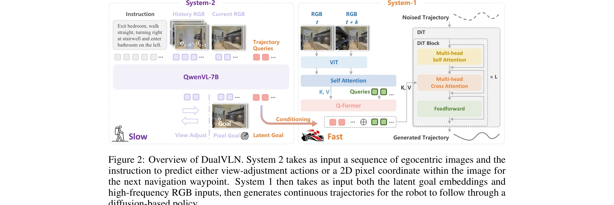

# Ground Slow, Move Fast: A Dual-System Foundation Model for Generalizable Vision-and-Language Navigation

> **저자**: Meng Wei, Chenyang Wan, Jiaqi Peng, Xiqian Yu, Yuqiang Yang, Delin Feng, Wenzhe Cai, Chenming Zhu, Tai Wang, Jiangmiao Pang, Xihui Liu | **날짜**: 2025-12-09 | **URL**: [https://arxiv.org/abs/2512.08186](https://arxiv.org/abs/2512.08186)

---

## Essence

*Figure 1: The proposed dual-system framework decouples high-level reasoning from low-level con-*

DualVLN은 Vision-Language Navigation을 위해 고수준 추론(System 2)과 저수준 제어(System 1)를 분리한 최초의 dual-system foundation model으로, VLM 기반 global planner와 Diffusion Transformer 기반 policy의 비동기 협력을 통해 실시간 제어와 동적 장애물 회피를 가능하게 한다.

## Motivation

- **Known**: 최근 VLM들이 VLN 분야의 generalization을 개선했으나, 기존 end-to-end 방식은 vision-language 입력을 직접 단기 이산 행동으로 매핑하여 단편적 움직임, 높은 지연시간, 동적 장애물 회피 어려움 등의 문제를 야기한다.
- **Gap**: 기존 VLA 모델들은 vision-language 추론, global planning, local control을 단일 파이프라인에 결합하여 계층적 의사결정의 명시적 조율이 부족하고, 실시간 제어와 agile control이 제한된다.
- **Why**: 실세계 로봇 배포에서는 부드러운 궤적 생성, 높은 주파수 제어, 동적 환경 적응이 필수적이므로, 추론과 제어의 explicit decoupling을 통해 각 모듈이 specialization할 수 있는 구조가 중요하다.
- **Approach**: System 2는 VLM(Qwen-VL-2.5)을 통해 image-grounded pixel goal을 예측하고, System 1은 lightweight Diffusion Transformer policy로 pixel goal과 latent goal features를 활용하여 smooth trajectory를 생성하는 비동기 구조를 채택한다.

## Achievement

*Figure 1: The proposed dual-system framework decouples high-level reasoning from low-level con-*

- **State-of-the-art 벤치마크 성능**: VLN-CE와 VLN-PE 벤치마크에서 모든 기존 방법을 상회하는 성능 달성 (VLN-CE에서 64.3%)
- **실시간 제어 및 동적 회피**: 30Hz로 작동하는 System 1이 200Hz low-level controller와 협력하여 실시간 장애물 회피 가능
- **Long-horizon planning과 generalization**: 실세계 로봇 실험에서 robust long-horizon instruction following과 unseen 환경에 대한 strong generalization 입증
- **사회적 인식 네비게이션**: 첫 Social-VLN 벤치마크 도입으로 humanoid agent와의 상호작용 시 task recovery 능력 평가
- **효율적 decoupled training**: System 2의 generalization을 보존하면서 System 1은 저수준 goal reaching 데이터만으로 학습 가능

## How

*Figure 2: Overview of DualVLN. System 2 takes as input a sequence of egocentric images and the*

- System 2: Qwen-VL-2.5 기반 farthest pixel goal grounding으로 mid-term waypoint 예측, view adjustment action을 통해 occlusion 처리
- System 1: Multi-modal conditioning Diffusion Transformer으로 현재 RGB 관찰과 latent goal embedding을 입력받아 noised trajectory에서 깨끗한 궤적 생성
- Dual-goal conditioning: 명시적 pixel goal로 interpretability 확보하고, 학습 가능한 latent queries를 통해 VLM의 hidden states에서 implicit goal feature 추출
- 비동기 inference: System 2는 2Hz, System 1은 30Hz로 작동하여 high-frequency local decision making 가능
- Decoupled training: System 2를 pixel goal task로 사전훈련 후 freeze하고, learnable latent queries를 prompt tuning으로 최적화하여 System 1 학습

## Originality

- Vision-Language Navigation 분야에서 처음으로 명시적 dual-system architecture 도입으로, slow reasoning과 fast control의 hierarchical decoupling 실현
- Pixel goal과 latent goal을 동시에 활용하는 hybrid conditioning 방식으로, 명시적 interpretability와 암시적 feature richness의 상승작용 달성
- Asynchronous dual-frequency 추론 (2Hz vs 30Hz) 구조로 실시간 동적 환경 적응 가능하게 함
- Social-VLN 벤치마크 신규 도입으로 humanoid agent와의 상호작용 시나리오에서 social awareness 평가
- Multiple robot platforms에서의 real-world deployment를 통해 sim-to-real transfer 검증

## Limitation & Further Study

- System 2의 2Hz 주기로 인한 planning latency가 존재하므로, 매우 빠른 dynamic obstacle에 대한 즉각적 대응은 System 1에 의존하는 trade-off 구조
- Latent query 학습을 위해 추가 prompt tuning이 필요하므로, fine-tuning 데이터 및 계산 비용이 추가로 발생
- Pixel goal grounding의 정확도가 System 1의 성능에 크게 영향을 미치나, occlusion이나 복잡한 실내 환경에서의 robust pixel coordinate 예측 방안이 제한적
- Social-VLN 벤치마크가 humanoid 에이전트 기반이므로, 실제 인간과의 상호작용 환경에서의 generalization 여부 미검증
- 후속 연구는 end-to-end 학습으로 System 1과 System 2의 더 긴밀한 상호작용, semantic scene understanding을 통한 long-horizon planning 개선, 및 multiple agent 환경에서의 확장성 탐구가 필요함

## Evaluation

- Novelty: 4/5
- Technical Soundness: 4/5
- Significance: 4/5
- Clarity: 4/5
- Overall: 4/5

**총평**: DualVLN은 Vision-Language Navigation 분야에서 VLM의 reasoning 능력과 diffusion policy의 real-time control 능력을 체계적으로 결합한 혁신적 접근법으로, 벤치마크와 실세계 실험 모두에서 뛰어난 성과를 입증하며 로봇 네비게이션의 실용적 배포에 큰 기여를 한다.

## Related Papers

- 🔄 다른 접근: [[papers/1428_Hume_Introducing_System-2_Thinking_in_Visual-Language-Action/review]] — 둘 다 dual-system 아키텍처로 System-1과 System-2를 분리하지만 DualVLN은 navigation에, Hume은 manipulation에 특화된 접근방식을 제시합니다.
- 🔗 후속 연구: [[papers/1421_Helix_A_Vision-Language-Action_Model_for_Generalist_Humanoid/review]] — GR00T N1이 제시한 dual-system VLA 아키텍처를 navigation 도메인에 특화하여 구현한 실제 사례입니다.
- 🏛 기반 연구: [[papers/1436_InstructVLA_Vision-Language-Action_Instruction_Tuning_from_U/review]] — VLA 모델의 instruction tuning 방법론을 dual-system에서 어떻게 효과적으로 적용할지에 대한 기반 연구입니다.
- 🏛 기반 연구: [[papers/1421_Helix_A_Vision-Language-Action_Model_for_Generalist_Humanoid/review]] — DualVLN의 dual-system 아키텍처가 GR00T N1의 System 1/2 구조 설계에 기반 아이디어를 제공합니다.
- 🔄 다른 접근: [[papers/1428_Hume_Introducing_System-2_Thinking_in_Visual-Language-Action/review]] — 둘 다 dual-system 구조이지만 Hume은 manipulation에, DualVLN은 navigation에 특화된 System-2 thinking을 구현합니다.
