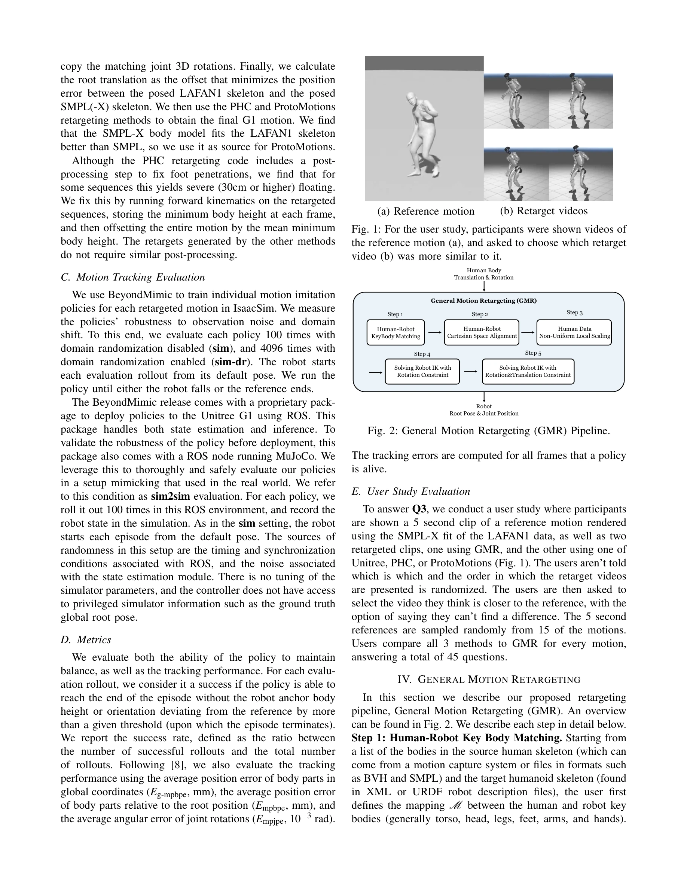

# General Motion Tracking for Humanoid Whole-Body Control

> **저자**:  | **날짜**:  | **URL**: [https://gmt-humanoid.github.io/](https://gmt-humanoid.github.io/)

---

## Essence

*Fig. 2: General Motion Retargeting (GMR) Pipeline.*

인간의 동작을 휴머노이드 로봇으로 변환하는 동작 리타게팅(Motion Retargeting) 품질이 로봇의 추적 성능에 미치는 영향을 체계적으로 분석하고, 기존 방법들의 문제점을 해결하는 GMR(General Motion Retargeting) 방법을 제안한다.

## Motivation

- **Known**: 휴머노이드 로봇의 동작 추적은 원격 조종 및 계층적 제어기의 핵심 요소이며, PHC와 ProtoMotions 같은 기존 리타게팅 방법들이 사용되고 있다. 그러나 발 미끄러짐, 자기관통, 물리적으로 불가능한 동작 같은 아티팩트들이 리타게팅 과정에서 발생한다.
- **Gap**: 기존 연구들은 광범위한 보상 엔지니어링과 도메인 랜더마이제이션으로 이러한 문제를 해결했으나, 리타게팅 품질이 정책 성능에 미치는 영향을 체계적으로 평가하지 않았다. 또한 현존하는 오픈소스 리타게팅 방법들의 구체적인 한계를 명확히 파악하지 못했다.
- **Why**: 고품질의 리타게팅은 보상 함수 엔지니어링 없이도 효과적인 동작 추적 정책을 학습 가능하게 하므로, 실제 로봇으로의 전환 난이도를 크게 낮출 수 있다. 또한 휴머노이드 로봇 제어의 실용성 강화에 중요하다.
- **Approach**: GMR은 비균등 지역 스케일링(non-uniform local scaling)을 사용하여 인간과 로봇의 크기 차이를 처리하고, 2단계 최적화를 통해 물리적으로 타당한 로봇 동작을 생성한다. BeyondMimic을 정책 학습에 사용하여 보상 튜닝 없이 리타게팅 방법들을 공정하게 비교 평가한다.

## Achievement

*Fig. 4: User study (N = 20) results for comparing GMR to*

- **GMR 방법 제안**: 비균등 지역 스케일링과 2단계 최적화를 통해 PHC와 ProtoMotions의 스케일링 문제를 해결하는 새로운 리타게팅 방법 개발
- **체계적인 영향도 분석**: 보상 튜닝 없이 LAFAN1 데이터셋의 21개 동작 시퀀스를 통해 리타게팅 품질이 정책 성공률에 미치는 영향을 정량화
- **성능 향상**: GMR은 발 관통, 자기교차, 급격한 속도 스파이크 같은 주요 아티팩트를 효과적으로 제거하여 오픈소스 방법들보다 높은 추적 성능과 낮은 추적 오류 달성
- **사용자 연구**: 20명의 참여자를 통해 리타게팅 동작의 지각적 충실도를 평가하고 리타게팅 품질과 정책 성공률의 상관관계 입증

## How

*Fig. 2: General Motion Retargeting (GMR) Pipeline.*

- SMPL 모델 기반 신체 피팅으로 초기 스케일링 수행
- 비균등 지역 스케일링으로 신체 부위별 크기 차이를 유연하게 처리
- 2단계 최적화: 1단계는 키 포인트 기반 거친 추적, 2단계는 접촉 제약을 고려한 정밀 추적
- BeyondMimic을 이용한 정책 학습으로 보상 함수 엔지니어링 배제
- 센서 노이즈, 모델 파라미터 오류, 네트워크 지연을 고려한 강건성 평가
- 초기 프레임의 영향을 분석하기 위해 동일한 동작에 대해 여러 초기 조건 테스트

## Originality

- 기존 리타게팅 방법들의 스케일링 아티팩트를 명확히 식별하고 분류한 첫 번째 체계적 분석 연구
- 보상 튜닝을 완전히 배제한 공정한 비교 프레임워크(BeyondMimic 활용) 제안
- 비균등 지역 스케일링 기법으로 기존의 균등 스케일링 방식의 한계 극복
- 지각적 충실도 사용자 연구와 동작 추적 성공률의 상관관계를 실증적으로 규명

## Limitation & Further Study

- 발 이외의 접촉을 포함하는 동작(손 접촉, 복잡한 상호작용)은 평가 대상에서 제외
- LAFAN1 데이터셋의 21개 시퀀스로 제한되어 더 다양한 인간 동작 범위에 대한 검증 필요
- 실제 로봇 환경에서의 전이(sim-to-real) 성능 검증 부재 - 시뮬레이션에서의 성공이 실제 로봇에서도 동일한지 미확인
- 초기 프레임의 영향이 중요한 요소로 발견되었으나 이를 자동으로 해결하는 방법론 제시 부족
- GMR이 Unitree 폐쇄소스 방법에 완전히 도달하지 못한 성능 격차 존재 - Unitree 방법의 상세 기법 접근 불가능으로 인한 한계

## Evaluation

- Novelty: 4/5
- Technical Soundness: 3/5
- Significance: 4/5
- Clarity: 4/5
- Overall: 4/5

**총평**: 본 논문은 휴머노이드 동작 추적 분야에서 리타게팅 품질의 중요성을 처음으로 체계적으로 입증하고, 실용적인 GMR 방법을 제안함으로써 보상 엔지니어링 없는 보다 직관적인 정책 학습을 가능하게 한다. 엄격한 성공 평가 기준과 다양한 강건성 테스트를 통한 신뢰도 높은 실험 설계가 돋보인다.

## Related Papers

- ⚖️ 반론/비판: [[papers/1405_From_Language_to_Locomotion_Retargeting-free_Humanoid_Contro/review]] — GMR의 motion retargeting 품질 개선 접근법이 RoboGhost의 retargeting-free 철학과 대비되어, 동작 변환의 두 가지 패러다임을 비교할 수 있다
- 🧪 응용 사례: [[papers/1379_Embracing_Evolution_A_Call_for_Body-Control_Co-Design_in_Emb/review]] — GMR의 일반적인 동작 리타게팅 기술이 co-design된 휴머노이드의 최적화된 물리 구조에 맞는 동작 적응에 직접 적용될 수 있다
- 🔗 후속 연구: [[papers/1425_GMT_General_Motion_Tracking_for_Humanoid_Whole-Body_Control/review]] — GMT의 전신 제어 방법론이 GMR의 동작 리타게팅 기술을 실제 휴머노이드 전신 동작 추적으로 확장한 구현체이다
- 🏛 기반 연구: [[papers/1379_Embracing_Evolution_A_Call_for_Body-Control_Co-Design_in_Emb/review]] — General Motion Retargeting의 동작 변환 기술이 co-design된 휴머노이드의 최적화된 물리 구조에 맞는 동작 생성에 필요한 기반 기술을 제공한다
- 🔗 후속 연구: [[papers/1594_Transferring_Foundation_Models_for_Generalizable_Robotic_Man/review]] — foundation model 기반 분할이 General Motion Tracking의 humanoid 제어와 결합되어 더 정교한 whole-body 조작을 가능하게 함
- ⚖️ 반론/비판: [[papers/1405_From_Language_to_Locomotion_Retargeting-free_Humanoid_Contro/review]] — RoboGhost의 retargeting-free 접근법이 기존 motion retargeting의 한계를 지적하며, GMR이 해결하려는 문제의 근본적 해결책을 제시한다
