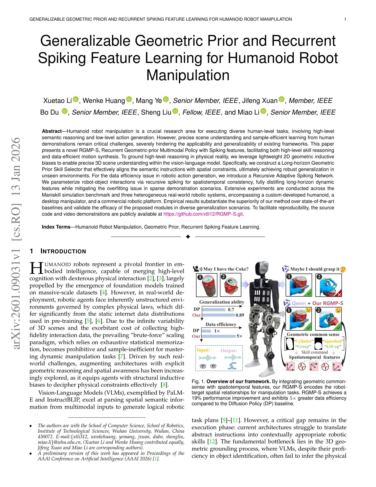
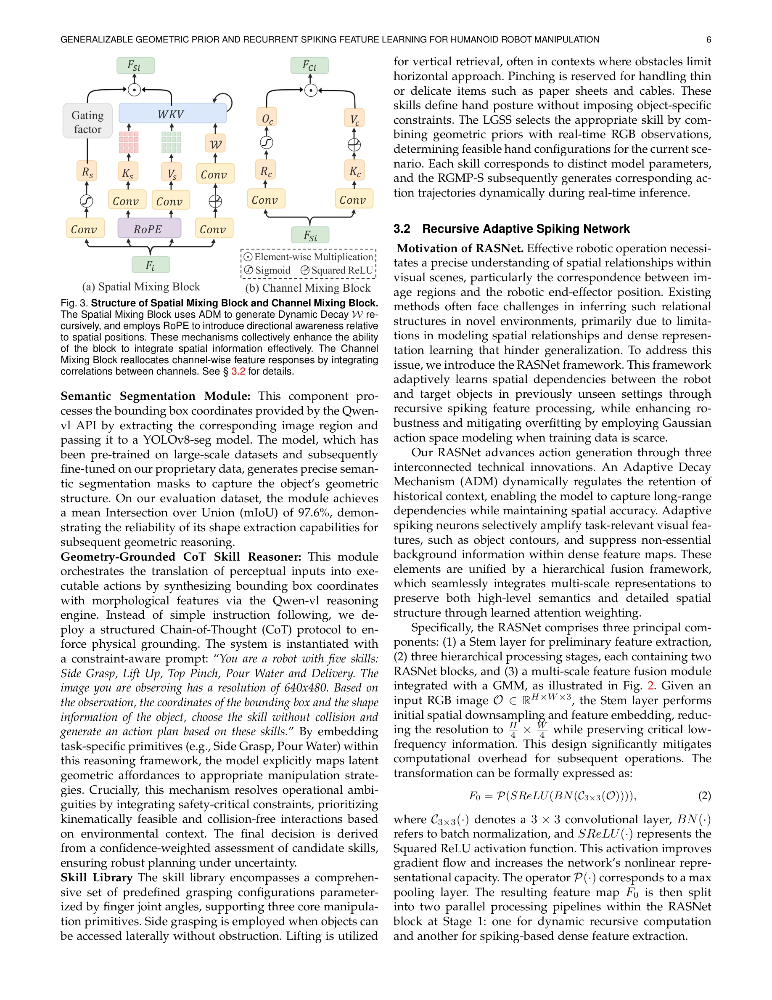

# Generalizable Geometric Prior and Recurrent Spiking Feature Learning for Humanoid Robot Manipulation

> **저자**: Xuetao Li, Wenke Huang, Mang Ye, Jifeng Xuan, Bo Du, Sheng Liu, Miao Li | **날짜**: 2026-01-13 | **URL**: [https://arxiv.org/abs/2601.09031](https://arxiv.org/abs/2601.09031)

---

## Essence

*Fig. 1. Overview of our framework. By integrating geometric common-*

본 논문은 인간형 로봇 조작을 위해 기하학적 추론과 시공간적 특징 학습을 결합한 RGMP-S 프레임워크를 제안하며, Long-horizon Geometric-prior Skill Selector와 Recursive Adaptive Spiking Network를 통해 고수준 의미 추론과 저수준 행동 생성을 동시에 해결한다.

## Motivation

- **Known**: Vision-Language Model(VLM)은 다중모달 입력에서 공간 의미 정보를 잘 파싱할 수 있고, Diffusion Policy는 고충실도 궤적 생성에 우수하지만 계산 비용이 높다. 또한 대규모 데이터 기반 스케일링은 효과적이지만 샘플 효율성이 낮다.
- **Gap**: 기존 VLM 기반 접근법은 3D 기하학적 추론의 부재로 물리적으로 실행 불가능한 계획을 생성하고, 제한된 시연 데이터로부터 데이터 효율적 학습과 견고한 일반화 간의 간극이 존재한다.
- **Why**: 인간형 로봇이 미지의 환경에서 다양한 조작 과제를 안정적으로 수행하려면 기하학적 제약을 이해하고 적은 데이터로도 일반화 가능한 정책이 필수적이기 때문이다.
- **Approach**: 2D 기하학적 귀납 편향을 통해 VLM 내 3D 장면 이해를 강화하고, Recursive Adaptive Spiking Network를 도입하여 robot-object 상호작용의 시공간적 일관성을 포착하면서 희소 시연 데이터에서의 과적합을 완화한다.

## Achievement

*Fig. 1. Overview of our framework. By integrating geometric common-*

- **기하학적 추론 기반 기술 선택**: Long-horizon Geometric-prior Skill Selector를 통해 의미적 지시사항을 공간 제약과 정렬하여 기하학적으로 타당한 조작 원시(primitive)를 선택
- **데이터 효율성 개선**: Recursive Adaptive Spiking Network로 Diffusion Policy 대비 5배 높은 데이터 효율성 달성
- **성능 향상**: Maniskill 시뮬레이션과 세 가지 이질적 실제 로봇 플랫폼에서 SOTA 대비 19% 성능 개선
- **광범위한 검증**: 맞춤형 인간형 로봇, 데스크톱 매니퓰레이터, 상용 로봇 플랫폼을 아우르는 다양한 로봇 시스템에서 일반화 능력 검증

## How

*Fig. 3. Structure of Spatial Mixing Block and Channel Mixing Block.*

- VLM에 경량 2D 기하학적 귀납 편향을 통합하여 RGB 입력에서 3D 공간 정보를 암묵적으로 추출
- Long-horizon Geometric-prior Skill Selector는 규칙 기반 제약 조건을 통해 기하학적 가능성을 검증하는 의사결정 프로세스 구현
- Recursive Adaptive Spiking Network를 사용하여 robot-object 상호작용을 재귀적 스파이킹으로 매개변수화하고 시공간적 일관성 보장
- Spatial Mixing Block과 Channel Mixing Block으로 구성된 구조를 통해 작업 관련 특징을 강조하고 배경 잡음 억제
- 희소 시연 데이터에서 장기 동적 특징을 효과적으로 추출하면서 그래디언트 소실 문제 완화

## Originality

- 기하학적 추론과 VLM을 명시적으로 통합하여 물리적 실행 가능성을 검증하는 새로운 접근법
- Spiking dynamics를 통해 시공간적 특징을 추출함으로써 기존 순환 신경망의 한계(그래디언트 소실) 극복
- 장기 조작 과제에서 기하학적 제약과 의미적 추론을 동시에 처리하는 통합 프레임워크 제시
- 맞춤형 인간형 로봇을 포함한 다양한 실제 로봇 플랫폼에서의 광범위한 검증

## Limitation & Further Study

- 2D 기하학적 귀납 편향은 복잡한 3D 장면이나 심각한 폐색 상황에서의 성능 저하 가능성
- Recursive Adaptive Spiking Network의 계산 복잡도 및 메모리 요구사항에 대한 상세한 분석 부재
- VLM 세부 조정(fine-tuning)에 필요한 규칙 기반 제약 조건 설계의 일반화 가능성 미검토
- 후속 연구: 3D 명시적 재구성과 암묵적 특징 추출의 최적 조합 모색, 다양한 도메인에서 규칙 기반 제약의 자동화 방법 개발

## Evaluation

- Novelty: 4/5
- Technical Soundness: 3/5
- Significance: 4/5
- Clarity: 4/5
- Overall: 4/5

**총평**: 본 논문은 기하학적 추론과 효율적 시공간 학습을 결합하여 인간형 로봇 조작의 핵심 과제들을 체계적으로 해결하며, 다양한 실제 로봇 플랫폼에서의 광범위한 검증을 통해 높은 실용성과 일반화 능력을 입증한다.

## Related Papers

- 🔄 다른 접근: [[papers/1455_HoRD_Robust_Humanoid_Control_via_History-Conditioned_Reinfor/review]] — 둘 다 로봇의 robust control을 추구하지만 RGMP-S는 geometric prior에, HoRD는 history conditioning에 기반한 다른 접근법입니다.
- 🏛 기반 연구: [[papers/1456_LERF_Language_Embedded_Radiance_Fields/review]] — LERF의 언어-기하학 통합 방법론이 geometric prior와 언어 추론을 결합하는 RGMP-S의 이론적 기반입니다.
- 🏛 기반 연구: [[papers/1473_MC-JEPA_A_Joint-Embedding_Predictive_Architecture_for_Self-S/review]] — MC-JEPA의 self-supervised 시각 표현 학습이 geometric reasoning에 필요한 robust feature를 제공합니다.
- 🔗 후속 연구: [[papers/1435_Instruct2Act_Mapping_Multi-modality_Instructions_to_Robotic/review]] — 언어 지시를 로봇 행동으로 변환하는 과정에서 LLM의 인터랙티브 환경 활용이 공통적이다.
- 🏛 기반 연구: [[papers/1456_LERF_Language_Embedded_Radiance_Fields/review]] — 언어-기하학 통합 방법론이 geometric prior와 language reasoning을 결합하는 RGMP-S의 이론적 기반을 제공합니다.
- 🔗 후속 연구: [[papers/1473_MC-JEPA_A_Joint-Embedding_Predictive_Architecture_for_Self-S/review]] — MC-JEPA의 motion-aware visual representation이 geometric reasoning과 결합되어 더 robust한 robot learning을 제공합니다.
- 🧪 응용 사례: [[papers/1561_SayPlan_Grounding_Large_Language_Models_using_3D_Scene_Graph/review]] — Grounding Large Language Models이 SayPlan의 3D scene graph grounding을 interactive 환경에서 구체적으로 적용한다.
- 🏛 기반 연구: [[papers/1353_Describe_Explain_Plan_and_Select_Interactive_Planning_with_L/review]] — Grounding Large Language Models는 DEPS의 오픈월드 환경에서 LLM 기반 대화형 계획의 이론적 토대를 제공한다
- 🔄 다른 접근: [[papers/1455_HoRD_Robust_Humanoid_Control_via_History-Conditioned_Reinfor/review]] — 둘 다 robust humanoid control이지만 HoRD는 history conditioning에, RGMP-S는 geometric prior에 기반한 다른 접근법입니다.
