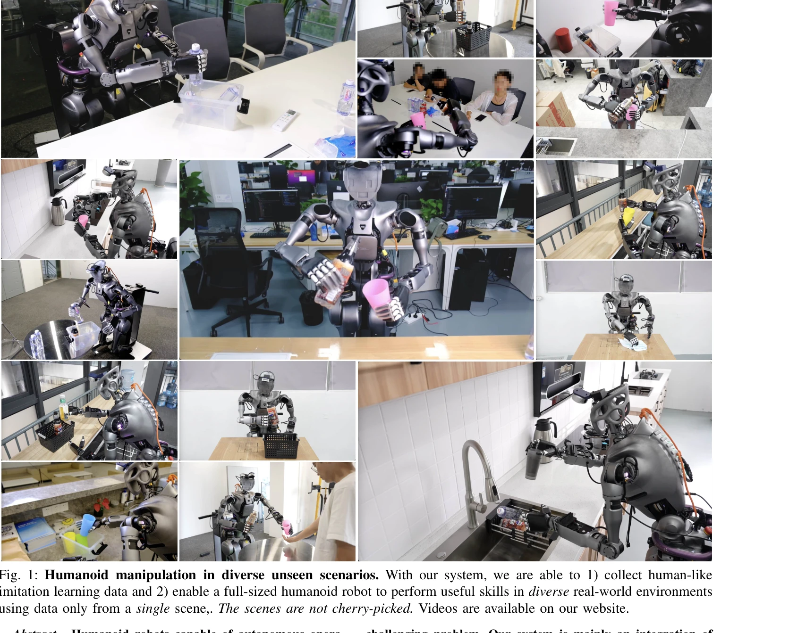
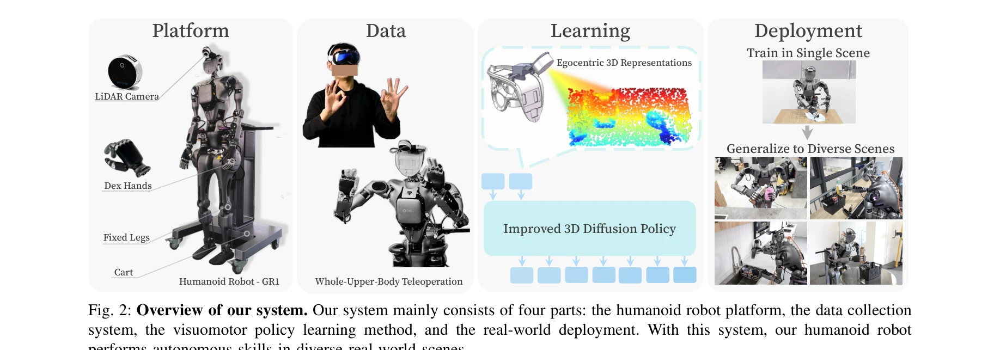

# Generalizable Humanoid Manipulation with 3D Diffusion Policies

> **저자**: Yanjie Ze, Zixuan Chen, Wenhao Wang, Tianyi Chen, Xialin He, Ying Yuan, Xue Bin Peng, Jiajun Wu | **날짜**: 2024-10-14 | **URL**: [https://arxiv.org/abs/2410.10803](https://arxiv.org/abs/2410.10803)

---

## Essence

*Fig. 1: Humanoid manipulation in diverse unseen scenarios. With our system, we are able to 1) collect human-like*

Humanoid로봇이 단일 장면의 데이터만으로 다양한 미지의 실제 환경에서 조작 작업을 수행할 수 있도록, 전신 텔레오퍼레이션 시스템, 3D LiDAR 기반 플랫폼, 그리고 개선된 3D Diffusion Policy (iDP3) 알고리즘을 통합한 실제 로봇 시스템을 구축했다.

## Motivation

- **Known**: Humanoid 로봇의 하드웨어 개발과 텔레오퍼레이션 시스템이 발전했으나, 학습 방법의 제한된 일반화 능력과 데이터 수집의 높은 비용으로 인해 조작 기술이 훈련 장면에만 국한되어 있다.
- **Gap**: 기존 humanoid 로봇 연구들(HumanPlus, OmniH2O 등)은 단일 장면에서만 조작 기술을 습득하며, 미지의 장면으로의 일반화를 위해서는 여러 장면의 데이터가 필요했다. 하나의 장면만으로 다양한 실제 환경에서 일반화되는 humanoid 조작 능력은 아직 달성되지 못했다.
- **Why**: 실제 환경에서 자율적으로 동작 가능한 humanoid 로봇을 실현하려면 데이터 효율성과 장면 일반화 능력이 필수적이며, 이는 로봇 공학의 오랜 목표이면서도 실제 구현이 매우 어려운 문제이다.
- **Approach**: 3D LiDAR 기반의 egocentric 표현을 활용하여 카메라 보정 불필요한 3D Diffusion Policy를 개발하고, 전신 텔레오퍼레이션으로 수집한 인간과 유사한 데이터로 학습한 뒤, 높이 조절 가능한 카트 기반 humanoid 플랫폼에서 2000회 이상의 실제 평가를 통해 검증했다.

## Achievement

*Fig. 1: Humanoid manipulation in diverse unseen scenarios. With our system, we are able to 1) collect human-like*

- **단일 장면 일반화**: 하나의 장면에서만 수집한 데이터로 25-DoF humanoid 로봇이 부엌, 회의실, 사무실 등 다양한 미지의 실제 환경에서 조작 작업을 성공적으로 수행
- **개선된 3D Diffusion Policy (iDP3)**: 기존 DP3의 카메라 보정과 점군 분할 요구사항을 제거하고 egocentric 3D 표현을 활용하여 실제 humanoid 로봇에 적용 가능한 형태로 재구성
- **전신 텔레오퍼레이션 시스템**: Apple Vision Pro를 활용하여 머리, 허리, 팔, 손을 포함한 전체 상반신(25-DoF)의 인간과 유사한 데이터 수집 체계 구축
- **엄격한 평가**: 2253회의 실제 로봇 에피소드를 통한 정밀한 정책 평가로 기존 연구(최대 540회)보다 4배 이상 많은 실제 데이터에서의 검증 수행
- **온보드 컴퓨팅**: 외부 인프라 없이 로봇 자체의 계산 자원으로만 정책 실행 가능

## How

*Fig. 2: Overview of our system. Our system mainly consists of four parts: the humanoid robot platform, the data collecti*

- **Humanoid 로봇 플랫폼**: Fourier GR1 로봇을 높이 조절 가능한 카트에 고정하여 상반신 안정성 확보 및 허리 자유도 활용 가능
- **3D LiDAR 센서**: RealSense L515를 로봇 머리에 장착하여 high-quality 점군 기반 egocentric 비전 제공
- **전신 텔레오퍼레이션 매핑**: Apple Vision Pro에서 인간의 머리, 손, 손목 위치를 추적하고 Relaxed IK를 통해 로봇 관절각으로 변환, 실시간 로봇 비전 피드백 제공
- **iDP3 알고리즘**: egocentric 점군에서 3D voxel 기반 표현 학습, diffusion policy를 통한 조작 정책 학습, 카메라 보정 및 수동 점군 분할 제거
- **데이터 수집**: 텔레오퍼레이션 중 관찰(점군, 이미지, 관절 위치)과 행동(목표 관절 위치) 쌍을 기록
- **정책 평가**: 학습된 정책을 다양한 미지의 장면에서 zero-shot으로 배포하여 일반화 능력 검증

## Originality

- **최초의 단일 장면 일반화**: Humanoid 로봇이 하나의 장면 데이터만으로 미지의 여러 장면에서 조작 기술을 일반화하는 것을 최초로 달성
- **전신 텔레오퍼레이션 + 3D Learning**: 허리와 머리를 포함한 전신 텔레오퍼레이션과 egocentric 3D Diffusion Policy의 결합으로 기존 팔-손 중심 시스템의 한계 극복
- **Egocentric 3D 표현**: 카메라 보정 불필요한 egocentric point cloud 기반 iDP3 개발로 실제 humanoid 로봇 배포의 실용성 향상
- **대규모 실제 평가**: 2000회 이상의 실제 로봇 에피소드를 통한 엄격한 검증으로 시뮬레이션-현실 갭 최소화

## Limitation & Further Study

- **다리 제외**: 안정성을 위해 humanoid 다리를 비활성화하고 높이 조절 가능한 카트 사용으로, 로코-매니퓰레이션 능력 부재
- **텔레오퍼레이션 레이턴시**: LiDAR 센서로 인한 ~0.5초 지연이 데이터 수집 품질에 영향, 다중 센서 사용 불가능
- **점군 정확도**: RealSense L515도 완벽하지 않은 점군 생성, 다른 LiDAR(Livox Mid-360 등)는 해상도와 주파수 부족으로 적용 불가
- **제한된 작업 범위**: 높이 조절 카트로 인해 복잡한 전신 제어가 필요한 작업에는 확장 어려움
- **후속 연구 필요**: 전신 제어 기술 성숙 후 다리 포함 시스템으로 확장, 다양한 humanoid 플랫폼 적용 검증, 더 복잡한 작업으로의 확대

## Evaluation

- Novelty: 4/5
- Technical Soundness: 3/5
- Significance: 4/5
- Clarity: 4/5
- Overall: 4/5

**총평**: 이 연구는 humanoid 로봇의 실제 조작 일반화라는 중요한 문제를 처음으로 해결하였으며, 전신 텔레오퍼레이션, 3D LiDAR 기반 플랫폼, 개선된 diffusion policy의 체계적 통합으로 높은 수준의 기술적 기여를 이루었다. 2000회 이상의 실제 로봇 평가와 다양한 미지 환경에서의 성공적 배포는 방법론의 실용성을 강력하게 입증한다.

## Related Papers

- 🔄 다른 접근: [[papers/1426_HumanPlus_Humanoid_Shadowing_and_Imitation_from_Humans/review]] — 3D LiDAR 기반 플랫폼과 3D Diffusion Policy를 사용한 일반화 가능한 조작과 HumanPlus의 RGB 카메라만을 활용한 접근법은 센서 모달리티 측면에서 대조적인 방법론입니다.
- 🔗 후속 연구: [[papers/1437_Hand-Eye_Autonomous_Delivery_Learning_Humanoid_Navigation_Lo/review]] — 3D Diffusion Policy 기반 일반화 가능한 조작 기술은 HEAD의 모듈식 고수준-저수준 정책 분리 구조와 결합하여 더욱 복합적인 loco-manipulation 작업을 수행할 수 있습니다.
- 🔄 다른 접근: [[papers/1426_HumanPlus_Humanoid_Shadowing_and_Imitation_from_Humans/review]] — HumanPlus의 RGB 카메라만을 활용한 단순한 센서 구성과 3D LiDAR 플랫폼 기반의 복합 센서 시스템은 휴머노이드 인지를 위한 서로 다른 접근법입니다.
- 🔄 다른 접근: [[papers/1437_Hand-Eye_Autonomous_Delivery_Learning_Humanoid_Navigation_Lo/review]] — HEAD의 모듈식 고저수준 정책 분리와 3D Diffusion Policy의 통합적 접근법은 humanoid loco-manipulation을 위한 서로 다른 아키텍처 설계 철학을 보여줍니다.
