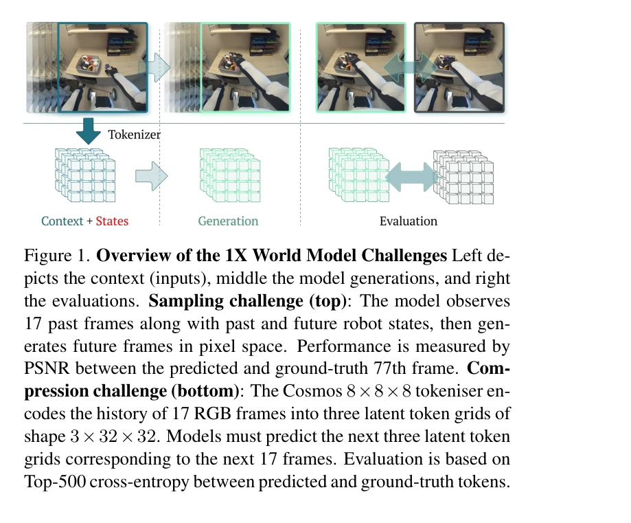
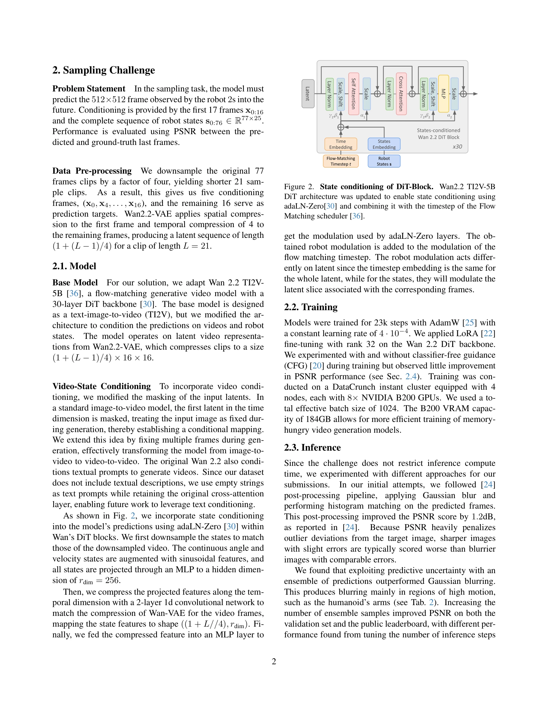

# Generative World Modelling for Humanoids: 1X World Model Challenge Technical Report

> **저자**: Riccardo Mereu, Aidan Scannell, Yuxin Hou, Yi Zhao, Aditya Jitta, Antonio Dominguez, Luigi Acerbi, Amos Storkey, Paul Chang | **날짜**: 2025-10-08 | **URL**: [https://arxiv.org/abs/2510.07092](https://arxiv.org/abs/2510.07092)

---

## Essence

*Figure 1. Overview of the 1X World Model Challenges Left de-*

1X World Model Challenge에서 Wan-2.2 TI2V-5B 기반의 video-state-conditioned future frame prediction 모델과 Spatio-Temporal Transformer 모델을 통해 샘플링 및 압축 트랙 모두에서 1위를 달성한 기술 보고서.

## Motivation

- **Known**: World model은 로봇이 미래를 예측하고 계획할 수 있게 하는 강력한 패러다임이며, 최근 generative modeling 기반 접근법들(autoregressive transformer, diffusion, flow-based)이 발전하고 있다.
- **Gap**: 실제 humanoid 상호작용에 대한 벤치마크가 부족하며, 픽셀 공간 예측과 discrete latent space 예측을 동시에 평가하는 통합적 평가 체계가 필요하다.
- **Why**: Humanoid 로봇의 실시간 제어와 계획 수립을 위해서는 정확하고 효율적인 world model이 필수적이며, 이는 robotics 분야에서 자율주행과 의사결정 능력을 향상시킨다.
- **Approach**: AdaLN-Zero를 이용한 robot state 조건화로 Wan-2.2 TI2V-5B를 적응시켰으며, 압축 트랙에서는 Spatio-Temporal Transformer를 처음부터 학습하여 discrete latent code 예측에 특화시켰다.

## Achievement

*Figure 2. State conditioning of DiT-Block. Wan2.2 TI2V-5B*

- **Sampling Track 우승**: 23.0 dB PSNR 달성으로 2위 대비 1.44 dB 향상
- **Compression Track 우승**: Top-500 CE 6.6386 달성으로 2위 대비 0.86 개선
- **Ensemble 기반 추론**: 예측 불확실성을 활용한 앙상블로 Gaussian blur 기반 후처리보다 우수한 성능 달성
- **다중 평가 메트릭**: PSNR, SSIM, LPIPS, FID 등으로 다각적 검증

## How

*Figure 2. State conditioning of DiT-Block. Wan2.2 TI2V-5B*

- Wan-2.2 TI2V-5B의 Flow-Matching 기반 DiT 아키텍처를 video-state 조건화로 확장
- Robot state를 sinusoidal feature로 증강하고 MLP를 통해 256차원으로 투영
- 1D convolutional network으로 state feature를 VAE 압축 스케일과 정렬
- AdaLN-Zero를 사용하여 timestep embedding과 robot modulation 결합
- LoRA rank-32로 Wan-2.2 DiT backbone 미세조정 (23k step)
- Classifier-free guidance 실험 후 비적용 결정
- 20-100개 샘플의 앙상블로 예측 결과 평균화
- 압축 트랙: Cosmos 8×8×8 tokenizer로 인코딩된 discrete token grid 예측

## Originality

- Text-to-Video 모델(Wan-2.2 TI2V)을 처음으로 robot state 조건화가 있는 video-to-video 예측으로 변환
- AdaLN-Zero를 활용한 novel한 robot state 통합 방식으로 spatial-temporal 정보 모두 활용
- Predictive uncertainty를 활용한 앙상블 기반 추론으로 image blur 후처리보다 우수한 결과 달성
- 184GB VRAM의 B200 GPU 클러스터를 활용한 대규모 배치 학습 (batch size 1024)

## Limitation & Further Study

- 논문이 기술 보고서로서 이론적 분석과 ablation study가 제한적
- CFG의 비효율성에 대한 심층적 분석 부재 (단순 'little improvement' 언급)", 'Ensemble 샘플 수와 inference step의 trade-off에 대한 이론적 근거 부족
- Compression track의 ST-Transformer 구조 세부사항이 본문에서 미흡 (Figure 3만 언급)
- 일반화 성능: 특정 1X humanoid 데이터셋에만 최적화되어 다른 로봇 플랫폼으로의 전이 학습 검증 없음
- 후속 연구: Text prompt를 활용한 conditioning 방식의 실제 적용, 실시간 inference 최적화, 다양한 robot morphology에 대한 generalization 연구 필요

## Evaluation

- Novelty: 3/5
- Technical Soundness: 4/5
- Significance: 4/5
- Clarity: 4/5
- Overall: 4/5

**총평**: 이 보고서는 기존의 강력한 기초 모델(Wan-2.2 TI2V)을 창의적으로 적응시켜 humanoid world modeling의 두 가지 중요한 과제 모두에서 우수한 성과를 달성했으며, 특히 AdaLN-Zero 기반 state 통합과 예측 불확실성 활용 앙상블은 실용적 가치가 높다.

## Related Papers

- 🔄 다른 접근: [[papers/1308_CLoSD_Closing_the_Loop_between_Simulation_and_Diffusion_for/review]] — Generative World Modelling for Humanoids는 LEO와 유사한 3D 구체화 에이전트이지만 인간형 로봇에 특화된 생성형 접근법을 사용한다
- 🔄 다른 접근: [[papers/1517_PointWorld_Scaling_3D_World_Models_for_In-The-Wild_Robotic_M/review]] — Generative World Modelling for Humanoids와 PointWorld는 모두 로봇을 위한 세계 모델 구축에서 서로 다른 표현 방식을 제시한다.
- 🔗 후속 연구: [[papers/1524_Reactive_Diffusion_Policy_Slow-Fast_Visual-Tactile_Policy_Le/review]] — 촉각 피드백과 시각 정보를 통합한 RDP 접근법이 삼중 계층 구조의 H³DP로 더욱 복잡한 visuomotor 정책으로 발전할 수 있다.
- 🔗 후속 연구: [[papers/1596_TriVLA_A_Triple-System-Based_Unified_Vision-Language-Action/review]] — TriVLA의 triple-system 아키텍처가 Generative World Modelling의 humanoid 세계 모델과 결합되어 더 포괄적인 embodied intelligence를 달성할 수 있음
- 🏛 기반 연구: [[papers/1630_WMNav_Integrating_Vision-Language_Models_into_World_Models_f/review]] — WMNav의 VLM 기반 world model이 Generative World Modelling for Humanoids의 세계 모델 원리를 navigation 작업에 특화하여 구현
- 🔗 후속 연구: [[papers/1595_OmniXtreme_Breaking_the_Generality_Barrier_in_High-Dynamic_H/review]] — 휴머노이드를 위한 생성형 월드 모델링이 OmniXtreme의 고동역 동작 생성을 위한 환경 예측 능력을 확장할 수 있습니다.
