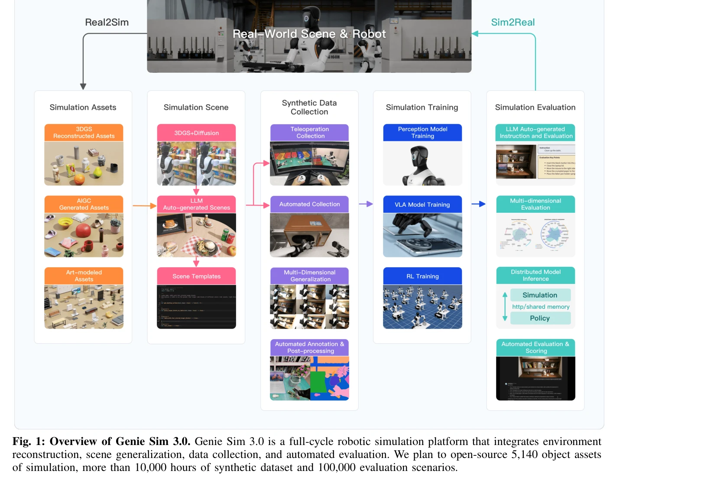
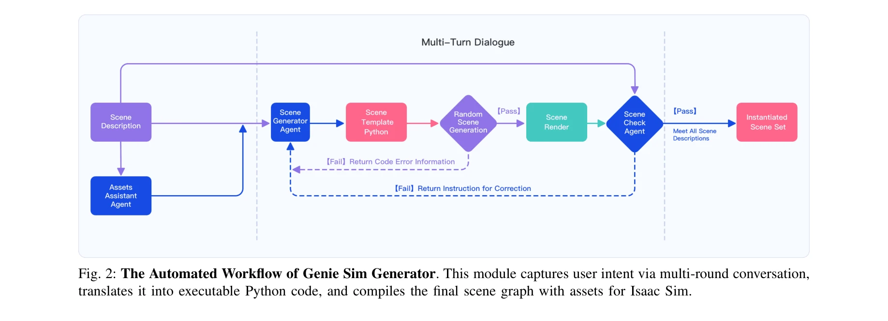

# Genie Sim 3.0 : A High-Fidelity Comprehensive Simulation Platform for Humanoid Robot

> **저자**: Chenghao Yin, Da Huang, Di Yang, Jichao Wang, Nanshu Zhao, Chen Xu, Wenjun Sun, Linjie Hou, Zhijun Li, Junhui Wu, Zhaobo Liu, Zhen Xiao, Sheng Zhang, Lei Bao, Rui Feng, Zhenquan Pang, Jiayu Li, Qian Wang, Maoqing Yao | **날짜**: 2026-01-05 | **URL**: [https://arxiv.org/abs/2601.02078](https://arxiv.org/abs/2601.02078)

---

## Essence

*Fig. 1: Overview of Genie Sim 3.0. Genie Sim 3.0 is a full-cycle robotic simulation platform that integrates environment*

Genie Sim 3.0은 LLM 기반의 자동 장면 생성, VLM 기반의 평가, 10,000시간 이상의 합성 데이터를 제공하는 휴머노이드 로봇 조작용 통합 시뮬레이션 플랫폼이며, 강력한 sim-to-real 전이 능력을 입증한다.

## Motivation

- **Known**: 로봇 학습은 대규모 다양한 학습 데이터와 신뢰할 수 있는 평가 벤치마크가 필요하며, 현존하는 시뮬레이션 벤치마크들은 단편화, 제한된 범위, 불충분한 충실도 문제를 겪고 있다.
- **Gap**: 고충실도 시뮬레이션 환경 생성은 3D 모델링 전문가의 수작업이 필요하고, 자동 생성은 세밀한 제어가 부족하며, 현재 평가 방식은 고정된 지표에 의존하여 작업 완성의 미묘한 차이를 포착하지 못한다.
- **Why**: 합성 데이터의 대규모 확보와 자동화된 평가 시스템은 로봇 정책 학습 개발 사이클을 가속화하고 실제 환경 배포 시 신뢰성 높은 성능을 보장할 수 있다.
- **Approach**: 자연 언어 지시를 통한 LLM 기반 Genie Sim Generator로 고충실도 장면을 자동 생성하고, LLM과 VLM을 활용한 자동 평가 파이프라인을 구축하며, 다양한 도메인 랜더마이제이션을 통해 대규모 합성 데이터를 수집한다.

## Achievement

*Fig. 1: Overview of Genie Sim 3.0. Genie Sim 3.0 is a full-cycle robotic simulation platform that integrates environment*

- **Genie Sim Generator**: 자연 언어 인터페이스를 통해 고충실도 시뮬레이션 장면을 실시간으로 생성하고 다회 상호작용을 지원하여 장면 생성 효율성을 크게 향상시킨다
- **다차원 장면 일반화**: 단일 생성 장면에서 조명, 배경, 레이아웃, 자세, 궤적, 센서 노이즈, 로봇 형태 등을 매개변수화하여 분 단위로 대규모 다양한 시나리오를 생성한다
- **자동화된 평가 벤치마크**: 100,000개 이상의 시뮬레이션 시나리오 기반의 확장 가능한 벤치마크로 의미 이해, 공간 추론, 작동 실행을 포함한 다차원 역량 프로필을 구성한다
- **Sim-to-Real 전이**: 10,000시간 이상의 합성 데이터와 체계적 실험을 통해 제어된 조건 하에서 합성 데이터가 실제 로봇 데이터의 대체 가능성을 입증한다
- **포괄적 오픈소스 공개**: 5,140개 자산, 10,000시간 이상의 데이터셋, 100,000개 이상의 평가 시나리오, 완전한 코드베이스를 공개하여 커뮤니티 발전을 가속화한다

## How

*Fig. 2: The Automated Workflow of Genie Sim Generator. This module captures user intent via multi-round conversation,*

- LLM을 활용하여 자연 언어 지시로부터 의미론적 정보를 추출하고 시뮬레이션 환경 구성으로 변환
- 3D 재구성과 시각 생성 합성을 통한 고충실도 시뮬레이션 구현
- domain randomization을 다차원으로 적용하여 조명, 배경, 물체 위치, 센서 노이즈 등 변수 자동 조절
- LLM 기반 작업 지시 자동 생성 및 VLM 기반 작업 완성도 자동 평가 파이프라인 구축
- 원격 조작과 자동화의 이중 모드 데이터 수집 파이프라인 구성
- Vision-Language-Action (VLA) 모델을 위한 폐루프 평가 체계 구축

## Originality

- LLM 기반 자동 장면 생성과 평가에 적용한 첫 벤치마크 제시
- 자연 언어를 통한 다차원 domain randomization 자동화로 기존 절차적 생성의 제어성 한계 극복
- VLM을 평가 메트릭 설계에 활용하여 고정된 지표를 넘어선 유연한 평가 방식 도입
- 10,000시간 규모의 합성 데이터에서 zero-shot sim-to-real 전이 성공 입증
- scene generation, evaluation, data acquisition, model assessment를 통합한 full-cycle 플랫폼 제시

## Limitation & Further Study

- 실제 물리 환경의 모든 복잡한 특성(동역학, 텍스처, 조명)을 완벽히 재현하기 어려워 특정 작업 또는 환경에서는 여전히 sim-to-real 갭이 존재할 수 있음
- LLM과 VLM의 정확도에 의존하므로 이들 모델의 오류가 장면 생성 및 평가 결과에 전파될 가능성
- 평가에 사용된 100,000개 시나리오가 충분히 다양한 현실 환경을 대표하는지에 대한 검증 필요
- 후속 연구로는 미래 예측, 동적 상호작용, 손실 함수 설계를 위한 더 정교한 시뮬레이션 피직스 모델 개발 필요
- 다양한 로봇 플랫폼과 구체적 산업 응용에 대한 적용 가능성 검증 확대 필요

## Evaluation

- Novelty: 4/5
- Technical Soundness: 4/5
- Significance: 4/5
- Clarity: 4/5
- Overall: 4/5

**총평**: Genie Sim 3.0은 LLM/VLM을 활용한 자동화된 장면 생성, 평가, 데이터 수집 전 과정을 통합하여 로봇 학습의 확장성 문제를 체계적으로 해결한 선도적 플랫폼이며, 10,000시간의 합성 데이터와 강력한 sim-to-real 전이 성능으로 실무적 가치를 입증한다.

## Related Papers

- 🔄 다른 접근: [[papers/1315_AutoRT_Embodied_Foundation_Models_for_Large_Scale_Orchestrat/review]] — 대규모 로봇 데이터 수집과 시뮬레이션 환경을 통한 정책 학습의 서로 다른 접근 방식을 보여준다.
- 🏛 기반 연구: [[papers/1360_Diffusion_Models_Are_Real-Time_Game_Engines/review]] — 실시간 게임 엔진으로서의 diffusion 모델이 Genie Sim 3.0의 시뮬레이션 환경 구축에 이론적 기반을 제공한다.
- 🔗 후속 연구: [[papers/1412_GR00T_N1_An_Open_Foundation_Model_for_Generalist_Humanoid_Ro/review]] — GaussGym과 함께 실제-시뮬레이션 간 전이를 위한 상호 보완적인 시뮬레이션 프레임워크를 구성한다.
- 🔄 다른 접근: [[papers/1282_Being-M05_A_Real-Time_Controllable_Vision-Language-Motion_Mo/review]] — 실시간 vision-language-action 모델링을 다른 아키텍처로 구현한 접근법이다
- 🔄 다른 접근: [[papers/1412_GaussGym_An_open-source_real-to-sim_framework_for_learning_l/review]] — 고성능 시뮬레이션 환경을 다른 아키텍처로 구축한 접근법이다
- 🔄 다른 접근: [[papers/1464_Magma_A_Foundation_Model_for_Multimodal_AI_Agents/review]] — 두 논문 모두 일반적인 휴머노이드 제어를 위한 기초 모델을 다루지만, 접근 방식과 핵심 기술이 다릅니다.
- 🔗 후속 연구: [[papers/1438_InternVLA-M1_A_Spatially_Guided_Vision-Language-Action_Frame/review]] — 공간 그라운딩을 통한 시각-언어-행동 학습이 일반적인 휴머노이드 제어로 확장 적용될 수 있습니다.
- 🧪 응용 사례: [[papers/1452_Learning_Interactive_Real-World_Simulators/review]] — 고충실도 시뮬레이션 플랫폼이 멀티모달 AI 에이전트의 훈련과 평가 환경을 제공합니다.
- 🔗 후속 연구: [[papers/1512_PaLM-E_An_Embodied_Multimodal_Language_Model/review]] — Helix의 일반화된 휴머노이드 비전-언어-액션 모델이 PaLM-E의 embodied multimodal language model을 휴머노이드 로봇에 특화하여 발전시킨다.
- 🔗 후속 연구: [[papers/1544_robosuite_A_Modular_Simulation_Framework_and_Benchmark_for_R/review]] — 기본적인 로봇 시뮬레이션 환경을 대규모 도시 환경에서의 일반적 로봇 시뮬레이션 플랫폼으로 확장한다.
- 🔄 다른 접근: [[papers/1610_Visual_Embodied_Brain_Let_Multimodal_Large_Language_Models_S/review]] — Visual Embodied Brain은 2D 시각 공간 기반 제어를, Helix는 3D world model 기반 제어를 통해 multimodal LLM의 embodied control을 구현하는 다른 방식
- 🏛 기반 연구: [[papers/1290_3D_Gaussian_Splatting_for_Real-Time_Radiance_Field_Rendering/review]] — 고품질 실시간 렌더링이 필요한 시뮬레이션 환경 구축의 기반 기술이다
- 🔗 후속 연구: [[papers/1550_Learning_with_pyCub_A_Simulation_and_Exercise_Framework_for/review]] — iCub 교육용 프레임워크 pyCub이 고충실도 종합 시뮬레이션 플랫폼 Genie Sim으로 확장될 수 있다.
- 🧪 응용 사례: [[papers/1491_NaVILA_Legged_Robot_Vision-Language-Action_Model_for_Navigat/review]] — 일반적인 휴머노이드 제어 모델을 legged 로봇의 시각-언어 네비게이션에 특화 적용한 사례입니다.
