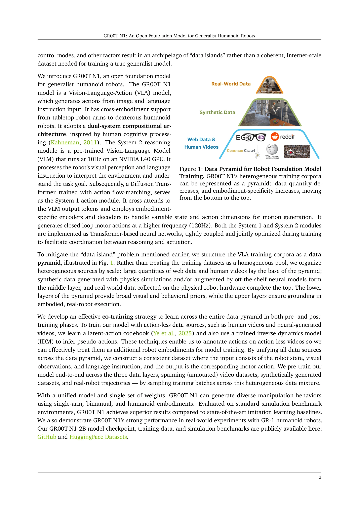
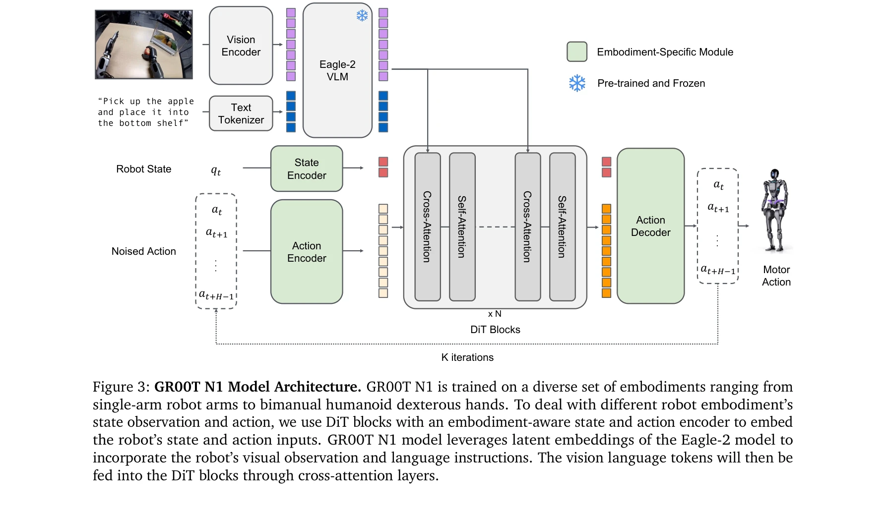

# Helix: A Vision-Language-Action Model for Generalist Humanoid Control

> **저자**:  | **날짜**:  | **URL**: [https://arxiv.org/abs/2504.XXXXX](https://arxiv.org/abs/2504.XXXXX)

---

## Essence

*Figure 2: GR00T N1 Model Overview. Our model is a Vision-Language-Action (VLA) model that adopts a*

GR00T N1은 Vision-Language-Action 모델로서 System 2 (VLM 기반 추론)과 System 1 (Diffusion Transformer 기반 행동생성)의 이중 구조를 통해 인간형 로봇의 일반화된 제어를 실현한다. 웹 데이터, 인간 비디오, 합성 데이터, 실제 로봇 궤적을 통합한 데이터 피라미드 전략으로 cross-embodiment 학습을 가능하게 한다.

## Motivation

- **Known**: 기초 모델(foundation model)은 대규모 다양한 데이터로 사전학습되어 새로운 상황에 대한 추론과 신속한 학습을 가능하게 한다. 인간형 로봇은 하드웨어 플랫폼으로서 일반적 자율성 구축에 유망하다.
- **Gap**: 현존하는 로봇 학습 데이터는 '데이터 아일랜드' 문제로 인해 단일 하드웨어별로 매우 제한적이며, 서로 다른 로봇의 embodiment, 센서, actuator 차이로 인해 일관된 대규모 dataset 구성이 어렵다.
- **Why**: 인간수준의 물리적 지능을 달성하려면 다양한 작업을 수행할 수 있는 일반화된 로봇 모델이 필수적이며, 이는 실시간 제어와 언어 명령에 기반한 강건한 행동 생성을 요구한다.
- **Approach**: 데이터 피라미드 구조(웹/인간 데이터 → 합성 데이터 → 실제 로봇 데이터)로 heterogeneous 소스를 통합하고, VLM과 DiT를 jointly 학습하여 추론과 행동 생성을 긴밀하게 결합한다. Latent-action codebook과 inverse dynamics model을 활용하여 행동 레이블이 없는 데이터를 처리한다.

## Achievement

*Figure 1: Data Pyramid for Robot Foundation Model*

- **이중 시스템 아키텍처**: System 2의 VLM이 환경 해석과 과제 이해를 담당하고(10Hz), System 1의 Diffusion Transformer가 실시간 모터 행동 생성(120Hz)을 담당하여 추론과 행동의 최적 분리
- **Cross-embodiment 지원**: 단일 모델로 테이블탑 로봇 팔, 양팔 로봇, 인간형 dexterous 손 등 다양한 embodiment을 지원하며 embodiment 특화 encoder/decoder를 통해 가변 상태와 행동 차원 처리
- **효과적인 데이터 전략**: 행동 레이블이 없는 인간 비디오와 합성 데이터에 latent-action codebook과 IDM을 적용하여 일관된 dataset으로 통합, 실제 로봇 데이터 효율성 극대화
- **벤치마크 우수성**: 표준 시뮬레이션 벤치마크에서 imitation learning 기준 모델을 초과 성능 달성
- **실제 로봇 배포**: Fourier GR-1 humanoid 로봇에서 언어 조건 양팔 manipulation 작업 수행으로 높은 데이터 효율성 입증

## How

*Figure 3: GR00T N1 Model Architecture. GR00T N1 is trained on a diverse set of embodiments ranging from*

- Eagle-2 Vision-Language Model을 VLM 백본으로 사용하여 이미지와 텍스트를 토큰화 및 인코딩
- Diffusion Transformer (DiT) 기반 flow-matching으로 action 생성, 노이즈 제거 반복 과정(K iterations) 수행
- State/Action Encoder MLP를 embodiment별로 구성하여 가변 차원의 상태와 행동을 공유 embedding 차원으로 투영
- Cross-attention layer를 통해 VLM 출력 토큰과 DiT를 결합, 시간 단계(diffusion timestep)를 action encoding에 포함
- Action chunk 처리로 시간 t에서 H 길이의 미래 행동 수열 [a_t, a_{t+1}, ..., a_{t+H-1}] 동시 예측
- Latent-action codebook과 inverse dynamics model (IDM)을 사용하여 action-less 데이터(인간 비디오)에 pseudo-action 주석 달기
- Pre-training에서 세 데이터 계층(비디오, 합성, 실제 로봇)을 혼합 배치 샘플링으로 end-to-end 공동학습

## Originality

- **이중 시스템 인지 구조**: Kahneman의 인간 인지 이론(System 1/2)을 로봇 제어에 적용하여 추론과 행동을 분리적으로 최적화하면서도 jointly 학습
- **데이터 피라미드 전략**: 단순한 데이터 혼합이 아닌 scale과 embodiment 특이성에 따른 계층적 구조로 organizer하여 일반화와 실제성의 균형 달성
- **Action-less 데이터 처리 방법**: Latent-action codebook과 IDM을 활용하여 인간 비디오와 합성 데이터를 로봇 학습에 직접 통합하는 novel한 접근
- **Embodiment-aware 아키텍처**: 가변 차원 상태/행동을 handling하는 embodiment 특화 encoder/decoder로 단일 모델에서 cross-embodiment 지원 실현

## Limitation & Further Study

- **데이터 품질 문제**: IDM과 latent-action codebook을 사용한 pseudo-action 주석의 정확성이 최종 성능을 제한할 수 있으며, action-less 데이터의 신뢰도 검증 필요
- **계산 복잡도**: Diffusion Transformer의 iterative denoising(K iterations)으로 인한 추론 시간이 실시간 고주파 제어(120Hz)에서 bottleneck이 될 수 있음
- **실제 로봇 검증 부족**: 발표된 실험이 GR-1 humanoid에 주로 집중되어 있으며, 다른 humanoid 플랫폼에서의 일반화 성능 미검증
- **Embodiment 일관성 한계**: 극단적으로 다른 embodiment (예: 휠 기반 로봇 vs 다리 로봇)간의 transfer 성능이 명시적으로 평가되지 않음
- **후속 연구**: (1) IDM 기반 pseudo-action 주석의 오류 누적 효과 분석 및 보정 방법, (2) Diffusion step 축소로 추론 속도 개선, (3) 더 다양한 humanoid 및 로봇 플랫폼에서의 cross-embodiment 성능 평가, (4) 언어 명령 외 다른 modality (예: human demonstration imitation) 통합

## Evaluation

- Novelty: 4/5
- Technical Soundness: 3/5
- Significance: 4/5
- Clarity: 4/5
- Overall: 4/5

**총평**: GR00T N1은 이중 시스템 아키텍처와 데이터 피라미드 전략으로 인간형 로봇의 일반화된 제어를 실현하는 중요한 기여이며, 인간 비디오와 합성 데이터를 활용한 action-less 데이터 처리는 로봇 학습의 데이터 부족 문제에 대한 novel한 솔루션이다. 하지만 실제 로봇 배포가 제한적이고 pseudo-action 주석의 정확성 문제가 남아있어, 추가 검증과 개선의 여지가 있다.

## Related Papers

- 🔄 다른 접근: [[papers/1427_GR00T_N1_An_Open_Foundation_Model_for_Generalist_Humanoid_Ro/review]] — 같은 GR00T N1 모델이지만 Helix는 generalist control에, 다른 버전은 open foundation model에 초점을 맞춘 변형입니다.
- 🏛 기반 연구: [[papers/1414_Ground_Slow_Move_Fast_A_Dual-System_Foundation_Model_for_Gen/review]] — DualVLN의 dual-system 아키텍처가 GR00T N1의 System 1/2 구조 설계에 기반 아이디어를 제공합니다.
- ⚖️ 반론/비판: [[papers/1510_OpenVLA_An_Open-Source_Vision-Language-Action_Model/review]] — OpenVLA의 오픈소스 접근법과 대비하여 proprietary foundation model의 장단점을 비교할 수 있습니다.
- 🔄 다른 접근: [[papers/1427_GR00T_N1_An_Open_Foundation_Model_for_Generalist_Humanoid_Ro/review]] — 같은 GR00T N1이지만 서로 다른 aspect(open foundation vs generalist control)에 초점을 맞춘 다른 버전입니다.
- 🔗 후속 연구: [[papers/1414_Ground_Slow_Move_Fast_A_Dual-System_Foundation_Model_for_Gen/review]] — GR00T N1이 제시한 dual-system VLA 아키텍처를 navigation 도메인에 특화하여 구현한 실제 사례입니다.
- 🔄 다른 접근: [[papers/1628_WholeBodyVLA_Towards_Unified_Latent_VLA_for_Whole-Body_Loco-/review]] — 둘 다 전신 제어이지만 Helix는 일반적 humanoid, WholeBodyVLA는 loco-manipulation 특화된 차이가 있다
