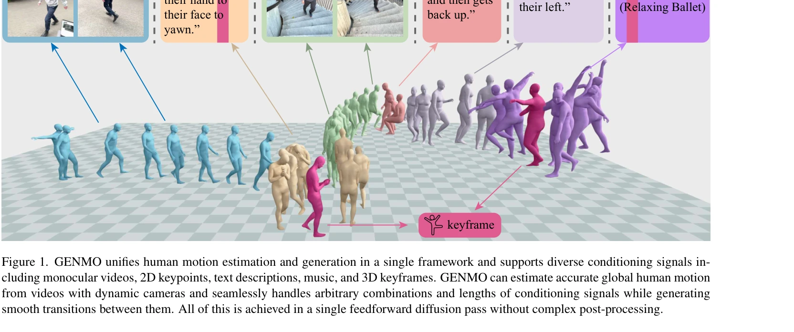
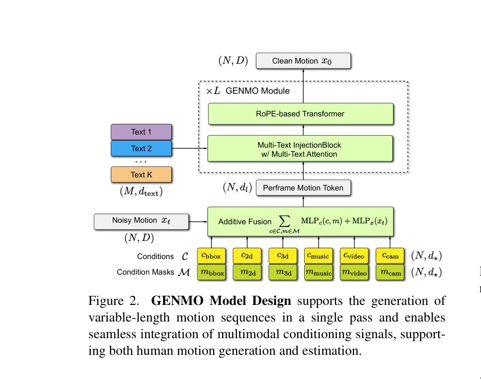

# GENMO: A GENeralist Model for Human MOtion

> **저자**: Jiefeng Li, Jinkun Cao, Haotian Zhang, Davis Rempe, Jan Kautz, Umar Iqbal, Ye Yuan | **날짜**: 2025-05-02 | **URL**: [https://arxiv.org/abs/2505.01425](https://arxiv.org/abs/2505.01425)

---

## Essence

*Figure 1. GENMO unifies human motion estimation and generation in a single framework and supports diverse conditioning s*

GENMO는 인간 모션 추정과 생성을 단일 프레임워크로 통합하는 generalist 모델로, motion estimation을 constrained motion generation으로 재정의하여 정확한 global motion estimation과 다양한 모션 생성을 동시에 달성한다.

## Motivation

- **Known**: Motion generation과 motion estimation은 전통적으로 분리된 작업으로 다루어져 왔으며, 각각 전문화된 모델이 사용되어 왔다. 최근 연구들은 generative priors이 challenging한 motion estimation에 도움이 되고, 대규모 video data가 생성 모델의 현실성을 향상시킴을 보여주었다.
- **Gap**: 기존 방법들은 generation과 estimation을 독립적으로 다루어 지식 전이를 제한하고 별개의 모델 유지를 필요로 한다. 또한 variable-length motion과 mixed multimodal conditions를 유연하게 처리할 수 있는 통합 모델이 부재하다.
- **Why**: 영화, 게임, 3D 콘텐츠 제작 등의 실제 응용에서는 정밀한 motion estimation과 다양한 motion generation을 동시에 요구하는 복합적인 시나리오가 필요하며, 단일 프레임워크로 이를 달성하면 모델 복잡도를 줄이고 synergistic benefits를 활용할 수 있다.
- **Approach**: Diffusion model 기반의 dual-mode training paradigm을 도입하여, estimation mode에서는 zero-initialized noise로 MLE를 강제하고 generation mode에서는 전통적인 diffusion training을 수행한다. 또한 estimation-guided training objective를 통해 in-the-wild videos with 2D annotations를 활용하고, 아키텍처 혁신으로 variable-length motions와 arbitrary multimodal conditions 조합을 처리한다.

## Achievement

*Figure 1. GENMO unifies human motion estimation and generation in a single framework and supports diverse conditioning s*

- **첫 번째 generalist model**: Global motion estimation과 flexible human motion generation을 단일 모델에서 통합 달성
- **다양한 conditioning 지원**: Video, music, text, 2D keypoints, 3D keyframes 등 다중 modality 조건을 arbitrary combinations로 처리
- **Architecture 혁신**: Variable-length motion sequences와 mixed multimodal conditions at different time intervals를 seamless하게 생성
- **Bidirectional synergy**: Generative priors이 occlusion 등 challenging conditions에서 estimation 개선, diverse video data가 generation 표현력 향상
- **State-of-the-art 성능**: Global/local motion estimation, music-to-dance generation 등 다양한 tasks에서 SOTA 달성

## How

*Figure 2.*

- Dual-mode training paradigm: Estimation mode에서 최대 diffusion timestep과 zero-initialized noise로 조건 신호에 대한 MLE 생성, generation mode에서 표준 diffusion training으로 다양한 분포 학습
- Motion representation: Egocentric motion과 global motion을 joint representation으로 통합하여 정확한 world-space estimation과 다양한 생성 가능
- Condition masking mechanism: Condition mask M을 사용하여 각 시간 단계에서 available한 조건들만 selective하게 적용
- Estimation-guided training objective: In-the-wild 2D annotations를 직접 활용하여 3D reconstruction 거치지 않고 robustness와 diversity 향상
- Multi-text attention: Flexible conditioning을 위해 natural language text tokens 처리
- Single feedforward diffusion pass: 복잡한 post-processing 없이 variable-length 다중 조건 모션을 한 번에 생성

## Originality

- Motion estimation을 constrained motion generation으로 재정의하는 conceptual breakthrough를 통해 두 작업의 본질적 연결성 규명
- Regression과 diffusion의 synergy를 활용하는 novel dual-mode training paradigm으로 precision과 diversity 동시 달성
- Variable-length motion과 arbitrary multimodal conditions 조합을 단일 diffusion pass로 처리하는 아키텍처 설계
- In-the-wild videos의 2D annotations를 직접 활용하는 estimation-guided training objective로 데이터 활용 효율성 극대화
- Generative priors와 diverse video data의 bidirectional synergy를 체계적으로 활용

## Limitation & Further Study

- 복잡한 human-object interaction이나 multiple people 동시 처리에 대한 평가 부재
- Real-time inference 성능에 대한 상세한 분석 미흡
- Challenging camera motion이나 extreme occlusion에서의 성능 한계 가능성
- 후속 연구: Fine-grained hand gesture나 facial expression 포함한 전신 모션 통합
- 후속 연구: Real-time interactive motion generation을 위한 경량화 모델 개발
- 후속 연구: Uncertainty quantification을 통한 ambiguous conditioning에 대한 robustness 향상

## Evaluation

- Novelty: 4/5
- Technical Soundness: 3/5
- Significance: 4/5
- Clarity: 4/5
- Overall: 4/5

**총평**: GENMO는 motion estimation과 generation의 전통적 분리를 타파하고 dual-mode diffusion 학습으로 두 작업의 synergy를 효과적으로 활용하는 혁신적 접근을 제시하며, 다양한 tasks에서 SOTA를 달성하여 human motion modeling의 새로운 패러다임을 제시한다.

## Related Papers

- 🔄 다른 접근: [[papers/1350_Do_You_Have_Freestyle_Expressive_Humanoid_Locomotion_via_Aud/review]] — generalist human motion 모델을 다른 통합 프레임워크로 구현한다
- 🏛 기반 연구: [[papers/1281_Being-H0_Vision-Language-Action_Pretraining_from_Large-Scale/review]] — vision-language-action 사전훈련의 기본 방법론을 human motion에 적용한다
- 🔗 후속 연구: [[papers/1476_Humanoid_World_Models_Open_World_Foundation_Models_for_Human/review]] — human motion modeling을 world model로 확장한 포괄적 접근이다
- 🔄 다른 접근: [[papers/1350_Do_You_Have_Freestyle_Expressive_Humanoid_Locomotion_via_Aud/review]] — audio-to-motion generation을 다른 generalist 모델 접근법과 비교할 수 있다
- 🔗 후속 연구: [[papers/1582_Natural_Humanoid_Robot_Locomotion_with_Generative_Motion_Pri/review]] — 일반적 인간 동작 생성 모델을 휴머노이드 자연스러운 보행으로 특화하여 발전시킨다.
- 🏛 기반 연구: [[papers/1507_Kimodo_Scaling_Controllable_Human_Motion_Generation/review]] — GENMO의 일반화된 인간 모션 모델이 대규모 제어 가능한 모션 생성의 이론적 기반을 제공함
- 🔗 후속 연구: [[papers/1609_Perpetual_Humanoid_Control_for_Real-time_Simulated_Avatars/review]] — 일반적인 인간 모션 생성 모델이 PMCP의 AMASS 데이터셋 활용을 더 광범위한 모션으로 확장할 수 있는 가능성을 제공합니다.
- 🏛 기반 연구: [[papers/1564_MaskedManipulator_Versatile_Whole-Body_Manipulation/review]] — GENMO의 일반적인 인간 모션 생성 모델을 로봇의 전신 조작이라는 특정 과제에 적용한다.
- 🏛 기반 연구: [[papers/1540_Learning_to_Control_Physically-simulated_3D_Characters_via_G/review]] — 일반적인 인간 모션 생성 방법론이 Mimic2DM의 다양한 도메인 모션 생성에 핵심 이론적 기반을 제공한다
