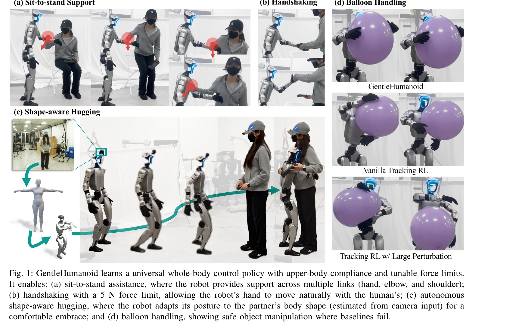

# GentleHumanoid: Learning Upper-body Compliance for Contact-rich Human and Object Interaction

> **저자**: Qingzhou Lu, Yao Feng, Baiyu Shi, Michael Piseno, Zhenan Bao, C. Karen Liu | **날짜**: 2025-11-06 | **DOI**: [10.48550/arXiv.2511.04679](https://doi.org/10.48550/arXiv.2511.04679)

---

## Essence

*Fig. 1: GentleHumanoid learns a universal whole-body control policy with upper-body compliance and tunable force limits.*

GentleHumanoid는 impedance control을 whole-body motion tracking policy에 통합하여 휴머노이드 로봇이 어깨, 팔꿈치, 손목 전체에서 상체 compliance를 달성하도록 하는 프레임워크이다. 인간 동작 데이터에서 샘플링한 spring-based formulation으로 resistive contact와 guiding contact를 모두 모델링하여 안전하고 자연스러운 인간-로봇 상호작용을 실현한다.

## Motivation

- **Known**: RL 기반 humanoid 정책은 rigid position/velocity tracking에 중점을 두며 external forces를 억제하는 경향을 보인다. 기존 impedance-augmented 접근법들은 base나 end-effector 제어에만 제한되어 있고 극단적 힘에 저항하는 데만 초점을 맞춘다.
- **Gap**: simultaneous multi-link contact (shoulders, elbows, hands)가 필요한 상황에서 whole-body impedance를 통합한 정책이 부재하며, 다양한 interaction scenarios (gentle touch부터 supportive forces)에 적응하는 메커니즘이 미흡하다.
- **Why**: 인간 중심 환경에서 휴머노이드 배치 시 gentle hugging, sit-to-stand assistance 등 안전하고 자연스러운 물리적 상호작용이 필수적이며, 이는 fragile objects 취급 등 다양한 실세계 응용으로 확대된다.
- **Approach**: impedance dynamics (M¨xi = fdrive,i + finteract,i)를 기반으로 하여, human motion datasets에서 샘플링한 spring anchor를 통해 kinematically consistent한 interaction forces를 생성하고, task-adjustable force thresholds로 안전성을 보장한다.

## Achievement

*Fig. 1: GentleHumanoid learns a universal whole-body control policy with upper-body compliance and tunable force limits.*

- **GentleHumanoid 프레임워크**: impedance control과 motion tracking을 통합하여 resistive contact와 guiding contact를 unified spring-based formulation으로 모델링
- **Force-thresholding 메커니즘**: training 중 안전한 힘 범위를 유지하고 배포 시 task-specific 임계값 조정 가능
- **다중 시나리오 검증**: gentle hugging, sit-to-stand assistance, balloon handling 등 다양한 compliance level 요구 작업에서 baseline 대비 peak contact force 감소 및 task success 유지
- **Custom pressure-sensing evaluation**: 40개 calibrated capacitive taxels를 갖춘 waist-mounted pad로 hugging 작업의 contact forces/pressures 정량 측정
- **Vision-integrated autonomous hugging**: camera input 기반 human shape estimation으로 personalized hug 수행

## How

*Fig. 2: Overview framework. (a) Reference dynamics: impedance-based dynamics integrate driving forces (for motion*

- Reference dynamics model로 virtual spring-damper 기반 fdrive와 interaction force finteract를 결합하여 link i의 motion 제어
- Resistive contact: spring anchor를 initial contact point에 고정하여 restoring forces 생성
- Guiding contact: human motion datasets의 complete upper-body postures에서 spring anchors 샘플링하여 kinematically consistent multi-joint forces 확보
- RL training에 diverse interaction scenarios 노출을 위해 physics engine (MuJoCo, IsaacGym) 기반 contact force 시뮬레이션 + human motion data 기반 synthetic guiding forces 결합
- Force-thresholding: training 중 predefined limits, deployment 시 task-adjustable limits 적용
- Unitree G1 humanoid에서 실제 구현 및 quantitative evaluation (force gauges, pressure-sensing pad) 수행

## Originality

- Shoulder, elbow, wrist에 걸친 **whole-body multi-link impedance control**로 기존 end-effector 중심 접근과 차별화
- Human motion data에서 complete postures를 샘플링하여 **kinematically coordinated interaction forces** 생성하는 unified spring-based formulation 제안
- Resistive contact와 guiding contact를 **동일 프레임워크**로 통합하여 diverse interaction scenarios 커버
- Vision-based human shape estimation과 정책의 **결합을 통한 personalized interaction** 실현
- Custom pressure-sensing pad 기반 **분포된 contact force 측정** 방식 설계

## Limitation & Further Study

- 상체(shoulder, elbow, wrist) 중심이며 lower-body compliance는 미다루어짐—full-body compliance로 확장 필요
- Synthetic interaction force 시뮬레이션은 real human dynamics의 미묘한 변화를 완전히 포착하지 못할 가능성
- Human motion datasets의 diversity에 따라 학습된 compliance 특성이 좌우될 수 있으므로 dataset bias 고려 필요
- Force threshold 설정이 task-specific이며 자동 조정 메커니즘 개발 여지
- 현재 Unitree G1에서 검증되었으나, 다른 humanoid morphologies에 대한 generalization은 미확인

## Evaluation

- Novelty: 4/5
- Technical Soundness: 3/5
- Significance: 4/5
- Clarity: 4/5
- Overall: 4/5

**총평**: GentleHumanoid는 whole-body multi-link impedance control과 human motion data 기반 interaction force modeling을 결합한 혁신적 접근으로, humanoid robots의 안전한 인간-로봇 물리 상호작용을 실질적으로 가능하게 한다. Simulation과 실제 로봇 양쪽에서 다양한 scenarios를 검증한 점과 custom pressure-sensing을 통한 rigorous evaluation이 강점이다.

## Related Papers

- 🏛 기반 연구: [[papers/1362_ECHO_Edge-Cloud_Humanoid_Orchestration_for_Language-to-Motio/review]] — 언어 기반 상체 동작 제어가 ECHO의 자연어 명령 처리와 안전한 인간 상호작용에 필수적인 기반 기술이 된다.
- 🏛 기반 연구: [[papers/1393_FAME_Force-Adaptive_RL_for_Expanding_the_Manipulation_Envelo/review]] — impedance control 기반 compliance가 FAME의 외부 힘 적응에서 안전한 접촉 상호작용의 이론적 기반을 제공한다.
- 🔗 후속 연구: [[papers/1434_H2-COMPACT_Human-Humanoid_Co-Manipulation_via_Adaptive_Conta/review]] — GentleHumanoid의 상체 compliance와 H2-COMPACT의 인간-휴머노이드 협업을 결합하면 더욱 자연스러운 공동 작업이 가능하다.
- 🔗 후속 연구: [[papers/1362_ECHO_Edge-Cloud_Humanoid_Orchestration_for_Language-to-Motio/review]] — ECHO의 edge-cloud 분산 처리 구조에 GentleHumanoid의 compliance 제어를 통합하면 안전한 원격 조작이 가능하다.
- 🔗 후속 연구: [[papers/1393_FAME_Force-Adaptive_RL_for_Expanding_the_Manipulation_Envelo/review]] — FAME의 외부 힘 적응과 GentleHumanoid의 compliance 제어를 결합하면 다양한 접촉 상황에서 안전한 조작이 가능하다.
- 🔗 후속 연구: [[papers/1382_EMP_Executable_Motion_Prior_for_Humanoid_Robot_Standing_Uppe/review]] — EMP의 상체 동작 모방에 GentleHumanoid의 compliance 제어를 추가하면 인간과의 안전한 상호작용이 가능하다.
