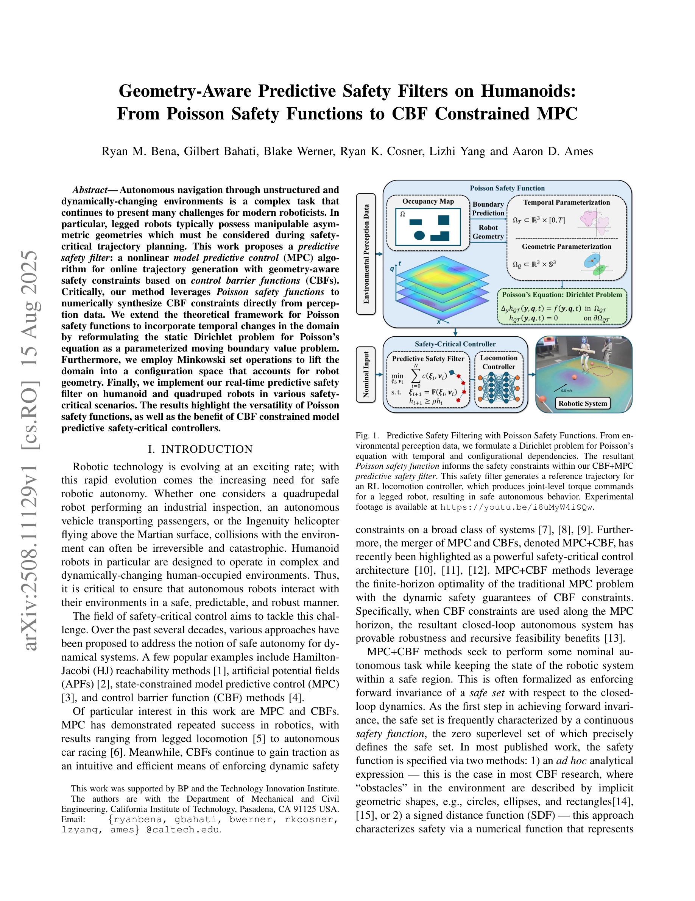

# Geometry-Aware Predictive Safety Filters on Humanoids: From Poisson Safety Functions to CBF Constrained MPC

> **저자**: Ryan M. Bena, Gilbert Bahati, Blake Werner, Ryan K. Cosner, Lizhi Yang, Aaron D. Ames | **날짜**: 2025-08-15 | **URL**: [https://arxiv.org/abs/2508.11129](https://arxiv.org/abs/2508.11129)

---

## Essence

*Fig. 1.*

본 논문은 Poisson safety function과 control barrier function (CBF)을 결합한 geometry-aware predictive safety filter를 제안하여, 비정형 동적 환경에서 휴머노이드 로봇의 안전한 자율 항법을 실현한다.

## Motivation

- **Known**: MPC와 CBF는 각각 로봇 제어와 안전성 보장에서 성공적으로 적용되어 왔으며, MPC+CBF 결합 방식은 유한 호라이즌 최적성과 동적 안전 보장을 동시에 제공한다.
- **Gap**: 기존 안전함수는 ad hoc analytical expression이나 SDF에 의존하는데, 이들은 복잡한 환경에서 로봇의 비대칭 기하학을 고려한 시간 변화하는 안전 제약을 충분히 반영하지 못한다.
- **Why**: 휴머노이드 로봇이 인간 환경에서 작동할 때 환경 변화와 로봇 기하학을 실시간으로 반영하여 충돌을 예방하는 것이 필수적이며, 이는 재앙적 손상을 방지하는 데 중요하다.
- **Approach**: 정적 Dirichlet 문제를 moving boundary value problem으로 재구성하여 시간 변화하는 안전함수를 생성하고, Minkowski set operation으로 로봇 점유도를 고려한 configuration space로 도메인을 확장한 후, 이를 CBF+MPC predictive safety filter에 통합한다.

## Achievement

- **시간 변화하는 Poisson safety function**: 정적 Dirichlet 문제를 parameterized moving boundary value problem으로 재형식화하여 유한 시간 간격에서 안전 집합의 진화를 외삽하는 동적 안전함수 개발
- **Configuration space 확장**: Minkowski set operation을 통해 로봇 점유도를 반영한 고차원 configuration space에서 기하학을 고려한 Poisson safety function 생성
- **실시간 predictive safety filter**: DCBF 제약이 통합된 MPC formulation으로 online trajectory generation을 실현하여 real-time 안전한 경로 생성
- **실제 로봇 검증**: 휴머노이드 및 사족 로봇에서 다양한 안전 임계 시나리오에서 실험적으로 방법의 우수성 입증

## How

- Poisson's equation을 PDE 기반 수치 해석으로 풀어 perception 데이터로부터 직접 안전함수 합성", 'Static Dirichlet boundary condition을 moving boundary로 확장하여 시간 종속성 도입
- Robot occupancy에 기반한 Minkowski set operation으로 configuration space 도메인 구성
- Discrete-time CBF (DCBF) 제약을 MPC horizon 전체에 적용하여 recursive feasibility 및 robustness 보장
- Safety filter 아키텍처로 nominal controller π_nom을 minimally modify하여 안전 제약 만족

## Originality

- Poisson safety function의 이론적 프레임워크를 시간 변화 도메인으로 확장한 것은 기존 정적 분석의 한계를 극복
- Minkowski set operation을 통한 configuration space 리프팅으로 로봇의 비대칭 기하학을 명시적으로 고려
- MPC+CBF 결합에서 Poisson safety function을 CBF로 직접 활용하는 새로운 연결고리 제시
- Perception 데이터에서 PDE 기반으로 safety function을 자동 생성하는 방식으로 ad hoc 설계 제거

## Limitation & Further Study

- Poisson's equation 수치 해석의 계산 복잡도가 configuration space 차원 증가에 따라 급증할 수 있어 고차원 시스템으로의 확장성 미지수", 'Moving boundary problem 공식화가 환경 동역학의 미래 예측에 의존하므로 예측 오류에 민감할 수 있음
- 실험이 quadruped와 humanoid 특정 모델에서만 수행되어 다양한 로봇 플랫폼에서의 일반화 가능성 미검증
- MPC의 horizon length N 선택과 regularization parameter γ 튜닝에 대한 체계적 가이드 부재
- Perception 불확실성 및 센서 노이즈가 Poisson safety function 정확도에 미치는 영향에 대한 분석 부족

## Evaluation

- Novelty: 4/5
- Technical Soundness: 3/5
- Significance: 4/5
- Clarity: 4/5
- Overall: 4/5

**총평**: 본 논문은 Poisson safety function을 시간-configuration space로 확장하고 MPC+CBF와 통합하여 로봇의 기하학을 고려한 실시간 안전 필터를 처음 제시했으며, 이론적 엄밀성과 실제 로봇 검증을 모두 갖춘 우수한 연구이다.

## Related Papers

- 🔗 후속 연구: [[papers/1383_End-to-End_Humanoid_Robot_Safe_and_Comfortable_Locomotion_Po/review]] — Geometry-aware safety filter와 end-to-end 안전 제어를 결합하면 정적 기하학과 동적 환경을 모두 고려한 포괄적 안전 시스템을 구축할 수 있다.
- 🔗 후속 연구: [[papers/1402_FocusNav_Spatial_Selective_Attention_with_Waypoint_Guidance/review]] — Poisson safety function의 기하학적 안전성과 FocusNav의 공간 선택적 주의를 결합하면 더욱 안전한 환경 네비게이션이 가능하다.
- 🔄 다른 접근: [[papers/1340_Dexterous_Safe_Control_for_Humanoids_in_Cluttered_Environmen/review]] — 둘 다 안전한 humanoid 제어를 다루지만 전자는 기하학적 예측 필터링, 후자는 dexterous한 환경 내 안전 제어에 집중한다.
- 🔗 후속 연구: [[papers/1340_Dexterous_Safe_Control_for_Humanoids_in_Cluttered_Environmen/review]] — 기하학적 제약을 예측 기반 안전 필터로 확장하여 더 안전한 제어를 달성한다
- 🏛 기반 연구: [[papers/1383_End-to-End_Humanoid_Robot_Safe_and_Comfortable_Locomotion_Po/review]] — Geometry-aware safety filter의 안전 제약 방법이 end-to-end 정책에서 LiDAR 기반 안전성과 편의성을 보장하는 핵심 기반이다.
- 🏛 기반 연구: [[papers/1402_FocusNav_Spatial_Selective_Attention_with_Waypoint_Guidance/review]] — Geometry-aware safety의 공간 인식 방법이 FocusNav의 waypoint 기반 공간 선택적 주의에 필수적인 이론적 기반을 제공한다.
- 🔗 후속 연구: [[papers/1475_Humanoid_Whole-Body_Locomotion_on_Narrow_Terrain_via_Dynamic/review]] — ZMP 기반 보상을 통한 좁은 지형 보행은 geometry-aware predictive safety filters로 확장하여 안전성을 향상시킬 수 있다.
- 🏛 기반 연구: [[papers/1489_HWC-Loco_A_Hierarchical_Whole-Body_Control_Approach_to_Robus/review]] — HWC-Loco의 robust control은 geometry-aware predictive safety filters의 안전 보장 메커니즘에 기반한다.
- 🔗 후속 연구: [[papers/1579_MorphoGuard_A_Morphology-Based_Whole-Body_Interactive_Motion/review]] — 기하학적 안전 필터가 형태학적 제어의 안전성을 보장하는 추가적인 레이어로 작용할 수 있습니다.
