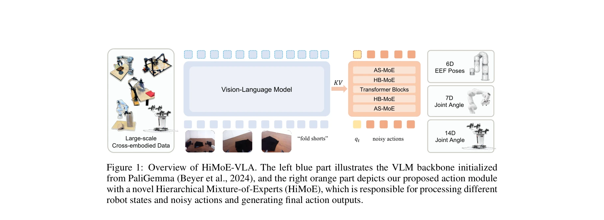
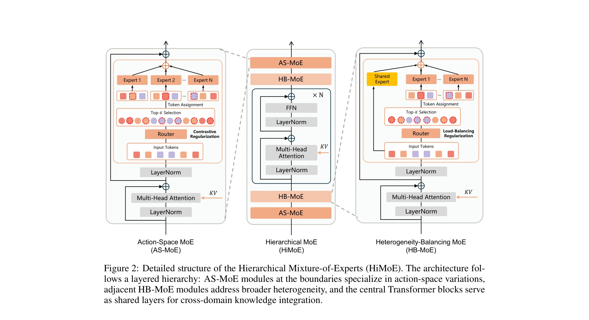

# HiMoE-VLA: Hierarchical Mixture-of-Experts for Generalist Vision-Language-Action Policies

> **저자**: Zhiying Du, Bei Liu, Yaobo Liang, Yichao Shen, Haidong Cao, Xiangyu Zheng, Zhiyuan Feng, Zuxuan Wu, Jiaolong Yang, Yu-Gang Jiang | **날짜**: 2025-12-05 | **URL**: [https://arxiv.org/abs/2512.05693](https://arxiv.org/abs/2512.05693)

---

## Essence

*Figure 1: Overview of HiMoE-VLA. The left blue part illustrates the VLM backbone initialized*

HiMoE-VLA는 로봇 데이터의 이질성(action space, embodiment, sensor configuration 등)을 명시적으로 처리하기 위해 계층적 Mixture-of-Experts 아키텍처를 제안하는 Vision-Language-Action 프레임워크이다.

## Motivation

- **Known**: 최근 VLA 모델들은 OXE와 같은 대규모 이질적 로봇 데이터셋을 활용하여 학습하고 있으며, VLM 백본을 기반으로 로봇 제어를 수행하고 있다.
- **Gap**: 기존 VLA 모델들은 로봇 데이터의 본질적 이질성(action space, embodiment, kinematics, sensor configuration 등)을 체계적으로 처리할 명시적 설계가 부족하여 도메인 간 일반화 능력이 제한된다.
- **Why**: 로봇 기초 모델 개발의 핵심 과제인 이질적 로봇 데이터로부터의 효과적 지식 이전을 달성하기 위해, 다양한 이질성 소스를 명시적으로 처리하고 통합하는 구조가 필수적이다.
- **Approach**: AS-MoE (Action-Space MoE)와 HB-MoE (Heterogeneity-Balancing MoE)로 구성된 계층적 전문가 구조를 설계하여, action space 차이는 얕은 층에서, 광범위한 이질성은 깊은 층에서 처리하고, 중간 Transformer 블록으로 공유 표현으로 통합한다.

## Achievement

- **계층적 이질성 처리**: Action-Space MoE가 joint-angle-space와 end-effector-space 간 차이를 전문화하고, Heterogeneity-Balancing MoE가 embodiment, kinematics, sensor 설정 등 광범위한 변동성을 처리
- **타겟 정규화 메커니즘**: Action-Space Regularization (contrastive 목표)과 Heterogeneity-Balancing Regularization으로 전문가 특화와 점진적 추상화 강화
- **포괄적 벤치마크 성능**: CALVIN, LIBERO 시뮬레이션 벤치마크와 xArm, ALOHA 실제 로봇에서 기존 VLA 대비 일관된 성능 향상 달성
- **강건한 일반화**: 미보유 객체, 환경, 새로운 로봇과 태스크에 대해 빠른 적응성과 효과적 일반화 능력 입증

## How

*Figure 2: Detailed structure of the Hierarchical Mixture-of-Experts (HiMoE). The architecture fol-*

- PaliGemma 기반 VLM 백본이 visual observation과 language instruction 처리
- AS-MoE: Top-K router를 사용하여 입력 토큰을 서로 다른 action space 전문가로 라우팅
- HB-MoE: 광범위한 embodiment/sensor 이질성을 처리하는 전문가 모듈
- 계층 구조: AS-MoE → Transformer blocks → HB-MoE → Transformer blocks 순서로 구성
- Flow-matching loss로 multimodal action 분포 모델링
- AS-Reg (contrastive loss)와 HB-Reg로 전문가 특화 및 지식 추상화 유도
- OXE와 ALOHA 데이터셋으로 사전학습 후 CALVIN, LIBERO, 실제 로봇에서 미세조정

## Originality

- **계층적 MoE 구조의 참신한 설계**: 일반적인 평면 MoE와 달리 action space와 광범위한 이질성을 명시적으로 분리한 계층적 조직화
- **로봇 도메인 맞춤형 문제 포뮬레이션**: VLA 맥락에서 이질성을 체계적으로 분류하고 처리하는 명확한 문제 정의
- **타겟 정규화 메커니즘**: Action-Space Regularization과 Heterogeneity-Balancing Regularization이 전문가 특화와 지식 통합을 동시에 달성
- **광범위한 실증 평가**: 시뮬레이션과 실제 로봇(단일/이중팔), 다양한 벤치마크에서의 체계적 검증

## Limitation & Further Study

- **계산 복잡도**: 계층적 MoE 구조로 인한 추론 시간과 메모리 오버헤드에 대한 상세 분석 부재
- **라우팅 메커니즘의 단순성**: Top-K 라우팅의 효율성과 로드 밸런싱 성능에 대한 심층 논의 미흡
- **제한된 action space 범위**: 현재 joint-angle과 end-effector 공간만 다루며, 다른 형태의 action 표현 확장성 불명확
- **후속 연구 방향**: (1) 동적 expert 수 조정, (2) 더 이질적인 embodiment(legged robots, dexterous hands)로의 확장, (3) 온라인 학습/연속 도메인 적응, (4) MoE 구조 최적화 자동화

## Evaluation

- Novelty: 4/5
- Technical Soundness: 3/5
- Significance: 4/5
- Clarity: 4/5
- Overall: 4/5

**총평**: HiMoE-VLA는 로봇 데이터의 본질적 이질성을 명시적으로 다루는 계층적 MoE 설계로 VLA 분야에 의미 있는 기여를 하며, 광범위한 실험을 통해 기존 방법 대비 향상된 성능과 일반화 능력을 입증한 우수한 연구이다.

## Related Papers

- 🔄 다른 접근: [[papers/1375_Efficient_Diffusion_Transformer_Policies_with_Mixture_of_Exp/review]] — 둘 다 로봇 데이터 이질성을 해결하지만 HiMoE-VLA는 hierarchical MoE를, Efficient DTP는 mixture of experts를 사용한 다른 접근법입니다.
- 🔗 후속 연구: [[papers/1624_VQ-VLA_Improving_Vision-Language-Action_Models_via_Scaling_V/review]] — VQ-VLA의 quantization 기법을 hierarchical MoE 구조와 결합하여 더 효율적인 cross-embodiment learning을 달성합니다.
- 🏛 기반 연구: [[papers/1510_OpenVLA_An_Open-Source_Vision-Language-Action_Model/review]] — OpenVLA의 대규모 VLA 훈련 방법론을 hierarchical MoE로 확장하여 더 복잡한 embodiment 처리가 가능합니다.
- 🔄 다른 접근: [[papers/1358_DexVLA_Vision-Language_Model_with_Plug-In_Diffusion_Expert_f/review]] — Hierarchical mixture-of-experts 아키텍처를 VLA에 적용하여 DexVLA의 plug-in diffusion expert와 다른 접근으로 일반화를 달성한다.
